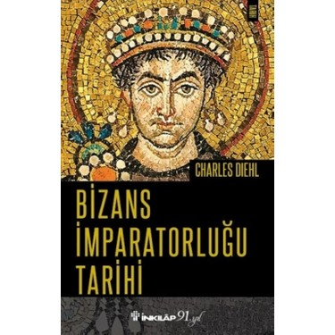

### Haluk Tatar; Mutlaka Okumanız Gereken 30 Tarih Kitabı | [Kaynak](https://www.youtube.com/watch?v=T_k1PDLxGrI&ab_channel=HalukTATAR)

 

___

- ***Dünya Ekonomisi - Mahfi Eğilmez ++++++***

  

    
     

___

- ***Amerika’Nın Ortadoğu Politikası-Benan Kepsutlu ++++++++***

  

    
     

___

- ***Hitler Almanyası - (1933 - 1945) - Jane Caplan ++++++***

  

    
     

___

- ***Avrupa Tarihi - J. M. Roberts ++++***

  

    
     

___

- ***Bizans İmparatorluğu Tarihi - Charles Diehl +++***

  

    
     

___

- ***Felsefe’Nin Kısa Tarihi-Derek Johnston +++***

  

    
     

___

- ***Avrupa'da Reform Tarihi - Carter Lindberg***

  

    
     

___

- ***Amerikan Dış Politikası - Steven W. Hook +++***

  

    
     

___

- ***Türk Tarihinin Yönünü Değiştiren Savaşlar 2 Deniz Savaşları Anadolu Selçuklu Devleti’nden Osmanlı İmparatorluğu’na - Mehmet Tanju Akad +++***

  

    
     

___

- ***Erken Modern Dönem Yahudi Tarihi-David B. Ruderman + ?***

  

    
     

___

- ***Japonya Tarihi - Milton W. Meyer +++***

  

    
     

___

- ***Görünmeyen Ordular - Gerilla Tarihi - Max Boot +++***

  

    
     

___

- ***İşgal Altında İstanbul-Ali Karakaya ++***

  

    
     

___

- ***Yunan Kültür Tarihi-Robin Sowerby +***

  

    
     

___

- ***Birinci Dünya Savaşı ve Osmanlı İmparatorluğu +++***

  

    
     

___

- ***17. Yüzyılda Akdenizde Korsanlık-Adrian Tinniswood +++***

  

    
     

___

- ***Meslekler Tarihi ?***

  

    
     

___

- ***Eğlenceli Türk Tarihi - Mustafa Barış Özkök +++***

  

    
     

___

- ***Klasik Yunan ve Roma Mitolojisi - Thomas Bulfinch ?***

  

    
     

___

- ***Ortadoğu Tarihi +++++***

  

    
     

___

- ***Dünya Tarihi I.Cilt - J. M. Roberts***

  

    
     

___

- ***Dünya Tarihi II.Cilt***

  

    
     

___

- ***Samuraylar Çağı - Dönüm Noktalarıyla Japon Tarihi - Erdal Küçükyalçın ?? +++***

  

    
     

___

- ***KISA DÜNYA TARİHİ - J. M. Roberts +++***

  

    
     

___

- ***Britanya Adaları Tarihi-Hugh Kearney +++***

  

    
     

___

- ***İran Tarihi - Gene R. Garthwaite***

  

    
     

___

- ***Dünya Tarihi 101-Bir Çırpıda Uygarlıklar Tarihi - Tom Head***

  

    
     

___

