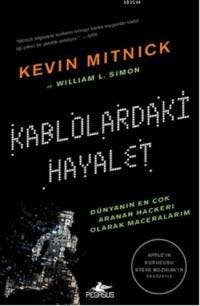

  
# Kablolardaki Hayalet - Kevin Mitnick
## 475 Sayfa
### 06.07.2020
  
 

  

    
     

 
 

> ***(Tanıtım Bülteninden)***

***“Kablolardaki Hayalet bilgisayar kurtları için yazılmış bir gerilim romanı gibi...” Kevin Mitnick gelmiş geçmiş yakalaması en zor hackerdı. Dünyanın en büyük şirketlerindeki ağlara ve bilgisayarlara ulaştı - ve yetkililer ne kadar hızlı olursa olsun, Mitnick hep daha hızlıydı. Telefon santrallerinde, bilgisayar sistemlerinde ve cep telefonu ağlarında koşturup durdu. Durdurulamaz olarak görülüyor, her zaman üç adım ilerde gidiyor ve yıllarca sanal âlemi boydan boya kat ediyordu.  İmkânsızı başarmak için duyduğu açlıkla, Mitnick güvenlik sistemlerini aştı ve Motorola dâhil dünyanın en büyük teknoloji şirketlerine kök söktürdü. Ancak FBI çevresini sardıkça, kaçmaya başladı. İçinde bulunduğu sofistike kedi-fare oyunu onu farklı kimliklere, şehirlere ve kıl payı kurtulacağı maceralara sürükledi - en sonunda onu ne pahasına olursa olsun durdurmaya yemin etmiş Federallerle karşılaşacaktı. Kablolardaki Hayalet, gerilim, heyecan ve inanılmaz bir kaçışın gerçek hikâyesini anlatıyor; yaratıcılığı, yetenekleri ve azmi peşindeki yetkililere işlerini sorgulatacak bir vizyonerin portresini sunuyor. Etkileri halen daha süren, bilgisayar güvenlik endüstrisinde köklü değişikliklere sebebiyet veren bir yaşam."***
_____

Bu çoğu zaman işe yarayan bir numara. Eğer hassas bir bilgiye erişmek isterseniz, insanlar şüphelenmeye başlar. Eğer zaten bilgiye sahipmiş gibi yapıp onlara yanlış bilgi verirseniz, genelde sizi düzeltirler - hem de beklediğiniz bilgiyi size vererek.. (s.40)

____

Ona teşekkür ettim ve birazcık daha sohbet ettik. Sohbet, insanlarda iyi bir intiba uyandıran, dostça olmak hissini artıran ve sonradan gelişecek şüpheleri etkili bir şekilde ortadan kaldıran bir araçtır.   Sosyal Mühendislik sanatını yıllardır icra etmeme rağmen, bunun bu kadar kolay olmasına hayranlık duyarım ve çok etkilenirim. Çoşkulu hissettiğiniz ya da Vegas'ta büyük para kazandığınızda hissettiğinize benzer anlardan biriydi - endorfin bütün vücudumu kaplamıştı.

____

Ofisimdeki bilgisayara oturdum ve tüm veriyi silmek için komutları girdim. Eğer bunu zaten bilmiyorsanız (bazen haberlere çıkar, özellikle  de Beyaz Saray çalışanı Denizci Yarbay Oliver North'un İran-Contra olayları karıştırdıktan sonra ortalığı toparlama çabasıyla ilgili olarak), Sil komutunu vermek bilgisayarın hard diskinden veriyi tamamen silmez. Onun yerine, her dosyanın adını, silinmiş olduğunu belirtmek için değiştirir; bu dosyalar aramalarda çıkmaz ancak hâlâ sürücüde saklıdır ve erişilebilirdir.   Sadece Sil komutu vermektense, WipeInfo isimli bir programı kullandım, Norton Utilities paketinde vardı. WıpeInfo hem dosyaları silinmiş olarak işaretlemeye hem de üzerlerini kurtarılamayacak şekilde yazmaya yarıyordu. Program işini hallettiğinde tek bir dosyamın bile o sürücüden kurtarılması mümkün olmayacaktı.

____

Yöneticinin hesabından FBI ajanına hackerin aktiviteleriyle ilgili daha çok detaya ulaştığımızı söyleyerek sahte bir giriş dosyası yolladım. Ben hack projelerime devam ederken onun bunları araştıracağını ve yanlış yönlendirmeleri takip edeceğini umuyordum.   Biz buna yanlış bilgilendirme taktiği diyoruz.

___

**Konuşmalarımızdan birinde internet protokölünün temelindeki temel zayıflıkları gösteren "IP dolandırıcılığı üzerine Morris makalesini" okuyup okumadığımı sordu.**

____

 

___
### Kitaptan Alıntılar ;
- ***"Ancak başka bir şey, daha önemli  bir şey vardı.  
Bir, üç ya da bir oda dolusu olsun tüm seyircilerin aldatılmaktan nasıl büyük keyif aldıklarını görmüştüm.   
Bilinçli bir düşünce olmamasına karşın, insanların kandırılmaktan keyif aldıkları fikri hayatımın geri kalanını etkileyecek baş döndürücü bir keşif olmuştu."(s.18)***
- ***Geçmişi düşündüğümde hep Tom Petty'nin şarkı sözlerini hatırlarım:   "Beni cehennemin kapılarında tutabilirsin ancak asla vazgeçmeyeceğim."***
- ***"Çoğu suçlu kendilerini beladan kurtarabileceklerine inanır."***
- ***"Yine hayatımda Bonnie vardı. Başıma gelen en güzel şeylerden biriydi. Ancak hiç çok iyi giden bir şeyin sonsuza kadar süremeyeceğini hissettiğiniz oldu mu?"***
- ***"Tek kardeşimle odada yalnızdım ve bir daha asla onunla konuşmayacaktım.   Klişe olduğunu biliyorum ancak mutsuzluğum bu hayatta ne kadar kısa bir zamanımız olduğunu hatırlamama yol açtı."***
- ***"Çok erken bir yaşta keşfettiğim üzere, insanlar kolay güvenir."***
