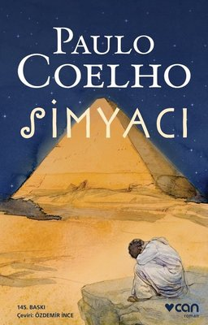

<table><tr>
<td align="left"> 

# Simyacı - Paulo Coelho
## 188 Sayfa
### 08.08.2020

  
</td>
<td> 
  

    
     
    
  
 
</td>

</tr></table>

***Karakterler ;*** 

- ***Santiago :*** Genç çobanımız
- ***Billureci Tüccar :*** Bu adamın Santiago'ya da çok faydası oluyor
- ***Şalem kralı :*** Herşeyin başlangıcı bu kral sebebi ile gerçekleşiyor
- ***Fatıma :*** Santiago'nun sevdiği kız
- ***Simyacı :*** Kahramanımıza çoğu şeyi öğreten bir öğretmen diyebiliriz

 

Santiago isminde bir genç çoban.. Üst üste rüyalar görür ve bir falcı çingene kadına gider.. Ardından da Şalem Kralına denk  gelir ve bu yaşlı adam ona hazinesini araması için büyük bir ilham verir. Koyun sürüsünün de onda birini kendisine vermesini ister.. Santiago ise , hazinenin onda birini vermeyi teklif eder.. Yaşlı adam ***" henüz sahip olmadığın bir şeyi vaat ederek gidecek olursan , onu ele geçirme arzunu yitirirsin."***  Sonrasında tüm koyunlarını satar ve elde ettiği parasıyla Mısır'a gitmek için yollara düşer.. Daha yolun başında hırsızın birine tüm parasını kaptırır ve beş parasız kalır.. Sonrasında 1 yıl kadar billuriyeci tüccar'ın yanında calışıp güzel işler yaparak para kazanır.. 

Bir kervan ile yola çıkar , uzun süre gittikten sonra bir vaha da uzun süre konaklamak zorunda kalır.. Bu süre zarfında ise Fatıma isminde bir kıza aşık olur , simyacı ile tanışır ve evrenin dilini tamamen anlamaya başlar.. Sonunda ise piramitlerin orada ki hazineye ulaşır.

___

> - ***Bu kitabı beni etkisi altında bırakan ve keyifle okuduğum  bir başyapıt olarak isimlendirmek istiyorum.***

___
