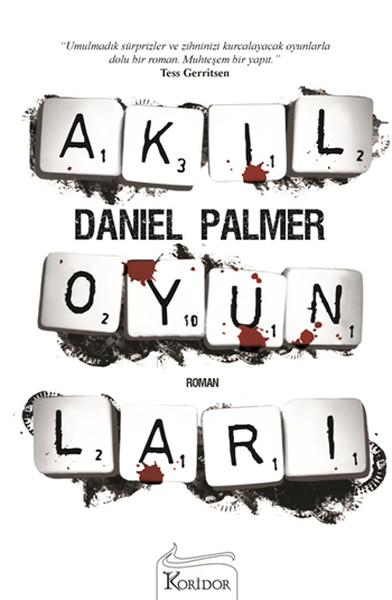

<table><tr>
<td align="left"> 
  
# Akıl Oyunları -  Daniel Palmer
## 452 Sayfa
### 10.08.2020

  
</td>
<td> 
  

    
     
    
  
 
</td>

</tr></table>

***Karakterler ;*** 
- ***Charlie Giles:*** Ana karakterimiz , Solucent Şirketinde yönetici pozisyonunda bir yazılım mühendisi.. " invision " Charlie  için çok önemli ve yaratıcısı olduğu bir buluş olan teknolojik cihaz , arabaya entegre edilen bir cihaz.
- ***Joe:*** Charlie'nin ağabeyi ve kendisi şizofren.
- ***Eddie Prescott :*** Bir zamanlar Charlie'nin ortağı.
- ***Charlie'nin Babası :*** Babası da şizofrendi ve onları bir anda bırakıp gitmiş , ortalıktan kaybolmuş. 
- ***Rachel Evans :*** Joe'nin doktoru.
- ***Monte :*** Charlie'nin sahiplendiği bir köpek.
- ***Anne Pedersen :*** Charlie'yi İnvision'un tehlikede olduğunu açıklayan sözde aynı şirkette çalışan bir kadın.
- ***Randal :*** Charlie'nin eski dostu. FBİ Polisi.
- ***Maxim :*** Hastane de , charlie'nin odasında çok az kalan çocuk.

 

____

> ***Aslına bakarsak bu eser beni o kadar içine çekti ki , yani bir solukta heyecan içinde okuduğum bir eser oldu. Tek kelimeyle bayıldım diyebilirim..***

___

Kitabımız ; Eddie Percott'un intihar etmesi ile başlıyor.. ***San francisco'da 109.lambayı geçince köprüye gelince , yüzünü doğuya yani şehre dönüp kendini o kadar yüksekten bırakıyor..***

> ***Kitabımız yıllar sonrasından devam ediyor.***

Aslında bir bakıma Charlie'nin ofisinde kendi el yazısıyla yazılmış , ama ne zaman yazdığını hatırlayamadığı bir notu bulmasıyla başlıyor.. 

> - ***| 1.not | ---> " Kendinden başka kime güvenebilirsin."***

Bir kaç gün içerisinde bir tane e-mail alıyor. Anne Pedersen isminde birisinden ve İnvision'un tehlikede olduğunu söylüyor.. Onunla  konuştuktan sonra bir buluşma ayarlıyorlar.. Charlie' o buluşmaya gidiyor.. Anne ise kendi patronunun bir kaç gün sonraki toplantıda savunacağı fikirler ile İnvision'u yere gömeceğini söylüyor.. Ve o adamın toplantıda kullanacağı sunumu Charlie'ye veriyor.. Charlie bu sunuma karşı iyice kendini hazırlıyor ve bir kaç gün sonra o toplantıya katılıyor.. 

İnvision'u batırmaya çalışan adama karşı yaptığı sunumda Charlie tamamen yerin dibine battı diyebiliriz.. Jerry'e karşı yaptığı savunma sonucunda , Jerry , böyle bir amacının olmadığını açıkladı. Ve sonuç olarak şirkette Anne Pedersen isminde bir çalışan olmadığı tespit edildi.. Charlie bu durumda hemen elindeki sunumun bilgilerine bakıyor , ordan bir savunma yakalamaya çalışıyor ama o sunumun bilgilerinde ise bu sunumun bir gün önce sabah Charlie tarafından olusturulduğu bilgisi yer alıyor..
  ***( Ne trajik bir olay.. )***  

> - ***| 2.not | ---> " Büründüğümüz rolden ibaretiz. "***

Tüm bunların sonucunda Charlie , Joe'nin doktoruyla kendisi için konuşmaya gitti ama bundan bir şey elde edemedi.. Sonrasında patronu tarafından iş yerine çağrıldı. Şirketin gizli bilgilerini başka şirket ile paylaştığını ve şirkette yetişkin içerikli şeyler izlediğinin tespit edildiğini söyledi.. Bu sebeple Charlie'yi şirketten kovdu. Ama tüm bunları Charlie yapmamıştı , böyle bir şey yaptığını da hatırlamıyordu..Bir süre sonra anneleri hastaneye yatırıldı.. Bitkisel hayatta ve iyileşip iyileşmeyeceği belli bile değil. Annesinin vasiyeti üzerine kardeşi Joe ile birlikte yaşamaya başlıyor.. Her ne kadar bunu istemese bile... Yine bir gün evdeyken bir zarfın içinde bir ölüm listesi buluyor.

> - ***Öldürülecekler Listem***   
> 
> **Bu olayın sorumlusu onlar ve şimdi hepsi ölecek.**
> 1. Rudy Gomes	
> 2. Simon " Mac " Mackenzie
> 3. Leon Yardley
> 4. Süpriz...

Charlie evdeyken , koltuğun altında bu ölüm listesini buluyor. Bunu da kendisi yazmıştı , yani yazı ona aitti. Ama yine böyle bir şey yazdığını hatırlamıyordu.. Gece olunca uykuya yatmıştı ve uzun bir uykunun ardından kardeşinin bulduğu notlara baktı..

> - ***| 3.not | ---> " Biri gitti kaldı üç. "***

Bunun ardından hemen Rudy Gomes'in evine gitti, ama çoktan ölmüştü..  Kendisinin yapmış olduğundan korkuyordu. Sonrasında Charlie , Rachel'in baskısı üzerine hastaneye test yaptırmaya geldi.. Ama bir süre sonra Anne'yi gördü ve peşinden koşmaya başladı ve ortalığı birbirine kattı. En sonunda Charlie'yi yakalayıp , kapattılar...

Onu kapattıklarından sonra hastane de 3 gün kalması gerekiyordu.. Bu süreç zarfında kardeşiyle konuşup , Rudy Gomes cinayetiyle yüzleşmesi gerekiyordu.. Polislerle birlikte Rudy'nin evine gittiler. Ama ortada ne bir ceset ne de bir kan izi vardı.. 36 saat sonra FBİ'da ki arkaşı ile konuştu. Rudy'nin farklı bir ülkede tatil yaptığını telefon görüşmesini kaydettiğini , kayıt ile kanıtladı.. Tam da hastaneden çıkacağından önce ; kendiyle yüzleşmesi için Rachel ile terapi yaptı.. Eddie'nin intihari için kendini suçladığını fark ettiler..
 Tam da herşey artık normal , hastaneden çıkması için bir engel yok ,artık çıkabilirsin dediklerinde doktor' elinde bir notla çıkıp geldi..

> - ***| 4.not | ---> Biri gitti. Kaldı üç , buradan çıkınca onları öldüreceğim."***

Bu not kendisine ait olduğu için ve tehdit oluşturduğundan dolayı Charlie'nin hastaneden çıkmasına izin vermediler. Charlie gece Eddie'nin seslerini duydu ve onunla konuşmaya basladı.. Eddie Charli'ye " buradan çıkması gerektiğini yoksa aksi takdirde hayatının tehlikede olduğunu söyledi "... -***" Revere'deki Seacost Moteli 224 Numaralı Oda , oraya git aradığın tüm cevaplar orada. Herşeyi anlayacaksın "*** dedi... Eddie'nin hayali , sadece Charlie'nin duyduğu hayali sesi..

Charlie bir şekilde hastaneden kaçtı ve oraya ulaştı.. 224 numaralı odayı tutmak istediği anda , yine ilginç bir şey ile karşılaştı.. Önceden kendisi  buraya zarf göndermiş ve içerisinde yine kendi yazdığı bir not ve kimlik.

- > ***| 5.not | ---> " Buraya kimliksiz geleceksin "***

Ve motelin ödemesini de 2 aylık yapmış. Charlie 224 numaralı odaya geldiğinde çok yorgun hissediyordu.. Hemen uyuyup kaldı .. Ve uzun bir sürenin ardından uyandığında üzerinde kan izleri vardı ve odada ilginç bir koku vardı.. Eşya dolabına baktığında tüm kıyafetlerini orada gördü ve bir de not vardı.. ***Yatağın altına bakmasını söylüyordu..*** Yatağının altından bir kutu çıktı. İçinde iki tane kesilmiş olan , farklı kişilere ait eller çıktı.. Diğer ikisi de ölmüştü.. Ve bir zarf daha vardı kutuda..

> - ***| 6.not | ---> "Üçte üç herkes öldü.. Dördüncü isim ise ' artık süpriz yok hoşça kal anne.. ' "***

Charlie' motel'in önünde arabasını gördü. Ama oraya nasıl geldiği hakkında en ufak bir fikri yoktu. Arabanın bagajına baktı ve kanlı bir kesim motoru ve silah çıktı.. Bu yıllar öncesinden babasına ait bir silahtı.. Silahı alıp arabanın içerisine geçti. 

> ***Annesine zarar vermemek için kendisini öldürmeye karar verdi. Silahı başına dayadı , tetiği çekecekti ki elinde tutmuş olduğu notlardaki " u ve ü " harflerinde bir kalınlık ve şişkinlik olduğunu fark etti , sanki üzerinden bir kaç defa gecilmiş gibiydi.. Charlie' hemen eline tekrardan kalem kağıt aldı ve üç kez daha aynı notları yeniden yazdı.. Ve " u ve ü " ler o şekilde olmuyordu.. Sonunda rahatladı ve notları kendisinin yazmadığından artık emindi. Bir bilgisayar gibi birşey ile yazılmış  olacağını düşünüyordu..***

Hemen Charlie , Joe ve Rachel'i aradı. Olanları onlara anlattı ve hemen ardından polislerden kaçmak zorunda kaldı.. Kaçarken arabasıyla kaza yaptı ve metro ile uzaklaşmak zorunda kaldı.. Uzun bir süre bir arabanın içinde saklandı.. Joe ve Rachel'in güzel yardımıyla onlarla bir araya geldi ve Charlie'yi arabanın arka koltuğuna saklayarak o bölgeden uzaklaştılar..

 

___

> ***" Eğer bu diş gösteren şey şizofreniyse , olay sadece sinir hücreleri sinapslarıyla d2 reseptörleri arasında fazla dopaminden kaynaklanan kimyasal bir reaksiyondan ibaret , diye hatırlattı joe kendine."***

___

### Kitaptan Alıntılar ;

> - ***" O da değiştiremeyeceği bir geçmişin yasını tutmak yerine tüm dikkatini daha önemli bir şeye vermişti , onlar gibi  olmamaya. "***
> - ***" Bazen kaçmak en mantıklı şeydir. "***
> - ***" Dostlarını kendine yakın tut , düşmanlarını daha da yakın. "***