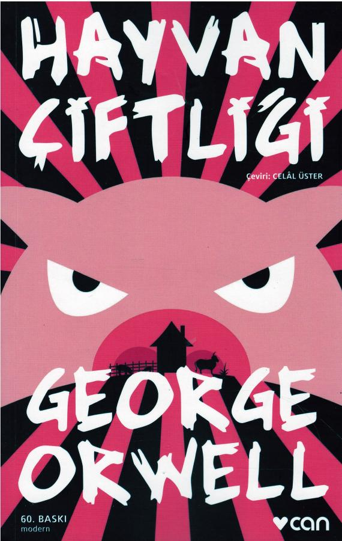

# Hayvan Çiftliği - George Orwell
## 151 Sayfa
### 12.08.2020

 

  

    
     
    

***Karakterler ;*** 
- ***Bay Jhones :*** Beylik Çiftliğin sahibi
- ***Kocareis :*** En başta ayaklanmayı yapan lider domuz
- ***Napoleon :*** Sonrasında başa geçerek tamamen bir dikdatör şeklinde çifliği yöneten domuz

 

> ***Bu güzel eser Goerge Orwell'ın aslında hayvanlar üzerinden o yıllardaki olan olayları eleştirmesini bizlere anlatıyor..*** 

İlk başlarda Beylik Çiftliğin sahibi olan Bay Jhones , tamamen vurdum duymaz ve sık sık sarhoş gezen.. Çiftlikteki hayvanların durumunu , aç olmasını vb. şeyleri hiç umursamayan bir çiftlik sahibiydi... Bunların üzerine Koca Reis dediğimiz bir domuz çiftlikteki tüm hayvanları toplayarak onları kendi özgürlükleri için örgütlemeye başladı.. Aradan bir süre geçtikten sonra artık dayanamaz bir noktaya gelen çiftlikteki hayvanlar ayaklandılar ve hep birlikte insanları bu çiftlikten kovmayı başardılar.. 

Bu zaferin ardından Koca Reis , eşitliği ve adaleti ele alan 7 temel kural belirleyip bunu çiftliğin duvarına yazdılar ve çiftliğin ismi artık hayvan çiftliği olarak değiştirildi.. Bir süre her şey yolunda gitse , Koca Reis öldükten sonra , artık hiçbir şey eskisi gibi olmamaya başladı.. Zamanla domuzların zeki ve akıllı olması göz önüne alınarak ,  çiftliği yönetmeye onlar başladı.. 

Gün geçtikçe daha sert ve baskıcı bir yönetim sergilemeye başladılar.. Diğer hayvanları her zaman çalıştırmaya ve tüm güzel hasatları ve diğer şeyleri kendilerine almaya başladılar.. Bu kitabın sonuna kadar bu sekilde işlenmeye devam ediyor , üstelik diğer hayvanlar hiçbir şey yapamadan bu durumu kabullenmekten başka ellerinden bir şey gelmiyor.. Kitabın sonunda ise ,  domuzların tamamen insanlara benzemesi ve birbirlerinden hiç bir farkı kalmaması , vurgulanarak bitiriliyor.. 

> ***Bu güzel eser bizlere , aslında çok güzel bir mesaj veriyor.***

