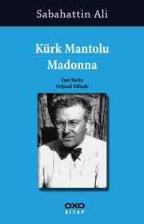

<table><tr>
<td align="left"> 
  
# Kürk Mantolu Madonna - Sabahattin Ali
## 160 Sayfa
### 14.08.2020

  
</td>
<td> 
  

    
     
    
  
 
</td>

</tr></table>

***Karakterler ;*** 
- ***Hamdi :*** Mektepten bir arkadaşı 
- ***Raif Efendi :*** Odasındaki çalışma arkadaşı
- ***Maria Puder :*** Raif Efendi'nin aşık olduğu ve evlendiği kadın.

 

Kahramanımız , işsiz bir şekilde dolaşırken , mektepten arkadaşı hamdi ile karşılaşır.. Hamdilerin evine misafir olur. Biraz sohbet muhabbet sonucunda , işsiz olduğunu bahsi açılır.. Hamdi de ertesi gün için yanına gelmesini söyler. Kahramanımız ertesi gün Hamdi'nin yanına gittiğinde ise ona bir tane iş verir.. Aylık 40 lira da para alacağını söyler.. Odasını hazırlatmıştır.. Kahramanımız hemen odasına gider ve çalışma arkadaşı Raif Efendi ile tanışır.. Uzun bir süre birlikte çalışırlar , ama Raif Efendi hiç konuşmayan , samimi olmayan içine kapanık bir adam.. 

Raif Efendi , ara ara hastalanır  ve işe gelemez.. Yine  bir gün bu sefer ki hastalığı uzun sürmüştür.. Bu süre zarfında  kahramanımız ile az da olsa dost gibi olmuşlardır ama tabi yine o samimiyet hala yoktur.. Raif Efendi , kahramanımızdan ofisteki  çekmecenin içindeki eşyalarını getirmesini istemiştir.. Ertesi gün kahramanımız eşyaları getirir ve o eşyaların içerisinde siyah kaplı bir defter vardır. Başta Raif Efendi o defteri sobaya atmak ister ama kahramanımız onu okumak istediğini bunca zamanın hatrına bunu ona çok görmemesini , kendisini artık diğer insanlardan ayırması gerektiğini söyler..

> ***Kahramanımız hemen eve gelince defteri okumaya başlar.. Yıllar öncesine ait olan , günlük tarzında olan bu yazılar.. Raif Efendinin 24-25 yaşında yaşadıklarını anlatmaktadır..***

O zamanlar genç iken Raif Efendi , okumayıp , son çare babası tarafından Almanya'ya sabunculuk öğrenmesi için gönderilir.. Raif Efendi Almanya'ya varınca uzun bir süre orada burada zamanını geçirir.. En sonunda yolu bir resim sergisine düşer.. Orada gezip tabloları incelerken , ansızın bir tablonun önünde durur ve çok ilgisini çeker.. Her gün durmaksızın buraya gelir ve bu tablonun karşısında durup bu tabloyu inceler , ***Kürk Mantolu Madonna***.. 

En son bir tane bayan gelir ve Raif Efendi ile konuşur. Raif Efendi , oradakilerin dikkatlerini çektiğini , her gün gelip bu tabloyu niye incelediği hakkında sorular sorar.. Ve bu konuşmanın ardından Raif Efendi , kendisi ile alay edileceğini düşenerekten bir daha buraya gelmez.. Aradan biraz daha zaman geçtikten sonra , kaldığı moteldeki 35 yaşlarındaki bir kadınla bir gece barda alkolü biraz fazla kaçırırlar ve eve dönerken , kadın tam düşecekken Raif Efendi'ye sarılır..  O anın getirdiği şeyler ile ,   bu kadın şehvetle Raif Efendi'yi öpmeye filan başlar , yani tam sarmaş dolaş oldukları sırada.. Raif Efendi gözleri bir anda karşıdan gelmekte olan kadını görür.. 

İçinde bulunduğu durumdan kurtulup onun arkasından gidine kadar , Raif Efendi, o kadını gözden kaybeder.. ertesi gün yine aynı saatte acaba buradan geçer mi ümidiyle kendisini yine orada bulur.. Ve ne tesadüftür ki kadın yeniden aynı saatte oradan geçer.. Tabi yüzünü görmediği , ama kürk mantosu giyen o kadının peşinden yakalanma korkusu içerisinde başı önde gitmeye başlar.. En sonunda bir tane mekanın önünde durur ve kadının buraya girdiğini düşünür.. 

Raif Efendi , kadının peşinden girdikten sonra , onu arar ama bulamaz.. Tam da artık gideceği sırada sahneye bir tane kadın şarkı söylemek için çıkar.. Ve bu kadın , takip ettiği kadındır.. Sahnedeyken göz göze gelirler ve kadın içten bir tebessüm ile gözleriyle Raif Efendiyi selamlar , sanki eski bir dostmuşçasına.. Raif Efendi bu durumdan çok mutlu olur.. 

> ***Sonrasında ise kadın sahneden ayrılır ve bir süre sonra yeniden Raif Efendinin yanına gelir.. Bir süre sohbet ederler.. O  tablonun kendisine ait olduğunu , defalarca birlikte yanyana izlediklerini ve raif efendinin o kadar kendini kaptırdığını  ve onu fark etmediğinden filan bahseder.. Kadın , Raif Efendiye kendisini eve bırakmasını teklif eder.. Raif efendi heyecanlı  bir şekilde kabul eder.. Eve kadar yürüyerek sohbet ederek gelirler ve ertesi gün buluşmak için sözleşirler.. Kadının ismi " Maria Puder " dir.. Ertesi gün buluşurlar yine birlikte güzel vakit geçirirler. Ama Maria , ilk başta kendini güzelce ifade eder  ve her şeyi açık açık söyler.. Onu sevemeyeceğini sadece güzel bir dost olacaklarını belirtir..***
 
Neyse işte aradan uzun bir süre geçtikten sonra devamında bunlar güzel güzel vakit geçirirler.. Yılbaşı gecesi birlikte bir mekana giderler ve iyice sarhoş olurkar.. Sonrasında Maria'nın evine gelirler ve o geceninde etkisiyle birlikte olurlar.. Uyuyup sabah uyandıklarında ise , Maria " herşeyi mahvettiklerini ,  artık görüşemeyeceklerini söyler ve ayrılırlar.. Raif Efendi tabi ne yapacagını bilemez.. Bir bakıma dünyası başına yıkılmış gibi olur.. 
 
> ***4-5 gün süre zarfında , Raif Efendi , Maria'yı merak eder ve konuşmak için evine ve çalıştığı yere gider ama onu bulamaz.. En sonunda öğrenir ki hastalanmış ve hastaneye kaldırılmış.. Hastaneye onu ziyarete gider ve 25 gün boyunca hastanede Maria'nın yanında kalır.. 25 günün  sonunda eve geçerler.. Yine evde Maria'yı bakmaya devam eder.. Bir gün konu açılır ve ayrıldıkları zaman ne yaptığını sorar Raif Efendi'ye.. Raif Efendi de tüm olan herşeyleri tamamen hiç yalan söylemeksizin anlatır.. Hastanede olanları anlatır , hissettiklerini anlatır..***

___

En sonunda Maria ise ;  
***" Beni bu kadar çok sevdiğine bir türlü inanamadığım için , sana aşık olmadığımı zannediyormuşum... Bunu şimdi anlıyorum. Demek ki , insanlar benden inanmak kabiliyetini almışlar... Ama şimdi anlıyorum... Sen beni inandırdın... Seni seviyorum... Deli gibi değil , gayet aklı başında olarak seviyorum... Seni istiyorum.. İçimde müthiş bir arzu var." der.*** 

___

Her şey ne güzel oldu derken , hemen kısa bir süre sonra memleketten Raif Efendi'ye haber gelir. " baban öldü , acil buraya gel... " Raif Efendi olanları Maria'ya anlatır ve ne yapması gerektiğini sorar. Maria'da tabiki de gideceksin der.. Öyle olunca Maria da annesinin yana dönmeye karar verir ve hemen Raif Efendi den önce şehri kendisi arkasında bırakıp gider.. Trene binmeden önce ; ***Maria : "şimdi ben gidiyorum. Fakat ne zaman çağırırsan geleceğim..." dedi.***  
Evvela ne demek istediğini anlamadım. O da bir an durdu ve ilave etti ; ***Maria : " nereye çağırırsan gelirim ! "***

> ***" Çağıracağım... Muhakkak çağıracağım ! " diye bağırdım.***

____

Kısa bir süre sonra Raif Efendi de memlekete döndü.. Oraya vardığında her şey darmadağın olmuş. Annesi bir tarafa gitmiş.. Babasının mirasını enişteleri aralarında yemiş desek yeridir.. Raif Efendi'ye kurak beş para etmez zeytinlikler bırakmışlar.. Neyse ki bir süre kendi topladı  ve bu sıralarda Maria ile mektuplaşıyorlardı.. ***Maria mektuplarında bir haberi olduğunu ve bunu anca yanınca gelince söyleyeceğini yazıp duruyordu..***

Bir süre sonra Maria'dan mektuplar kesildi.. Raif Efendi yazmaya devam etti. Çok fazla yazdı ama cevap gelmedi.. Bir süre sonra göndermiş olduğu  mektuplar alınmadığı için geriye geldi ve Raif Efendi tamamen umudunu kesti.. 

> ***Aradan 10 yıl geçti..*** 

***Bu süre zarfında hep Maria'yı suçladı.. Kendisi hayata küstü. Ta ki , Berlin de kaldığı moteldeki kadınla karşılaşana kadar.. Bir gün ,  o kadınla karşılaştı ve biraz konuştular.. Maria 'yı sordu.. Kadın ; " Maria'nın hep annelerine Türk bir adamdan bahsettiğini anlattı.. Bir süre sonra ne yazık ki hamile olduğunu doğum yaptıktan 10 gün sonra öldüğünü ama Maria çocuğun babasını kimseye söylemediğini " kadın , Raif Efendi'ye söyledi..  Ve şuan bu kadının yanında olan küçük kız çocuğunun ise Maria'nın kızı olduğunu öğrendi. Yani kendi kızıydı.. Kadın ve yanındaki kız , trene binip ordan ayrıldılar..***

Raif Efendi tüm bunları öğrendikten sonra kendisine o kadar kızdı ki , Maria'yı suçsuz olduğu için bunca zamandır ona kızdığından kendinden utandı.. 

> ***Bilmiyordu ki Maria'nın ona yazamamasının sebebi ölmüş olmasıydı.. Neyse ki tüm bu olanlardan sonra bir defter aldı ve 1 gün boyunca bunları en başından  itibaren anlattı..*** *( 10 yıl önce.. )*

*Kahramanımız tüm bunları okudu ve ertesi günü defteri teslim etmek için Raif Efendi'nin evine gitti ama ne yazık ki evde büyük bir kargaşa hakimdi.* ***Raif efendi ölmüştü.***

___

> ***Dün akşam bana : "Seninle şöyle bir oturup konuşamadık evlat ! " demişti. Ben artık öyle düşünmüyordum. Dün akşam onunla uzun uzun konuşmuştum.***  
***O bu dünyadan ayrılırken , benim hayatıma , başka hiçbir insana nasip olmayacak kadar canlı bir şekilde giriyordu. Bundan sonra onu daima yanımda bulacaktım.***  
***Şirkette Raif Efendi'nin boş masasına oturdum ve siyah kaplı defterini önüme koyarak bir kere daha okumaya başladım...***

> ***- SON -***

___

### Kitaptan Alıntılar ;
- > ***" Hayatımın başka türlü olmasına imkan var mıydı ? Zannetmem. Tesadüf seni önüme çıkarmasaydı , gene aynı şekilde , fakat her şeyden habersiz , yaşayıp gidecektim. Sen bana , dünyada başka türlü bir hayatın da mevcut olduğunu , benim bir de ruhum olduğunu öğrettin..***
- ***" Kaybedilen en kıymetli eşyanın , servetin , her türlü dünya saadetinin acısı zamanla unutuluyor. Yalnızca  kaçırılan fırsatlar asla akıldan çıkmıyor ve  her hatırlayışta insanın içini sızlatıyor. Bunun sebebi herhalde , " Bu öyle olmayabilirdi !" düşüncesi , yoksa insan mukadder telakki ettiği şeyleri kabule her zaman hazırdır..***
- > ***" Belki bu da kafiydi. Bir insana bir insan herhalde yeterdi. Fakat o da olmayınca ? "***
- ***" Bu akşam anladım ki , bir insan diğer bir insana bazen hayata bağlandığından çok daha kuvvetli bağlarla sarılabilirmiş.. Gene bu akşam anladım ki , onu kaybettikten sonra , ben dünyada ancak kof bir ceviz tanesi gibi yuvarlanıp sürüklenebilirim.."***
- > ***" Bu hareketsizliğin , korkuya dayanan bu tereddüdün daha zararlı olduğunu , insan münasebetlerinde bir noktada taş kesilmiş gibi kalınamayacağını , ileriye atılmayan her adımın insanı geriye götürdüğünü ve yaklaştırmayan anların muhakkak uzaklaştırdığını , karanlık bir şekilde seziyor ve içimde sessizce yanan , fakat günden güne büyüyen bir endişenin yer etmeye başladığını hissediyorum.. "***
- ***" Benim beklediğim aşk başka!" dedi. "O, bütün mantıkların dışında , tarifi imkansiz ve mahiyeti bilinmeyen bir şey. Sevmek hoşlanmak başka , istemek , bütün ruhuyla , bütün vücuduyla , her şeyiyle istemek başka... Aşk bence istemektir. Mukavemet edilmez bir istemek ! "***