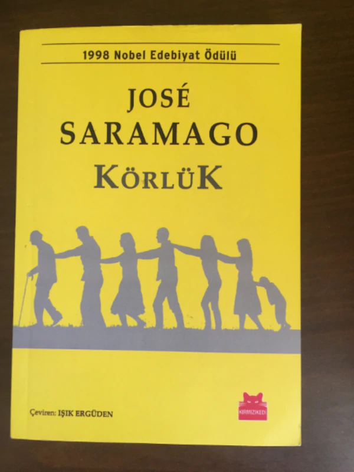

<table><tr>
<td align="left"> 
  
# Körlük - Jose Saramago
## 331 Sayfa
### 16.08.2020

  
</td>
<td> 
  

    
     
    
  
 
</td>

</tr></table>

***Karakterler ;*** 
- ***İlk kör olan adam :***
- ***İlk kör'ün karısı :***
- ***Göz doktoru :***
- ***Göz doktoru'nun karısı :***
- ***Araba hırsızı :***
- ***Koyu renkli gözlüklü kız :***
- ***Küçük kız :***
- ***Bir gözü siyah bandajlı adam :***

> - ***Bu eserimizde karakterler sıfatlar ile anlatılmış herhangi bir isim kullanılmıyor.***

 

Öncelikle hikayemiz , ansızın bir anda trafik ışıklarında kırmızı ışıkta beklerken bir anda kör olan adamla başlıyor.. Kör oldum diye bağırmaya başlıyor ve hemen trafikteki insanlar yardıma koşuyor.. İçlerinden bir tanesi onu evine götürmeyi teklif ediyor.. Zaten kör olan adamında evi yakın olduğu için , hemen onu arabasıyla birlikte eve götürüyor.. Fakat adamı evine bıraktıktan sonra arabanın anahtarlarını vermiyor ve kör olan adamın arabasını çalışıyor.. Tabi bunu kör olan adam , o telaş ile akşam olunca fark ediyor..

Kör olan adam , karısının işten gelmesini bekliyor.. Karısı gelince durumu anlatıyor ve hemen ardından bir tane göz doktoruna gidiyorlar.. Göz doktoru hemen onu durumu acil olduğu için muane ediyor.. Ama anormal hiç bir durum olmadığını söylüyor.. Göz doktoru , o akşam tüm hastalarını muane ediyor ve sonra evine dönüyor.. 

Eşiyle konuşuyor olanları anlatıyor , ne kadar ilginç ve şimdiye kadar böyle bir şeyin görülmediğinden bahsediyor.. Gece eşi yattıktan sonra doktor araştırma yapmaya  devam ediyordu ama bir anda kendisi de kör oldu ve etrafını bembeyaz görmeye başladı.. Sabaha kadar bekledi ve gece eşine bir şey söylemedi.. Sabah olunca hükümet ile konuştular.. Doktoru almaya geldiler , eşi onu arabaya kadar geçiriyordu ama eşinin gelemeyeceğini söylediler ama eşi ise kendisinin de kör olduğunu söyledi böyle olunca.. Doktor ve eşini alıp birlikte , karantina altına almaya götürdüler.. Doktor ve karısını , bir tane terkedilmiş , akıl hastanesine getirdiler.. Hemen sağdan ilk koğuş onlarındı.. 

Bir süre sonra ; sayıları artmaya başladı.. Doktorun o gün muane ettiği herkes kör olmuştu.. İlk kör olan adam ve onun arabasını çalan adamda aynı yere getirildi ve aynı odada yaşamaya başladılar.. ***Bu arada doktorun karısının gözleri kör olmamıştı , sadece kocasından ayrı kalmamak için o , da gözlerinin görmediğini söyleyerek gelebilmişti buraya...***

Bu ilerleyen zamanda , kör takliti yapmak zorundaydı... Bir süre sonra arka arka birbirlerinin omuzlarını tutarak , lavaboya  giderlerken , araba hırsızı olan adam , koyu renkli gözlüklü kızı taciz etti ve onu ellemeye çalıştı , öyle olunca da kız  bir topuk darbesi attı ve ayağındaki sivri topuklu ayakkabı ,araba hırsızının bacağına bıçak gibi saplandı.. Bir süre sonra bu yara iyice ağırlaştı.. Bu arada dışarıdan içeriye hiçbir şekilde yardım yada başka bir şey göndermiyorlardı.. İlerleyen süreçte zaten adamın yarası iyice kötü bir hal aldı ve binadan çıkıp , ana kapıya askerlere doğru yardım istemeye giderken askerin biri ateş ederek , bacağı yaralı olan adamı öldürdü..

Bir süre 7-8 kişi yaşamaya başladılar.. Bir süre öyle idare ettiler.. Sonra sayıları biraz daha arttı ve 1.koğuş dolduktan sonra 2.koğuşunda bir kısmı doldu.. Yine ilerleyen süreçte bu şekilde yaşamaya devam ettiler ama sonradan 200 kişilik büyük bir grup geldi.. Olaylar aslında  bundan sonra başlıyordu.. İçeriyi pislik götürüyordu.. Kalabalıklığın verdiği kargaşa da bi ayrı olaydı.. Bu arada bu zamana kadar illaki ölenler oldu , ama askerler tarafından ama başka sebeple.. Onları kendileri dışarıya bahçelere gömmek zorundaydılar... 

Bir kaç gün sonra binanın giriş kapısının oraya yemek almaya gidecekleri sırada , bu yeni gelen gruplardan bazıları resmen bir çete gibi yemeklere el koymuşlardı ve silahları da vardı... Eğer yemek almak istiyorlarsa , tüm koğuşların değerli eşyalarını getirmelerini söylediler.. Mecburiyetten aç kalmamak için , tüm koğuşlar değerli eşyalarını topladılar ve onlara verdiler.. Bir süre bu şekilde az az da olsa yemek alabildiler.. Sonrasında ise bu grup işi iyice abartmış ve odalardaki kadınları istediklerini söylediler. Yoksa yemek vermeyeceklerdi..

> ***Ne kadar kötü bir durum da olsa , tüm koğuşlardaki kadınlar , 20 tane hayvan erkeğin arasına gidip, kendilerini onlara teslim etti.. En son bizim 1. Koğuşa da ne yazık ki sıra geldi.. Onlarda bunu yaptı.. Ama 1 hafta sonra , doktorun karısı , yan koğuşun kadınları ile  birlikte o erkeklerin yanına gitti ve onların liderini makasla ensesinden  yaralayarak öldürdü....*** 

Bir süre sonra yemek gelmemeye başladı ve aç kaldılar.. O erkeklerin koğuşu ile savaşmak zorunda kaldılar , bunun sonucunda ise mağlup oldular.. Bizimkilerden 2 kişi hayatını kaybetti... Sonrasında ertesi gün  , yangın çıktı ve tüm bina alev alev yanmıştı... Bizimkiler dışarıya çıktıklarında baktılar ki dışarı da bir tane bile asker kalmamış.. Sonradan fark ettiler ki ülkede ki herkes kör olmuş... 

Sadece doktorun karısının gözleri açıktı..  Bir süre yorularak , zor da olsa hayata tutundular.. Bir şekilde doktorun ve karısının evine ulaştılar.. Uzun süre orada kaldılar.. Doktorun karısı yiyecek içecek buldu ve yanındaki 6 kişiyi besledi , baktı.. Resmen gözleri ve elleri olmuştu..  

> ***En sonunda ise bir mucizedir ki ; herkesin gözleri bir bir yeniden açıldı...***

___

> ***+ Neden kör olduk ?***  
> *- Bilmiyorum.*  
> ***+ Belki bir gün nedenini öğreniriz.***  
> *- Ne düşündüğümü söyleyeyim mi sana*  
> ***+ Söyle***  
> *- Bence biz kör olmadık , biz zaten kördük*  
> ***+ Gören körler mi***  
> *- Gördüğü halde göremeyen körler...*  
