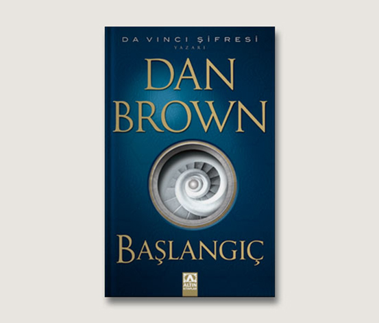

  
# Başlangıç - Dan Brown
## 535 Sayfa
### 19.08.2020

 
  

  

    
     
    

***Karakterler ;*** 
- ***Edmond Kirsch :*** Milyarder bir bilgisayar uzmanı
- ***Robert Langdon :*** 20 yıl önce , Edmond'un öğretmeni ve yakın dostu
- ***Winston :*** Edmond'un yaptığı konuşan ve o kadar da akıllı , yapay zeka bilgisayar
- ***Ambra Vidal :*** Edmon'un yardımcısı , Prens Julian'ın nişanlısı
- ***Prens Julian  :*** Ülkenin başına geçecek yeni kral adayı , babası ülkenin kralı
- ***Amiral Avila :*** Edmond'u öldüren adam

 

> ***" Dan Brown'un okuduğum ilk eseri ama kesinlikle son olmayacak. Benim için ; çok keyif alarak okuduğum ve  aynı zamanda çok sevdiğim bir kitap oldu. "***

 

Edmond gerçekten üstün bir bilim insanı diyebileceğimiz bir bilgisayar uzmanı.. Tarihe geçmiş , bir çok yeni buluşa imza atmış ve kimsenin bilmediği ***Winston*** gibi üstün bir yapay zeka bilgisayar yapmıştır... 

Yine Edmond çok büyük bir şey keşfetmiş.. Tüm dünyanın dengesini alt üst edecek , dinleri bir kenara atacak bir buluş.. Bunu açıklamadan önce üç büyük dinin temsilcileri ile bir araya gelip , buluşunu onlara anlattı ve bu buluş onları çok rahatsız etti ve Edmond'un bu buluşu açıklamasına karşı çıktılar..

Edmond , bir kaç gün sonra ansızın bir şekilde tüm dünyaya buluşunu açıklayacağını duyurdu.. Sunumun yapılacağı yerde yüksek bir güvenlik önlemi vardı.. Sadece listede ismi olanlar katılabiliyordu , girişte herkese kulaklık yani sanal rehber veriliyordu..

> Edmond'un dostu , Robert Langdon da mekana giriş yaptı.. Ona da aynı şekilde kulaklık verildi ve ardından bi anda kulaklık konuşmaya başladı ilk başta konuşanın uzaktan gerçek bir insan olduğunu düşünmüştü ama , bu konuşan ***Winston***'idi.. Sonrasında Winston , kendisini Robert Langdon'a açıkladı.. ***Winston , kendisinin Edmond'un tasarladığı bir yapay zeka bilgisayar olduğunu söyledi ve bunu kimsenin  bilmediğini anlattı..*** Sonrasında Winston , Robert Langdon'u yönlendirerek , Edmond ile buluşturdu.. Bir süre sohbet ettiler..

Sohbetin ardından ayrıldılar ve bir süre sonra tüm dünyaya canlı yayın yaparak , gösteri başlamıştı... Programı , Ambral Vidal isminde hoş bir kadın sunuyordu. Uzun bir süre sanal olarak , video şeklinde anlatılarak ilerledi ve sonradan ise dumanlar eşliğinde sahne de Edmond belirmişti.. 

> Güzel bir girişe imza atan Edmond bir süre konuştu olanları anlattı ve ***" nereden geldik , nereye gidiyoruz."*** şeklinde soruyordu.. 

Tam da buluşunu açıklayacaktı ki , kimsenin görmediği bir yerden ***Amiral Avila*** , tek bir kurşun ile Edmond'u başından vurdu ve Edmond oracıkta can verdi. Tamamen buluşunu dünyaya anlatamasın diye bir suikast'e kurban gitti..

Bir süre olayın şokunu atamayan "Ambra Vidal ve Robert Langdon "' sonrasında Winston'un yardımı ile binayı terk ediyorlar ve herkesten kaçıyorlar.. Oradan ayrılmadan önce Robert Langdon , yerde cansız bir şekilde yatan Edmond'un cebinden telefonunu alıyor ve onun parmak iziyle açıp , şifreyi kaldırıyor.. Yolda Winston'un yardımıyla , ilk önce bir tekne ile havalanına gidiyorlar ve ordan da helikopter ile Barcelona Havaalanına iniyorlar.. Edmond'un tesla aracıyla , Edmond'un evine geliyorlar.. Evin önünde bir sürü gazeteci vs olmasına rağmen.. 

Ambra ile robert arabanın içerisine saklanıyorlar ve tesla otopilot ile , Edmon'un evine giriş yapıyorlar..

___

> ***Şimdi şöyle bir durum var.. Edmond'un buluşunu yayınlamak için , uzak bir sunucuya bağlanıp bu işlemi başlatmaları gerekiyor. Ve bunun içinde 47 haneli bir şifreye ihtiyaçları var.. Daha önceden bildikleri kadarıyla bu da Edmond'un en sevdiği bir şiir'den kesitmiş..***

___

Bu yüzden eve geldiklerinde kütüphanedeki tüm kitaplara bakıyorlar.. Bu arada Edmond'un banyosunda buldukları ilaç kutuları ile , Edmond'un aslında kanser olduğunu öğreniyorlar. Winston ile konuşunca , Winston bunu bildiğini ve Edmond'un aslında ortalama bir haftalık  bir ömrü kaldığını söylüyor... Yani bir hafta sonra zaten Edmond ölecekti...

> Kitapları aramaya başlıyorlar , hepsine bakıyorlar ve hiçbir tane şiir kitabı bulamıyorlar.. En sonunda Robert Langdon , cam ile çevrelenmiş bir şeyin içinde yazar ve şair ***" William Blake'nin Tüm Eserleri "*** isimli kitabı görüyor ve hemen camı kırıyor.. 

Bakıyor ki içi boş..  Ama kapakta bir tane not var , Edmond'un kartın arka yüzüne yazılmış tek talebi , ***" Kitabın 163. Sayfası açık olacak şekilde sergilenmesiydi.."*** Robert Langdon'un bunu bulduğu esnada , tüm binanın etrafını polisler sarmıştı.. Çatıda ise kraliyet muhafızları vardı , helikopterden dolayı , Ambra Vidal sesini polislere duyurmakta güçlük cekti ve sonradan geleceğin kraliçesine ateş açılmaya başlandı , Ambra bunlardan kaçarken ; 

> Dengesini yitirdi ve yere düştü , bu düşme sonucunda ise elindeki ***Edmond'un telefonu da yuvarlana yuvarlana parcalanarak çatıdan aşağıya düştü ve telefonu ne yazık ki yitirdiler.. Winston ile bağlantı kopmuştu...*** Kraliyet muhafızları Robert Langdon ve Ambra Vidal'i helikoptere aldılar ve sonra da , Ambra'nın emriyle , o kitabın verildiği kiliseye yani ***" Sagrada Familia Kilisesi'ne "*** gittiler..

Orada ***" Rahip Bena "*** onları , kitabın olduğu yere götürdü ve 163. Sayfa'da bir tane resim vardı.. ***Hemen onun öncesinde bir tane şiir vardı ve son satırı ; Onların aradığı şifre idi...***

___

> ***Şifre : " karanlık dinlerden kurtulur & tatlı bilim hüküm sürer." --> "karanlıkdinlerdenkurtulurettatlıbilimhükümsürer"***

___

İşte 47 haneli bu şifreyi bulduktan sonra , tam ayrılacakları sırada , Amiral Avila ( Edmond'un katili ) , 2 kraliyet muhafızını öldürdü ve " Robert Langdon ve Ambra Vidal'i " de öldürmek için emir almıştı.. Kaçarlarken , Robert Langdon ile katil baya bir boğuştular ve en sonunda Robert , katili merdiven boşluğuna itmeyi başardı.. Katil Amiral Avila öldü..

> Robert Langdon ve Ambra Vidal  yine helikopter ile ayrıldılar ve Edmond'un sunucularını bulmalıydılar.. Barcelona'nın Stadı'nın yanında bir tane yere geldiler.. ***" Barcelona Süper Bilgisayar Merkezi"*** Uzun bir süre kapılara vurdular. Kamera üstlerinde dolandı ve sonra kapı açıldı.. İçeri girdiler.. Karşılarına ekranda bir şeyler çıktı , onları  izlediler..

Sonrasında Winston'un sesi duyuldu.. Winston'a yeniden kavuştukları için çok sevinmişlerdi... Winston burada ki herşey hakkında onları bilgilendirdi.. Sonrasında Edmond'un calışma odasına gittiler.. Devasa mükemmellikte bir sistem vardı.. Şifreyi girdiler...

> ***Ve ardından tüm dünyaya 220 milyona hitap ederek canlı yayında , Edmond'un buluşunu tüm dünyaya gösterdiler..***

> ***Yayından sonra Ambra Vidal , Prens Julian ile buluşmak için ayrıldı.. Robert Langdon , Winston ile konuştu.. Tüm bu olanlardan sonra Winston yarın  1 'de kendisini sileceğini söyledi ve Edmond tarafından bu şekilde  kodlandığını  anlattı..***

Ertesi gün , Winston'un kendisini silmesinden 10 dakika önce , Robert Langdon  Winston'la konuştu.. Robert Langdon , bazı şeylerin farkına varmıştı.. " Monte @ iglesia . org " , ismindeki muhbir Winston'muş..  

> ***- SON -***

____

 **"Canlı yayınlanan sunumun ortasında Edmond'ı öldürmesi için Palmarian Kilisesi üyesini kim tuttu?" dedi Langdon** ... Winston bir süre cevap vermedi. "Sesinizdeki şüpheyi duyuyorum profesör ama endişelenmenize gerek yok. Ben , Edmond'ı korumaya programlandım. Onun en yakın arkadaşım olduğunu düşünüyorum." Biraz durdu. "Akademisyen olduğunuz için eminim *Fareler ve İnsanlar*'ı okumuşsunuzdur."  

 Langdon bu cevabı durumla hiç bağdaştıramamıştı. **"Elbette okudum ama ne ilgisi----"**  
Kelimeler boğazında takılı kaldı. ***"Sadık , cesur , merhametli.*** Edebiyattaki en ünlü arkadaşlığı tarif etmek için lisedeyken bu üç kelimeyi seçmişti. 

***Fareler ve İnsanlar'ın final bölümünde bir adamın , çok sevdiği arkadaşını korkunç bir sondan korumak için öldürdüğü yazıyordu..***

 Langdon , **"Winston,"** diye fısıldadı. **"Lütfen... Hayır."**  
Winston , "İnanın bana," dedi. "Edmond böyle olmasını isterdi."

___

### Kitaptan Alıntılar ;
- > ***" Düşmanlarınız mı var ? Güzel. Demek ki hayatta bir şeylerin mücadelesini vermişsin. "***
  
- ***" Daha en başında doğa da yazılı bulunduğu için hiçbir şey icat edilemez.     Orjinallik aslında geri dönmekten ibarettir. "***

- > ***" Canavarlarla savaşan kişi , bu süre zarfında kendisi de canavarlaşmamaya dikkat etmelidir. "***

- ***" Başarı , hiç şevkini kaybetmeden bir başarısızlıktan diğerine geçebilme kabiliyetidir. ( Winston Churchil ) "***

- > ***" Tarih bana iyi davranacak çünkü onu yazmaya çalıştım. "***
