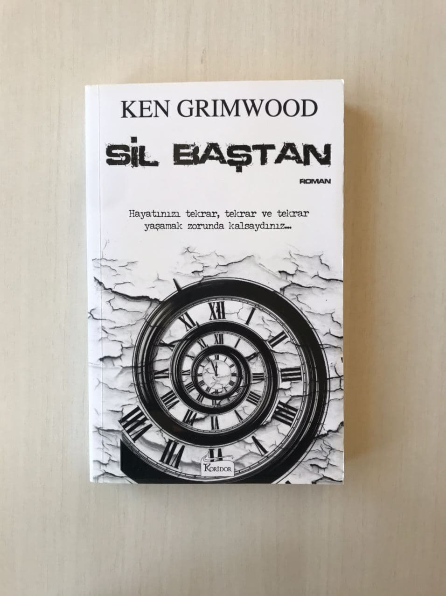

<table><tr>
<td align="left"> 
  
# Sil Baştan - Ken Grimwood
## 361 Sayfa
### 21.08.2020

  
</td>
<td> 
  

    
     
    
  
 
</td>

</tr></table>

***Karakterler ;*** 
- ***Jeff Winston  :*** Kahramanımız
- ***Pamela Philips :*** Tekrara başlayan , sonrasında ise Jeff ile sevgili olan kadın

 

Jeff bir gün ofiste , eşiyle telefonda konuşurken bir anda ölüyor ***1988 Ekim 18*** .. Sonrasında ise 1963 , Atalanta'da yurt odasında hayata yeniden başlıyor.. Başta neler olduğunu anlamakta güçlük çekiyor , hayal gördüğünü filan düşünüyor ama biraz zaman geçtikçe fark ediyor.. 

Her şey geçmişte olduğu gibi yeniden aynı sırayla olduğu için , jeff, sonucunu bildiği şeyler için at yarışı vs. büyük bahisler yatırıyor ve o şekilde zengin oluyor.. İlk tekrarı , zenginlik ve karı kız içinde geçiyor...

> İkinci tekrara başladığında başta kendi eşiyle tanışmayı deniyor ama kendi eşi onu reddediyor , öyle olunca Judy ile bu sefer daha sade bir hayat yaşıyor ve bir tane çocuk sahibi oluyor.. Ama yine bir süre sonra aynı öldüğü tarihte , tekrar ölüyor ve en baştan başlıyor.. 

Üçüncü tekrarında yine bir şekilde para kazanarak ilerlerken , daha önce hiç karşılaşmadığı bir film ile karşılaşıyor ve bu film baya da bir başarılı bir film olduğu için , bu filmin yapımcısi ile tanışıyor ***" Pamela Philips "*** .. Sonrasında konuşurlarken , pamela'nın da tekrarcı olduğunu anlıyorlar.. Bu tekrarın sonuna kadar birlikte zaman geçiriyorlar ve sonlara doğru aşk yaşıyorlar.. Ölmeden önce tekrardan bir araya gelmek için sözleşiyorlar..

>Dördüncü tekrara başladıklarında , Jeff hemen Pamela'nın 14 yaşında ailesiyle yaşadığı eve gidiyor.. İçeriye girip , Pamela ile konuşuyor ama Pamela Jeff'i hatırlamıyor , bunun sebebi ise asıl Pamela'nın henüz tekrara başlamamış olması..

Aradan 1 yıl geçiyor , Pameladan Jeff'e mektup geliyor ve bunun sonucunda bir araya geliyorlar.. Yani bu da demek oluyor ki , artık tekrarların başlangıç noktası sapmaya başlıyor.. Bu tekrarlarında yine birlikte zaman geçiriyorlar , her tarafta mesaj paylaşıyorlar kendileri gibi bir tekrarcı bulmak amacıyla ve çabalarının sonucunda ise 1 tane tekrarcı buluyorlar.. Psikopat katil bir adam , hastaneye kapatılmış vs..

> Beşinci tekrarın tamamında , yine büyük bir sapma yaşıyorlar.. Başlangıç zamanları 3-5 yıl belki daha fazla gecikiyor bu sefer.. Bu tekrarda , tüm bu olanları ve olacakları dünya ile paylaşıyorlar ve bilim insanlarının dikkatini çekip , onların kendilerine yardım etmesini istiyorlar.. Ama bunun sonucunda pek bir şey elde edemiyorlar.. Bu tekrarları deyim yerindeyse , boşa gidiyor diyebiliriz..

Bir sonraki tekrarlarında çok az zamanları kalıyor yine birlikte geçiriyorlar... Artık en sonunda tekrar hakları bitiyor ve uzun bir süre arafta kalıyorlar  , acı çekiyorlar.. Ölüyorlar ve tekrar ölüyorlar ,  böyle bi döngüye giriyorlar.. 

>Tüm bunlar son buluyor ve yaşamaya devam ediyorlar.. Artık kaldıkları yerden , herhangi bir tekrar olmaksızın... Birbirleri ile konuşuyorlar ve tüm o olanlar , yani aralarında yaşadıkları şeyler gerçekmiş.. 

> ***- SON -***

 

### Kitaptan Alıntılar ;
- > ***" Sorgulanmamış bir hayat yaşamaya değmez." Doğru. Ama " çok yakından incelenmiş bir hayatta intihara değilse bile deliliğe yol  açar. "***