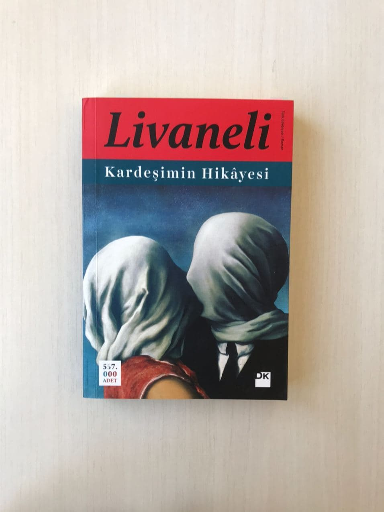

<table><tr>
<td align="left"> 
  
# Kardeşimin Hikayesi - Zülfü Livaneli
## 324 Sayfa
### 27.08.2020

  
</td>
<td> 
  

    
     
    
  
 
</td>

</tr></table>

***Karakterler ;*** 
- ***Ahmet Arslan :*** Kahramanımız
- ***Mehmet Arslan :*** Kahramanın kardeşi
- ***Kerberos :*** Kahramanımızın köpeği
- ***Hatice Hanım :*** Kahramanımızın hizmetçisi , ev işlerine yardım eden biri
- ***Arzu :*** Öldürülen kadın , genç ve güzel bir kadın
- ***Ali :*** Öldürülen kadının , 30 yaş büyük kocası
- ***Gazeteci Kız:***
- ***:***

 

Kahramanımızı en başta tanımlayacak olursak , sessiz sakin, kimseyle konuşmayan , evine sadece 3 kişi girmiş.. Kimse ile temas  etmeyen. Gerçektende öyle fiziksel temastan ciddi bir şekilde kaçınıyor.. Evinde bir sürü kitap olan , halk kütüphanesi bile  yanında az kalır... Böye birisi olarak tarif edebiliriz.

Hikayemiz , kahramanımızın hatice hanımın kendisini telefonda aramasıyla başlıyor.. Hatice Hanım zaten çok konuşan ve neredeyse hiç susmayan biri.. Dün gece Arzu Hanım'ın evinde öldürüldüğünü  anlattı..  Dün gece onların evinde verilmiş olan , partide birliktelerdi diyebiliriz.. Ama kahramanımız o kalabalıktan uzaklaşıp , geceyi evin üst katlarında geçirmiş.

Aynı gün , evine bir genç gazeteci kız geliyor.. Biraz bilgi almaya çalışıyor ,ama kahramanımız bir o kadar esrarengiz ve ilginç bir adam ki , başta anlaşamıyorlar tabi ki kız ile.. Kız çekip gidiyor.. Kahramanımız arkasından , onun için , yani cinayet ile ilgili bir hikayesi olduğunu söylüyor.. 

Bir süre sonra bu kız yine geliyor.. Tabi bu hikaye , Arzu ve Ali'nin evinde çalışan , çocuk bakıcılığı yapan Svetlana'nın hikayesi , sözde Ali'den hoşlandığını filan söylüyor.. Bir süre sonra jandarma , kahramanımızı ilçeye hakim karşısına götürüyor.. Olanları anlatıyor , ve bunun sonucunda kahramanımız  tutuklanıyor ..

Bir süre orada kaldıktan sonra aynı gün içerisinde  serbest bırakılıyor.. İlerleyen günlerde , gazeteci kız yine geliyor.. Svetlena hakkında yaptığı haberin boş çıktığından filan bahsediyorlar.. Konuşuyorlar ; sohbet , muhabbet... 

> Kahramanımız , kendi kardeşinin başına gelenleri , büyük bir aşk hikayesi olduğunu , bunları anlatacağını söylüyor.. O gece genç kız , kahramanımızın evinde kalıyor.. Hikayeyi anlatmaya başlıyor en başından.. Çocukluğundan , annesi ve babasını bir trafik  kazasında kaybettiklerini. Daha sonradan dede ve ninelerinin yanlarına Ankara'ya gittiklerini... Onları büyüttüklerini ve sonra onların da öldüğünü anlatıyor.. Bir süre sonra iki kardeş mühendis olarak mezun olduktan sonra.. Kahramanımız Rusya'ya , İnşaat Mühendisi olarak gidiyor , ardından kardeşini de çağırıyor ve kardeşi de gelmeyi kabul ediyor...  

Hikayenin burasını ; anlatırken , bu genç gazeteci kızımız uyuyup kalıyor ve bugün böyle bitiyor... 

Ertesi gün , ayrılıyorlar...  Yine eve jandarma geliyor. Yine hakim karşısına çıkıyor , bu sefer , o hizmetçi kız hakkında bilgiler veriyor.. İşi bittikten sonra oradan ayrılırken bizim genç kız ile denk geliyorlar.. Biraz konuşuyorlar ve sonra kız kahramanımız ile birlikte köye dönüyor , hikayenin devamını merak ettiği için.. 

> Zaten kahramanımız duygusuz bir insan olarak tanımlıyor kendini , hiç bir şekilde canıma zarar verilmediği sürece hiçbir şeye aldırmam ben filan diyor.. Bunun üzerine bu kızımız , kahramanımızı tahrik edici şeylerde bulunuyor , hakaretler , saldırılar , tükürmeler vs ama kahramanımız bunlara hiç bir şekilde tepki vermiyor.. 

> En son evin önüne geldiklerinde ise , bir anda kahramnımızın elini tutuyor  ve kahramanımız orada neredeyse benliğini yitirdi diyebiliriz.. Uzun yıllardır , hiç kimseye dokunmadıgı için, neredeyse kendini kaybetti ve bağırmaya başladı.. Bunun üzerine köpeği de çok büyük ve vahşi olduğu için... Zincirini koparıp , kızı altına aldı ve neredeyse parçalayacaktı... Kahramanımız hemen köpeğine komutlar vererek , durmasını ve yuvasına gitmesini söyledi... Kız bir süre yerde , krize girmiş bir şekilde yattı kaldı , korkudan... Sonrasında eve geçtiler.. Bir süre kendine gelemedi kız ve topallıyordu..

Ertesi gün , baktılar ki kızın ayağında diş izleri var. Doktor çağırdılar... Kahramanımız ilaç almaya gitti.. Kız ailesini aradı ve 3 gün kadar burada kalacağını söyledi..  3 gün boyunca kız evdeydi... Kahramanımız , kardeşi Mehmet'in hikayesini anlatmaya devam ediyor..

> ***Mehmet'in hikayesi -->*** Ahmet , kardeşini " Minsk , Borisov " ' a gelmeye ikna ediyor... Birlikte çalışmaya başlıyorlar.. Bir süre sonra Mehmet , pazarda dolaşırken çok güzel mükemmel ötesi bir kızı görüyor.. Konuşmaya çalışıyor ama saçmalıyor... Sonraki bir kaç hafta boyunca, rusça da bilmediği için yanında Ludmilla ismindeki çevirmen ile bu kızı arıyorlar. Ludmilla , bu arada şantiyede çalışan patron bayan.... Neyse işte bir sürenin ardından bu pazarda gördüğü kızı buluyorlar , bu kız ***Olga Pavlona***.. Uzun bir süre birlikte zaman geciriyorlar.. Tabi tüm bunlar olurken , yanlarında hep Ludmilla olmak zorunda , çünkü iletişim kuramıyorlar.. Ludmilla çeviriyor her şeyi.. En sonunda Mehmet ,  Olga'yı Türkiye'ye getirmeye karar veriyor.. 

> Türkiye'ye gelmek için , Olga, Olga'nın kardeşi , Ludmilla ve Mehmet havaalanına geliyorlar.. Kızlar geçiyor güvenlikten ama Mehmet geçemiyor.. Mehmet'i bir süre bekletip , bir takım telefon görüşmelerinden sonra alıp götürüyorlar... Biraz zaman alsa da en sonunda küçücük hücre gibi bir yere kapatıyorlar.. Bu küçük yerde sadece az miktarda yemek-su veriyorlar.. Ve tuvaletini de bu küçücük hücrenin bir köşesine yapıyor... Çok uzun bir süre burada kalıyor.. Bir yılı aşkın bir süre.. Zaman kavramını yitiriyor.. Kendini öldürmek istiyor ama , bunu yapabileceği hiç bir şey olmuyor etrafında... Resmen , hayvanlaştığını söylüyor...

> En sonunda yanına bir tane adam getiriyorlar , o adam 1 gün orada kalıyor.. Bu sürede , Mehmet , onunla konuşuyor ve tüm olanları anlatıyor. Adamdan yardım etmesini istiyor.. Adamı ertesi gün alıp götürüyorlar.. Bir süre umutla bekliyor ama yine aradan uzun bir süre geçiyor ve tüm umutları neredeyse tükeniyor.. En sonunda oraya biri geliyor ve Mehmet'i  o hücreden çıkartıyor... Artık kurtulduğunu ve tüm bu şeylerin bittiğini söylüyor.. Mehmet işin aslını öğrenmek için sorular soruyor... 

> O zamanlarda , kendisini aynı isimle ve ona çok benzeyen bir terorist lideri ile karıştırdıkları için böyle bir yere kapattıklarını , sonrasında aslında o liderin öldüğü , ama Mehmet'i orada unututklarını söylüyor.. Yani Mehmet , isim benzerliğinden , boşu boşuna suçsuz yere bir buçuk yıl boyunca o hücrede kafayı yiyor... Ve o adam , onu ihbar eden kadının  ***"Ludmilla "*** olduğunu , söyleyince.. Mehmet çok büyük bir dehşete düşüyor... Sebebini anlayamıyor..

Neyse işte bir süre sonra Ludmilla'nun adresini buluyor evine gidiyor.. Onu içeriye sokuyor , sinirinden sert bir tokat atıyor.. Sonrasında olanları konuşmaya başlıyorlar.. Ludmilla , başta böyle bir şey olmasada bir süre sonra Olga'ya aşık olmuş.. Onsuz yaşayamayacak duruma gelmiş.. En sonunda Mehmet de Olga'yı Türkiye'ye götürecek olunca , bunu engellemek için  Mehmet'i ihbar etmiş... Bunları duyduktan sonra Mehmet Ludmilla'nın boğazına yapışıyor.. Neredeyse onu boğacak , deli gibi Olga'nın yerini soruyor.. Onun aşkından buralara kadar geldiğini vs söylüyor.. Neredeyse kadını öldürecekken ,arkadan bir ses..

> Olga çıkıp geliyor.. Mehmet olga'ya sarılıyor , ama sanki Olga onu hatırlamıyor bile.. Olga, yerde yatan Ludmilla'nın yanına gidiyor, onu öpüyor filan.. Mehmet kapıdan çıkıp gidiyor.... Gece de yolda yürürken , atla yanına gelen kızlar'ın atlarından bi tepik yiyor.. Hastaneye kaldırılıyor , beyin sarsıntısı 

***Bir süre sonra ...***

> Evdeyken , ikinci gün gece bir ara Mehmet geliyor , biraz kahramanımız ile konuşuyorlar ve kahramanımızın yanlış bir kaç şey söylemesi üzerine çekip gidiyor.. Son gece de kahramanımız genç gazeteci kıza hikayeyi anlatıp bitiriyor ve zaten birlikte vodka içtikleri için sarhoş oluyorlar diyebiliriz. Kız uyuyup kalıyor.. Sonrasında kahramanımız uyuyamıyor ve kızın odasına gidiyor , onun yanına yatıyor , kokusunu içine çekiyor ama hiç bir şekilde kıza dokunmuyor.. Bir süre sonra odadan ayrılıyor.. Ertesi sabah kız son günü olduğu için kahramanımız evinden ayrılıyor.. 

> Aynı gün içerisinde kahramanımız , intihar ediyor ve yazdığı 300 sayfa kadar notlar ile birlikte savcıya bir mektup bırakıyor... Mektupta , Arzu Hanım, cinayetinin katili , Hatice Hanım'ın engelli oğlu Muharrem olduğunu söylüyor.. Muharrem , altın kolyeyi Arzu'yu öldürdükten sonra boynundan alıyor ve kahramanımızın bahçesindeki köpeğin olduğu yere gömüyor..

***Tabi bu arada, sonuç olarak kahramanımız, yani Ahmet Arslan isminde birinin olmadığını , kahramanımız olarak adlandırdığımız kişi aslında kardeşi Mehmet Arslan olduğu ortaya çıkıyor.. Yıllar önce , o trafik kazasında annesi babası ve ikiz kardeşi Ahmet'in öldüğü kayıtlara geçmiş.. Mehmet Arslan bu trajedi ve sonrasında yaşadığı trajik aşk hayatının sonucunda bu hale gelmiş , ve tüm bu olanları kendini Ahmet'in yerine koyarak , Mehmet'in yaşadığını düşünmüş....***

***Sonuç olarak kahramanımız , yani Mehmet Arslan , intihar ederek , sevgili ismini verdiği sarılma makinasının altında yüksek basınç sonucu , ölüyor...***

> ***- SON -***

___

- Savcıya hiç kızmadınız mı ?  
  Yoo , niye kızayım.    
- Sizden kuşkulandı , tutuklanmanızı istedi ya.  
  "Görevini yaptı" dedim. "ayrıca bir ara sen de kuşkulandın ,unutma. Az bağırıp çağırmadın bana."    
- "Ben sizi denemek istemiştim" dedi. "sinirleriniz nereye kadar dayanıyor diye."  
  "Bunun sınırı yok. Canıma zarar vermediği sürece hiçbir şeye aldırmam ben. Çünkü insanları yöneten o diktatörü , yani egoyu yendim.

____

+ "Her insan bedeninin çürüyeceğini bilir ve bundan korkar" dedim. "Ama çoğu insanın ruhu gövdesinden önce çürür; nedense bundan kimse korkmaz !"  
  "Bunu niçin söylediniz şimdi?" diye sordu.    
+ "Kardeşim ve benim için" dedim. "Ama inan bana, insanların çoğunun ruhu , bedeninden önce çürür."

 

### Kitaptan Alıntılar ;
- > ***"Bende" dedim , "duygularla ve egoyla çarpılmamış , serinkanlı , duru bir gözlem alışkanlığı var. Belki fark etmişsinizdir; her şeyi ve herkesi gözlemlerim. Birçok insan bunu yapamaz , çünkü aşırı derecede kendi duygularıyla ve egosuyla meşguldür. Başkalarıyla ilgilenemez."***

- > ***"Cevabı biliyorsun aslında" dedim. "benim için hayat bir roman , herkes de roman kahramanı."***

- > ***" İnsanın geçmişini araştırması acı veren bir deneyimdi. Mutlu olabilmenin tek şartı " unutmayı " başarabilmekti.. Hayvanların yaptığı gibi neredeyse hafızasız yaşamak ve mutlu olmak mümkündür. Ama hiç bir şeyi unutmadan yaşamak imkansızdır.***

- > ***" Sen bal gibi bu kıza aşık olmuşsun. Ahmet ! " dedi. " bunu kabul et , rahatla. İnsanın en kötü yalanı kendine karşı olanıdır."***

- > ***" Aşkın , gözü kapalı uçurum kıyısında yürümek olduğunu bilen biri aşık olur mu hiç ? " deyip sustum."***

- > ***" Evet , insan her şeyi unutarak yaşayabilirdi ama her şeyi hatırlayarak yaşayamazdı."***

- > ***" İnsanların duyguları olmasaydı her şey ne kadar kolaylaşırdı.."***

