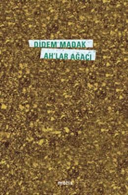

  
# Ah'lar Ağacı - Didem Madak
##  76 Sayfa
### 28.12.2021
  
 

  

    
     

 
 

> ***(Tanıtım Bülteninden - Metis Yayıncılık)***

***Güçlü bir el silkeledi beni sonra   
Sanırım tanrının eliydi,   
Sayamadım kaç ah döküldü dallarımdan   
Çok şey görmüşüm gibi,   
Ve çok şey geçmiş gibi başımdan   
Ah dedim sonra,   
Ah!***

***İç ses diye söylendim   
Gel!   
Ahlar ağacından sen de biraz meyve topla.***
_____

***SAMSON VE DALİLA***

***Heceleme beni artık Allah'ım  
Bırak okunaksız kalayım   
Kaderimin hepsi pek iyi olmasın varsın   
Bak, ömrüm eriyor işte   
Çocukluk fotoğrafımdaki kardanadam gibi yanı başımda   
Bak, ilkokul talebesi kalbimden   
Yine karne parası istiyorlar   
Bir gecekonduda oturuyor kalbim oysa   
Yağmur yağdıkça   
Bir gecekondunun damı gibi içine doğru ağlıyor (s.43)***

____

***Itiraf etmek gerekirse  
Domates-biber biçiminde tuzluklar aldım pazardan  
Kalp şeklinde kültablaları  
Kalbimde söndürülmüş birkaç sigaradan kalan kül  
Yetmezdi yeniden doğmaya.  
Orhan Gencebay dinledim itiraf etmek gerekirse  
Bedelini ödedim ama Pollyanna  
Itiraf artık tedavülden kalkmış bir kâğıt para. (s.50)***

_____

***Kardeşim, biriciğim   
Bazı yaralar yararlıdır buna inan,   
Bazı yaraların ortasından küçücük bir el,   
Sanki geçmişine çiçek uzatır,   
Bazı yaralardan sızan kanla,   
Tüm geleceğin yıkanır.   
Bazı yaralar...   
Sayıyorum, sayıyorum   
Hiç bitmiyor güller   
Sensiz hiç bitmiyor zaman.   
Belki saymayı mutsuzlar bulmuştur.   
Mutsuzlar hep sayar.   
Bizler mihsabıyız hayatın,   
Tam on gün oldu,   
Gamzelerinden su içmiyor kuşlar.   
Kardeşim, biriciğim   
Hadi çık o karanlık odadan. (s.64)***  

____

***Hay!   
Keşke susmanın muhabbet kuşu olaydım.   
Ters Pinokyo olmak istiyorum Gepetto Usta   
Kötülüklere boğulup   
insanlıktan çıkmak istiyorum artık!   
Kafam karışık ama   
Yetişir!   
Bir beyaz balinanın karnında uyumak istiyorum artık.   
Camdan pabuçlarım kırık   
Prens de bulamaz beni artık.   
Hayata söyleyin bundan sonra gitsin   
Anlamını masallarda arasın   
Hay!   
Ben sizin ruhunuza çiçek aşısı yapayım   
da çiçekler açsın ruhunuz.   
Hadi alkışlayın!   
Biliyorum hâlâ biraz safım.***  

***Keşfettim   
Küçük ruhlarınızdaki büyük Amerika'yı   
Hadi alkışlayın!   
BU SİZİN BAŞARINIZ. (s.67)***

____

***"Sanırdım  
Yanağımın sıcağına göç ediyor kırlangıçlar  
Beni anla.  
Geçti ömrüm ikliminden iklime  
Yuva yaptım kaç paket cigaranın bacasında  
Yorgunum, kahvem çamur gibi  
Batmaya da razıyım, artık beni anla  
Yeter ki sen beni  
Hiç yazamayacağım bir romanın kollarına atma." (s.73)***

 

### Kitaptan Alıntılar ;
- ***"Bir zamanlar kendimi   Bulunmaz Hint kumaşı sanmıştım.   Kaç metredir benim yokluğum?   Benden daha çok var sanmıştım." (s.16)***
- ***`"İnsan unutandır`   `ve insan unutulmaya mahkûm olandır." (s.19)`***
- ***"Sen sarılmak istersin ona,   O sana sarılamazdı." (s.19)***
- ***"Ya siz,   Nasıl bilirdiniz çocukluğunuzu cemaat?   Nasıldı   Öldürdüğünüz birinin cenaze namazını kılmak?" (s.23)***
- ***"Bazen sevinince annem gibi,   Rengârenk reçeller dizerim kalbimin raflarına." (s.24)***
- ***"Kılıç çeken kılıçla ölür." (s.29)***
- ***"Kaderden kaçılmaz." (s.29)***
- ***"İnsan kaybolmayı ister mi?   Ben işte istedim bayım." (s.36)***
- ***"Kimi gün öylesine yalnızdım   Derdimi annemin fotoğrafına anlattım." (s.38)***
- ***"Bir gölgeyi sevmek ne demektir bilmezsiniz siz bayım." (s.38)***
- ***"Siz aşkı ne bilirsiniz bayım   Aşkı aşk bilir yalnız!" (s.38)***
- ***"Bilirim kırılmış dizeleri tamir etmez zaman." (s.40)***
- ***"Kalbim küs oysa, kalbim yalnız bir kovboy    Nedense şimdi evinden çok uzakta." (s.44)***
- ***"Aşk mektupları elbette yakılmalı,   geçmiş en soylu yakacaktır."   | Nabokov (s.47)***
- ***`"Muhabbet kuşumuz öldü`   `Arkasında uçuşan tüyleriyle mavi bir sonbahar bırakarak`   `Biliyorsun ölüm, mavi boş bir kafestir kimi zaman`   `Acıyı hangi dille tercüme etsek şimdi yalan olur Pollyanna"` (s.47)***
- ***`"Sana son mektubu,`   `Artık senden mektup beklemediğimi söylemek için`   `yazıyorum Pollyanna`   `Son şiirini yazmaya cesaret edememiş bir şair olarak."` (s.52)***
- ***"Sağlam bir halatla çekiyorum acıyı kendime doğru." (s.55)***
- ***"Ben sevgilim...   Bir çocuk bayramı gibi yaşamak isterdim her aşkı." (s.58)***
- ***`"Tehlikeli sayılmam artık. Kalbimi kalın bir kitabın arasında kuruttum."` (s.66)***
- ***Ben sizin ruhunuza çiçek aşısı yapayım   da çiçekler açsın ruhunuz. (s.67)***
- ***`"Ölürüz belki ikimiz de ucuz bir aşk romanının sonunda."` (s.69)***,
- ***"Annemin bir şiir defteri vardı   Yaprakları gitgide sarardı   Hep sararan bir şey olarak kalmışsın aklımda." (s.71)***
