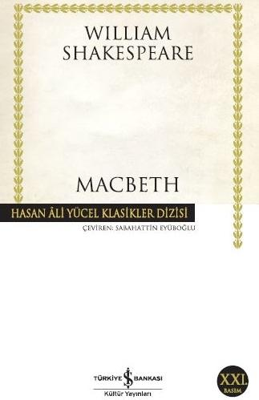

  
# Macbeth - William Shakespeare
##  154 Sayfa
### 05.01.2022
  
 

  

    
     

 
 

> ***(Tanıtım Bülteninden)***

***William Shakespeare (1564-1616): Oyunları ve şiirlerinde insanlık durumlarını dile getiriş gücüyle yaklaşık 400 yıldır bütün dünya okur ve seyircilerini etkilemeyi sürdüren bu efsanevi yazar, büyük olasılıkla 1606 yılında yazdığı Macbeth’le "yükselme arzusu ve politik hırsın" kişiyi neye dönüştürebileceğini dünü, bugünü ve yarını kapsayacak bir derinlikle öngörmüştür.***

***Shakespeare'in bu ölümsüz oyunu genellikle evrensel ahlaki değerler açısından ele alınır, Macbeth'in bilinçli bir şekilde kötülüğü seçmesi ve bu seçimin bireysel ve toplumsal sonuçları üzerinde durulur. Ancak Macbeth Shakespeare'in diğer kötü adamlarına benzemez. Çünkü III. Richard ve lago gibi karakterlerin aksine, yaptığı kötülüklerden hiç de zevk almaz; dahası, ilk cinayetini işlediğinde gerçekten acı çeker, sözlerine bakılırsa benliğinde bir iç savaş yaşamaktadır.  
Peki doğrununu, yanlışın ne olduğun bilen, ileriyi görme yeteneği olan bir adam niçin kötülüğü seçer? Belki de Macbeth'in trajedisi, geleceğe hükmetmeye çalışırken kötülüğe giden yolda attığı her adımın ona azap vermesinden, ahlaki değerlerden ne denli uzaklaştığını bile bile yoluna devam etmesinden kaynaklanır.***
_____

***"Bundan bir saat önce ölüp gitseydim,   
Mutlu bir ömür sürmüş olurdum.  
Çünkü bundan sonra benim için  
Her şey boş artık bu yalan dünyada.  
Her şey bir oyuncak artık sadece:  
Büyüklük, insanlık öldü.  
Hayatın şarabı alındı gitti,  
Tortusu kaldı yalnız bu karanlık mahzende." (s.39)***

___

***"Kurtar onu bunlardan. Hekimsin madem,  
Kafanın derdine de deva bulamaz mısın?  
İçimize kök salmış bir kara düşünceyi  
Söküp atamaz mısın aklımızdan?  
Beynimize işlemiş kuşkuları silemez misin?  
Her şeyi unutturan tatlı bir ilaç verip bize,  
Atamaz mısın göğsümüzü daraltan zehiri,   
Yüreğimize çöken o baskıyı içimizden?" (s.98)***

___

 

### Kitaptan Alıntılar ;
- ***"İyi demek kötü demek, kötü demek iyi demek;   Sisli puslu havalarda kanatlanıp uçmak gerek." (s.4)***
- ***"Ne olacaksa olur, bırak olsun;   En kötü gün de sonuna varır, bırak varsın." (s.14)***
- ***"Kusura bakmayın: Unuttuğum bir şeyleri   Arayıp duruyorum yorgun kafamda." (s.14)***
- ***"İnsanın içinden geçenler yüzünden okunabilseydi!" (s.15)***
- ***"Sen yalnız renk verme sakın:   Yüzü bir değişti mi insanın, korku başladı demektir." (s.20)***
- ***"Benim bildiğim kırlangıçlar nereye yerleşirse,   En temiz hava oradadır." (s.21)***
- ***"Atasözündeki çaresiz kedi misali:   Balık ağzıma gelsin, ama ayağım suya değmesin." (s.23)***
- ***"Gel gidelim, en tatlı yüzümüzle   Boyayalım gözünü herkesin;  Kalleş bir yüreği kalleş bir yüz gizlesin,   Yalancı bir yüreğin içindekini." (s.25)***
- ***"Böylesine düşünmeye gelmez bu işler   Aklını kaçırır insan." (s.32)***
- ***"Bırakma kendini saçma düşüncelere." (s.34)***
- ***"Diller anlatamaz seni! Yürekler dayanamaz sana!" (s.37)***
- ***"İnsan nasıl hem akıllı hem şaşkın,   Hem öfkeli hem durgun olabilir?" (s.39)***
- ***"Duymadığı bir acıyı duyar görünmek   İşten değildir ikiyüzlü bir adam için." (s.41)***
- ***"Hırsızca kaçıp gitmek suç sayılmaz   Yüreklerin taş kesildiği yerden." (s.41)***
- ***"Ölenlerle niçin ölmez size verdikleri tasalar?   Devası olmayan şeyleri unutmak gerek: Olan oldu." (s.51)***
- ***"Delirdin mi sen? Yitirdin mi büsbütün kendini?" (s.59)***
- ***"Yazık sana! Utanır insan!" (s.59)***
- ***`"İnsan ölür gider, her şey bitermiş." (s.59)`***
- ***"Bir an önce rahat etse bu memleket,   kurtulsa o lanetli ellerden." (s.66)***
- ***"Ama öyle kötü günler yaşıyoruz ki şimdi,   İnsan ne yaptığını bilmeden hain oluveriyor.   Neden korktuğumuzu bilmeden kuşkular içindeyiz." (s.75)***
- ***"Gel bir tenha yer bulalım seninle.   Dertli yüreklerimizi boşaltalım seninle." (s.79)***
- ***"Ben umutlarımı yitirdim de geldim." (s.80)***
- ***"En sağlam sevgi bağlarından nasıl kopuverir insan?" (s.80)***
- ***"Ne hale geldik; bakın:   Birbirimizi tanıyamaz olmuşuz." (s.85)***
- ***"Gözlerini kapayıp durma öyle.    Dile getir duyduğun acıyı! Dert sustu mu   Yüreğe dolar için için, yıkar yüreği!" (s.88)***
- ***"Yüreğiniz ferah olsun, olabildiği kadar:   En uzun gecelerin bir de sabahı var." (s.89)***
- ***"Cehennem ne karanlıkmış!" (s.92)***
- ***"Ben güneşi görmekten bezdim artık.   Varsın bütün dünya yok oluversin!" (s.102)***