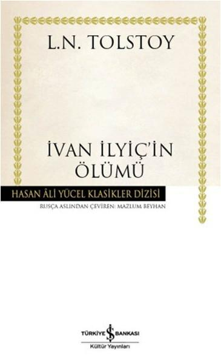

  
# İvan İlyiç'in Ölümü - Lev Tolstoy
##  100 Sayfa
### 11.01.2022
  
 

  

    
     

 
 

***Karakterler;***
- ***İvan İlyiç:***
- ***Proskovya Fyodorovna Mihela:*** İvan İlyiç'in  karısı
- ***İlya Yefimoviç Golovin:*** İvan İlyiç'in babası
- ***Pyotr İvanoviç:*** İvan İlyiç'in arkadaşı.
- ***Gerasim:*** İvan İlyiç'i seven ve onu anlayan tek kişidir| Uşak
- ***Pyotr:*** Diğer uşak

 

> ***(Tanıtım Bülteninden - Türkiye İş Bankası Kültür Yayınları)***

***Lev Nikolayeviç Tolstoy (1828-1910): Anna Karenina, Savaş ve Barış, Diriliş, Kreutzer Sonat’ın büyük yazarı, yaşamının son otuz yılında kendini insan, aile, din, devlet, toplum, özgürlük, boyun eğme, başkaldırma, sanat ve estetik konularında kuramsal çalışmalara da verdi. Bu dönemde yazdığı roman ve öykülerinde yıllarca üzerinde düşündüğü insanlık sorunlarını edebi bir kurguyla ele aldı. 1886 yılında yayınlanan İvan İlyiç’in Ölümü sade, süssüz anlatımıyla Rus gerçekçi edebiyatında eşsiz bir yere sahiptir. Daima gerektiği gibi yaşamaya özen göstermiş bir insanın ölümle yüzleşmesini konu edinen eser, Tolstoy’un yaşamının son döneminde ortaya koyduğu yeni ahlak anlayışının da ilk örneklerinden biridir. İvan İlyiç’in Ölümü Tolstoy’un bir mektubunda belirttiği gibi sıradan bir adamın, sıradan ölümünün kendi gözünden tasviridir.***

***Mazlum Beyhan (1948): Dostoyevski’den Suç ve Ceza ve Budala, Tolstoy’dan Sanat Nedir?, Çocukluk, İlkgençlik, Gençlik, Gogol’den Bir Delinin Anı Defteri, Burun, Palto Mazlum Beyhan’ın çevirdiği başyapıtlar arasında yer alır. Ayrıca Çernişevski, Byelinski, Kropotkin ve Şçedrin’den Türkçeye kazandırdığı eserlerle hiç tartışmasız son 35 yılın en önemli Rus Edebiyatı çevirmenlerinden biridir.***

***"Tolstoy muhteşem bir yazar. Hiçbir zaman anlayışsız değil, aptal değil, yorulmak nedir bilmiyor, bilgiçlik taslamıyor, teatralliğe düşmüyor. Diğerlerinden çok daha üstün."***  
***-JAMES JOYCE-***
_____

İvan İlyiç, hukuk okuduktan sonra çalışmaya başlıyor. Bu sıralarda İvan İlyiç, Proskovya Fyodorovna Mihela ile tanışıyor ve bir süre sonra bu kadınla evleniyor.. İvan İlyiç, işe başladıktan üç yıl sonra savcı yardımcılığına yükseliyor. Yine aynı şekilde aradan yedi yıl geçiyor ve başka bir şehre taşınmak zorunda kalıyorlar ve aynı zamanda savcı oluyor.. Bunun üzerine aradan yedi yıl daha geçiyor ve İvan İlyiç'in bir tane çocuğu ölüyor. İvan İlyiç'in kızı evde eğitim görüyor. İvan İlyiç oğlunun her ne kadar hukuk okumasını istiyor olsa da karısının baskısı sebebiyle oğlan normal liseye başlıyor... İlerleyen zamanlarda İvan İlyiç çalışmaya devam ediyor, artık en üst makam olan mahkeme başkanlığına getirilmeyi bekliyor. Lakin beklediği gibi olmuyor ve Goppe ismindeki bir adam, elini çabuk tutup bu görevin başına geçiyor... Bunun üzerine İvan İlyiç, nerede ve hangi pozisyonda olursa olsun en az beş bin ruple para alabileceği bir iş aramaya başlıyor. Nitekim de yol parasıyla birlikte 6500 ruple kazançlı bir iş buluyor... 

Aslında ne oluyorsa bundan sonra oluyor. İvan İlyiç, büyük kocaman bir ev tutuyor. İlk başta ailesi kendisiyle gelmiyor. Kısa sürede bu evin içerisini istediği gibi döşemeye başlıyor.. Artık kendini evdeki eşyalara o kadar fazla kaptırıyor ki, iş yerinde bile perdeleri hangilerinden alacağını düşünmeye başlıyor. Bunun akabinde, bir gün çok sert düşüyor ve çok kötü çarpıyor. Bunun ardından hayatı günden güne daha kötüye gitti. 

___

📌 Ölümcül bir hastalığa yakalanan İvan İlyiç, günden güne ölüme bir adım daha yaklaşır. Bu süreç aynı zamanda bir o kadar acılı ve dayanılmazdır. Bu eser, tüm bu süre boyunca ölüme dair bize sorular sordurtan, felsefi ve psikolojik açıdan zengin bir kitaptır.

📌 İvan İlyiç, en başından beri monoton bir hayata sahip, yegâne amacı daha yüksek mevkiye ve paraya ulaşmaktır. Bunun dışında hiçbir alanda kendini geliştirmemiş, başka hiçbir şeyle ilgilenmemiş ve ikili ilişkilere değer vermemiş bir karakterdir.

📌 İvan İlyiç, mutsuz bir evlilik yapmıştır. Hayatını eşinden nefret ederek geçirmiş, en sonunda eşinin yüzünü bile görmeye dayanamaz hale gelmiştir. 

📌 Peki hayatı boyunca diğer insanlar tarafından saygı duyulan, önünü iliklettiren İvan İlyiç ne duruma düşmüştür? Yalnız kalmıştır, şu koskoca dünyada kötü gününde yanında olacak kimsesi yoktur. Ölümün korkusu karşısında, tek başına hüngür hüngür ağlayacak, en sonunda kendi ihtiyacını tek başına göremeyecek kadar muhtaç duruma düşmüştür.

📌 Peki İvan İlyiç'in ölmeden önce farkına vardığı şu soruların kıymeti var mıdır?  
-"Belki de sürdüğüm yaşam, sürdürmem gereken yaşam değildir?"  
-"Ya gerçekten de yaşamam gerektiği gibi yaşamadıysam, bilinçli seçtiğim yaşamım yanlışsa?.." 

✨ Tüm bu soruları ölmeden önce sormak yerine, bunun farkına vararak yaşayalım.   -"Acı geçicidir. Pişmanlık, sonsuza kadar sürer."   -"Zamanımız kısıtlı, bu yüzden başkalarının hayatını yaşayarak onu harcamayalım..." 

 

### Kitaptan Alıntılar ;
- ***Pyotr İvanoviç'in onu son görüşünden bu yana epey geçmiş, zayıflamış gibiydi, ama yüzü bitkin ölülerde olduğu gibi güzel, daha da önemlisi yaşarken olduğundan daha anlamlıydı." (s.5)***
- ***"Üç gün boyunca gece gündüz acılar içinde kıvranmak, sonra da ölüm... Bu her an benim de başıma gelebilir..." (s.9)***
- ***"Evlenmelerinin üzerinden geçen bir yıl gibi kısa bir süre sonunda İvan İlyiç, evliliğin hayatta birtakım kolaylıklar sağlamakla birlikte, aslında çok karmaşık ve sorunlarla dolu ağır bir iş olduğu sonucuna vardı." (s.20)***
- ***"Eşler birbirine nadiren sevgiyle yaklaşıyor ve bu anlar çok kısa sürüyordu. Bu anlar kısa süreliğine sığındıkları küçük adacıklar gibiydi, hemen sonraysa içten içe besledikleri karşılıklı düşmanlığın denizine açılıyorlardı yeniden." (s.22)***
- ***"İvan İlyiç'in hayatının en zor yılıydı bu. Gerek maaşı yetmediği için çektikleri geçim sıkıntısı, gerekse herkes tarafından unutulmak, kendisine karşı yapılmış büyük bir haksızlık, acımasızlık gibi geliyordu ona, oysa başkalarınca son derece sıradan bir şey gibi görünüyordu bu durum." (s.23)***
- ***"Babası bile kendini ona yardım etmek zorunda  hissetmiyordu." (s.23)***
- ***`"Aslında her şey, gerçekte o kadar zengin olmadıkları halde zenginlere benzemek isteyen, bu yüzden de ancak birbirlerine benzeyebilen insanlarınki gibiydi..." (s.27)`***
- ***"Alınacak, düzeltilecek,  yerleştirilecek bir şey kalmayınca bir şeylerin eksikliği duyulur." (s.28)***
- ***"Hepsinin ne olduğu önceden belli ve herhalde gereksiz yanıtlar için sorulan gereksiz sorular..." (s.34)***
- ***"Doktorun karar özetinden İvan İlyiç'in çıkardığı sonuç şu oldu: Durumu kötüydü ve onun durumunun kötü olması doktorun da, başka herhangi birinin de umurunda değildi, çünkü durumu kötü olan oydu. İvan İlyiç'e çok dokundu bu, kendine dehşetli acıdı ve böylesine önemli bir konuda kayıtsızlık, vurdumduymazlık içinde olan doktora karşı yüreği öfkeyle doldu." (s.35)*** 
- ***"İvan İlyiç'e yolda her şey hüzünlü göründü. Arabacılar, evler hüzünlüydü, gelip geçenler, dükkânlar hüzünlüydü." (s.36)***
- ***"İvan İlyiç, kendi hayatını mahvettiği gibi başkalarının hayatlarını da zehirlediği düşüncesiyle yalnız kaldı. Üstelik bu zehir azalmak şöyle dursun gitgide tüm varlığını ele geçiriyordu." (s.41)*** 
- ***"Ölümün kıyısında, onu anlayacak, ona acıyacak hiç kimse olmadan böyle tek başına yaşayacaktı." (s.41)***
- ***"Ne diye kendimi aldatayım? Benden başka herkes bilmiyor mu ölmekte olduğumu sanki... Bu hafta mı, gelecek hafta mı; bugün mü yarın mı? Sorun bundan ibaret! Belki de bugün, şimdi! Az önce aydınlıktı ortalık, şu anda karanlık. Şimdi buradayım, az sonra orada olacağım. İyi de orası neresi?" (s.46)***
- ***"Bir anda buz gibi oldu, soluğu kesildi. Yalnız kalbinin atışını duyuyordu." (s.46)***
- ***"Tam kıyısındayım artık uçurumun. Ölüm kapıda  beklerken..." (s.46)***
- ***"Niye açıklama yapıyorum ki, sanki anlayacak!" diye geçirdi içinden." (s.47)***
- ***"Tutunacak bir nokta bulurum umuduyla bu düşüncenin yerine sırayla başka düşünceleri çağırıyordu." (s.50)***
- ***"Sabah ya da akşam, cuma ya da cumartesi hiç fark etmiyordu, öyle ya da böyle, değişen hiçbir şey yoktu hayatında!" (s.59)***
- ***"Acı, bir an bile soluk aldırmadan eziyete devam ediyordu." (s.59)***
- ***"İyi de bu ağrı... bu ağrı neyin nesi şimdi, bir an bile dinmeyecek mi?" (s.60)***
- ***"Hep aynı şey... Günler, geceler hep aynı... Ah bir an önce bitse! Ne bir an önce bitse? Ölüm, karanlık. Yok, yok. Her şey ölümden daha iyidir!" (s.60)***
- ***`"Hep aynıydı. Kimi zaman ufacık bir umut ışıltısı belirir gibi oluyor, kimi zaman da bir umutsuzluk denizi kudurmaya başlıyordu, ama hep aynıydı: Aynı acı, aynı keder, aynı iç sıkıntısı... Tek başına kalmak dayanılır gibi değildi." (s.61)`***
- ***"Yeniden dakikalar dakikaları, saatler saatleri kovalamaya başladı; her şey eskisi gibiydi, her şey aralıksız sürüp gidiyor ve kaçınılmaz son gitgide daha korkunçlaşıyordu." (s.67)***
- ***"Sonra kendini bıraktı ve çocuklar gibi ağlamaya başladı. Umarsızlığına , korkunç yalnızlığına, insanların acımasızlığına, Tanrı'nın acımasızlığına, Tanrı'nın yokluğuna ağlıyordu..." (s.70)***
- ***"Ve İvan İlyiç güzel yaşamının  en iyi anlarını seçip ayırmaya başladı zihninde. Fakat -tuhaftır- bir zamanlar çok güzel bulduğu anların hiçbiri artık öyle gelmiyordu. Çocukluğuna dair ilk anıları dışında hiçbiri..." (s.71)***
- ***"Çocukluğunda, şu anda yeniden yaşayacak olsa yine güzel bulacağı gerçekten hoş şeyler vardı. Ama o hoşluğu yaşamış adam artık yoktu: Bütün bunlar bir başkasının anılarıydı sanki." (s.71)***
- ***"Ne bu şimdi? Ne için bütün bunlar? Olacak şey mi! Böylesine anlamsız ve iğrenç olabilir mi hayat?  Hayat bu kadar anlamsız ve iğrençse, o zaman niye ölünüyor; hem de acılar çerekek?.." (s.71)***
- ***`"Belki de sürdürdüğüm yaşam, sürdürmem gereken yaşam değildir?" (s.71)`***
- ***"...içinde umut diye bir şey kalmıyor, umut adına ne varsa paramparça oluyordu." (s.74)***
- ***"Hayat gitgide artan acılar demek; artan bir hızla en dibe, en korkunç acılara doğru uçmak demekti. 'İşte bende uçuyorum...'" (s.75)***
- ***"Tanrı aşkına, hiç değilse rahatça ölmeme izin ver," dedi İvan İlyiç. (s.77)***
- ***"Doktor hastanın çektiği fiziksel acıların dayanılmaz olduğunu söylüyordu ki bu doğruydu, ama ona asıl çektiren manevi acılardı." (s.78)***
- ***"Ya gerçekten de yaşamam gerektiği gibi yaşamadıysam, bilinçli seçtiğim yaşamım yanlışsa?.." (s.78)***
- ***"Yaşadığın ve yaşamakta olduğun her şey yalan. Senden hayatı da ölümü de gizleyen koca bir yalanı yaşadın sen." (s.80)***
- ***"Bir idam mahkûmu kurtulamayacağını bile bile nasıl celladın elinden kurtulmaya çabalarsa, öyle debeleniyor, çırpınıyordu. Tüm çabalarına karşın, geçen her dakikayla o korkunç sona adım adım yaklaştığını hissediyordu." (s.81)***
