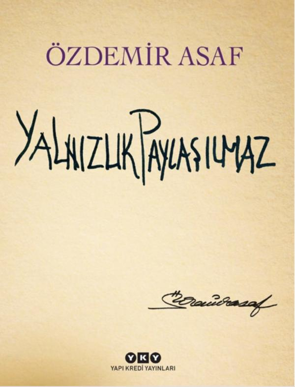

  
# Yalnızlık Paylaşılmaz - Özdemir Asaf
##  156 Sayfa
### 16.01.2022
  
 

  

    
     

 
 

> ***(Tanıtım Bülteninden - Yapı Kredi Yayınları)***

***İlk basımı 1978’de yapılan “Yalnızlık Paylaşılmaz”ın bu özel baskısı Özdemir Asaf’ın özgün elyazmalarıyla daktiloya çekilmiş müsveddelerini bir araya getiriyor.***

***Her zaman aza indirgeme ilkesiyle, dokunaklı söyleyişiyle, kendine özgü şiir mantığını kuran Özdemir Asaf, şiiriyle her dönemde genç kuşakların ilgisini çekmiştir. “Yalnızlık Paylaşılmaz” otuzbeş yılı aşan serüveninde hâlâ taze, şairin yazı masasına düşen ışıkla bütün yalnızlıklara seslenmeyi sürdürüyor.***
_____

> ***AŞK (s.15)***

***Sen kocaman çöllerde bir kalabalık gibisin,   
Kocaman denizlerde ender bir balık gibisin.  
Bir ısıtır, bir üşütür, bir ağlatır, bir güldürür;   
Sen hem bir hastalık hem de sağlık gibisin.***
_____
> ***O VAR (s.16)***

***Gözlerimizin önünde  
İlginç bir yaşam sürdürdü.   
Anlattı, dinledi, güldürdü,  
Ölümü düşünmüyorduk,  
Düşündürdü.***

____

>***İLK (s.21)***

***Biri vardı, o ilk ağlamayı bulup,  
Herkesi güldüren.  
Sonra da bunu unutup  
Ağlarcasına gülen.***

____

>***BİLGİĞİM (s.23)***

***Sana bakmaktan 
Onu göremiyorum.  
Bilmiyorum bunda ne var.    
Bunu ben anlamam,  
Bir o var,  
O anlar.***

____

>***ÖZLEM (s.24)***

Bir gece,  
Gecede bir uyku... 
Uykunun içinde ben.. 
Uyuyorum, 
Uykudayım, 
Yanımda sen. 

Uykunun içinde bir rüya,  
Rüyamda bir gece, 
Gecede ben.. 
Bir yere gidiyorum,  
Delice.. 
Aklımda sen.

____

>***ONARMAK ZORDUR (s.29)***

Şarkılar değil de  
Hep kulaklar bitiriyor,  
Onarmak zordur. 

Bir yürek üşümüş  
Kapamış kapılarını,  
Onarmak zordur.

Bir şey yitirilmiş,  
Hiç eskimeyecektir,  
Onarmak zordur.

İnsanın içine düşen korku  
Özgürlüğünden oluşmuştur,  
Onarmak zordur.

Ölümü düşünmek yenilmek,   
Sevmek ölümü yenmektir. 
Onarmak zordur.

_____

>***ÖZEL BİR ŞİİR (s.34)***

Başında hiç sevmemek varken   
Sonra anlamak var mı   
Birden bir sevi dili.  

Anılası bir geçitten ikili   
Tam aldatırken ölümü   
Sulamak bir yalan gülü.  

Yıkanmayor çamaşır gibi   
Konular doğuruyor   
Yalnızın kanayan eli.

Saygılı sevgisizliklerle dolu   
Işıldayan geceler,   
Tüm uykusuzluklar uykulu.  

Tüm sıcak yastıklar soğuk,   
Sevgiler yorgun, yapay,   
Açık gözler kapalı  

Bir dönülmezliğe düşmüş   
Kimbilir kimlerin yolu,  
 O gidilmezliğe gömülü.  

Akşamların kucağında değil   
Kendi kucağında ağlayor  
Hırçın sevgili.  

_____

> ***YALNIZLIK (s.55)***

>***I***

***Yalnız kaldınız sanırsınız,  
Biliyorum.  
Yalnız bırakılmışsınız,  
Biliyorum 
Ötesi yok.*** 

>***II***

***Ötesi var;  
Yalnızlık  
Müziğin bile seni dinlemesidir.  
Yalnızlık  
İnsanın kendine mektup yazması 
Ve dönüp-dönüp onu okuması   
Yalnızlığın da ötesidir.*** 

_____

>***SU (s.74)***

***Kirli eller daha temiz.  
Temiz elli  
Kirli gönüllerden.  
Ne dersiniz?***

_____

>***SENİ SAKLAYACAĞIM (s.95)***

Seni saklayacağım inan   
Yazdıklarımda, çizdiklerimde,   
Şarkılarımda, sözlerimde.  

Sen kalacaksın kimse bilmeyecek   
Ve kimseler görmeyecek seni,   
Yaşayacaksın gözlerimde.  

Sen göreceksin, duyacaksın   
Parıldayan bir sevi sıcaklığı,   
Uyuyacak, uyanacaksın.  

Bakacaksın, benzemeyor  
Gelen günler geçenlere,   
Dalacaksın.  

Bir seviyi anlamak   
Bir yaşam harcamaktır,   
Harcayacaksın.  

Seni yaşayacağım, anlatılmaz,   
Yaşayacağım gözlerimde;   
Gözlerimde saklayacağım.  

Bir gün, tam anlatmaya..  
Bakacaksın,   
Gözlerimi kapayacağım..   
Anlayacaksın. 

____

 

### Kitaptan Alıntılar ;
- ***"Sözün bitim yerini olay ya da konu seçmez, söz seçer.    Başlangıcını da olduğu gibi." (s.1)***
- ***"Yer altından dinleniyoruz;   Tedirginliğimiz ondan.   Seslerimizi dinleyorlar,   Ölülerin katında biriktiriyorlar;   Suskunluğumuz ondan." (s.11)***
- ***"Uzağa değil, usta   Öteye hep öteye gitti;   Yalnızlığı ondandır." (s.14)***
- ***"Kimler kimler yoktu bizim kervanda,   Birer birer indi hepsi bir handa,   Savrulduk sap saman biz bu harmanda.    Bir gidiş yoluydu, dönüyor çıktı." (s.36)***
- ***"Bir başka yere diyorum gidip içelim bu gece..   İnsan sevdiği sürece   Uykusu gelmez." (s.53)***
- ***`"Gelmeyecek bir gideni,`   `Olmayacak bir nedeni`   `Beklediniz mi..."` (s.59)***
- ***`"Hep mi hep ölecekmiş gibi,`   `Hiç mi hiç ölmeyecekmiş gibi`   `Yaşadınız mı.."` (s.59)***
- ***"Anılarda bir tipi, umutlarda bir sis   İkisi de bizsiz, ikisi de isimsiz   Şarkılar bitmeden kurşuna dizildi kaldı." (s.96)***
- ***Anı:   "...Benim güzel çocukluğumu   Ahmak bir ayak ezdi..."   Asaf Hâlet Çelebi (s.96)***
- ***"Bir şey olmasaydı yazmak olmayacaktı..   Başka bir şey de olmasaydı   Silmek olmayacaktı. (s.97)***
- ***"Kimine unutmak bile çok, kimine unutmamak az" (s.100)***
- ***`"Her şey süpürebilirsin, sonbaharı süpüremezsin."` (s.105)***
- ***`"Yalnızlık paylaşılmaz.. Paylaşılsa yalnızlık olmaz.."` (s.111)***
- ***"Yalnız   Bir ordudur   Kendi çölünde..    Sonsuz savaşlarında   Hep yener    Kendi ordusunu." (s.113)***
- ***"Yalnız   Sürekli dinleyendir   Söylenmemiş bir sözü." (s.114)***
- ***"Yalnız   Hem kaptanı   Hem de tek yolcusudur   Batmakta olan gemisinin..    Onun için   Ne sonuncu ayrılabilir   Gemisinden   Ne de ilkin." (s.117)***
- ***`"Her leke`   `Kendisiyle çıkar."` (s.118)***
