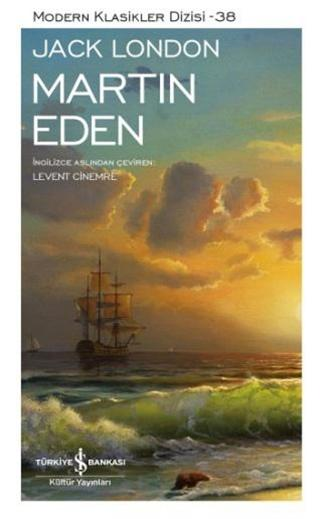

  
# Martin Eden - Jack London
##  520 Sayfa
### 08.02.2022
  
 

  

    
     

 
 

***Karakterler;***
- ***Martin Eden:*** Genç denizci, kahramanımız.
- ***Ruth Morse:*** Martin'in aşık olduğu kız. Üniversitede İngiliz Edebiyatı dersi alıyor. 
- ***Marian:*** Kaldığı evdeki odanın sahibi.
- ***Arthur:*** Ruth'un erkek kardeşi
- ***Bay Bayan Higginbotham:*** Martin'in ablası ve eniştesi
- ***Profesör Caldwell:*** Kitap boyunca karşımıza çıkan tek aydın kişi.
- ***Gertrude:*** Martin'in ablası.
- ***Russ Brissenden:*** Martin'in kendine en yakın bulduğu dostu.
- ***Lizzie:*** Koşulsuz şartsız Martin'e aşık olan kız.
- ***Joe:*** Martin'in çamaşırhanede birlikte çalıştığı arkadaşı.

 

____

> ***Kitap Hakkında Yorumlarım***

📌 Seni kitap okuyan insanlarla tanıştıracağım. Hayat ancak böyle insanlarla bir araya geliyorsan yaşanmaya değer.

📌 Bazı kitaplar vardır, okuduktan sonra hayatınızda boşluk bırakır. O boşluk hiç dolmaz...

📌 Pekâlâ, aslında bir bakıma Jack London'ın yazdığı bu eser otobiyografik bir eserdir diyebiliriz. Jack London, Martin Eden'dir. Martin Eden, Jack London'dır. Eser içerisinde, sosyoloji, felsefi ve psikolojik taraflar barındırıyor. Eser, farklı sosyal sınıflar arasındaki çatışmaları gözler önüne sermektedir.

📌 Martin Eden, cahil, ağzı bozuk, eğitimsiz, alt tabakaya ait ama güçlü ruhu olan bir denizcidir. Ruth ismindeki bir kıza aşık olduktan sonra Martin için işler değişmeye başlar. Martin Eden hayatını değiştirmeye, Ruth'a layık olabilmek için bir çok şey yapmaktadır. Martin, kitaplarla ve kütüphane ile tanışır. Martin'in  hayatı da bu noktada değişir. Ne bulduysa okumaya, kendini geliştirmeye başlar ve kitaplar onun her şeyi olmuştur. Bir de bunun yanında yazmaya başlar. Günde sadece 5 saat uyur ve geri kalan 19 saatin hepsini çalışarak geçirir. Martin Eden'a kendisinden başka kimse inanmaz. Herkes bir yerde iş bulup çalışmasını söyler. Ama Martin Eden hayallerinden vazgeçmez. Sevdiği kız Martin'i hiçbir açıklama yapmadan tek bir mektupla terk eder.

📌 Martin Eden'in yazdığı her eser, reddedilir. Martin Eden, büyük bir yoksulluk içerisinde, eşyalarını rehineciye bırakarak, yeri geldiğinde günlerce boğazından tek bir lokma geçmeden hayatını sürdürmeye ve yazmaya devam eder... En sonunda Martin Eden hayallerine ulaşır. Martin Eden'in artık hiçbir hevesi ve isteği kalmamıştır. İşin komik tarafı ne biliyor musunuz? 

📌 Martin Eden, ülkede en zengin konuma geldikten sonra herkes onu evine yemeğe davet edebilmek için sıraya girer... Peki ama bunların ne anlamı vardır? Ne değişmiştir? Martin Eden, aynı Martin Eden'dir. Yeni bir şey yazmamıştır. Sattığı tüm eserler, insanların Martin'e sırtını döndüğü zamanki yazdığı eserlerdir.

📌 Ben açken, ben yoksulken, bir parça ekmek için kıvranırken, benim günlerce boğazımdan tek bir lokma geçmemişken siz nerdeydiniz? Şu anda her şeyi alabilecek param var, niye beni şimdi hepiniz evinize yemeğe davet ediyorsunuz?

📌 Martin Eden, insanların ne kadar yapmacık, sahte ve ilişkilerinin boş olduklarını görür. Dışarıdan bakınca parlak bir yıldız olan insanların içine girdiğinde kapkara kömürden başka bir şey olmadıklarını fark eder.

✨ Kitaplar Yazılmıştı!  
✨ Kitaplar Yazılmıştı!  
✨ Kitaplar Yazılmıştı!  

____

"Kimsenin yaşantısını beğenmedim: Kendime uygun bir yaşantı da bulamadım" | Tutunamayanlar, Oğuz Atay
Sayfa 666 - iletişim yayınları

alt tabaka, üst tabaka

Martin Eden, hayatta ulaşmak istediği yere geldikten sonra fark eder ki bunların hepsi gerçekten bomboş şeyler.  Hiçbir hevesi ve isteği kalmamıştır. Fark eder ki aslında onun için anlamı olan şeyler, ona keyif veren şeyler, onun kendisi gibi olabilmesini sağlayan şeyler ilk başta içinde bulunduğu yerdir.

Hastalık bedeninde değil ruhunda ve aklındadır.

Çamaşırhanede insanın hayvan gibi sadece çalıştırılması... "Çok çalışanın hayvanlaştığını görürsünüz."
İnsanlara dinlenme imkanı vermeyen, sevdikleriyle zaman geçirme, sanata zaman ayırma fırsatı vermeyen ve sadece ve sadece insanı hayvan gibi çalıştıran kapitalizm'e çok büyük bir eleştiridir.

____

> ***(Tanıtım Bülteninden - Türkiye İş Bankası Kültür Yayınları)***

***Jack London’ın yarı otobiyografik romanı Martin Eden, 20. yüzyıl başında sosyal ve ideolojik meseleler ağırlıklı içeriğiyle Amerikan edebiyatında büyük ölçüde kabul görmüştür. London farklı sınıflar arasındaki zihniyet ve değer farklarını gözlerimizin önüne sererken, statü ve servetin Amerikan toplumundaki hayati önemine işaret eder. Romanın ana temalarından biri, başarı ve refah yolunun sosyal sınıf farkı gözetilmeksizin herkese açık olduğu şeklinde özetlenebilecek Amerikan Rüyası’dır. Ya da bu idealin yarattığı muazzam hayal kırıklığı…***

***London, romanı bir sanatçının çıraklıktan olgunluğa geçiş sürecini işleyen Künstlerroman geleneğinde yazmıştır. Martin’in aşkı uğruna eğitimsiz genç bir işçiden başarılı ve rafine bir yazara dönüşüm mücadelesini anlatır. Kahramanı hedefine ulaştığında ise motivasyonunu ve heyecanını çoktan yitirmiş, trajik bir sona doğru sürüklenmektedir artık…***
_____

> ***Bölüm 1 - 7 | s.1 - s.65***

Martin Eden, kızın kardeşi olan Arthur'u bir beladan kurtarmıştı. Bu sebeple bu ailenin kısa bir süreliğine misafiri olur ve daha sonrasında buradan ayrılır. Martin Eden, evine döner. Eniştesi ve onun karısı Bay Bayan Higginbotham ile aynı evde yaşamaktadırlar.. Higginbotham'lar, Martin'in sarhoş olduğunu düşündüler, lakin Martin'in sarhoşluğuna Ruth'a duyduğu sevgi ve aşk  sebep olmuştu.   ***"Bir kadının yüzüne bakıp sarhoş olacağımı hiç sanmazdım." (s.33)***  

Martin, Ruth'un hayalini kuruyordu. Bir türlü onu düşünmeden edemiyordu.  Lakin bir yandan da olumsuzlukları hatırlıyordu. Martin ve ailesi alt mensupa sahiptiler. Buna karşın; ***Ruth ve ailesinin ellerı yumuşacıktı, bu düşünce onların üst tabakaya mensup olduğunu, Ruth ile arasında da dev bir uçurum bulunduğunu gayet açık bir biçimde göstererek onu irkti. (s.45)*** Tüm bunların üzerine, Martin kendini değiştirmeye karar verdi...

Bu süre içerisinde Martin Eden, kütüphaneye gitmeye başladı. Bir çok şey okuyor ve araştırıyordu. Kısa bir süre içerisinde kütüphanedeki görevli tarafından artık tanınıyordu. 

Bir gün Martin Eden, Ruth'u görebilmek için tiyatroya gitmişti.. Nitekim çıkışta  onu görebilmek için aşağı inmişti. O sırada Martin Eden'in etrafını birkaç tane kız sarmıştı. Martin Eden, bir o kadar çekici ve kızlar tarafından ilgi gören biriydi.

_____

> ***Bölüm 7 (s.65)***

Martin Eden, Ruth'un evine kızdan aldığı kitapları vermek için gelmişti. Nitekim Martin Eden'in Ruth'a karşı duyduğu sevgi ve aşk çok fazlaydı.. Aslında benzer şeyleri Ruth'da hissediyordu lakin henüz Martin Eden'a aşık olduğunu düşünmüyordu.. Martin Eden, bu buluşmada Ruth'dan akıl istedi. Aralarında şu şekilde konuşma geçti:  
***SAYFA 72-73***

Bunun üzerine Ruth, Martin Eden'in her şeye en baştan başlaması gerektiğini önerdi ve kendisine bir tane dil bilgisi kitabı verdi.
____

Martin Eden, bir süre dil bilgisi çalıştı.. Daha sonrasında ise aylarca denizciliğe çıktığı için uzak kalmıştı. Bu süre boyunca dil bilgisi kitabını defalarca okumuş ve artık ezberlemişti. Nitekim bunun yanında kendini de bir çok alanda geliştirmişti... Bu uzun sürenin ardından tekrardan döndükten sonra, Martin Eden yazmaya karar verdi. Bir sürü hikaye ve makale yazdı. Bunları farklı farklı editörlere gönderdi ve hepsinden ret yanıtı aldı.. Martin Eden, aynı zamanda liseye gitmek için sınava girmişti fakat dil bilgisi dışındaki hiçbir alanda başarılı olamadı. Bu yüzden birçok eğitimi yeniden alması gerekiyordu. Okula gitmek yerine Martin Eden, kendi kendine daha hızlı öğrenebildiğini biliyordu. 

Bunun yanında bir gün Martin Eden, Ruth ile birlikte dışarı çıkma fırsatı elde etmişti.. Aslında Ruth başka biriyle gidecekti lakin o kişi gelemediği için Ruth Martin Eden'i davet etti. Birlikte o etkinliğe katıldılar. Aynı zamanda Ruth, Martin Eden'in koluna girmişti. Martin Eden'in hissettiği duygular tarif edilemezdi.. 

______

Martin Eden, uzun zamandan beri yazdığı tüm yazıları Ruth'a göstermişti. Ruth edebiyat okuduğu için, okuduğu tüm cümlelerde bir kusur bulmuştu ve bunların acemice yazıldığını düşünüyordu. Nitekim Ruth yine de beğendiğini söyledi. Her ne kadar Martin Eden tam olarak öyle olduğunu hissetmese de mutlu oldu.. Aradan biraz zaman geçmişti, artık Martin Eden'in hiç parası kalmamıştı. Yazdığı hiçbir yazı karşılığını alamamış, tüm editörlerden red yanıtı almıştı.

Son çare Martin Eden iş aramak için başvurmuştu ve orada Joe isminde biriyle karşılaştı. Martin Eden ne iş olursa yapabileceğini söyledi ve bu işe kabul edildi... Joe ve Martin uzun süre birlikte çalıştılar. Bir otelin çamaşırhanesindeki işlerle uğraşıyorlardı.. Ama bu işler o kadar yorucu ve aynı zamanda o kadar zamanlarını alıyordu ki, kendilerine neredeyse hiç zaman kalmıyordu.. Martin Eden, artık hiçbir şey düşünemez olmuştu, artık bir şeyler okuyamıyor, yazamıyordu.. Martin'in Ruth'u düşünecek vakti bile yoktu... 3 ay gibi bir süre bu şekilde devam etti. Bu süre içerisinde Martin Eden yeniden üç kez kadar alkol almıştı, ancak bu şekilde rahatlayabiliyordu.. Bu 3 ayın sonunda işi bırakmaya karar verdi.. Bu karara Joe'de ortak olmuştu. 18 yıldır bu işi yapan Joe'de işi artık işi bırakmıştı... Joe ve Martin vedalaşırken, Joe şunları söylemişti: 

***"Seni  yine görecem, Mart, sen de ben de ölmeden önce. Orası kesin. İçime doğdu. Hoşça kal Martin. Umarım işlerin yolunda gider. Acayip sevdim seni, biliyon." (s.181)*** 

_____

> ***19. Bölüm (s.183)***

Martin Eden, yeniden Oakland'a geri dönmüştü. Aynı zamanda Ruth'da tatilden dönmüştü. Martin Eden, bir süre hiçbir şey yapmadan dinlendi. Zamanla yeniden okumaya ve yazmaya başlamıştı. Bu süre içerinde Ruth ve Martin Eden birlikte çok daha fazla zaman geçirdiler. Aynı zamanda biraz daha yakınlaşmışlardı. Fakat Martin Eden, başından geçenlerden bahsetti. Alkol aldığından, tekrardan para için denize gideceğinden vs... Bunların üzerine Ruth, Martin Eden'den soğumuştu. 

Ruth ve annesi arasında geçen konuşmada, Ruth 24 yıldır hiç aşık olmamıştı. Bu duyguları hiç tatmamıştı. Nitekim Martin Eden'in kendisini sevdiğini biliyordu. Fakat kendisi Martin Eden'i sevemezdi. Çünkü Martin Eden'in kötü özellikleri olmuş, şimdiye kadar çok kötü şartlarda bulunmuş, kendisinden çok daha alt bir tabaka da olduğunu biliyordu. Tüm bu şartlar sebebiyle Ruth, Martin'i sevecek olmasının en büyük hatası olacağını ve böyle bir şeyin gerçekleşmeyeceğini annesine de söyledi.. Bunun üzerine Ruth'un annesi ve babası artık Martin Eden'dan kurtulmaları gerektiği konusunda hem fikirdi. Çünkü Martin Eden, onlara istediklerini vermişti. Kızlarının kadınlığa adım atmasını, bu duygularını keşfetmesini sağlamıştı... Martin, denize gittikten sonra  Ruth'un annesi kızını uzaklara gönderecekti...

____

> ***Bölüm 20 - 26 | (s.193 - s.253)***

Ruth'un aklında kesinlikle Martin Eden'e aşık olmak ve onu sevmek yoktu. Hatta bunun olmaması için, Martin'i reddetmek için kendi kendine prova bile yapmıştı... Bir gün Martin Eden ve Ruth birlikte otururlarken, birbirlerine iyice yaklaştılar. Ruth, ilk başta başını Martin'in omzuna koymuştu. Nitekim Ruth tüm bunları otomatik bir şekilde yapıyor ve kendine engel olamıyordu. Bunun üzerine Martin Eden'de Ruth'a karşılık vermiş, Ruth'u kollarıyla sarmış ve öpüşmülerdi. O anda Ruth'da, Martin Eden'e aşık olduğunu anlamıştı. İkisi de bunlara karşı koymadı ve o anların tadını çıkardılar. Nitekim Martin Eden ve Ruth artık sevgili olmuşlardı...

Ruth eve döndükten sonra bu olanları annesine anlatmış, Martin Eden'i ne kadar sevdiğini söylemiştir. Sonrasında Ruth'un annesi ve babası bu durumu hoş karşılamasalar bile bu olanları zamana bırakmaya karar vermişler, Ruth'un sevgisinin zamanla azalacağını düşünmüşlerdir..

Ruth, Martin Eden'in  içinde bulunduğu yazma isteğini hiçbir zaman hoş karşılamamış. Bir an önce yazmaktan vazgeçmesini, onca zamandır tek bir yazısını bile satamadığını söylemiş ve düzgün bir işte çalışmasını istemiştir. Ama Martin Eden bu isteğinden bir an bile olsun vazgeçmemiş, güzel paralar kazanabileceğine inanmaktadır. Aynı zamanda Martin Eden, Ruth'dan her şeyi yoluna koymak için iki yıl gibi bir süre istemiştir...

Aradan onca zaman geçmiştir, Martin Eden bir sürü yazı yazmıştır ama hiçbirini yine  de satamamıştır. Artık cebinde parası kalmamış, eşyalarını rehin bırakmış ve tükenme noktasına gelmiştir. Martin Eden'in çeşitli yerlere bir sürü borcu olmuş, yiyecek bir şey bulamaz hale gelmiştir. Martin Eden anca Ruth'un ailesine ya da ablasına gittiğinde doğru düzgün yiyecek bir şeyler bulabiliyordu... 

Martin Eden'in  gönderdiği onca mektup geriye iade ediliyor ve nereye gönderdiyse red cevabı alıyordu. Ama bir gün, eline bir tane mektup geldi.. Martin Eden çok heyecanlıydı.. Zarfı açmadan önce kendi kendine yaptığı hesaba göre bu yazısından 100 dolar gibi bir ücret bekliyordu. Fakat zarfı açtıktan sonra büyük bir hayal kırıklığına uğradı. Bu yazısı için topu topu 5 dolar fiyat teklif etmişlerdi... Bunun ardından Martin Eden dehşete düştü. Boş bir hayalin peşinden onca zamanını bunun için mi harcadığını düşündükçe çok kötü oldu... Bunun üzerine artık bir daha yazmamaya karar verdi. Nitekim bunlar sebebiyle de hasta olmuştu....

____

> ***Bölüm 26-27 | s.253 - s.283***

Martin Eden, birkaç gün boyunca hasta bir şekilde yatmıştı. Artık her şeyden umudu kesmiş ve yazmak istemiyordu. En son gelen mektuplara bakıyordu ki bir de ne görsün. White Mouse isimli dergiden bir cevap gelmişti. Martin Eden'in ilk yazdığı eserlerden biri için kısaltarak, 40 dolar teklif etmişler. Martin Eden çok sevindi. Tüm umutları yeniden canlandı ve bunları görünce daha fazla yazmak istedi..

Martin Eden, hasta olduğu için Ruth onu görmeye geldi. Ruth ilk defa bu kadar sefil bir hayatı gözleriyle tanık olmuştu.. Ruth bir süre orada kaldıktan sonra ayrıldı.. 

Aradan biraz zaman geçti. Martin Eden ucuzda olsa ilk yazdığı eserlerden üçer beşer kuruş kazanmaya başlamıştı. Bunlar başlangıç ve ismini duyurması için önemliydi.. Paraları eline ulaşınca, Martin Eden borçlarını kapattı ve ihtiyaçlarını karşıladı. Aynı zaman da Martin Eden, rehin verdiği eşyalarını da geri alabilmişti. Bu sayede artık, Ruth'u görmeye gidebilirdi..

Martin Eden, Ruth'u görmeye gittiğinde, kızın evinde bir sürü yüksek kesimden insanlar vardı. Ailesinin planladığı gibi kızlarını bu kişilerle zaman geçirmeye teşvik etmek istiyorlardı.. Bu süre boyunca Martin Eden, ilk defa bu kadar üst tabakadan insanlarla bir araya gelmenin heyecanını yaşıyordu. Ama Martin Eden hepsiyle tek tek konuştukça büyük bir hayal kırıklığına uğramıştı. Onca zaman bunların seviyesine çıkmak için mi uğraşmıştı? Martin Eden, onların hepsinden üstün bir konumdaydı ve bunu fark etti.. Martin Eden sadece onların arasında tek bir kişiye saygı duyuyor ve onun düzeyinde olmadığını biliyordu.. Bu kişi ise uzun bir süre sohbet ettikleri Profesör Caldwell idi.

_____

> ***Bölüm 27-31 | s.283 - s.317***

Martin Eden, yine uzun bir süre yazmaya devam  etti ama kolay kolay yazdıklarını editörlere satamadı. Yeniden eski sefil hayatına mahkum olmuştu. Yeniden borçları birikmiş ve eşyalarını rehin bırakmıştı.. 

Martin Eden, Ruth'un evine gittiği bir zaman da Ruth'un babasıyla "Cumhuriyetçi, sosyalist" gibi konular üzerine uzun uzun tartışmaya girdiler. Yine bunun sonucunda üst tabakadaki kişilerin hiçbir şey anlamadığını ve bunca eğitimi boşuna aldıklarını düşünüyordu.

Daha sonrasında Martin Eden kendi kız kardeşi Marian ile de bir takım konular üzerine tartışmıştı. Kız kardeşine yazdığı şiir, kız kardeşinin nişanlısı tarafından hoş karşılanmamıştı. Aynı zamanda kız kardeşi Martin Eden'den utandığını söylemişti. 

Toplamda aradan bir yıl geçmişti. Ruth ve Martin Eden o konuşmayı gerçekleştirdiler. Martin Eden henüz gözle görülür bir başarı elde edemedi ve yoksulluk içerisinde. Haliyle Ruth bundan rahatsız olmaktadır. Ruth, evlenmeleri gerektiğini dile getirmiş, bu şekilde herhangi bir ilerleme kaydedemediklerinden yakınmıştır. Martin Eden ise verdiği sözden kalan son 1 yılı Ruth'dan istemiş ve çok ilerleme kaydettiğini söylemiştir.

Martin Eden'a kendisinden başka kimse inanmamaktadır. Ama Martin Eden kendisinden şüphe duymuyor ve bunu başaracağına inanıyordur..

____

> ***Bölüm 31 - 37  | s.317 - s.369***

Martin Eden, uzun zamandan sonra ilk defa tanıştığı birinin bilgisiyle ve düşünce yapısıyla kendisine yakın olduğunu gördü. Bu kişi Russ Brissenden'di. Martin Eden ilk başta Brissenden'a hiç ısınamamış ama sonradan bir yere gidip birlikte bir şeylere içip sohbet ettikten sonra onun diğerlerinden farklı olduğunu görmüştür.

Martin Eden ve Brissenden, uzun bir süre birlikte zaman geçirdiler. Brissenden, Martin'in evine ziyarete gelmeye başladı ve birlikte sohbet edip bir şeyler içtiler... Artık arkadaş olmuşlardı. Nitekim bir ara Brissenden hiçbir haber vermeden gelmeyi bıraktı. Bu aralıkta Martin, yine zor durumdaydı ve alacağı olduğu 5 doları almak için dergiye gitti. Oradaki herkes Martin ile tanıştığı için mutluydu, Martin'in yazdığı eseri çok fazla abartarak anlattılar ama bir türlü ödemeden bahsetmiyorlardı. Martin konuyu ödemeye getirdi, ama oradakilerin hiçbirinden para çıkmadı. En sonunda Martin adamlardan birinin boğazına yapışarak zorla da olsa 5 dolar parasını almıştı..

Bunun ardından Ruth Martin'in evine ziyarete geldi. Çünkü ertesi günü katılmaları gereken bir yemek vardı. Ama Martin parası olmadığı için eşyalarını rehineciden alamıyordu. Bu yüzden o yemeğe katılamayacaktı.. Martin dergide başından geçenleri ve parasını aldığını Ruth'a anlattı.  Bunun üzerine Ruth, Martin'in yemeğe gelebileceğini düşünürekten sevinmişti. Ama Martin yine de yemeğe gelemeyecekti. Çünkü aldığı 5 doları Marian'ın ineklerini barınağa götürmüşlerdi, bu sebeple Martin parasını kız kardeşi Marian için harcamıştı.. Bunun üzerine Ruth üzülerekten oradan ayrıldı...

Brissenden, aradan geçen iki haftanın ardından geri döndü. Martin Eden, niye gittiğinin üzerinde pek fazla durmadı... Brissenden, yazmış olduğu bir şiiri Martin'e verdi. Bu şiirin ismi "Fani" idi... Martin şiiri okuduktan sonra o kadar mest oldu ki.. Bunun üzerine Martin, Brissenden'e bir sürü övgü de bulundu. Kendisinin bunca zaman boşuna yazdığını, Brissenden'in bir usta olduğunu söyledi.. Bunun üzerine aynı şekilde Brissenden, cebinden başka bir kağıt çıkardı ve bu kağıtta  Martin'in yazmış olduğu "Güneşin Utancı" isimli yazısı ya da şiiri vardı... Brissenden, Martin'in bu eserle başarılı olacağını ve her şeyin başlangıcının bu eser olacağını söyledi.. Brissenden oradan ayrılırken Martin'in eline bir şey sıkıştırmıştı... Martin sonrasında bu kağıdın, 100 dolarlık bir çek olduğunu gördü. Arkadaşına minnet duydu, bu parayı harcamaktan çekinmedi. Çünkü ileride bunu ödeyeceğini düşünüyordu...

Martin Eden bu parayla tüm borçlarını ve dertlerini halletti. Üstelik kalan parayla oradaki fakir çocuklar için bir sürü şey, ayakkabı şeyler aldı. Hep birlikte dönerlerken, Ruth ile karşılaştı. Ruth o gördüğü manzara karşısında Martin'in yoksulluğundan  ve bu yoksul yaşantısından bir türlü kurtulamayacağını düşünmüştü. Nitekim mutsuz bir şekilde oradan ayrıldılar.

> ***Brissenden, Martin'i bir tane yere götürdü. Burada kitap okuyan insanlar vardı. Martin gerçekten burada mest olmuştu. Bu insanların hepsi birer kitabı temsil ediyordu. Oradaki herkes kendi fikir ve düşünceleriyle birbirleriyle tartışıyordu... Ben de burayı çok sevdim.. (36. Bölüm | s.359)***

_____

> ***Bölüm 37 - 40 | s.369 - s.397***

Martin Eden, Ruth'un ailesiyle yine yemek yerken. Orada bulunan yüksek makamlı bir yargıçla tartışmaya girdi. Bu yargıç, Herbert Spencer'e bilip bilmeden sallayınca Martin Eden'in damarına basmış oldu. İster istemez Martin Eden çok sinirlenmiş ve karşılık vermişti.. Tabi haliyle işler biraz Martin Eden için tatsız bir hal almıştı.

Daha sonrasında Brissenden, Martin'i sosyalistlerin olduğu bir topluluğun içerisine götürdü. Martin burada konuşma yaptı. Oradaki insanları kışkırttı. Bir çok karşılıklı fikir çatışması ve tartışması yaşandı. Ertesi gün ise gazetelerde Martin Eden'i gazeteye haber yapmışlardı. Bir gün önce gerçekleştirdiği konuşmayı esas alarak, aslı olmayan şeyler de eklemişlerdi. Bunun ardından bir tane genç gazeteci Martin Eden'in yanına geldi. Aynı zaman da Brissenden'de oradaydı. Martin Eden ve Brissenden, bu genç gazeteciyle alay ettiler ve gönderdiler. 

Ertesi gün ise gazetede Martin Eden için daha kötü haberler çıkmıştı. Artık bu sefer işler büyük bir çıkmaza girmişti. Oakland'daki herkes tarafından dışlanan Martin Eden, vatan haini sosyalist ilan edilmiş ve kimse onun yüzüne bakmıyordu. Aynı zaman da Ruth'dan da üzücü bir mektup gelmiş ve ilişkilerini bitirmişti, mektup şu şekildeydi: 

***Tutku dolu bir mektup değildi. Kızgınlık belirtisi yoktu. Bastan sona, ilk cümlesinden sonuncusuna kadar  gücenmişlik ve hayal kırıklığıyla doluydu. Martin'den çok daha iyisini beklemişti Ruth. Gençlik çılgınlıklarını atlattığın sanmış, Martin'e duyduğu sevginin, onun ciddi ve düzgün bir hayat sürmesine yetecek ölçüde kıymetli olabileceğini düşünmüştü. Ancak artık babasıyla annesi katı davranıyor ve aralarındaki nişanın atılmasını istiyorlardı. Bu konuda haklı olduklarını kabul etmekten başka yapabileceği bir şey yoktu. Birlikte asla mutlu olamazlardı. İlişkileri baştan beri talihsizdi. Martin'e en çok koyansa, mektupta dile gelen sitemdi. “Keşke bir mevki sahibi olmaya, bir yerlere gelmeye çalışsaydın,” diye yazmıştı. “Ama olmayacak işti bu. Bunu yapamayacak kadar yabani ve düzensiz bir geçmişin var. Suçun sende olmadığını görebiliyorum. Sen ancak doğana ve aldığın eğitime göre davrandın. Seni suçlamıyorum Martin. Lütfen bunu unutma. Aramızdakiler bir hataydı. Babamla annemin de söylediği gibi biz birbirimiz için yaratılmamışız. İşin bu noktaya gelmesinden ikimiz de memnun olmalıyız, çünkü çok geç olmadan durum anlaşıldı.” ... Sonlara doğru, “Beni görmeye çalışmanın faydası olmaz," diyordu. “İkimiz için de mutsuz bir karşılaşma olacağı gibi annem de üzülür. Onu çok sıktığımı, üzdüğümü hissediyorum ve bu hissim doğru. Bunu telafi etmek, onun gönlünü almak için çok şey yapmam lazım." (s.392)***

Bunun üzerine Martin cevap yazmıştı ama sonrasında Ruth'dan cevap gelmedi. İlerleyen zamanlarda Martin, birkaç kez Ruth'u görmek için evlerine gitmişti ama hiçbir zaman içeriye alınmadı ve kapıdan geri çevrildi...

_____

> ***Bölüm 40 | Brissenden'in ölümü. (s.397)***

Martin Eden, yolda Ruth ile karşılaştı. Zorla da olsa Ruth ile konuşmayı başardı. Ama değişen hiçbir şey olmamıştı. Martin Eden, son yazdığı mektupta cevabını alamadığı soruyu yeniden sordu. Beni seviyor musun sorusunun cevabı, Ruth tarafından hayır olarak verildi.. Aynı zamanda tüm bu olanların Ruth'un kendi isteğiyle gerçekleştiğini ve kendisini herkese karşı mahçup ettiğini söylemişti Ruth.

Bunun üzerine Martin Eden, kendisini kapatıp beş gün boyunca hiç durmadan yazmıştı. Beklenen'in üzerine çalışıyordu. Bu beş günün sonunda bir tane mektup gelmişti. Brissenden'in Fani şiiri editör tarafından çok beğenilmiş ve 350 dolar ödeme almış, eğer isterlerse bu fiyatın daha fazla artabileceğini söylemişlerdi.. Martin Eden, Fani şiirini Brissenden'in haberi olmadan göndermişti. Martin Eden, Brissenden'e kendisinin haklı olduğunu göstermek için, onun kaldığı otele gitti.  Ama Brissenden'in odası bomboştu. Martin Eden öğrendi ki, Brissenden ölmüştü, beş gün önce intihar etmiş ve cenazesi çoktan kaldırılmış aynı zamanda Doğu'ya gönderilmişti.. Daha sonrasında ise Martin Eden, Fani'nin basıldığını görmüş ve onun için yapılan  yorumları okuyunca çok üzülmüştür. Nitekim Martin Eden bunların ardından Brissenden'in kendisini asla affetmeyeceğinin farkındadır..

Tüm bunlardan sonra Martin Eden, kendisini odasına kapatmış, uzun süre yemeden içmeden en sonunda Beklenen eserini bitirmiştir. Martin Eden, son cümlelerini yazarken biriken borcundan dolayı daktiloyu almaya gelmişlerdir. Martin Eden, Beklenen'i bitirip, son kelime olarak "SON" yazmıştır ve ardından daktiloyu teslim etmiştir... Artık Martin Eden için hiçbir şeyin anlamı yoktur ve öylece oturmaktadır.   ***Tek gördüğü fazlasıyla kirlenmiş yazı masası, bir zamanlar daktilonun durduğu boşluk ve uzun zamandır silinmemiş camlardı. Homurdanarak gözlerini kapadı ve uyudu... (s.405)***

______

> ***Bölüm 41-44 | s.407 - 439 |  Martin'in emeklerinin karşılığını aldığı zamanlar***

Martin Eden artık kendini her şeyden soyutlamıştı. Hiçbir şey umrunda değildi. Ama işte kader mi desek, kaderin bir  oyunu mu desek. Bu noktadan sonra maddi anlamda her şey yerine oturmaya başlamıştır.. Martin Eden'in ilk kazancı The Millennium'dan gelen 350 dolarlık çek, "Macera" eseri için'dir. Hawaii'de  geçen hikayesi "Wiki-Wiki"ye, Warren's Monthly iki yüz elli dolar ödemiştir. (s.411)

Bu paraları kazandıktan sonra Martin Eden'in hayali bir ada satın alıp tek başına orada yaşamaktır... Daha sonrasında tekrardan mahalladeki arkadaşlarının yanına dönen Martin Eden, onları bırakmakla ne kadar büyük bir hata yaptığını fark etmiştir. Aynı zamanda Lizzie ismindeki genç kız daha da güzelleşmiş ve Martin Eden'i beklemiştir. Nitekim Martin Eden, bu kızla evlenip mutlu olma şansına sahiptir ama bunu kesinlikle reddetmiş ve Lizzie'ye karşılık vermemiştir. Ama Martin Eden, Lizzie'yi abi kardeş ilişkisi içerisinde koruyup kollamaya devam edecektir. 

***"Beklenen" için 500 dolarlık bir telif teklif etmişti ve bu kabul edildi. Martin, Gertrude'ye verdiği söz olarak beş doların 100 katını ablasına verirken şunları söyledi: "Tramvay param yokken bana verdiğin beşliği hatırlıyor musun? İşte o burada; yanında da yaşları farklı ama boyutları aynı doksan dokuz kardeşi." (s.413)***

***Martin Eden, bir daha asla yazmayacaktı. Bu konuda kararı kesindi. (s.416)***

***Güneşin Utancı" isimli ilk kitabı basıldı. Ama en ufak bir heyecan duymadı. Getireceği tek şey paraydı. Artık parayla da bir işi kalmamıştı. (s.427)***

***Yayınevi Martin Eden ile anlaşma yapmıştı. Yazmış ya da yazacak olduğu her şeyi kabul edeceklerini söylemişlerdi. Bunun üzerine Martin Eden'in daha sonradan gönderdiği kitap karşılığında beş bin dolar çek vermişlerdi. Martin Eden bunun üzerine Çekin eline geçtiği sabah, "Maria, bu öğleden sonra saat iki de benimle bir yere gelmeni istiyorum," dedi. "Ya da şöyle yapalım, saat iki de 14. Sokak ile Broadway Caddesi'nin köşesinde buluşalım. Seni orada bekleyeceğim." (s.430)*** Bunun üzerine Martin Eden, Maria için oturduğu evi satın almış ve üstelik bu evi de kiraya vermesini istemiştir. Daha sonrasında Martin Eden, Maria için büyük bir çiftlik satın almış ve Maria orada mutlu bir şekilde sanki periler ülkesindeymişçesine yaşamaya başlamıştır.

***Martin Eden, hem "Beklenen" hem de "Güneşin Utancı" eserleriyle birlikte Martin, daha önce hiç olmamış bir şeyi, hem de haftalar boyunca gerçekleştirmiş oluyordu: en çok satanlar listesinin en tepesinde iki kitabı birden vardı. (s.432)***

***"Editörler Martin'e sürekli olarak hangi koşulları istiyorsa bildirmesini yazıyor, o da öyle yapıyordu ama bu durum,  yazılmış eserler için geçerliydi. Yeni bir şey yazmak için taahhütte bulunmayı kesinlikle reddediyordu. Tekrar kâğıdın başına oturmanın düşüncesi bile deli ediyordu onu. Brissenden'in toplum tarafından lime lime edilmesine tanık olduğunda yaşadığı sarsıntıyı atlatamıyor, şimdi aynı güruh tarafından baş tacı edilmesine rağmen, onlara herhangi bir saygı, itibar göstermek elinden gelmiyordu. Bu kadar sevilmesini, tutulmasını bile Berissenden'e ayıp etmek, onu sırtından bıçaklamak olarak görüyordu. Biraz irkilse de, kesesini doldurana kadar aynen devam etmeye karar verdi." (s.434-435)***

***"Ayrıca Brissenden'in hiçbir marifetin dergilerin iltifatına mazhar olamayacağı iddiasının cevabını bulmuş oluyordu artık. Bizzat kendi başarısı Brissenden'in yanıldığını ortaya koyuyordu. Ama nedense hâlâ içinde Brissenden'in haklı çıkmış olduğuna dair bir his vardı." (s.437)***

***Tek gerçek vardı: "Fani", kendisinin yaptığı her şeyden sınırsız kere daha üstündü. Kendi içinde barındırdığı potansiyelden bile çok daha büyüktü. Asırların şiiriydi o. O halde bu güruhun gösterdiği hürmet aslında esef edilecek bir hürmetti, çünkü "Fani"yi kendi ağnadıkları çamurlara bulayan da aynı çeteydi. Tatmin olmuş halde derin bir of çekti. Son dosyasının da satılmasından gayet memnun, yakında her şeyin bitecek olmasından son derece hoşnuttu. (s.438)***
_____

> ***"Kitaplar Yazılmıştı!"***

Bu noktadan sonra gerçekleşen ortak tek bir şey  vardı. Martin Eden, belli bir ünvana, statüye ve zenginliğe sahip olduktan sonra herkes tarafından ilgi görmeye başladı. Herkes bir anda Martin Eden'i evine davet etmeye, yemeğe davet etmeye başladı. Ama Martin Eden'in kafasında dönen ve onu rahat bırakmayan bir soru vardı. Neden bu kadar param varken? Neden karnım aç değilken? Neden şimdi? Bu insanlar onca zaman ben zor durumdayken nerdeydi? Ben eşyalarımı rehineciye bırakırken neredeydi? Ben kaç gün aç susuz hiçbir şey yemeden günlerimi geçirirken neredeydiler? Niye o zaman bana sırtlarını döndüler? Şimdi ne değişti? Yine ben aynı Martin'im.  Yine yazdıklarım aynı şeyler. O zamanda bu yazdıklarım vardı. Onların üzerine hiçbir şey koymadım. 

Gün geldi devran döndü, Martin'e sırtını dönen herkes şimdi onunla nasıl tanıştığını, ona nasıl inandıklarından bahseder oldular. Herkes geldi, kendisinin evinde yemeğe misafir olmasını istedi. O zaman için kendisine inanmayan sevdiği kadın bile gelip, yeniden bir şans istedi... İşte hayat buydu.

Martin Eden, Ruth'un tüm çırpınışlarına rağmen, Ruth'un yeniden herşeye en baştan başlama isteğine rağmen, Ruth'un şu an kendisini ne kadar çok sevdiğini söylemesine rağmen ona şans vermedi. Çünkü artık Martin Eden'a hiçbir şey samimi gelmiyordu.

En sonunda Martin Eden, Joe ile karşılaşmıştı. Martin, Joe'ye yardım etti. Çalışması için Joe'nin sahip olacağı bir çamaşırhane almıştı. 

Martin Eden, oradan uzaklaşmak için yola çıktı. Gemiyle yolculuk ediyordu. Lakin son birkaç gece gemideyken hiç uyuyamadı ve hiçbir şey yapmak istemiyordu. Artık çok yorulmuştu. Hiçbir beklentisi kalmamıştı. Martin Eden, en sonunda şiir okurken Swingburne ait bir şiire rastladı ve o şiiri defalarca okudu. Şiir şu şekildeydi: 

***"Bunca şevkle tutunmaktan hayata,  
Serbest kalmış korkudan, ümitten,  
Kaçar ve şükrederiz tanrılara;  
Bu lütuf geldiyse hangisinden.   
Bir canlı sonsuza dek ömür sürmez  
Ölü adam hiçbir zaman dirilmez  
En yorulmuş nehir bile dinlenmez  
Denize ulaşmadan salimen." (s.477)*** 

"Ölü adam hiçbir zaman dirilmez!"... Martin Eden'i bu dize çok etkilemişti ve defalarca bunu tekrar etti. Artık çıkış yolunu biliyordu, artık tüm bunlara son verebilirdi. Nitekimde öyle yaptı. Martin Eden, kendisini okyanusun derinliklerine bıraktı...

***"Dipte bir yerlerde karanlığın içine düştü. Bu kadarını fark edebildi. Karanlığın içindeydi artık. Bunu fark ettiği anda da farkındalığı sona erdi." (s.480)***

> ***- SON -***
______________

- ***6+11+44+62+63+88+103+108+131+142+297+298+302+303+334+335+366+367+375+383+384+385+392+393+394+402+403+413+415+424+430+431+433+434+437+438+439+440+441+442+446+455+456+457+458+460+461+477***

_____________

 

### Kitaptan Alıntılar ;
- ***"Bırakın kanım kaynayarak geçsin ömrüm!   İçip hayal şarabını yatayım sarhoş!   Görmesin şu çamurdan ruh evini gözüm   Tozun içine devrilmiş bir mabet, bomboş!" (s.1)***
- ***"Anlıyor," diye düşündü. "Aklımdan geçeni olduğu gibi görüyor." (s.3)***
- ***"Tamam, tamam, bizden korkma. Sade ve gösterişsiz insanlarızdır..." (s.4)***
- ***"Karşısında yaşamaya değer bir şey vardı işte; kazanmak için savaşmaya, mücadele etmeye ve evet, uğruna ölmeye. Kitaplar haklıydı. Dünyada böyle kadınlarda vardı. Karşısındaki onlardan biriydi." (s.11)***
- ***"Düşündüklerini dile dökememiş, zifiri karanlık bir gecede, yabancı bir gemide, hiç alışık olmadığı halatların arasında el yordamıyla yolunu bulmaya çalışan denizciye benzetmişti kendini." (s.13)***
- ***"Kitapları ve şiiri severim ve en ufak vakit bulduğumda okumuşumdur." (s.14)***
- ***"Geçmiş, bugün ve gelecek birbirine girmişti..." (s.28)***
- ***"Hayatımın en güzel akşamı... Biliyorsunuz ben alışık değilim... böyle şeylere." Umutsuzca baktı kıza. "Yani böyle insanlara... böyle evlere. Benim için çok  yeni bunlar." (s.28)***
- ***`"Çok ilginç biri, taze bir esinti gibi." (s.29)`***
- ***`"Bir kadının yüzüne bakıp sarhoş olacağımı hiç sanmazdım."` (s.33)***
- ***"Halbuki güzelliği içlerinde hisseden insanlardan olsalardı, o parlayan gözlerin ve hararetlenmiş yüzün, gencin aşkla ilk tanışmasının belirtisi olduğunu anlayabilirlerdi." (s.37)***
- ***"İçinde en iyi olan ne varsa muhteşem bir akışla dışarı taşıyordu. Sadece onu düşünmek bile Martin Eden'i yüceltiyor, saflaştırıyor, daha iyi biri haline getiriyor ve daha da iyi olmak istemesine yol açıyordu." (s.42)***
- ***"Ruth'un avucu ne kadar da farklıydı! Hatırlayınca hoş bir heyecana kapıldı. Gülün yaprağı gibi diye düşündü, kar tanesi kadar serin ve yumuşaktı. Bir kadının elinin bu kadar hoş bir yumuşaklığa sahip olabileceği aklına bile gelmezdi." (s.44)***
- ***"Aynaya bir kez daha baktı ve yüksek sesle, büyük bir ciddiyetle şöyle dedi:   "Martin Eden, yarın ilk iş halk kütüphanesine gidip bi görgü kuralları kitabı okuyacan. Anlaşıldı mı!" (s.46)***
- ***"Bi de şu küfürlü konuşmayı bırakman lazım oolum Martin, bırakman lazım." (s.46)***
- ***"Doğasından gelen bir alışkanlıkla kimle konuşursa konuşsun, onu dinlerdi." (s.50)***
- ***"Oysa şimdi, tam ortasında Ruth adlı kadının çiçek açtığı başka bir dünyanın gerçek ve mümkün olduğunu görmüştü ve bundan böyle yeni acılar çekecek, canını yakacak büyük özlemlerle yanıp tutuşacak, sahip olamayacağı şeylere iştahlanıp kavuşamayınca umutsuzluğa düşecekti." (s.51)***
- ***`"Bir sürü kitap okudu ama içindeki huzursuzluk azalmak yerine daha da büyüdü." (s.55)`  `"Her kitabın tek tek her sayfası bilgi âlemine açılan birer gözetleme deliğiydi. Okudukları açlığını daha da artırdı." (s.55)`***
- ***"Arkadaşları içip içip sarhoş oldukça gözlem yapıyor, içlerindeki canavarın uyanıp onları nasıl ele geçirdiğini görüyor ve artık öyle olmadığı için Tanrı'ya şükrediyordu." (s.57)*** 
- ***"Eski arkadaşlarından  ve eski hayat tarzından kendini azat ettiği, yeni arkadaş da edinmediği için okumaktan başka yapacak bir şeyi kalmamıştı." (s.65)***   ***"Okumaya o kadar çok vakit ayırıyordu ki bunu yapan sıradan gözler olsaydı, şimdiye kadar on kere bozulmuştu." (s.65)***
- ***"Cehaletin karanlığı içinde koca bir ışık gördü, büyük bir aydınlanma yaşadı ve ondan sonra şiiri her zamankinden daha büyük şevkle okudu." (s.67)***
- ***`"Tanrı'nın çılgın âşığı bir buseye feda eder hayatını." (s.70)`***
- ***"Ama ben kitapları hep sevdim ve bulduğum her şeyi okudum. Yani sanırım onların çoğundan farklı düşünüyorum." (s.72)***
- ***"Bakmayı severim, daha da fazla şey görmek isterim. Farklı şeyler görmek isterim." (s.73)***
- ***"On bir yaşımdan, annem öldüğünden beri kendi başımın çaresine kendim bakarım. Belli ki  bu çalışmayı kendim yapacağım. Nereden başlayayım, onu soruyom." (s.74)***
- ***`"Ne söylediğinizi, biraz da nasıl söylediğiniz belirler." (s.74)`***
- ***"Kendisinin ait olduğu aşağı tabakalarsa bayağıydı; hayatını kirleten bu adilikten arınmak, üst sınıfların bulunduğu yüce diyara yükselmek isteği duyuyordu. Bütün çocukluğu ve gençliği boyunca belirsiz bir huzursuzluğun sıkıntısını çekmiş, ne istediğini hiç bilememişti." (s.78)***
- ***"Şimdiyse bu huzursuzluğu çok daha keskinleşmiş ve acı vermeye başlamıştı, ama artık ne istediğini açık ve net olarak biliyordu: Güzelliğe, aydın bir bilince ve aşka sahip olmak istiyordu." (s.78)***
- ***"Gündüz çalışıyor, akşamları da okula gidiyordu. Tamamen geleceğine odaklanmıştı." (s.83)***
- ***"Sadece geçinmek istemiyor, iyi bir meslekte başarı kazanmanın peşinde koşuyor, bu hedefine varmak için gündelik hayatından fedakârlık yapmaktan kaçınmıyordu." (s.83)***
- ***"Biliyor musun," diye ekledi. "Bay Butler'a acıyorum. Doğru dürüst harcayamayacağı otuz bin dolar kazanmak için hayatını boşa harcamış. Niye mi, çünkü artık otuz bin dolar nakit verse bile çocukken on sente alabileceği şeyleri alamaz, mesela şeker, fıstık veya tiyatroda en üst balkondan bir bilet." (s.84)***
- ***`"...ve sınırlı beyinler ancak başkalarındaki sınırları görürdü." (s.85)`***
- ***"İnsan, denilen yaratığın zihninde yer etmiş olan; kendi renginin, inancının ve siyasetinin en doğrusu, en iyisi olduğuna ve insanların dünyanın dört bir yanına dağılmış diğer tüm insanların kendisinden daha talihsiz konumlara sahip olduğuna inanmasını sağlayan o  yaygın dar görüşlülük, çoğu insanda vardı." (s.86)***
- ***"En hızlı giden, yalnız gidendir." (s.103)***
- ***"Tanrım! Gözlerinin önünden geçenleri ona söyleyebilecek kelimeleri bir araya getirmeyi ne kadar isterdi!" (s.104)***
- ***"Asıl dünya onun kafasının içindeydi ve yazdığı hikâyeler, birçok parça halinde zihninden çıkan gerçeklikti." (s.108)***
- ***"İşleri iyi etmek benim elimde." (s.115)***
- ***"Hiç kimse tarafından korunup kollanmamış. Hep kendi başının çaresine bakmış. Kendi başına bakmış bir kızın gözleri yumuşak ve kibar olmaz." (s.121)***
- ***"Kültür, kendi içinde bir amaçtır." (s.131)***
- ***"Aşkın akılla alakası yoktu. İnsanın âşık olduğu kadının mantııklı düşünüp düşünmemesi önemli değildi. Aşk, aklın üzerindeydi." (s.132)***
- ***"Asıl yazılması gereken buydu işte! Umacak hiçbir şey kalmamışken bile umudunu yitirmeyenleri; çılgın aşıkları..." (s.136)***
- ***`"Kimsenin yol göstermediği, teşvik etmediği, hatta cesaretini kırdığı Martin, karanlıkta da olsa mücadelesini sürdürüyordu." (s.137)`***
- ***"Yazdıklarına bakarak onun ruhunun ve kalbinin neye benzediğini sezebilir..." (s.138)***
- ***"İçimde söylemek istediğim çok şey var sanki. Çok büyük şeyler. Bunları ifade etmenin yolunu bulamıyorum. Bazen bana öyle geliyor ki bütün dünya, bütün hayatlar, her şey içimde duruyor ve sözcüsü olmam için feryat ediyor. Hissediyorum... ama anlatamıyorum..." (s.140)***
- ***`"Buralara nereden geldiğimi biliyorum, gidecek daha çok yolum olduğunu da biliyorum ve gerekirse dizlerimin üstünde sürünerek de olsa oraya gideceğim..." (s.148)`***
- ***"Sürekli dövüştüklerini, kendisinin hep dayak yediğini gördü... Ama asla kaçmamıştı Bunu hatırlayınca gücünün yerine geldiğini hissetti. Hiç kaçıp gitmemiş ve bunun bedelini ödemişti." (s.150)***
- ***"İster yensin ister yenilsin, ancak kavga bittikten sonra dinlenebiliyordu. Ama bırakmak, kavgadan vazgeçmek, işte Martin'e göre bunun mümkünü yoktu!" (s.152)***
- ***`"Burada duramazsın. Devam etmek zorundasın. Biliyorsun ki sonuna kadar gitmek zorundasın." (s.158)`***
- ***"Uykunun getirdiği unutkanlıktan nefret ediyordu. Yapacak, yaşayacak çok şey vardı. Uykunun kendisinden çalıp götürdüğü her an için kin güden Martin, daha saatin zili susmadan, suyun soğuk ısırığıyla titreyerek kendine gelmek için başını kulaklarına kadar el yıkama leğenine daldırmıştı." (s.159)***
- ***`"Veda edecek kimsesi yoktu." (s.162)`***
- ***"Artık siz çalışın bakalım köleler! Aynen öyle. Köle gibi çalış! Köle gibi terle! Sonunda sen de  benim gibi çürüyecen toprağın altında, ölünce. Eee, ne farkı kaldı ha? Söyle bakalım, uzun vadede ne farkı kaldı?" (s.181)***
- ***"Seni yine görecem, Mart, sen de ben de ölmeden önce. Orası kesin. İçime doğdu. Hoşça kal Martin. Umarım işlerin yolunda gider. Acayip sevdim seni, biliyon." (s.181)***
- ***"Elleri ve gözleri yalan söyleyemez." (s.188)***
- ***"Evlenmelerine hiçbir engel yoktu. Aralarındaki tek fark sınıf farkıydı ve sınıf denilen şey, insanın içinde bulunan değil, dışarıdan gelen bir şeydi. Yani silkilip atılabilirdi." (s.209)***
- ***`"Oysa aşk, aklın ötesinde, üstündeydi." (s.222)`***
- ***`"Eğer bir şeyi sevmediysem sevmedim demektir, o kadar. Şu güneşin altındaki hiçbir sebep sadece türdeşlerim çoğunluk olarak onu beğeniyor veya beğenilmesi gerektiğine inanıyor diye diye o beğeniyi benim de taklit etmemi gerektirmez." (s.238)`***
- ***"Kütüphane dolduracak kadar yazmak, kendi hayatını kaybeden adama ne fayda sağlar?" (s.254)***
- ***`"Ayrıca herhangi bir şeyin kölesi olmak, tütün bile olsa hiç iyi bir şey değildir." (s.260)`***
- ***"İçlerindeki en iyi şeyi birbirlerine vermeyeceklerse erkekler ve kadınlar hayatta niye bir araya gelir ki? İçlerindeki en iyi şeyse ilgilendikleri, geçimlerini sağladıkları, gece gündüz çalıştıkları, rüyalarında bile görüp iyice uzmanlaştıkları şeydir." (s.272)***
- ***"Bir şeyler yapabilecek bir adam, bunu değerli bulmadığı için yapmıyor ve kalbinin  derinliklerinde, her zaman bunu yapmadığı için pişmanlık duyuyor..." (s.281)***
- ***"Martin'i en çok şaşırtan şey onların cehaleti olmuştu. Ne olmuştu onlara? Eğitimlerini ne yapmışlardı? Kendisinin okuduğu kitaplara onlar da ulaşabilirdi. Nasıl olur da kitaplardan bir şey öğrenmezlerdi?" (s.294)***
- ***"Kültürün giyimle atbaşı gittiğinde, üniversite eğitimiyle derin bilginin aynı şey olduğuna inanarak nasıl da kendini kandırmıştı." (s.295)***
- ***"Bundan böyle yoluna devam edecek ve daha iyisine ulaşmak için mücade verecekti." (s.295)***
- ***"Bu arada sizin de bildiğin gibi bir insanın düşüncelerini alıp, allayıp pulladıktan sonra yine ona sunarak istediğiniz kişiyi kandırabilirsiniz." (s.296)***
- ***"Paranızı toplumun efendilerinden kazanıyorsunuz; bir adamın karnını kim doyuruyorsa onun efendisi odur. Evet, siz bir yandaşsınız." (s.297)***
- ***"Cumhuriyetçiler eşitliğin düşmanıdır, ama içlerinden çoğu eşitliğe karşı savaşırken ağızlarından eşitlik lafını düşürmezler. Eşitlik adına eşitliği yok ederler. Bu yüzden onlara ahmak diyorum." (s.298)***
- ***"Kesinlikle, düşman kampına sızan bir casus gibi. Düşmanınızı başka nasıl tanırsınız?" (s.298)***
- ***`"Etrafına, üç beş kitabına şefkatle baktı. Yanında kalan yoldaşları sadece onlardı." (s.301)`***
- ***"...yani kendi küçük hayatlarını dar kafalı küçük formüllere göre yaşayanları, bir araya toplaşmış sürüler dışında var olamayan varlıkları, yaşamlarını başkalarının düşüncelerine göre kalıplara sokanları, kölesi oldukları çocuksu kurallar nedeniyle gerçekten yaşamayı ve birey olmayı beceremeyenleri düşününce bir iki kez acı kahkahalara boğuldu." (s.302)***
- ***"Sen de ötekiler gibiydin, genç. Senin de ahlakın, bilgin tıpkı onlarınki gibiydi. Kendi adına düşünüp, kendin gibi davranmıyordun..." (s.302)***
- ***`"Senin de fikirlerin, tıpkı giysilerin gibi başkaları tarafından üretilmiş." (s.303)`***
- ***"Bir şeyin var olması, varlığını sürdürecek kadar güçlü olduğunun göstergesidir." (s.307)***
- ***"Bilir misin, huzur içinde uykuya dalmak nedir, tamamen unuttum. Doyasıya uyumuş halde yataktan kalkmayalı milyonlarca yıl olmuştur." (s.312)***
- ***"Deniz derin ve sükûnet içinde;   Uyutuyor her şeyi sinesinde;   Suya dalış, kabarcıklar ve biter,   Tek bir adımla her şey sona erer." (s.312)*** 
- ***"Beni seviyorsun, çünkü tanıdığın ve sevebileceğin herkesten farklıyım." (s.313)***
- ***"Bana böyle şeyler yaptırır, beni diğer adamlara benzetir, onların işlerine sokar, onların soluduğu havayı solutur, onların bakış açılarını kafama yerleştirirsen, işte bu farklılığı, beni, sevdiğin şeyi yok etmiş olursun." (s.313)***
- ***"Ben de seni seviyorum; onları değil, seni. Onların yapacağı hiçbir şey beni incitemez." (s.314)***
- ***"Onların düşmanca tutumlarından korkmuyorum, senin aşkına inanıyorum. Hayatta her şey kötüye gidebilir, aşk hariç. Yeter ki bitkin düşen, bocalayıp tökezleyen zayıf iradeli biri olmasın, aşk hiçbir zaman  yolunu şaşırmaz." (s.315)***
- ***"Aklından geçen düşünce, hoşlanmadığım biriyle niye vakit kaybediyorum ki, oldu." (s.321)***
- ***`"Vardığın hükümler, okuduğun kitaplarla paraleldir mutlaka." (s.323)`***
- ***"En ağır silleleri vursa da kader,   Ezilir belki ama eğilmez başım." (s.325)***
- ***"Yazamayanlar, yazanlar hakkında çok şey yazıyor." (s.330)***
- ***"Hakikat'i, Güzel'i, İyi'yi ağzından düşürmeyip kirleten, lekeleyen ve sonunda sırtını sıvazlayıp, 'Aferin sadık köpeğim' diyenler. İğrenç herifler!" (s.330)***
- ***"Güzelliği, güzellik için sev." (s.331)***
- ***"Başarı, keyif aldığın şeyi yapmak değil, onu yaparken haz duymaktır." (s.332)***
- ***`"Adam gibi adamlar, akıllı insanlar; tacirin ininde düşüp kalktığın değersiz gevezelere benzemeyen kişiler. Sen kitapları okuyarak kendi yolunu kendi başına buldun. Bundan sonra yalnız kalmayasın diye seni bu akşam kitap okuyan diğer adamlarla tanıştıracağım." (s.360)`***
- ***"Kafasına koyarsa istediğini elde edebilir. Bu kadar tembel olmasaydı yapabileceklerinin sınırı yoktur." (s.362)***
- ***`"Hepsi fikir sahibi adamlardı ve  o fikirler sık sık birbiriyle çatışıyordu; akıllı, hazırcevap, nüktedan insanlardı, yüzeysel değillerdi. Hangi konuda konuşurlarsa konuşsunlar, bilgiyle yaklaştıklarını, oturmuş bir toplum ve evren anlayışına sahip olduklarını hemenfark etti. Kimse tarafından oluşturulmuş fikirleri dile getirmiyorlardı. Hepsi şu ya da bu şeye başkaldırmış insanlardı ve dudakları yavanlığa, basmakalıp sözlere yabancıydı." (s.363)`***
- ***"Kitaplar bu adamlarda yaşıyordu. Hayatta hep içkinin ve öfkenin etkisiyle parlayan adamlar görmüştü, bunlarsa düşüncenin uyarısıyla heyecana gelip ateşle, çoşkuyla konuşuyorlardı." (s.364)***
- ***`"Hayat, ancak böyle insanlarla bir araya geliyorsan yaşanmaya değer olur." (s.367)`***
- ***"Bir daha masanızı rahatsız etmeyeceğim sevgilim. Benden hoşlanmıyorlar; itiraz ettikleri varlığımı  gözlerine sokmam yanlış olur. Üstelik, benim de onlara aynı ölçüde itirazım var. Aman! Midemi bulandırıyorlar. Halbuki düşünsene, bir zamanlar bütün masumiyetimle yüksek makamlarda oturan, güzel evlerde yaşayan, banka hesabı olan eğitimli insanların ne kadar değerli olduklarına inanırdım." (s.379)***
- ***"Geçmiş geçmişte kalmıştır ve de tarih tekerrür eder diyen adam, en büyük yalancıdır." (s.382)***
- ***"Eninde sonunda çok ünlü ve başarılı bir gazeteci olacak. Vicdanı yok çünkü. Sadece bu bile onu ünlü yapar." (s.390)***
- ***"Halbuki gerçek asil insan şefkat ve merhametin üzerindeydi. Şefkat ve merhamet, kölelerin yeraltı hapishanelerinde icat edilmiş şeylerdi; sefiller ve güçsüzler ordusunun ıstırabından başka bir şey değillerdi." (s.395)***
- ***`"Geleceğin ona neler getireceğini kısa süre içinde görecekti zaten. Gelecek ne getirirse getirsin, onun için önemli değildi. Zaten görünüşe göre artık hiçbir şey önemli değildi." (s.399)`***
- ***"Tek gördüğü fazlasıyla kirlenmiş yazı masası, bir zamanlar daktilonun durduğu boşluk ve uzun zamandır silinmemiş camlardı. Homurdanarak gözlerini kapadı ve uyudu." (s.405)***
- ***"Haritasız ve dümensiz kalmış, gideceği limanı olmayan bir gemiydi. Kendini akıntıya bırakıp sürüklenmek, en azından hareket etmek,  hayatta kalmak demekti içini acıtan şey de zaten buydu; yaşamak." (s.408)***
- ***`"Arkadaşı ve tanıdığı yoktu, kimseyle tanışmaya da çalışmıyordu. Hiç heves etmiyordu böyle şeylere." (s.408)`***
- ***"Onları terk ettiği için amma da salak olduğunu düşündü; bütün o kitaplara, yüksek mevkilerdeki insanlara bulaşmayıp bunlarla kalmış olsa elde edeceği toplam mutluluğun çok daha büyük olacağı kesindi." (s.417)***
- ***"Hayat büyük bir hata  (bence), utanç verici bir maskaralık. Aynen öyle, büyük bir hata hayat, utanç verici bir maskaralık." (s.425)***
- ***"Yazdığı her şeyi; şiirlerini, hikayelerini, denemelerini, 'Wiki-Wiki'yi, 'Güneşin Utancı'nı Ruth'a okumuştu. Sanki Martin ona layık olmak için sürekli  çalışmıyormuş, uykusundan çalmıyormuş, hayatını tüketmiyormuş gibi düzenli bir iş bulup sürekli aynı daireye gidip gelmesi için ısrarla zorlamıştı Ruth." (s.441)***
- ***"Halk kütüphanesindeki binlerce kitabı ilk gördüğünde ağzı açık kalan ama sonrasında kitapların içinde yolunu bulmayı öğrenip onların efendisi olandı." (s.451)***
- ***"Brissenden'in uyarısını hatırlayıp bir daha gülüyordu. Kadınlar onu asla yok edemeyecekti, bu kesindi. O aşamayı çoktan geçmişti." (s.452)***
- ***`"Seni görmek  istedim. Ne kadar aptal olduğumu söylemeye geldim. Geldim çünkü daha fazla dayanamayacaktım; çünkü kalbim zorladı, çünkü... çünkü gelmek istedim." (s.455)`***
- ***`"Kimse beni istemezken hangi kıymete sahipsem şimdi de öyleyim. Şu anda kafamı en çok kurcalayan şey, beni neden istedikleri. Beni kendim olduğum için istiyor olamazlar çünkü hâlâ eskiden istemedikleri kişiyim." (s.457)`***
- ***"Anlamıyorsun, şimdi bile ne dediğimi   anlamıyorsun. Kelimelerim, içlerine yüklemek için onca çaba gösterdiğim anlamlarını sana aktarmıyor." (s.459)***
- ***"Ben  hasta bir adamım. Hayır, bedenim değil, ruhum hasta, beynim hasta. Bütün değerlerimi kaybettim sanki. Hiçbir şeyi umursamıyorum." (s.461)***
- ***"Uyku onun için unutmak demekti; uyandığı her sabahı kederle karşılıyordu. Hayat onu kaygılandırıyor, sıkıyor, zaman ise eziyet gibi geliyordu." (s.465)***
- ***`"Ne çok uyuduğunu ve buna rağmen ne çok uyumak istediğini fark etti. Halbuki eskiden uykudan nefret ederdi. O zamanlar uyku, hayatının kıymetli anlarını çalıyordu. Yirmi dört saatte dört saat uyku, dört saatlik hayatın elinden alınması demekti. Nasıl da çok görürdü uykuyu! Oysa şimdi çok gördüğü şey hayattı artık. Hayat güzel değildi; tatsızdı, acıydı. En vahimi de buydu. Yaşamayı arzu etmeyen bir hayat, sona erme yoluna girmiş demektir." (s.470)`***
- ***"Hayat, hastalıklı bir insanın yorgun gözlerini yakan güçlü bir ışık gibiydi. Uyanık geçirdiği her an, etrafında ve üzerinde çiğ bir öfkeyle parlıyordu. Acıtıyordu. Dayanılmaz acı veriyordu." (s.475)***
- ***"Kim bilir, belki de haklıydı. Belki de hiçbir şeyde hakikat yoktu, hakikatin kendisinde bile; hakikat  diye bir şey yoktu." (s.476)***
- ***"Bunca şevkle tutunmaktan hayata,   Serbest kalmış korkudan, ümitten   Kaçar ve şükrederiz tanrılara;   Bu lütuf geldiyse hangisinden.   Bir canlı sonsuza dek ömür sürmez   Ölü adam hiçbir zaman dirilmez   En yorulmuş nehir bile dinlemez   Denize ulaşmadan salimen." (s.477)***
- ***"Dipte bir yerlerde karanlığın içine düştü. Bu kadarını fark edebildi. Karanlığın içindeydi artık. Bunu fark ettiği  anda da farkındalığı sona erdi." (s.480)***

