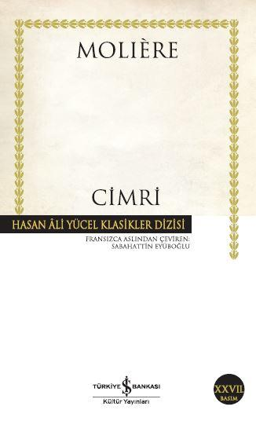

  
# Cimri - Moliere
## 104 Sayfa
### 10.02.2022
  
 

  

    
     

 
 

> ***(Tanıtım Bülteninden - Türkiye İş Bankası Kültür Yayınları)***

***Molière [Jean-Baptiste Poquelin] (1622-1673); Eserlerindeki tiplemelerle dünya edebiyatında, Shakespeare’den sonra insan gerçekliğine belki de en derinlemesine nüfuz eden oyun yazarlarından biridir. Kadınlar Mektebi’nden Kibarlık Budalası’na, Cimri’den Hastalık Hastası’na bu oyunlar, sadece dönemin tutucu otoritelerini rahatsız etmekle kalmamış, tazeliklerini bugüne kadar korumuşlardır.***

***Sabahattin Eyüboğlu (1908-1973): Hasan Âli Yücel’in kurduğu Tercüme Bürosu’nun başkan yardımcısı ve Cumhuriyet döneminin en önemli kültür insanlarından biriydi. Tek başına ya da imece usulü yaptığı çeviriler, Hayyam’dan Montaigne’e, Platon’dan Shakespeare’e kadar, dünya kültürünün doruk adlarındandı.***

_____

> ***Benim Kitap Hakkındaki Yorumlarım***

Paradan başka hiçbir şeyi düşünmeyen saçma bir adam var. Para için çocuklarını 50-60 yaşındaki insanlarla evlendirmeyi göze alan, çocuklarının hiçbir duygu ve düşüncelerine önem vermeyen bir adam... İkram edecekleri yemeğe kadar ince ince hesap kitap yapan saçma bir adam. 

Açıkçası bu adama çok sinir oldum ve anlatacak bir tarafını da görmüyorum.

Neyse ki kitabın sonu mutlu bitiyor.

Kitap elbette bir dünya klasiği olarak karşımıza çıkıyor. Aslında bizlere verdiği mesaj da çok önemli. Nitekim ben ekstra keyif alarak okuduğumu söyleyemem. Daha çok bahsettiğim gibi, bu cimri babaya çok sinir olarak okudum kitabı... Biraz incelediğimde ise insanların  genel olarak bu kitabı beğendiklerini gördüm..

____

> ***[Başka bir okuyucu tarafından yazılmış bir inceleme](https://1000kitap.com/gonderi/93803232)***

Hep para, para!
Ağızlarını açtılar mı ilk söz para! Tek bildikleri, tek düşündükleri bir şey var : Para!

Moliere’in yaşadığı dönemde Fransa’da tiyatro, edebiyatın yerini almış ve Fransız düşüncesinin sahnede anlatılması ile adeta sanat ve edebiyat kaynaşması gerçekleşmiştir.

Bu dönemde tiyatro sadece saray sınıfının ve entellektüellerin ilgi alanında olan tragedyalar ve halk sınıflarının seyircisi olduğu kaba halk komedileri olarak ikiye ayılmış. Moliere’in en büyük başarısı ve tiyatroyu yücelttiği nokta bu iki ayrı sınıf arasındaki ayrılığı giderebilmiş ve aydın kesimle kaba halk kitlelerini tiyatro çatısı altında bir araya getirebilmiş olmasıdır.

Kendisi de tragedya lar ile yola çıkan Moliere yakalamayadığı başarısını komedya ile yakalamayı başarmıştır. Komedyayı içindeki güldürü öğelerini bozmadan ciddileştirmiş ve bir nevi güldürürken düşündüren bir forma kavuşturmuştur. Bu yeni yaklaşım ve oyunlarındaki konu seçimleri ile çağdaşlarının, kilisenin ve sarayda pek çok kişinin de hışmına uğramış her devrimci ve yenilikçi kişi gibi pek çok zorlukla karşılaşmıştır ve sonunda belki de Aristophanes’ten sonra gelmiş geçmiş en iyi komedya yazarı ünvanını almıştır.

Tiyatroya getirdiği bu yeniliklerin temeli insan olgusunu en üst seviyede gözlemleme ve yaşama şansına sahip olması ile ilgilidir. Paris’te zengin bir aile’de dünyaya gelmesi, babasının işi nedeni ile saray çevresinde bulunması, ardından tutku haline getirdiği Tiyatro ile çıktığı taşra gezilerinde bilgisiz ve yoksul Fransız köylüler ile kurduğu iletişim kendisine çift taraflı bir gözlem şansı sunmuştur. Oyunlarını da o dönem için daha popular olan kitap dili ile değil sahne dili ve gerçekçilikle kurgulanmıştır.

Cimri oyunu temellerini Plautus’un Çömlek adlı komedyasından alıyor. Moliere bu ölümsüz eseri ile aslında insanın hiçbir zaman güncelliğini kaybetmeyen anlam arayışını, parayı yaşamın anlamı haline getiren ve adeta tüm insani değerlerin üstüne koyan kitleyi gözümüzün önüne koyuyor. Yaşantımızın her evresinde rastladığımız bu insanların eleştirisini yaparak düştükleri durumun komikliğini bir nevi sahneliyor. Bu eser ile Moliere’in dönemin burjuva sınıfını eleştirdiği söylenmiş olsa da şahsi görüşüm Cimri’nin evrensel bir Cimri olduğu ve Moliere’in bu komedya ile evrensel bir mesaj verdiğidir.

Oldukça keyifli ve bir oturuşta okuyabileceğiniz bu oyunu özellikle mutlu olmaya ya da enerjiye ihtiyacınız olan bir gün okumayı tercih edebilirsiniz. Diğer tüm Moliere eserleri gibi.

Bu kitapta sizleri neler bekliyor : Para, Para, Para

_____

 

### Kitaptan Alıntılar ;
- ***"Senin için yaptığım hiçbir şeye pişman değilim. Öyle tatlı bir zor ki bana bunları yaptıran, istesem de elimde değil pişman olmak. Ama doğrusunu istersen, bu kadar mutluluk ürkütüyor beni. Seni sevmekte belki fazla ileri gittim diye korkuyorum." (s.3)***
- ***"Erkekler bir tuhafsınız: İnsan sizi yüreğinin bütün açıklığıyla sevdi mi, sevgisini gösterdi mi, hemen soğuyuverirsiniz; hem de nasıl! Ölsek kılınız kıpırdamaz." (s.4)***
- ***"Ne kolay, ne kolay inanıyor insan sevdiğine!" (s.4)***
- ***"Bakıyorum da, insanları kazanmak için en iyi çare onların sevdiklerini sever görünmek, doğru dediklerine doğru demek, kusurlarını övmek, her yaptıklarını alkışlamak." (s.6)***
- ***"Hem dünyada kim var, bir kez olsun aklını kaybetmeyen?" (s.7)***
- ***"Ah, öyle dertliyim ki bilemezsin." (s.8)***
- ***"İnsan yemek için yaşamaz, yaşamak için yer." (s.52)***
- ***"Açık söz yerin dibine batsın! Ne belalı şeymiş doğruyu söylemek! Vazgeçtim, bir daha zor söylerim doğruyu." (s.57)***
- ***"Mesut olmak için birinin ölümünü beklemek hiç de hoş bir şey değil; hem ölüm dediğin senin istediğin zaman çalmaz ki kapını!" (s.58)***

____

- ***Bütün erkeklerin sözleri birbirine benzer. Onları sadece yaptıkları birbirlerinden ayırır.***
- ***Aşk bu... Hiç kimseyi tanımaz.***
- ***Evlenmek sanıldığından çok daha önemli bir konu;insanın yaşamı boyunca mutlu ya da mutsuz olması buna bağlı.***
- ***Nedir bu mahzun halin? Bana bu kadar umut verdikten sonra? (s.3)***
- ***Kimin yüzüne baksam kuşku sarıyor içimi.***
