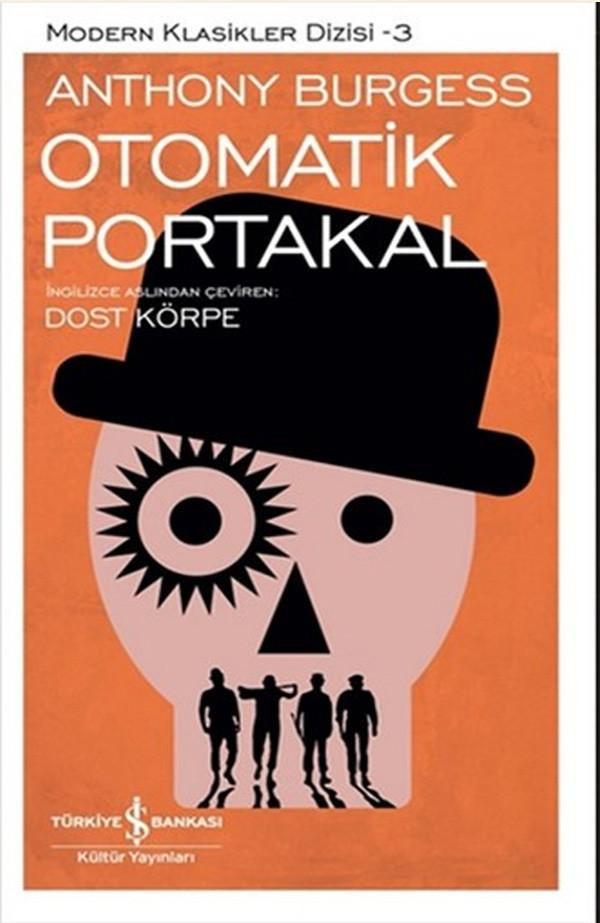

  
# Otomatik Portakal - Anthony Burgess
##  172 Sayfa
### 15.02.2022
  
 

  

    
     

 
 

***Karakterler;***
- ***Alex:*** Kahramanımız.
- ***Pete:*** Alex'in çetesindeki arkadaşı.
- ***George:*** Alex'in çetesindeki arkadaşı.
- ***Aptalof:*** Alex'in çetesindeki arkadaşı.

 

> ***(Tanıtım Bülteninden - Türkiye İş Bankası Kültür Yayınları)***

***Tüm hayvanların en zekisi, iyiliğin ne demek olduğunu bilen insanoğluna sistematik bir baskı uygulayarak onu otomatik işleyen bir makine haline getirenlere kılıç kadar keskin olan kalemimle saldırmaktan başka hiçbir şey yapamıyorum...***

***Cockney dilinde (İngiliz argosu) bir deyiş vardır. "Uqueer as as clockwork orange". Bu deyiş, olabilecek en yüksek derecede gariplikleri barındıran kişi anlamına gelir. Bu çok sevdiğim lafı, yıllarca bir kitap başlığında kullanmayı düşünmüşümdür. Bir de tabii Malezyada "canlı" anlamına gelen "orang" sözcüğü var. Kitabı yazmaya başladığımda, rengi ve hoş bir kokusu olan bir meyvenin kullanıldığı bu deyişin, tam da benim anlatmak istediğim duruma, Pavlov kanunlarının uygulanmasına dayalı bir hikâyeye çok iyi oturduğunu düşündüm...***  
***-Anthony Burges-***

***Karabasan gibi bir gelecek atmosferi... Geceleyin sokaklara dehşet saçan, yaşamları şiddet üzerine kurulu gençler... Sosyal kehanet? Kara mizah? Özgür iradenin irdelenişi?.. Otomatik Portakal bunların hepsidir. Aynı zamanda hayranlık verici bir dilsel deneydir, çünkü Burgess antikahramanı için yeni bir dil yaratır: Yakın geleceğin argosu "nadsat"ı.***

***... ve Stanley Kubrickin muhteşem film uyarlaması, yirminci yüzyılın kült eserlerinden biri olan bu romanın şöhretini pekiştirmiştir...***
_____

Başta Alex olmak üzere 4 kişilik bir arkadaş grubu vardır. Bu arkadaş grubu'nun kimseye faydası yoktur. Üstelik bunlar, önüne gelen herkese sataşıp, saldırmaktadırlar. Saldırdıkları insanları bir güzel dövüp, paralarını alıyor ve ardından onların kıyafetlerini çıkartıp, o şekilde bırakıyorlardı... 

Bunların başında yaşlı bir öğretmen geliyor. Yaşlı adamcağız, kütüphaneye giderken koltuğunun altında üç tane kitap vardır. Bu gençler, adamın yolunu keser ve yine yukarıda bahsettiğim gibi adama zarar verirler ve adamcağızın kitaplarını parçalarlar. Daha sonrasında ilerleyen zamanlarda bu gençler soygun yapmaya devam ederler. 

Bu gençler başka bir gün, rastgele bir tane eve zorla girerler. Bu evdeki adam yazardır ve o esnada kitap yazmaktadır. Adamın yazdığı kitabın ismi "Otomatik Portakal"dır. Adamın yazdığı kitabı parçalarlar, adamın karısına saldırıp, zorla kadınla birlikte olurlar. Evin altını üstünü getirdikten sonra oradan ayrılırlar...

Aradan biraz zaman geçtikten sonra kahramanımız Alex, bir süre evde ailesiyle birlikte zaman geçirdi. Yine akşam vakti arkadaşlarıyla dışarıya çıkmadan önce babası Alex için endişelendiğini belirtti. Nitekim Alex yine her zamanki gibi vurdum duymaz bir tavırla onlarla vedalaştı ve arkadaşlarıyla buluştu.

Bu sefer Alex ve arkadaşları arasında bir farklılık  vardı. Artık Alex'in arkadaşları özgür ve söz sahibi olmayı istiyorlardı. Nitekim arkadaşları bu düşüncelerini dile getirdiler. Bunun üzerine Alex bu grupta kimin sözü geçtiğini göstermek için arkadaşlarıyla kavga etti ve 2 tanesini yaraladı. Aynı zamanda Alex bu kavgayı kazanmıştı..

Gençlerin saldırmak için yeni bir hedefi vardı. Yaşlı kadının evine gittiler. İlk önce, yaşlı kadını dışarıdan kandırmaya çalıştılar ama yaşlı kadın buna kanmadı. Bunun üzerine Alex gizlice yaşlı kadının evine girdi. Nitekim Alex, bu grubun başının kim olduğunu da göstermek istiyordu. Bu yüzden Alex tüm işleri tek başına halletmek istiyordu. Alex ve yaşlı kadın uzun bir süre boyunca boğuştular. En sonunda Alex yaşlı kadının kafasına ağır bir şeyle vurdu. Bunun üzerine dışarıdan polisin yaklaştığını duyunca Alex hemen evden ayrılmak istedi. Ama diğer arkadaşları gitmişti, sadece Aptalof kalmıştı. Aptalof son yaptıkları kavga yüzünden intikam almak için, Alex'in başına sopasıyla ağır bir darbe indirdi. Nitekim bunun üzerine Alex'in gözleri karardı ve oradan uzaklaşamadı... Kısa bir süre sonra polisler gelip Alex'i yakaladı...

Alex'i karakola götürdüler. Uzun bir sorgulamanın ardından Alex'i çok fena dövmüşlerdi. Aynı zamanda Alex yaptıkları tüm şeyleri birbir polislere anlatmıştı. Nitekim artık Alex bir cinayet bile işlemişti. Çünkü yaşlı kadın ölmüştü.

____

> ***İkinci Bölüm (s.67)***

Tüm bu olanlardan sonra Alex, 14 yıl hapis cezasına mahkum edildi. Dev-Tut 84 F'ye 6655321 numaralı suçlu olarak getirildi. Tüm bunların üzerine Alex'in annesi ve babası gerçekten mahvolmuştu...

Alex, burada iki yıl geçirmişti. Bu iki yıl onun için hiçte kolay geçmedi. Gardiyanlar tarafından oldukça dayak yemişti. Ama nitekim Alex, rahibin en sevdiği kişi konumundaydı. Alex, rahibe yardımcı oluyordu ve bu şekilde küçükte olsa bazı çıkarlar elde etmişti.. Alex, daha uysal ve sanki iyi bir insanmış gibi kendini göstermeye devam ediyordu.

Alex ve 5 kişi daha küçücük koğuşta kalıyorlardı ve  6 kişilik yatakları vardı. Bir tane daha kendini beğenmiş, herkesle düşman olmaya çalışan bir mahkum geldi. Bu mahkum koğuştaki kimseye karşı en ufak bir dostluk belirtisi göstermedi. En sonunda bu mahkumla birbirlerine giren odadakiler, bu mahkumu bir güzel dövdüler. Sonrasında bu mahkum kanlar içerisinde yerde bayılıp kaldı. Sabah uyandıklarında ise mahkum ölmüştü. Alex bir kez daha odadikiler tarafından gardiyanlara ispiyonlandı, herkes bu mahkumun ölmesine Alex sebep olmuş gibi iş birliği yaptılar ve Alex bir kez daha ihanete uğramıştı...

Ertesi gün Alex'in koğuşuna üst makamdan insanlar geldi. Bunun böyle devam edemeyeceğini, bu suçluları bir araya kapatmanın daha da kötü sonuçlar verdiğinden bahsetti.. Aralarından birisini seçip üzerinde deney yapacaklardı ve bu şanslı kişi Alex oldu..

Alex'i oradan çıkardılar ve başka bir yere götürdüler. Alex'e kendine ait bir oda ve yatak verdiler. Alex'in karnını bir güzel doyurdular.. Alex halinden çok memnundu ve çok mutluydu.. Alex'in koluna bir sıvı verip sinema izlemeye götürdüler. Alex başta hiçbir şeyden habersiz, film izleyeceğini düşünüyordu. Sonrasında ise Alex'i güzelce bağladılar ve gözkapaklarını kapatmaması için, göz kapaklarını bir şeyle tuturdular.. Bunların üzerine Alex, uzun uzun geçmişinde yaptığı şeylerle alakalı filmler izledi. Bunların başında, insanları dövmek, kızlara kötü şeyler yapmak, kan, vahşet gibi gibi şeyler... Tüm bunların üzerine Alex kendisini çok kötü hissediyordu ve hasta oluyordu.

Alex için işkenceye dönüşen bu filmleri izlemek günlerce devam etti. Tabi en sonunda Alex'in gelişimini üst makamdan kişilere göstermek için bir sürü insan bir araya gelmişti. Alex sahnedeydi. Bir tane oyuncu Alex'in karşısına geçip, Alex'i kışkırtıp, ona kötü davranıyordu. Her ne kadar Alex buna eski günlerdeki gibi karşılık vermek istese, hemen vücudu kasılıyor kendini çok kötü bir çıkmazın içerisinde buluyordu. En sonunda Alex, karşısındaki adamdan af dilemeye, ayaklarına kapanmaya ve ona yardım etmeyi denedi. Sonuç olarak bu sahne başarıyla sonuçlanmıştı..

Hemen ardından Alex'in karşısına çıplak  şekilde  bir kız çıkarılmıştı. Alex'in heyecan seviyesi doruklara çıktı, ama Alex kıza karşı eski günlerdeki gibi kötü düşünceler içerisine girdiği anda vücudu büyük bir acının içerisine giriyor ve kasılmaya başlıyordu. Alex en ufak kötü bir şey yapmaya kalkışsa, hatta düşünse bile kendini büyük bir kabusun içerisinde buluyordu.. Nitekim Alex, yine kızın ayaklarına kapanmaya ona güzel sözler söylemeye, kızı iyi yoldan elde etmeye çalıştı.. 

Sonuç olarak her iki farklı sahnede de Alex istesede kötü bir şekilde davranamamıştı. Oradaki doktorlar deneylerin başarıyla sonuçlandığını açıklıyorlardı... Peki aslında bu bir bakıma öğrenilmiş çaresizlik değil miydi..?
_____

> ***Üçüncü Bölüm (s.117)***

Alex, tüm imza işlemlerinden sonra  Dev-Tut'tan serbest bırakıldı. Alex, iki yıl önce yaşlı kadını öldürdüğünde üzerinde olan kıyafetleri ile yeniden dışarı çıkmıştı. Alex, büyük bir heyecan içerisinde ailesinin evine gitti. Anahtarıyla içeriye girdiğinde evdekiler Alex'i görünce şaşırmışlardı. İlk başta Alex'in hapishaneden kaçtığını düşünmüşler ve feryat figan ortalığı inletmişlerdi. Aynı zamanda evin içerisinde bir tane yabancı 35-40'larında bir adam daha vardı. Bu adamın ismi Joe'ydi. Joe ve Alex birbirleriyle baya bir sürtüştüler. Bu Joe'yi, Alex'in odasını kiralamışlardı. Nitekim Joe, Alex'in annesinin ve babasının yeni evlatları olmuştu ve anne ile babanında buna bir itirazı yok gibi görünüyordu.
Evdeki kimsenin Alex'i orada istemediği belliydi. Bunun üzerine Alex bir daha dönmemek üzere evini terk etti.

Alex, artık hayatına son vermek istiyordu. Bunu cebindeki bıçağıyla yapmayı düşündü ama bu düşünce onu mahvetti. Hem bıçağını, hem de kendisinden çıkacak olan kanlar onu hasta ediyor ve dayanılmaz bir hale sokuyordu.. Bunun üzerine çocukluğunun ardından halk kütüphanesine gitmeye karar verdi. Kütüphanenin içerisinde kendisini nasıl öldürebileceğine dair kitaplar ararken, oradaki yaşlı bir adamla gözgöze geldiler. Bu adam ise, en başta Alex ve arkadaşlarının saldırdığı yaşlı öğretmendi. Bu adamın kitaplarını yırtmışlar ve adamı dövmüşlerdi. Bunun üzerine adam olanları hatırlayıp, ALex'e saldırmaya başladı. Aynı zamanda adamın etrafındaki diğer yaşlılar da, o yaşlı adamla birlikte hepsi Alex'i dövmeye başladılar. Ne yazık ki Alex buna karşılık veremiyordu, çünkü karşılık verecek olsa dayanamayacağı şeyleri yeniden yaşayacaktı. Onun yerine dayak yemeği yeğliyordu... En sonunda polisler geldi ve Alex'i oradan kurtardılar... Ama Alex bir de ne görsün ki, kendi çetesindeki Aptalof ve bir kişi daha polis elbiseleri içerisindeydi. Bu caniler nasıl olurda polis olabilirlerdi...

Polisler, Alex'i kimsenin olmadığı ormanlık bir alana götürdüler ve çok fena bir şekilde dövdüler. Polisler Alex'i orada bırakarak oradan uzaklaştılar. Alex ne yapacağını bilmez halde uzun bir süre yürümek zorunda kaldı. Alex en sonunda bir tane evin önüne gelmişti. Evin girişinde YUVAMIZ yazıyordu, burası sanki Alex'in geçmişinden bir çağırışım yapıyordu ama bir türlü hatırlayamadı.. Evin kapısını çaldı ve yardım istedi.. Evin sahibi olan adam Alex'i içeriye aldı. Alex içeriye girdikten sonra bu adamın Otomatik Portakal'ı yazan adam olduğunu anladı. Bu adamın evine zorla girmişler, evlerini yerle bir etmişler, kızı ve karısına saldırmışlardı... Ama neyse ki adam Alex'i tanıyamamıştı... Adam Alex'in yaralarını sardı, onun için yiyecek bir şeyler hazırladı.  Birkaç gün Alex burada kaldı. Alex ve arkadaşlarının bu evi yağmaladıkları gece, adamın karısı bunlar yüzünden ölmüştü.. 

Bu kafayı sıyırmış olan adam Alex'in gerçek kimliğinden habersiz olarak, onu kullanabileceklerini söylüyordu. Bu adam  birkaç arkadaşını daha çağırdı. Alex'e yapılanları halka bir bir anlatıp, o zamanki mevcut yönetimi yıkmak istiyorlardı. 

Alex'i alıp bir tane eve götürdüler ve onu orada tek başına bıraktılar... Alex tam uyuyacaktı ki birden yükselen müzik sesi Alex'i etkisi altına aldı. Alex, bu müziklerden artık nefret ediyor ve dayanamıyordu. Çünkü bu müzikler, Alex'in işkence gördüğü, filmleri izlediğindeki eşlik eden müziklerdi.. Alex, ne yaptıysa müzik durmamıştı ve üstelik sesi daha fazla artmıştı. Evin kapıları kilitliydi ve Alex dışarıya çıkamıyordu.. Alex tüm bu olanları son vermek için intihar etmek amacıyla kendisini camdan aşağı attı. Ama nitekim Alex ölmemişti. Uzun bir aranın ardından gözlerini hastanede açtı.

Artık Alex'in hastalığı geçmişti. Alex'in öğrendiği, öğrenilmiş çaresizlik davranışları ona zarar veremiyordu. En sonunda Alex yeniden eski hayatına döndü. Artık 18 yaşındaydı. İlk başta yeniden bir çete kurmuştu ama bu sefer kendisi saldırmıyordu. Alex sadece emir veriyordu. Ama yine de Alex için bir şeyler yolunda gitmiyordu. Alex çeteden ayrıldı ve yalnız kalmak için oradan ayrıldı..

Alex, artık bir şeylerin değişmesi gerektiğinin farkına vardı. Artık geleceği hayal edebiliyordu. Güzel bir eşi ve çocuğuyla kendini görebiliyordu. Bu noktadan sonra Alex'in yapacağı şey ise kendine güzel bir eş aramak olacaktı... 

> ***- SON -***

_____

***S.86 - S.87***

____

***`"Bazılarımız anadan doğma savaşçıyızdır. Özgürlüğümüzü korumamız gerek. Benim için siyasi partiler önemli değildir. Nerede bir kötülük görsem ona karşı çıkarım. Parti adlarının bir önemi yoktur. Özgürlüktür önemli olan. Halk, özgürlüğü için başkaldırmaz, direnmez. Bir lokma ekmeğe, bir kaşık çorbaya değişir özgürlüğünü. Bunun için onların altına ateş yakmak, haklarını aramalarını sağlamak gerekir. Demokrası istiyorlarsa onu kazanmak için savaşmaları gerekecektir. Bütüncül yönetimleri yıkıp, özgürlük, mutluluk içinde yaşamalarını ancak biz düşünürler sağlayabiliriz onlara..." (s.146)`***
____

 

### Kitaptan Alıntılar ;
- ***"Ama siz neyin harika neyinse beş para etmez olduğunu çoktan unutmuşsunuzdur." (s.1)***
- ***"Kolunun altına sıkıştırdığı kitaplara bakılırsa okuma meraklısıydı. Bu günlerde kimse kolay kolay Ulusal Kütüphane'ye gitmiyor. Kitap okuyupta ne yapacağız?" (s.4)***
- ***"Kolunun altındaki kitapları gördük kardeşim. Bugünlerde kitap taşıyan birini görmek gerçekten göz yaşartıcı..." (s.5)***
- ***"İnsan birine kardeşim demeye  görsün,  nelere katlanıyor nelere!!!" (s.11)***
- ***"Ne biçim dünya bu be! İnsanlar aya gidiyor. Elektriğin çevresinde dönen tatarcıklar gibi dünyanın çevresinde vızır vızır dönüyor uydular ama, burada, şu garipler köşesinde ne yasa var ne de zavallıyı koruyan, onu düşünen biri..." (s.13)***
- ***"Besbelli televizyon seyrediyordu insanlar sıcacık odalarında: güven içinde.  Bu gece tüm dünya yurttaşları aynı programı izleyecekler enayi kutusunda. Uzayda dolaşıp duran bir verici, sinyalleri toplayıp dağıtacak. Genellikle bu kutunun başında oturup özyaşamlarını yitirerek başkalarınınkine musallat olanlar orta yaşlı, burjuva sınıfındandır." (s.16)***
- ***"Arkadaş değil miyiz? Dostların birbirini kırması doğru olur mu hiç?" (s.27)***
- ***"Aramızda birinin öncü olması, buyruk veren olması gerekmez mi? Sıkıdüzenin olmadığı yerde kargaşalık başlar, anarşi filizlenir." (s.27)***
- ***"Öğleden sonra da eğer canım isterse gereksiz bilgilerle kafa şişiren okulumun yolunu tutarım." (s.32)***
- ***`"Alex, bu hasta, ölmek üzere olan toplumda tek arkadaşın, gerçek dostun benim. Seni senden kurtarmak için çaba harcıyorum." (s.35)`***
- ***"Sanat zevki ve anlayışı gençliğe aşılanırsa geleceğe umutla bakabiliriz." (s.38)***
- ***"İnsan dediğin bir kez ölür. Aptalof doğmadan ölmüş zaten." (s.49)***
- ***"Gün  gelecek sana döneceğim sevgilim, aşkım,   Ama sen beni çoktan bırakmış gitmiş olacaksın..." (s.59)***
- ***"Çoğunuz aptalsınız, enayi. Ruhunuzu şeytana satmışsınız. Cehennemin varlığını bile bile, kolay yaşamak için, üç beş kuruş çalmak için, birkaç günlüğüne rahat yaşamak için hırsızlık yapılır mı?" (s.69)***
- ***"İyilik kişinin içinden gelir. Kişi iyiliği seçebilmelidir. Kişiye seçme hakkı tanınmazsa, o kişiliğini yitirir." (s.74)***
- ***"Kardeşlerim deyip bağrıma bastığım hain, kötü yürekli yaratıklar beni nasıl bırakıp kaçmışlarsa şimdi de koğuş arkadaşlarım beni aslanın ağzına atıyorlardı." (s.81)***
- ***"Güven, arkadaşlık gibi sözcüklerin modası geçmişti anlaşılan sayın kardeşlerim." (s.81)***
- ***"Belki de her şey gönlünüzce sonuçlanır. Kim bilir, kim bilir!" (s.86)***
- ***`"Ama bu kez çok dikkatli olmam gerekecek. Bir başıma yapacağım ne yaparsam! Yıllarca arkadaş, kardeş dediğim hainlere güvenim yok artık." (s.99)`***
- ***"Herhangi bir şeyi sınırlandırmak çok güçtür. Dünyayı, yaşamı sınırlandıramayız." (s.104)***
- ***"İnsanlar yeryüzünde, mutluluk içinde birbirlerini incitmeden, dövmeden, bıçaklamadan yaşamalıdırlar." (s.105)*** 
- ***"İçime o güne değin duymadığım garip bir duygu kaplayıvermişti. Dayak yemek dayak atmaktan daha güzel, daha mutlu bir olaydı! Eğer o beyaz ceketli odada kalsaydı ona öbür yanağımı da dönerdim..." (s.109)***
- ***"TUTKU KORKUYU KOVABİLEN TEK GÜÇTÜR." (s.114)***
- ***"Demek ölüm tek gerçekti. Doğum ve ölümün dışında başka hiçbir şey gerçek diye nitelendirilemezdi." (s.128)***
- ***"Yaşam ne aldatıcıdır biliyor musun?" (s.130)***
- ***"Kimseye güvenmemek gerek bu dünyada." (s.136)***
- ***"Nereye gidecektim? Ne evim, ne param, ne de beni düşünen insanlar vardı yeryüzünde." (s.137)***
- ***"Rahatlığa önem veren biri döşemişti bu odayı. Kitap, kitap, kitap. Dört bir yanım kitaplarla doluydu." (s.139)***
- ***"Seni bir makine biçimine sokmuşlar. Seçme hakkını elinden almışlar. Toplumun kabullendiği davranış türlerine boyun eğmek zorundasın. Sadece iyilik yapmakla görevli küçücük bir makinesin. Buna göre müzik, cinsel ilişki, edebiyat ve her türlü sanat dinlendirici, zevk verici değil de, acı çektirici birer etken oluyorlar." (s.142)***
- ***"Seçme hakkına sahip olmayan kişi kişiliğini yitirmiştir." (s.142)***
