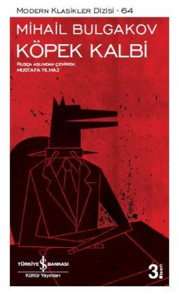

  
# Köpek Kalbi - Mihail Bulgakov
##  132 Sayfa
### 18.02.2022
  
 

  

    
     

 
 

***Karakterler;***
- ***Şarik | Şarikov  Poligraf Poligrafoviç:*** Köpeğimiz
- ***Filip Filipoviç:*** Köpeğe bir şeyler veren adam | Kalabuhov Evi
- ***Vitali Aleksandroviç:*** Filipoviç'in evinin bir kısmını elinden alınmasına engel olan kişi
- ***Bormental:*** Filip Filipoviç'in ilk öğrencisi ve dostu.

 

> ***(Tanıtım Bülteninden - Türkiye İş Bankası Kültür Yayınları)***

***Köpek Kalbi, hem Rusya'da hem de Batı'da geçen yüzyılın sakıncalı kitaplarından. 1925'te yazılan, ülkesinde ancak 1987'de yayımlanabilen bu roman, 1917 Rus Devrimi'nin toplumsal sonuçlarına odaklanmış. Yer yer Frankenstein'ı andıran, gerçeküstü atmosferiyle kendisini bir distopyanın eşiğinde tutan bir kara mizah, Köpek Kalbi. Oldukça sağlam iplerle birçok metne bağlanan anlatısı, Rus bir doktorun elinden ortaya çıkan tehlikeli bir insan-hayvan türünün, insan doğası üzerinden burjuva ve proleterya görünümlerini yakalayıp hicvediyor. Postmodern romanın unsurlarını, yazıldığı döneme rağmen içinde saklayan Köpek Kalbi; Gogol'un hemşehrisi ve en önemli mirasçısı, Usta ile Margarita'nın yazarı Bugakov'un komünist devrime ve dünyaya bakışını yansıtan küçücük bir roman.***
_____

Hikaye, Kahramanımız olan köpeğimizin gözünden anlatılmaktadır. Köpeğimizin üzerine cani bir şekilde kaynar su dökmüşlerdir.. Köpeğimizin karnı çok kötü bir şekilde yanmış ve yaralanmıştır. Bu soğuk kış gününde köpeğimiz yaralı halde yiyecek bir şey bulamayacağı için ölmeyi kabullenmiş ve bir duvarın kenarına kıvrılıp ölümünü beklemeye başlamıştır. Ama kısa bir süre sonra köpeğimize doğru bir tane beyfendi yaklaşır ve köpeğimize sucuk gibi yiyecek şeyler verir. Bu adamın ismi Filip Filipoviçtir ve köpeğimizi kendi peşinden gelmesi için çağırır. Zaten yaralı halde olan köpeğimiz bu teklifi geri çevirmez ve bu adamı takip eder...

Köpeğimiz bu adamla birlikte bir yere gelirler. Nitekim buranın kendisi için kötü bir yer olacağını düşünen köpeğimiz kaçmaya çalışır ve ortalığı birbirine katar, ama köpeğimizi yakalarlar ve ardından köpeğimiz zaten bayılmıştır... 

Köpeğimiz uyandığında karnının sarıldığını görür. Artık canı yanmıyordur ve sıcak bir ortamdadır. Oldukları yer aslında Filipoviç'in hem evi hem de çalışma yeridir. Birçok kişi buraya ameliyat olmak için gelir. Nitekim köpeğimiz buranın tam olarak ne olduğunu anlayamaz.

Köpeğimizin ismi **Şarik** olarak verildi. Bu noktadan sonra Şarik olarak bahsedeceğim. Aradan belli bir zaman geçti ve bu zaman içerisinde Şarik'i çok güzel beslediler. Şarik ne bulduysa yedi ve halinden oldukça memnundu.. Şarik sahibine oldukça bağlanmıştı ve herhangi bir şeyden şüphe duymuyordu. Bir gün apar topar bir şeyler oldu. Aynı zamanda o gün herhangi bir hasta kabul edilmiyordu. Çok kısa bir süre önce ölen bir adamı getirdiler. Bunun ardından ise bir anda Şarik'i bayılttılar ve ameliyata aldılar. Bu ameliyatta, kısa süre önce ölen adamın testislerini ve hipofizini Şarik'in testisi ve hipofizi ile değiştirdiler... Nitekim bunun sonucunda aslında Şarik'in ölmesini bekliyorlardı ama tam tersi oldu. Şarik zamanla iyileşmeye başladı. Aynı zamanda zamanla ise ağzından kelimeler çıkmaya ve küfürler etmeye başladı. Doktorların bu deneyi yapmalarının sebebi gençleşmeyi sağlamaktı ama nitekim öyle olmadı ve beklemedikleri bir sonuçla karşılaştılar... Aradan belli bir zaman geçtikten sonra Şarik'in  edindiği şeyler şu şekildeydi: 

1 - Vücut yapısına göre bir insan  
2 - Ağırlık olarak üç pud (1 pud = 16.38 kg)  
3 - Kısa boylu  
4 - Başı küçük  
5 - Sigara içmeye başladı  
6 - İnsanların yediği yemekleri yiyor  
7 - Kendi başına giyiniyor  
8 - Rahatlıkla sohbet edebiliyor (s.71)

Bunun üzerine Şarik, kendine şöyle bir isimlendirme yaptı: Şarikov  Poligraf Poligrafoviç | yurttaş Şarikov... Şarikov, ilerleyen bunca süreçte, içindeki köpek kalbini hala gün yüzünde tutuyordu ve kedilerden nefret ediyordu... Bunun yanı sıra insandan aldığı olumsuz özelliklerde baş gösterince doktorların sabrını taşırdı. Doktor Filip Filipoviç, büyük bir hata yaptığının farkına varmıştı. Bunun üzerine Şarikov'u yeniden eski haline döndürmek için, Şarikov'un hipofizini kendisine ameliyatla  geri koydu. Artık Şarikov yavaş yavaş konuşmayı unutuyordu...
____

***S.68 - S.69***

______

 

### Kitaptan Alıntılar ;
- ***"Ah, insanlar, insanlar!" (s.3)***
- ***"Çizmeli ayaklarıyla tekmelediler mi? Tekmelediler. Böğrüme tuğla yedim mi? Doya doya. Her türlüsünü çektim, yazgımı kabullendim; şimdi ağlıyorsam sadece fiziksel acıdan ve açlıktan. Zira ruhum henüz ferini yitirmedi. Dayanıklıdır köpek ruhu." (s.4)***
- ***"Soluğu kesilmişti. Hiçbir yere kımıldamamaya, burada, kemeraltında ölmeye karar verdi. Umutsuzluk yıkmıştı onu. Ruhu o kadar acı ve keder, o kadar yalnızlık ve korku içindeydi ki..." (s.6)***
- ***"Anlaşılan ölmek için henüz erken. Umutsuzluğa düşmek gerçekten günah belki de." (s.8-9)***
- ***"Çok kan dökülür, çok şarkılar söylenir güzeller uğruna!.. Ben de kan dökecek, şarkı söyleyeceğim en güzel olana!.." (s.22)***
- ***"Yemek, İvan Arnoldoviç, alengirli iştir. Yemeyi bileceksin. Düşünebiliyor musun, çoğu insan yemeyi hiç bilmiyor.  Sadece ne yiyeceğini değil, ne zaman ve nasıl yiyeceğini de bilmek gerek." (s.37)*** | Fazla edebi bir anlatım olmamış mı... 😅
- ***"İki Tanrıya kulluk edilmez!" (s.41)*** 
- ***"Acele etmeyen her yere yetişir." (s.43)***
- ***"Kemeraltı günleri yeniden başlayacak, akıl almaz soğuklar, buz tutmuş asfalt, açlık, kötü insanlar..." (s.43)***
- ***"Kimseyi cezalandırmak yok. Bunu iyi  yaz aklına! İnsana da, hayvana da yalnızca telkinle yaklaşılabilir." (s.46)***
- ***"Korku gitmiş, yerini mutluluk almıştı. Bilincini yitirmekte olan köpek iki saniyeliğine de olsa sevdi ısırıklıyı. Ardından bütün dünya baş aşağı döndü ve köpek karnının üstünde soğuk ama hoş bir dokunuş hissetti. Sonrası hiçlik." (s.55)***
- ***"Ne yapacağımı bilmez haldeyim!" (s.64)*** 
- ***"Kelimelerin bir önemi yok." (s.79)***
- ***"Ne var ya, ne var gene." (s.93)***
- ***`"Bir şeyler okusanız keşke..." (s.96)`***
- ***"Hayır, bunu yapmanıza izin veremem, canım evladım. Altmış yaşındayım. Size tavsiyede bulunabilirim yani. Asla suça bulaşmayın, kime karşı olursa olsun. Yaşlandığınızda elleriniz temiz olsun." (s.112)***
- ***"Elbette, kedilere neler yaptığını gördük! Adamda köpek kalbi var!" (s.113)***
- ***`"Şunu anlayın ki, asıl korkunç olan artık köpek kalbi değil, insan kalbi taşıması. Hem de doğada var olanlar arasında en rezilini." (s.113)`***
