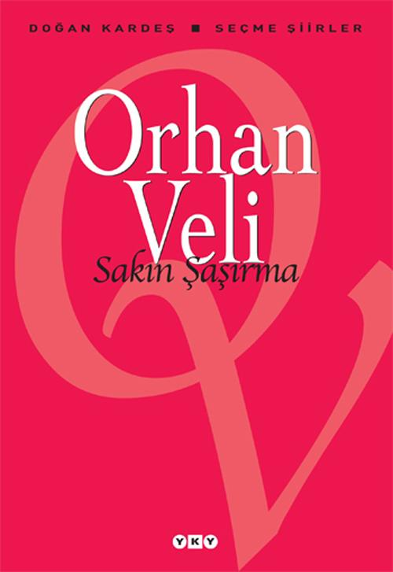

  
# Sakın Şaşırma - Orhan Veli Kanık
##  112 Sayfa
### 03.03.2022
  
 

  

    
     

 
 

> ***(Tanıtım Bülteninden)***

***Handan, hamamdan geçtik,  
Gün ışığında hissemize razıydık;  
Saadetinden geçtik,  
Ümidine razıydık;  
Hiçbirini bulamadık;  
Kendimize hüzünler icadettik,  
Avunamadık ;  
Yoksa biz...  
Bu dünyadan değil miydik?***
_____

> ***ANLATAMIYORUM (s.42)***

Ağlasam sesimi duyar mısınız,  
Mısralarımda;  
Dokunabilir misiniz,  
Gözyaşlarıma, ellerinizle?  

Bilmezdim şarkıların bu kadar güzel,  
Kelimelerinse kifayetsiz olduğunu  
Bu derde düşmeden önce.  

Bir yer var, biliyorum;  
Her şeyi söylemek mümkün;  
Epiyce yaklaşmışım, duyuyorum;  
Anlatamıyorum.  

______

> ***DEĞİL (s.51)***

Bilmem ki nasıl anlatsam; 
Nasıl, nasıl, size derdimi! 
Bir dert ki yürekler acısı, 
Bir dert ki düşman başına. 
Gönül yarası desem... 
Değil! 
Ekmek parası desem... 
Değil! 
Bir dert ki... 

Dayanılır şey değil.

___

> ***İSTANBUL'U DİNLİYORUM (s.77)***

İstanbul'u dinliyorum, gözlerim kapalı;   
Önce hafiften bir rüzgâr esiyor;   
Yavaş yavaş sallanıyor   
Yapraklar, ağaçlarda;   
Uzaklarda, çok uzaklarda,   
Sucuların hiç durmıyan çıngırakları;   
İstanbul'u dinliyorum, gözlerim kapalı;  

İstanbul'u dinliyorum, gözlerim kapalı;   
Kuşlar geçiyor, derken;   
Yükseklerden, sürü sürü, çığlık çığlık.   
Ağlar çekiliyor dalyanlarda;   
Bir kadının suya değiyor ayakları;   
İstanbul'u dinliyorum, gözlerim kapalı;  

İstanbul'u dinliyorum, gözlerim kapalı;   
Serin serin Kapalı Çarşı;   
Cıvıl cıvıl Mahmutpaşa;   
Güvercin dolu avlular.   
Çekiç sesleri geliyor doklardan,   
Güzelim bahar rüzgârında ter kokuları;   
Istanbul'u dinliyorum, gözlerim kapalı;  
____

>***BİRDENBİRE (.94)***

Her şey birdenbire oldu.   
Birdenbire vurdu gün ışığı yere;  
Gökyüzü birdenbire oldu;  
Mavi birdenbire.  
Her şey birdenbire oldu;  
Birdenbire tütmeye başladı duman topraktan;  
Filiz birdenbire oldu, tomurcuk birdenbire.  
Yemiş birdenbire oldu.

Birdenbire,  
Birdenbire;  
Her şey birdenbire oldu.  
Kız birdenbire, oğlan birdenbire;  
Yollar, kırlar, kediler, insanlar...  
Aşk birdenbire oldu,   
Sevinç birdenbire.

___

> ***YAŞAMAK (s.100)***

Biliyorum, kolay değil yaşamak,   
Gönül verip türkü söylemek yâr üstüne;   
Yıldız ışığında dolaşıp geceleri,   
Gündüzleri gün ışığında ısınmak;   
Şöyle bir fırsat bulup yarım gün,   
Yan gelebilmek Çamlıca tepesine...   
-Bin türlü mavi akar Boğaz'dan-   
Her şeyi unutabilmek maviler içinde.  

Biliyorum, kolay değil yaşamak;   
Ama işte   
Bir ölünün hâlâ yatağı sıcak,   
Birinin saati işliyor kolunda.   
Yaşamak kolay değil ya kardeşler,   
Ölmek de değil;  
Kolay değil bu dünyadan ayrılmak.  
(Aile, (17), Nisan 1951)

___

> ***İÇKİYE BENZER BİR ŞEY (s.102)***

İçkiye benzer bir şey var bu havalarda.   
Kötü ediyor insanı, kötü...  
Hele bir de hasretlik oldu mu serde;  
Sevdiğin başka yerde,  
Sen başka yerde;  
Dertli ediyor insanı dertli.  

İçkiye benzer bir şey var bu havalarda,  
Sarhoş ediyor insanı, sarhoş.  
____

 

### Kitaptan Alıntılar ;
- ***“Bir ışık oyunu var tavanda.  
Gölgeler seslerle birleşiyor  
Ve bir karga beynimi deşiyor  
Azaplar kemirdiğim bu anda.” (s.12)***
- ***“İçimde bir yalnızlık duygusu;  
Ölüm kadar uzun yaz uykusu,” (s.13)***
- ***"Gemliğe doğru   Denizi göreceksin;   Sakın şaşırma." (s.16)***
- ***"Mahallemizde   Senden başka ağaç olsaydı   Seni bu kadar sevmezdim.   Fakat eğer sen   Bizimle beraber   Kaydırak oynamasını bilseydin   Seni  daha çok severdim." (s.18)***
- ***"Şu anda dışarıda yağmur yağıyor   Ve bulutlar geçiyor aynadan   Ve bugünlerde Melih'le ben   Aynı kızı seviyoruz." (s.19)***
- ***"Bir aydan beri iş arıyorum, meteliksiz.   Ne üstte var ne başta.   Onu sevmeseydim   Belki de beklemezdim   İnsanlar için öleceğim günü." (s.19)***
- ***"Yol mu, para mı, mektup mu;   Bir düşündüğüm var." (s.26)***
- ***"Dağ başındasın;   Derdin günün hasretlik;   Akşam olmuş,   Güneş batmış,   İçmeyip ne halt edeceksin?" (s.28)***
- ***`"Ölüm Allahın emri,`   `Ayrılık olmasaydı." (s.32)`***
- ***Şeytan diyor ki: "Aç pencereyi;  Bağır, bağır, bağır; sabaha kadar." (s.36)***
- ***"İmkansız şey   Şiir yazmak,   Âşıksan eğer;   Ve yazmamak,   Aylardan nisansa." (s.37)***
- ***"Arzular başka şey,   Hâtıralar başka,   Güneşi görmeyen şehirde,   Söyle, nasıl yaşanır?" (s.37)***
- ***`"Bekliyorum`   `Öyle bir havada gel ki,`   `Vazgeçmek mümkün olmasın."(s.37)`***  
- ***"Böyle havalarda unuttum;   Şiir yazma hastalığım   Hep böyle havalarda nüksetti;   Beni bu güzel havalar mahvetti." (s.41)***
- ***"Deli eder insanı bu dünya;   Bu gece, bu yıldızlar, bu koku,   Bu tepeden tırnağa çiçek açmış ağaç..." (s.47)***
- ***"Kendimize hüzünler icadettik,   Avunamadık;   Yoksa biz...   Biz bu dünyadan değil miydik?" (s.52)***
- ***"Bir de rakı şişesinde balık olsam..." (s.55)***
- ***"Hendeğin yolları taştan,   Sen çıkardın beni baştan." (s.57)***
- ***`"Alışacak mıyım,`   `Unutamayacak mıyım?"` (s.58)***
- ***"Ölürüz diye mi üzülüyoruz?   Ne ettik, ne gördük şu fâni dünyada   Kötülükten gayri?" (s.72)***
- ***"Bakakalırım giden geminin ardından;   Atamam kendimi denize, dünya güzel." (s.84)***
