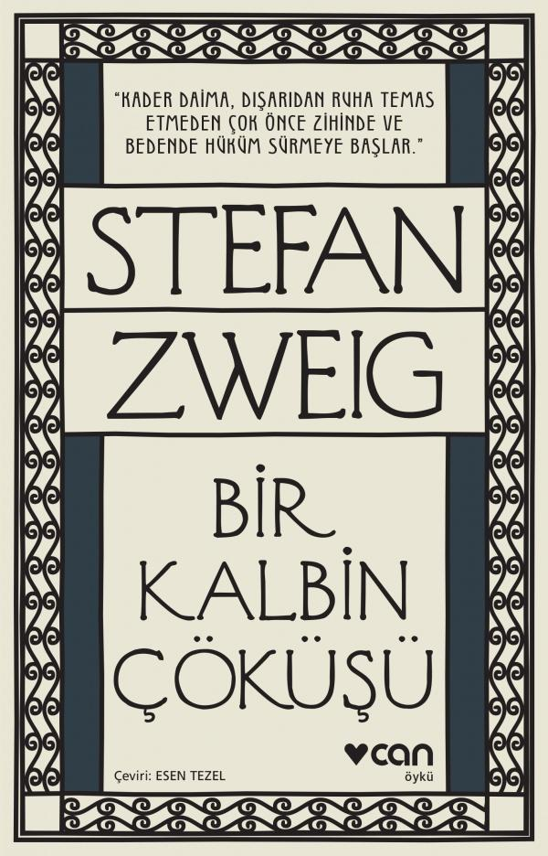

113_bir_kalbin_cokusu.jpg
  
# Bir Kalbin Çöküşü - Stefan Zweig
##  56 Sayfa
### 06.03.2022
  
 

  

    
     

 
 

***Karakterler;***
- ***Salomonsohn:*** Yaşadığı yerde özel ticaret müşaviri olarak tanınıyordu.

 

> ***(Tanıtım Bülteninden - Can Yayınları)***

***Bir Kalbin Çöküşü, Stefan Zweig’ın psikolojiye duyduğu yoğun ilgiyi yansıtan öykülerinden biridir. İnsan ruhunun en karmaşık duygularından biri olan tutkuyu olanca canlılığıyla dile getiren Bir Kalbin Çöküşü, ruh ikizini Lev Tolstoy’un unutulmaz kahramanı İvan İlyiç’te bulduğumuz yaşlı bir adamın, Salomonsohn karakterinin ailesinden ve yaşamdan uzaklaşmasını öyküler.***

***Zweig’ın en beğenilen öyküleri arasında yerini alan Bir Kalbin Çöküşü şüphe, korku ve nefretle ölüme sürüklenen baba Salomonsohn’un psikanalizi olarak  okunabilir. Salomonsohn karakterinin, psikanalize sağladığı malzemeyle Sigmund Freud’un ve Arthur Schnitzler’in ilgisini çektiği biliniyor.***
_____

***Bu kitabı anlatmaya kelimeler yetmez benim için.. Bu kadar muazzam anlatımı ve  betimlemeyi nasıl yapabilirsin be üstad.***

Kitabımız, Salomonsohn ismindeki yaşlı adamın, kızını başka adamın odasına girerken görmesi ve bunun üzerine kendi kendine kafasında birçok şey kurmasıyla başlıyor.. Ne yapsada bu durumu kızına bir türlü söyleyemiyor, ama içten içe kafasında büyüyen düşünceler yaşlı adamı mahvediyor. Ve âdeta günden güne bir kalbin nasıl çöktüğünü bize anlatmaktadır.

Burada asıl önemli olan şeyler kitabın ortasından sonra bizlerin karşısına çıkmaktadır.. Yaşlı adam, günden güne herkes uzaklaşır. Onca yıllarını ne için heba ettiğini fark eder. Sırf başkaları için 65 yılını geçirmiş ve kendi için en ufak bir şey yapmamıştır.. En üzücü kısmı ise, karşısındaki değer verdiği insanlar kızı ve karısı başta olmak üzere hiçbiri adamın ne düşündüğünü ne için bu kadar üzgün olduğunu umursamazlar... 

Artık yaşlı adam tamamen hayattan kopmuş, günden güne hissizleşmiştir.. 

Kitabın bitiş cümlesi böyle olabilir mi gerçekten:   ***`"...kalbi artık onu incitmeyi çoktan bırakmıştı."`***

 

### Kitaptan Alıntılar ;
- ***"Kader daima, dışarıdan ruha temas etmeden çok önce zihinde ve bedende hüküm sürmeye başlar. Kendini idrak etmek kendini savunmaktır; ve çoğu zaman boşunadır." (s.9)***
- ***"Peki ama bütün bunlara neden tahammül ettim?" (s.14)***
- ***"İşte yine yalnızım," diye düşündü. "hep yalnızım!" (s.16)***
- ***"Elli saçma yıl boyunca eşek gibi çalıştım, bir gün olsun kendime izin vermedim ve şimdi yalnızım..." (s.16)***
- ***"Neden gelmiyor? Muhtemelen hâlâ yorgun, rahat bir vicdanla mışıl mışıl uyuyor, benimse burada kalbim parçalanıyor, ah ben budala..." (s.16)***
- ***"Ama rahmetli babam hep söylerdi:   "Zevk-ü sefa bizim gibilere göre değildir, biz sırtımızdaki yükü mezara kadar taşırız..." (s.19)***
- ***"Silah daima fiziksel olarak zayıf insanı kendinden daha emin kılar." (s.24)***
- ***"Masadan kalkarken benden özür dilemediler. Ben onlar için bir köpeğim, üzerine basılacak bir paspasım. Ama haklılar, ben buna tahammül ettiğime göre haklılar." (s.31)***
- ***"Dayanamıyorum dedim sana... Dayanamıyorum, dayanamıyorum. Yalvarırım bana başka bir şey sorma... Ama inan dayanamıyorum... Dayanamıyorum. Bir kez olsun hatırım için bir şey yap, tek bir kez olsun benim için..." (s.33)***
- ***"Ah bu şiddetli, insanı yakan, kıvrandıran ağrı; yüksek sesle bağırmamak için dişlerini sıkmak zorunda kaldı." (s.34)***
- ***"Hiç kimsem yok, köpek gibi gebereceğim." (s.35)***
- ***"İnsan altmış beş yaşında artık iyileşemez... İçimi oyanın, deşenin ne olduğunu biliyorum, ölüm bu ve ömrümün kalan birkaç yılında artık yaşamayacağım, sadece öleceğim, sadece öleceğim..." (s.35)***
- ***"Ama zaten ben ne zaman, ne zaman yaşadım?.. Ne zaman kendim için, sadece kendim için yaşadım?.. Benimkisi hayat mıydı ki: Hep para kazandım, para, para, hep başkaları için, peki şu anda bunun bana ne faydası var?.." (s.35)***
- ***Bir karım oldu, onu genç kızken aldım. Yıllar yılı aynı yastığa baş koyduk... Peki ya şimdi, şimdi nerede o kadın?.. Artık onun yüzünü bile tanıyamıyorum... Benimle bir yabancı gibi konuşuyor ve hayatımı hiç umursamıyor, ne hissettiğim ne acılar çektiğim ne düşündüğüm, bütün bunlar umurunda değil... Yıllardır bana yabancı... Nereye gitti bütün o, bütün o..." (s.35)***
- ***"Sadece kendim için ölmüş olacağım, sadece kendim için.. Çünkü diğerleri için zaten ölüyüm... Tanrım, Tanrım, hiç bu kadar yalnız kalmamıştım." (s.36)***
- ***"Artık biliyorum, sadece onlar için yaşadım da bir teşekkür bile etmediler, hiçbir zaman, bir saatçik olsun kendim için yaşamadım... Ama artık onlardan bana ne... Onlardan bana ne... Beni hiç düşünmeyeni ben niye düşüneyim? Onlardan merhamet göreceğime geberip giderim daha iyi... Onlardan bana ne..." (s.37)***
- ***"Ağrısı yoktu. Ama yine de içinde bir şey küle dönüyor ve çürüyordu, bir şey ölmeye başlamıştı. Yaşadığı her şey, sevdiği her şey bu yavaş yavaş sönen alevde eriyip gidiyor, yanıp küle dönerek kararıyor, sonra da kömürleşip dağılarak vıcık vıcık bir umursamazlık çamurunun içine düşüyordu. Bir şey oluyordu, yaşlı adam bunu belli belirsiz hissediyordu, kendisi uzandığı yerde kendi hayatını çoşkuyla gözden geçirirken bir şey oluyordu. Bir şey bitiyordu. Neydi bu? Yaşlı adam durmadan kendi içine kulak kabartıyordu. Ve yavaş yavaş kalbi çökmeye başladı." (s.37)***
- ***"Gitmekmiş! Hemen gitmekmiş! Üstelik birden canı öyle istedi diye... Burası hoşuna gitmiyorsa bıraksın biz keyfimize bakalım... Onun ruh hali umurumda bile değil, ne söylerse söylesin, ne yaparsa yapsın." (s.41)***
- ***"Yaşlı adam divanda  put gibi oturuyordu. Her kelimeyi duymuştu. Ama ne tuhaftır ki bunlar artık ona acı vermiyordu, hem de hiç. Daha önce küt küt vuran, örselenen o gürültücü saat mekanizması göğsünde sessizce duruyordu, parçalanmış olmalıydı. Kendisinden böyle acı bir dille söz edilmesi içinde hiçbir tepki uyandırmamıştı. Ne öfke, ne nefret... Hiçbir şey... Hiçbir şey..." (s.42)***
- ***"Ve o bir saniye içinde hatırladı: Bugüne dek belki bin kez aynı şekilde numune çantasını yabancı bir kapının önünde yere bırakmış, sonra da yaltaklanan bir tavırla başka siparişlere de hazır olduğunu belirterek arkasını dönüp selam verdikten sonra çıkıp gitmişti. Ama burada artık hiçbirişi kalmamıştı; dolayısıyla selam vermeye gerek görmedi. Kafasını kaldırıp bakmadan, tek kelime etmeden çantasını tekrar eline aldı ve kolu çekerek kendisiyle eski hayatı arasındaki kapıyı tak diye kapattı." (s.44)***
- ***`"İçinde bir yer kilitliydi, oraya ulaşamıyordu, girişe duvar örülmüştü." (s.45)`***
- ***"Şurası açıktı ki artık onun için insanlar yaşamıyordu. Kimseyi sormuyor, kendi evinde karısının endişeli umutsuzluğunu, kızının kafasındaki çaresiz soru işaretlerini fark etmiyordu. Gazete okumuyor, hiçbir konuşmayı dinlemiyordu; hiçbir kelime, hiçbir soru onun  hal ve tavrındaki donuk, kapalı kayıtsızlığı bir an için olsun delip geçmiyordu. En kendine ait dünyasına bile yabancılaşmıştı." (s.46)***
- ***"Sadece köpeği ara sıra içeri giriyor ve bu unutulmuş adamın yatağının önüne uzanıyordu." (s.49)***
- ***"Çoktan ölmüş kalbinde artık hiçbir acı yoktu ama siyah köstebek gövdesini içeriden kemirmeye devam ediyor, kıvranan etini kanatarak parçalıyordu." (s.49)***
- ***"Mezarlığa annesiyle babasının yattığı yere gitti. Yarı çürümüş taşlarla, insanla konuşur gibi uzun süre sesli olarak konuşmuştu.  Yanlarına geleceğini mi haber veriyordu, yoksa  hayırdualarını almak mı istiyordu." (s.50)*** 
- ***"Doktor kontrol etmek için dinlediğinde, kalbi yaşlı adama acı çektirmeye son vermişti." (s.52)***

____

- ***"...kalbi artık onu incitmeyi çoktan bırakmıştı."***
