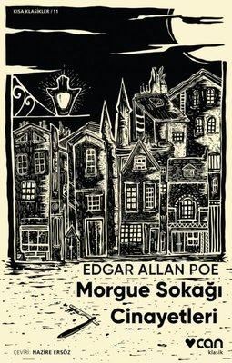

  
# Morgue Sokağı Cinayetleri - Edgar Allan Poe
##  56 Sayfa
### 08.03.2022
  
 

  

    
     

 
 

***Karakterler;***
- ***Kahramanımız:***
- ***C. Auguste Dupin:*** Kahramanımızın arkadaşı.

 

> ***(Tanıtım Bülteninden - Can Yayınları)***

***Öykü ustası Poe modern anlamda korku, gerilim ve polisiye türlerinin de öncüsüdür. Yoklukla, kayıplarla, hastalıklarla, alkolle ve sanrılarla cebelleşmesine rağmen, hem dünya edebiyatı hem de Batı kültürü üzerinde derin bir etki bırakan olağanüstü öyküler ve şiirler yazmıştır. Poe’nun kâh fantastik kâh gotik kâh gizemli öğeler içeren “Morgue Sokağı Cinayetleri” adlı öyküsü yazarın eşsiz üslubunu ve insanın içinde pusuda bekleyen karanlığı keşfedeceğiniz bir klasik.***

***"Sarhoş, yoksul, ezik, dışlanmış Edgar Allan Poe, dingin ve erdemli bir Goethe'den ya da Walter Scott'tan çok daha fazla hoşuma gidiyor. O ve onun gibi özel yapıdaki adamlar için şöyle diyeceğim: 'Bizler adına acı çektiler.'"***

***-Charles Baudelaire-***
_____

 Auguste Dupin çok üstün bir gözlem yeteneğine sahip bir genç.

Çok ilginç bir dedektiflik hikayesi. Polislerin gözünden kaçan onca şeyi, çok ince bir düşünce biçimiyle ele alan Dupin. İşlenen cinayeti çok  güzel bir şekilde gözler önüne seriyor.

Katilin pencereden nasıl kaçtığını ve pencerenin aslında dışarıdan nasıl kapatıldığını ve üstelik tüm bunların gözden kaçma sebebi olarak aslında pencerenin içerden çiviyle kapatıldığını söyleyebiliriz. Ama bu çivi aslında çürümüş. Çivinin başıyla kendisi ayrılmış. Bu sebeple pencere kapandığında aslında bir bütünmüş gibi gözüküyormuş.. (bence güzel bir detaymış..)

İşin en ilginç tarafı ise kitabın sonunda bu cinayeti işleyenin bir orangutan çıkmasıydı.. 

İlginç bir hikaye ortaya çıkmış. 

____

 

### Kitaptan Alıntılar ;
- ***`"Ne kadar çok okuduğunu fark ettikçe şaşkınlığa düşüyordum; ama asıl önemlisi, hayal gücünün azgın coşkusunun, canlı tazeliğinin ruhumu tutuşturuyor olmasıydı." (s.14)`***
- ***"Ona göre, pek çok insanın göğsünde pencereler vardı..." (s.15)***
- ***"Gerçek her zaman bir kuyunun dibinde değildir. Aslında, daha önemli bilgilere bakınca, onun hep yüzeyde olduğuna inanıyorum. Biz onu vadilerin derinliklerinde ararken, o dağların doruklarında durmaktadır." (s.29)***
- ***"Alışılmamış ile anlaşılmazı birbirine karıştırmak gibi büyük ama sık rastlanan bir yanılgıya düştüler. Oysa akıl gerçeği ararken, alışılmış biçimlerin dışına çıkarsa, yolunu bulur. Şu anda yürütmekte olduğumuz türden araştırmalarda, 'Ne olmuş?' sorusundan çok, 'Daha önce hiç görülmemiş bir şey olmuş mu?' sorusu sorulmalıdır." (s.32)***
- ***"Bazen insan hatırlamanın eşiğine gelir ama hatırlayamaz ya, işte ben de anlamanın sınırına gelmiştim ama anlama gücüne sahip değildim." (s.40)***
- ***"Bundan on kat daha tuhaf rastlantılar, hayatımızın her saatinde, hepimizin başına gelir ama dikkatimizi bile çekmez. İnsanoğlunun, yaptığı araştırmalarda parlak sonuçlar elde etmesini sağlayan bir olasılıklar kuramı vardır -rastlantılar, genel olarak, bu kuram hakkında hiçbir şey bilmeyen birtakım düşünürlerin yolundaki en büyük engeldir." (s.41)***
- ***“Gereksiz derinlik, düşünceyi bulandırır, zayıflatır; gözlerimizi ayırmadan bakarsak Çoban Yıldızı bile gökyüzünden silinip görünmez olur.” (30)***