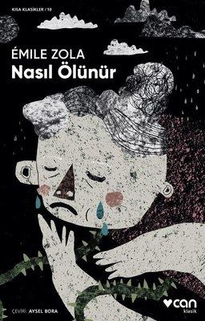

  
# Nasıl Ölünür - Emile Zola
##  48 Sayfa
### 10.03.2022
  
 

  

    
     

 
 

> ***(Tanıtım Bülteninden - Can Yayınları)***

***Ölüm gerçek, ölüm döşeği tabu, cenaze ortak, yas bireysel… Peki ölüm herkesi eşitler mi?***

***Romanlarından tanıdığımız Émile Zola’dan toplumsal ve ekonomik koşulların ölümü nasıl şekillendirdiğini gözler önüne seren çarpıcı beş öykü. Aristokrat, burjuva, esnaf, köylü ve işçi ailelerinin bu süreci nasıl yaşadıklarını olanca sadeliğiyle ve toplumsal çerçeveden kopmadan sergileyen beş tablo.***
_____

 

### Kitaptan Alıntılar ;
- ***"Birbirlerini anlıyorlardı, ayrı ayrı yaşamışlardı ve ayrı ayrı ölmek istiyorlardı." (s.11)***
- ***"İçlerinde, cimriliği ve parası çalınacak korkusuyla, ölmüş anneleri uyanmıştı. Para ölümü zehirlerse, ölümden bir tek öfke çıkar. Tabutların üzerinde insanlar dövüşür." (s.24)***
- ***"Ticaret işi böyledir: Kendinizi tedavi ettirmeye zaman bile bulamadan ölür gidersiniz." (s.26)***
- ***"Artık içim rahat öleceğim... Kırlara gitmeyi hak etmiştim, sana kırları özlemediğimi söyleyemem. Ama sen gideceksin, sen... Seçtiğimiz yere yerleşeceğine dair bana söz ver, biliyorsun, hani şu Melun yakınlarında annenin doğduğu köy... Bu beni çok sevindirirdi." (s.29)***
- ***"Lüzumsuz bulduğu için artık konuşmuyordu." (s.42)***
- ***"Altmış yıl çalışmıştı, madem yer işgal etmekten ve insanları rahatsız etmekten başka bir işe yaradığı yoktu, artık göçüp gidebilirdi." (s.43)***

___

- ***“Ölünün huzurunda bütün kavgalar biter" (s.30)***
- ***"Hava nasıl olursa olsun, hiçbir şekilde fakirlere yaramıyordu."***
- ***"Biraz yorgunum sadece... Tek ihtiyacım dinlenmek..." (s.10)***
- ***"Bu günlük güneşlik bir ölüm, kırların dinginliğinde sonsuz bir uykuydu." (s.47)***
- ***"Geriye kalan ve onları bağışlamasını sağlayan tek şey sevgisiydi." (s.19)***
