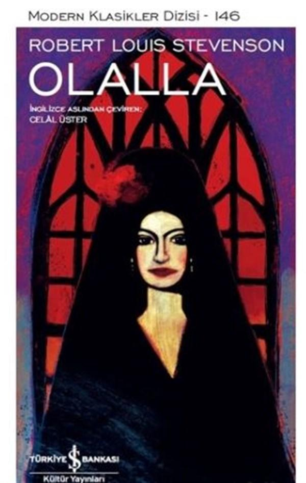

  
# Olalla - Robert Louis Stevenson
##  64 Sayfa
### 16.03.2022
  
 

  

    
     

 
 

***Karakterler;***
- ***Kahramanımız:***
- ***Yaşlı Kadın:*** Kahramanımızın yaşamak için gittiği evdeki yaşlı kadın.
- ***Felipe:*** Yaşlı kadının oğlu.
- ***Padre:*** Yaşlı kadının kızı.

 

> ***(Tanıtım Bülteninden - Türkiye İş Bankası Kültür Yayınları)***

***Stevenson’ın İspanya’nın ücra bir köşesinde, dağlarda geçen bu tüyler ürpertici öyküsü çürümekte olan aristokrasi ve trajik aşk temalarının yanı sıra vampirlik anıştırmalarıyla dikkat çeker. İlk kez 1885 Noel’inde The Court and Society Review’da bir hayalet öyküsü olarak yayımlanan Olalla, tıpkı Dr. Jekyll ile Bay Hyde gibi Stevenson’ın düşlerinden çıkmıştır. Yazar düşünde gördüklerini geleneksel bir anlatıya dönüştürürken çektiği zorlukları bir yazısında bizzat anlatır.***

***Yarımada Savaşı (1808-1814) sırasında İspanyol ordusuyla birlikte savaşırken yaralanan genç bir İskoç subayı hastanede tedavi gördükten sonra hava değişimi için yoksul düşmüş soylu bir ailenin evine pansiyoner olarak yerleştirilir. Orada kendini akla hayale sığmayacak olayların içinde bulacaktır.***

***Olalla, gotik edebiyatın kimi özelliklerini barındırır: Stevenson’ın yaman fırtınaların tozu dumana kattığı kıraç ve dağlık arazilerdeki viran bir konakta geçen öyküde yarattığı kasvetli atmosfer, soyunun günahlarının kefaretini ödemek için dünyadan elini eteğini çeken olağanüstü güzellikte bir genç kız, lanetlenmiş bir soy, sadizm… Yazıldığı tarihten beri görmezden gelinen bu muazzam öykü, Modern Klasikler Dizisi’nde yerini alıyor.***
_____

Kahramanımız  hastadır ve doktoru tarafından uzak diyardaki eski bir konakta yaşayan ailenin yanına gönderilmeyi teklif edilir. Bu konakta yaşayan aile eski soylu bir ailedir fakat yıllar içerisinde fakirleşmiş ve hiçbir şeyleri kalmamıştır.. Kahramanımız gidecek olduğu evdeki ailenin erkek çocuğu olan Felipe ile yolculuğa çıkar ve konağa ulaşırlar..

İlerleyen günlerde ailedeki kimse kahramanımız ile herhangi bir iletişimde bulunmazlar. Sadece Felipe ile konuşur ama Felipe'de çocuk gibidir ve hiçbir bilgisi yoktur.. Evin annesi olan kadın ise, sadece dışarıya çıkıp güneşlenmek ve yatmaktan başka bir şey yapmaz. Bir hafta on günün ardından bu kadın ile kahramanımız yavaş yavaş konuşmaya başlarlar..

Bir gün kahramanımız odasındayken, havanın çok rüzgarlı olduğu bir günde alt kattan dehşet verici çığlıklar yükselmektedir. Kahramanımız gidip kontrol etmek ister ama kapı üzerinden kilitlenmiştir... Ertesi gün kahramanımız evi keşfetmek için dolaşmaya başlar ve evin kızının odasını bulur. Aynı zamanda daha sonrasında bu evin kızı olan Olalla ile karşılaşırlar ve kahramanımız kıza ilk görüşte deli gibi aşık olur.. 

Aradan biraz zaman geçtikten sonra birkaç kez daha kahramanımız ve Olalla karşılaşırlar ama kız herhangi bir şekilde kahramanımız ile konuşmaz.. 

Kahramanımız dışarıya hava almak için çıktığında Olalla, kahramanımızın yanına gelir ve bugün evden ayrılmasını ister.. Bunun karşılığında kahramanımız Olalla'ya olan aşkını itiraf eder ve onu ne kadar sevdiğini anlatır.. Olalla her ne kadar yeniden gitmesini istese de kahramanıza sarılır..

Kahramanımız eve döndükten sonra odasına çıkar ve sinirden cama yumruk attığı için eli kesilir ve şiddetli bir şekilde kanamaya başlar.. Kahramanımız ne yapacağını bilemez ve hemen alt kata inip yaşlı kadından yardım ister. Yaşlı kadın kanlı eli görünce bir anda kahramanımıza saldırır ve onun kanlı elini ısırır. Kahramanımız ne olduğunu anlayamaz acı içerisinde yaşlı kadını kendisinden uzaklaştırmaya çalışır. Sonrasında ise Olalla gelir ve kahramanımızı odasına götürür. Bunun üzerine geçen gece yükselen çığlıklar yaşlı kadın tarafından yeniden tüm evi inletir.. 

Olalla kahramanımızı kendi elleriyle pansuman yapar, saatlerce kahramanımızın başında bekler ve dualar eder.. Olalla, kahramanımıza olan aşkını itiraf eder ama ne olursa olsun onunla birlikte olamayacağını, kahramanımızın oradan kesinlikle ayrılması gerektiğini söyler.. Bunun sebebi ise yıllardan beri gelen atalarının günahlarını kendisinin çekiyor olmasıdır. Her ne kadar çok güzel bir kız olsa da tüm bu güzellik ve kötü şeyler atalarından kendine gen ile bahşedilen lanet bir şeydir. Olalla bu şekilde bahseder ve artık daha fazla bu kukla oyununa dayanamyacağını söyler...

Ertesi gün kahramanımız oradan ayrılır ve bir daha birlikte olamazlar...

____

 

### Kitaptan Alıntılar ;
- ***"İlle de bir şey yapman gerekiyormuş gibi bir duyguya kapılırsın, ama ne yapacağını bilmezsin." (s.21)***
- ***"yerinizde olsam öyle demezdim. Tanrı'yı gücendirmeyin. İnsanın dibi boylamasının sonu yok." (s.27)***
- ***"Ertesi gün onu göremeyince yüreğim sızladı, insanlar sabahı nasıl iple çeker ben de onu görmeyi öyle iple çeker oldum." (s.30)***
- ***`"İnsanın söyleyeceği hiçbir şeyi yoksa konuşmasının da pek yararı yoktur." (s.32)`***
- ***"İnsanlar çok konuşuyorlar, çok fazla konuşuyorlar..." (s.32)***
- ***"Hiç konuşmamıştık, birbirimizi hiç tanımıyorduk; ama yine de, bir devin sımsıkı  yakalaması kadar güçlü bir etki bizi sessizce birbirimize sürüklemişti." (s.34)***
- ***"Onu kaybedemezdim." (s.38)***
- ***"Hiçbir şeyin önemi yok; hiçbir şey istemiyorum, mutluyum, seni seviyorum." (s.41)***
- ***"...ama çok bilenler bilginin kaymağını yerler; yasaları kavrarlar, düşüncenin yüceliğine akıl erdirirler - hayatın gerçeklerinin dehşeti yavaş yavaş belleklerinden silinir gider. Biz kötülüklere aşina olanlar ise galiba unutmuyoruz. İyisi mi git artık, git, ama beni aklından çıkarma. Aklından çıkarma ki, bu bedende yaşadığım gibi, kendi hayatımı yaşadığım gibi, sevgiyle anılarak yaşayayım belleğinde." (s.42)***
- ***`"Kendi kendimizin efendisi olduğumuzu sanıyoruz, oysa bir hiçiz." (s.43)`***
- ***"Aklımın yettiği konularda seninle çok açık konuşabilirim; hiçbir şey bilmediğim konularda ise susmaktan başka bir şey yapamam." (s.47)***
- ***"...günahın mirasçıları; hepimiz bizim olmayan bir geçmişe katlanmak ve kefaretini ödemek zorundayız." (s.52)***
