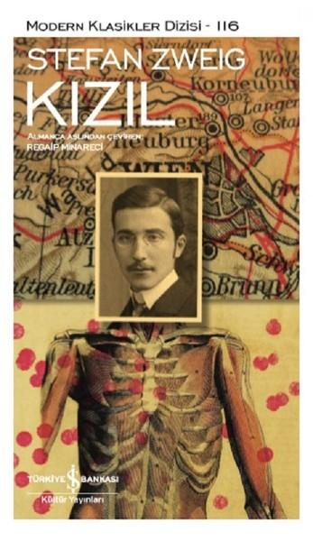

  
# Kızıl - Stefan Zweig
##  72 Sayfa
### 23.03.2022
  
 

  

    
     

 
 

***Karakterler;***
- ***Bertold Berger:*** Kahramanımız, tıp fakültesi öğrencisi.
- ***Avukat Schramek:*** Komşu, avukat | Berger'in tek dostu.
- ***Karla:*** Schramek'in sevgilisi.

***Yer:*** 
- Viyana
- Josefstadt

 

> ***(Tanıtım Bülteninden - Türkiye İş Bankası Kültür Yayınları)***

***Zweig gençlik dönemi yapıtlarından Kızıl’da öğrenim için Viyana’ya giden genç bir tıp öğrencisinin büyük kentin gerçekliğine uyum sağlama ve yetişkinliğe adım atma sürecini anlatır. Kendini birdenbire ailesinden uzakta soğuk bir odada yapyalnız bulan bu “çocuksu” genç adam, zamanla girdiği bunalımın etkisiyle hayallerinden, başlangıçta büyük bir hevesle sarıldığı tıp eğitiminden vazgeçme noktasına gelmiştir. Tam da o günlerde kızıla yakalanan ve yardımına ihtiyaç duyan bir kız çocuğu onu hayata geri çağırır… 1908 yılına ait bu anlatı, Zweig’ın daha o zamanlar çoktan bir novella üstadı olup çıktığının kanıtıdır adeta. Üstelik, yazarın sonraki yapıtlarında sıklıkla karşılaştığımız bir temanın peşine henüz kariyerinin başındayken düştüğünü; gaddar bir dünyada varoluşunu sürdüremeyecek kadar kırılgan insanların acılarını baştan beri dert edindiğini ortaya koyar.***

_____

Kahramanımız Bertold Berger, Viyanaya tıp öğrenimi için gelmiştir. Berger ailesinden ayrılmanın hüznünü ve yalnızlığını derin bir şekilde hissetmektedir. Berger ilk olarak komşusu Schramek ile tanışmıştır. Berger, arkadaşına çok fazla özenmekte ve onun gibi olmak istemektedir. Berger kendisi çok çelimsiz, zayıf, güçsüz ve aynı zamanda çocuk gibi biridir.

Berger, uzun bir süre tek başına herkesten uzak yaşamaktadır. Çünkü herkes onunla alay etmekte ve dalga geçmektedir. Aynı zamanda Berger, özgüvensiz ve çok utangaçtır. Arkadaşı Schramek bile onu tam olarak dikkate almamakla birlikte, kendisine çocuk diye hitap etmektedir. Her ne kadar Berger, arkadaşının kendisine böyle seslenmesine sinir olsa da Viyanadaki tek dostu ve sevdiği insan Schramek'tir..

Berger, bir gün Schramek'in sevgilisi Karla ile tanışır. Her ikisi de Berger ile dalga geçerler. Aradan biraz zaman geçtikten sonra başka bir gün Berger ve Karla başbaşa kalırlar. Her ne kadar Berger utangaç olsa da aslında ilk başta bir şey yapmaz ama Karla Bergen'in üzerine gider onu kışkırtır ve onunla alay eder.. En sonunda Berger Karla'ya saldırır, fakat bu saldıraları çok zayıf kalır ve Karla kolay bir şekilde Berger'in kollarından tutup onu durdurabilir ve Berger bu güçlü kadının ellerinden kurtulamaz. Bunun devamında ise Berger ile Karla arasında boğuşma yaşanır. Berger, Karla'ya saldırmak isterken ona sarılmayla karışık kadını yere düşürmeye çalışır bu esnada fazlasıyla yakınlaşan bu ikili, Karla'dan yayılan güzel kokular Berger'i alt üst eder ve Berger çok büyük bir haz duymaya başlar.. Tüm bunların ardından Berger odayı terk eder ve uzun bir süre bunların yanına gelmez..

Aradan yine 10 gün kadar geçtikten sonra Schramek, hiçbir şeyden habersiz sınavını başarıyla tamamlamış ve artık mezun olmuştur. Bu mutlu haberi vermek için Berger'in odasına gelir ve kutlama yapacaklarını söyler. Schramek, Berger'i zorla tutup götürür... Orada yine Karla da vardır. Berger ile Karla yanyana oturmaktadır. Berger hiçbir şey yapmıyorken, Karla, Berger'in yakınına kadar girer, elini tutar ve Berger'in elini kendi bacağına koyar. Bir süre o şekilde kaldıktan sonra en sonunda Berger orayı terk eder..

Artık Berger tek dostu olan arkadaşını da kaybetmiştir. Çünkü ona ihanet etmemek için bir daha onlarla bir araya gelmezler.. Aynı zamanda Berger uzun zamandır okuluna gitmiyor ve üniversitesini bırakmıştır. Berger'in artık yaşama ümidi gibi bir şeyi kalmamıştır... Bir gün geç saatte eve gelirken anahtarı olmadığı için ev sahibine kapıyı açtırır.. Kadının hali çok kötüdür ve günlerdir uykusuz olduğu belli olmaktadır. Kadına ne olduğunu sorar ve kadın da kızının hasta olduğunu söyler. Bunun üzerine Berger'in içerisinde insanlara yardım etme isteği uyanır ve doktorluk iç güdüsü büyük bir şevkle kabarır... Günlerce kızın başında bekler ve nitekim 13 yaşındaki kızı iyileştirir. Aynı zamanda bu kıza aşık olur... 

Artık Berger'in hayata bağlanma isteği ve arzusu yeniden gelmiştir ve okuluna da devam etmek ister.. Ama hesapta olmayan bir şey vardır... Berger kızıl hastalığına yakalanmıştır.. Ve maalesef 2-3 günün içerisinde ölür..

> ***- SON -***

____

***"Çünkü buradaki yaşamımda her şey farklı, düşünemeyeceğin kadar farklı, umutlarımdan da farklı. Sana bunları yazmak canımı acıtıyor, ama burada kimsem kalmadı.   Günlerdir kimseyle konuşmuyorum. Bazen sokakta insanların peşine takılıyorum, sözcüklerin tınısını duyabilmek için konuşmalarını dinliyorum. Hiçbir şey anlamıyorum, bilmiyorum, yapmıyorum, işe yaramamaktan tükeniyorum.   Günlerce hiçbir şey yaşamıyorum, tanıdık bir yüz görmüyorum; binlerce insanın arasında yapayalnız olmanın ne anlama geldiğini bilemezsin." (s.44)***

____

***`"Artık okumuyorum, haftalardır hiçbir derse girmedim, kitaplarım toz içinde öylece duruyor. Nedenini bilmiyorum, ama artık ders çalışamıyorum, hissizleştim, buradaki hiçbir meslek beni çekmiyor, çünkü bu korkunç ve boğucu yalnızlık duygusundan kimse beni çekip çıkarmıyor. Burada hiçbir şey istemiyorum artık, her şeyden tiksiniyorum. Bastığım her taştan nefret ediyorum, odamdan, karşılaştığım insanlardan nefret ediyorum, şiddetli soğuğun nemiyle yüklü kirli havayı soğurken işkence çekiyorum. Buradaki her şeyden boğuluyorum, tükeniyorum. Bataklığa gömülür gibi batıyorum. Belki çok gencim, çok güçsüz olduğum kesin zaten. Yumruklarım yok, iradem yok, işleri başlarından aşkın insanların arasında bir çocuk gibi duruyorum." (s.45)`***

_____

 

### Kitaptan Alıntılar ;
- ***"Ehh... zamanla olacaktır. Sigara kullanmayanların nesli tükenmek üzere." (s.8)***
- ***"Sonraki günlerde de değişen hiçbir şey olmadı: Hüzünle sevinç, umutla düş kırıklığı sürekli iç içeydi; belirsiz bir duygu, ama daima  yabancı olmak ve alışamamak."(s.11)***
- ***"Kentte uzun bir süre dolanıp durmuş, insanlarla dolup taşan caddelerde yine yapayalnızlığının acısını duymuştu." (s.14)***
- ***"Herkes birbirini tanıyordu, aralarında birlik vardı. Kitaplar yalan söylememişti. Burası, onlara ulaşamadığı için çoğu zaman kuşkuyla yaklaştığı bütün o maceraların gerçek olduğu yerdi." (s.19)***
- ***"Onu kenarda tutan çekingenliği değildi yalnızca. Yoksullukta elini kolunu bağlıyordu." (s.19)***
- ***"Kaçmak, buradan binlerce, on binlerce mil öteye kaçmak istiyorum." (s.31)***
- ***"Hadi bir şeyler anlat bana. Doğru düzgün ya da aptalca bir şeyler. Sizler gün boyu kitap okuyorsunuz, bildiklerin vardır elbette." (s.32)***
- ***"O günleri yapayalnız geçirdi. Yanına kimse gelmedi, o da kimsenin onu istemediği, sevmediği ve ona ihtiyaç duymadığı gibi alçaltıcı duyguları gitgide daha şiddetli duyumsadı." (s.38)***
- ***"Ona ihanet etmek istemiyorsa, artık görüşmemeliydi." (s.43)***
- ***"Son zamanlarda burada nelere katlandığımı kimse öğrenemeyecek, kimse beni benden daha fazla hor göremez. Kendimi perişan hissediyorum,  hasta gibiyim, sakat gibiyim, çünkü herkesten çok farklıyım, gitgide daha kötü, daha değersiz, daha gereksiz olduğumu gözyaşları içinde hissediyorum, ben..." (s.46)***
- ***"Eğer biri acı çekecekse, bu kişi yalnızca kendi olmalıydı." (s.47)***
- ***"Tuhaftı, böylece oturmaktan ve zamanın akıp gittiğini görmekten başka arzuladığı bir şey yoktu." (s.49)***
- ***"Bir anda yüreğine oturdu, aylardır hemen yanında, aralarındaki duvarın ardında hiç görmediği insanlar yaşıyor, yanı başında ağır yazgılar vuku buluyor ve onun bunalardan haberi olmuyordu. Ölüm bitişikte bir kız çocuğunu pençesine almaya çalışırken, o hayvan gibi uyumuştu ve bu durumda nasıl olur da başkalarından güven bekleyebilirdi?" (s.50)***
- ***"Geç kaldığı için kendini sürekli suçluyordu. Bu kızın ve annesinin yanından neden bir yabancı gibi geçip gitmiş, yanı başında yaşayan bu iki insanı neden düşünmemişti? Bu dudaklar ona neden hiç gülümsememiş, gözkapaklarının ardında kapalı duran bu gözler neden şimdiki gibi yabancı kalmıştı? Bu küçücük çocuk göğsünün altında usulca atan bu yüreğin içinde olup bitenlerden neden haberi olmamıştı?" (s.53)***
- ***"Bundan sonraki yaşamının istikametini o an açıkça gördü: Faal ve yararlı olmalıydı, o zaman insanlar onu fark eder, o da bir daha hiç yalnız kalmazdı." (s.55)***
- ***"Incipit vita nuova."   "Yeni bir yaşam başladı." (s.62)***
- ***"Değiştirilemez bir durum olduğuna göre hiçbir şey yapmamalı, bağırmamalı ya da ağlamamalıydı, umutlanmamalı, hiçbir beklentiye girmemeliydi." (s.63)***
- ***"Ama ölmek - içinde pek çok şey buna başkaldırıyordu. Üç hafta önce kimsenin onu dinlemediği, onunla konuşmadığı günlerde nasıl gönüllü giderdi, sahneden sessizce ve dikkat çekmeden nasıl seve seve inerdi! Ama şimdi? Yaşam onunla neden böyle oynuyordu? Vedayı zorlaştırmak için mi ona son saatinde cazip bir şey sunmuştu? Neden tam da şimdiydi? İnsanlarla yeniden bağ kurduğu, kimilerinin acı çekeceği, belki de ondan çok acı çekeceği bir zamanda, neden?" (s.63)***
- ***"Her şey birbirine karışmıştı. Yaşadıklarının bir düş olduğunu hissetti yalnızca; mutluluk ya da mutsuzluk, insanlar ya da yalnızlık, geçmiş ya da gelecek bir düştü. Arzuladığı hiçbir şey yoktu artık. Böyle bir anda suskunlaşmak - ölmek bu herhalde, diye acıyla düşündü." (s.63)***

____

- ***"Kadınlar bütün sırların bekçisiydi ; cezbeden, vaat eden, arzulayan ve aynı zamanda arzulanan onlardı." (s.25)***
- ***"Nedenini bilmiyorum, ama artık hissizleştim."***
- ***"...yaşamın gerektirdiği gibi güçlü ve acımasız olmayı bilmiyordu."***
