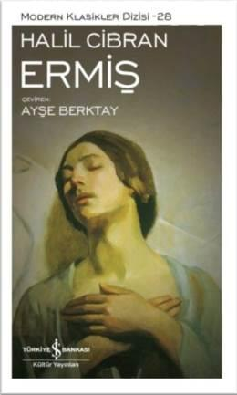

  
# Ermiş - Halil Cibran
##  55 Sayfa
### 30.03.2022
  
 

  

    
     

 
 

> ***(Tanıtım Bülteninden - Türkiye İş Bankası Kültür Yayınları | 17. Basım)***

***"İnsan için tüm amaçlarını susuzluktan çatlamış dudaklara ve tüm yaşamı bir çeşmeye dönüştüren bir armağandan daha büyüğü yoktur kuşkusuz. Benim şerefim ve ödülüm işte bu armağanda yatıyor. Ne zaman içmek için çeşmeye gelsem, diri suyun kendisini susamış bulmamda..." Yıllar boyu kendisine yurt olan kentten ayrılırken, Ermiş'ten geride bıraktığı halka hitap etmesi istenir. Kent halkı ona aşk, evlilik, suç, ölüm, güzellik ve daha pek çok konuda sorular yöneltir. Aldıkları karşılık, hoşgörü ve sevginin biçimlendirdiği bir insan yaşamı üzerine hazine değerindeki öğütlerdir. Haklıyla haksızın, suçluyla suçsuzun, dimdik ayakta duranla düşmüşün aslında aynı insan olduğu bir yaşamdır bu...***
_____

 

### Kitaptan Alıntılar ;
- ***"Aşk sizi çağırdığı zaman, onu izleyin... Yolları zorlu ve dik olsa da." (s.6)***
- ***"Onlar sizin sayenizde gelir ama sizden değildir. Sizinle birlikte olsalar da size ait değildir. Onlara sevginizi verebilirsiniz ama düşüncelerinizi değil..." (s.9)***
- ***`"Kederli olduğunuz zaman yine yüreğinize bakın göreceksiniz, aslında, bir zamanlar neşe kaynağınız olan için ağlamaktasınız." (s.16)`***
- ***"...bu evlerde neyiniz var? Kilitli kapılarla koruduğunuz nedir?" (s.18)***
- ***"Giyimde edep, ahlaksız olanın gözlerinden korunmak için bir kalkandır, unutmayın." (s.19)***
- ***"Haklıyı haksızdan ve iyiyi kötüden ayıramazsınız..." (s.23)***
- ***"Yasa koymaktan haz alıyorsunuz. Ama onları çiğnemekten aldığınız haz daha fazla. Okyanus kıyısında oynayan, durmaksızın kumdan kuleler yapıp, sonra da kahkahalar atarak onları yıkan çocuklar gibi." (s.24)***
- ***"Ruhunuz çoğu zaman bir savaş alanıdır, burada aklınız ve yargılama gücünüz, tutkunuz ve iştahınıza karşı savaşır." (s.27)***
- ***"Çünkü tek başına hükmeden akıl, kısıtlayıcı bir güçtür; başıboş bırakılmış tutku ise, kendisini yok edene kadar yanan alevdir." (s.28)***
- ***"Yürekleriniz sessizce bilir günlerin ve gecelerin gizlerini. Fakat yüreğinizdeki bilginin sesine susamıştır kulaklarınız." (s.30)***
- ***"Dostunuz ihtiyaç duyduğunuzda yanınızda olandır." (s.31)***
- ***`"Bilir ki, dün, bugünün anısından ve yarın, bugünün düşünden başka bir şey değildir." (s.34)`***
- ***`"Sıkıntıya ve dara düşünce dua ediyorsunuz; keşke sevinciniz doruklarda olduğunda ve bolluk günlerinizde de dua etseniz." (s.36)`***
- ***"Çoğu kez kendinizi hazdan mahrum etmeniz arzuya varlığınızın kuytularında biriktirmekten başka bir şeye yaramaz. Bugün ihmal edilmiş gibi görünenin yarını beklemediğini kim bilebilir?" (s.39)***
- ***"Nerede arayıp, nasıl bulacaksın güzelliği; güzellik bizzat yolunuz ve rehberiniz değilse? Ve güzellikten nasıl söz edeceksiniz, sözlerinizi dokuyan o değilse?" (s.40)***
- ***"İhtiyaçları değişir insanın, fakat sevgisi ve sevgisinin ihtiyaçlarının karşılandığını görme arzusu değişmez." (s.46)***
- ***"Her şeyin başlangıcı muğlak  ve bulanıktır, ama sonu öyle değildir." (s.51)***

_____

- ***''... pek çok kez parmağımla kendi yaramı deştim, size daha fazla inanmak ve sizi daha fazla tanımak için.'' (s.51)***
- ***"Malınızdan mülkünüzden verdiğinizde pek fazla bir şey vermiş sayılmazsınız. Gerçekten vermek kendinden vermektir.  
Çünkü mal mülk, bir gün gerekeceği endişesiyle alıkoyup sakladığınız şeylerden başka nedir?"***
- ***"Hakikati buldum" değil, "Bir hakikat buldum" deyin. "Ruhun yolunu buldum." demeyin. "Kendi yolumda yürürken ruhla karşılaştım." deyin. (s.30)***
- ***Pişmanlık, davet edilmeden, bir gece vakti çıkar gelir...***
- ***"Sevgi olmadan boşunadır tüm emekler..."***
- ***"Ruhunuz çoğu zaman bir savaş alanıdır." (s.27)***
