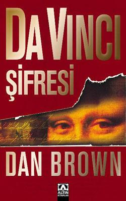

  
# Da Vinci Şifresi - Dan Brown 
##  495 Sayfa
### 12.08.2022
  
 

  

    
     

 
 

***Karakterler;***
- ***Robert Langdon:*** Dedektifimiz, baş karakterimiz.
- ***Bayan Ajan Sophie Neveu:*** Polis, kriptoloji alanında. 
- ***Jacques Sauniere:*** Öldürülen müze müdürü, Sophie Neveu'nun büyükbabası.
- ***Silas:*** Katil.
- ***Piskopos Aringarosa:*** Silas'ı yanına alan ve onunla birlikte uzun süre yaşayan.
- ***Fache:*** Soruşturmayı yöneten yüzbaşı.
- ***Vernet:*** Banka müdürü.
- ***Leigh Teabing:*** Langdon'un eski bir arkadaşı.
- ***Remy:*** Teabing'in hizmetçisi.

___

### Kitaptan Önemli Olabilecek Başlıklar

- Da Vinci - Fibonacci Sayıları - Beş Köşeli Yıldız - Pi sayısı  
- Vitruvius Adamı - Leonarda Da Vinci'nin en ünlü eskizinin  gerçek boyutlu  bir kopyasını yapmıştı.
- Kripteks
- `"Clef de voute - Kilit taşı" Sait Sulpice Kilisesi'nde saklanıyordu.` 
- Musee du Louvre -- 65.300 sanat eseri,5 günde görebilirsin -- etrafı 5 kilometre. -- Mona Lisa, Milo Venüs, Zafer tanrıçası Nike eserleri burada. 

---

 

> ***(Tanıtım Bülteninden - Altın Kitaplar )***

***Da Vinci Şifresi satışa çıktığı ilk haftanın sonunda büyük bir başarı kazandı. New York Times'ın 'en çok satanlar' listesine "1 Numara"dan girdi. Aynı zamanda Wall Street Journal, Publishers Weekly ve San Francisco Chronicle'ın 'en çok satanlar' listesinde ilk sıradaki yerini uzun süre korudu. Colombia Pictures kitabın film haklarını satın aldı.*** 

***Harvard Üniversitesi Simge-Bilim Profesörü Robert Langdon, Paris'te iş gezisindeyken, gece yarısı, Louvre'un yaşlı müdürünün ölü bulunduğu haberini alır. Langdon ve yetenekli Fransız kriptoloji uzmanı Sophie Neveu, cesedin etrafındaki izleri takip ederek bu garip esrar perdesini araladıkça, ipuçlarının onları Da Vinci'nin tablosuna götürdüğünü keşfederler. Büyük usta bu sırrı herkesin görebileceği bir yere, ünlü eseri Mona Lisa tablosunun içine gizlemiştir.  
Langdon bu garip bağlantıyı açığa çıkarınca tehlike artar. Cinayete kurban giden müze müdürü de, Sir Isaac Newton, Botticelli, Victor Hugo, Da Vinci ve aralarında diğer ünlülerin de bulunduğu gizli bir kuruluş olan Sion Manastırı Derneği'nin bir üyesidir.  
Langdon, aydınlatmaya çalıştıkları bu tehlikeli sırrın yüz yıllardır tarihin derinliklerinde gizlendiğinden şüphelenir. Böylece Paris ve Londra sokaklarında amansız bir kovalamaca başlar. Langdon ve Neveu, kendilerini, atacakları her adımı önceden bilen esrarengiz olduğu kadar da çok zeki olan bir adamla karşı karşıya bulurlar. Eğer bu karmaşık bilmeceyi çözemezlerse Priory'nin büyük yankılar uyandıracak bu çok eski gerçeği ebediyen kaybolacaktır.***
_____

> Bölüm 0 | s.11

Bir tane adam, katil, Müze'nin müdürü olan Jacques Sauniere'i yakalamış ve onu köşeye sıkıştırmıştı. Katil, müze müdüründen sırrın ne olduğunu ve nerede olduğunu öğrenmek istedi. Ama müze müdürü yıllardır tekrarladığı o şeyi söyledi nitekim bunun kendisini kurtaracağı bir yalan olduğunu düşünüyordu. Nitekim müdür aklından geçenleri söyledi. Katil ise diğer üçü gibi sende aynı şeyleri söyledin ve bu sırrı artık tek bilen ben kalacağım diyip, yalan söylediğini anlamıştı. Bunun ardından katil müdürü silahla vurdu. Müdür 15 dakika sonunda can çekişerek ölecekti. Müdür, bu sırrın kendisiyle birlikte gideceğinden korkuyor ve bir şekilde bu sırrı birisine aktarması gerekiyordu. O yüzden şöyle düşündü:

***Büyük Galeri'de kısılıp kalmıştı ve yeryüzünde meşaleyi devredebileceği tek bir kişi vardı. Sauniere zengin hapishanesinin duvarlarına göz gezdirdi. Dünyanın en ünlü tablolarından oluşan koleksiyon, ona eski bir dost gibi gülümsüyordu. Yüzünü acıyla buruşturarak, tüm gücünü topladı. Önündeki vahim görevin, geriye kalan hayatının tüm saniyelerini alacağını biliyordu. (s.14)***

_____ 

> ***[Bölüm 1 , Bölüm 9] - s.[11, 65]***

Silas ismindeki adamın katil olduğunu biliyoruz. Bu adam emir aldığı kişiyle konuştu ve Müze müdürüyle birlikte diğer üç senechaux'u öldürdüğünü söyledi. Hepsinin kendisine söylediği son sözler aynıydı. Bu sözleri emir aldığı kişiye söyledi. Aynı zamanda peşinde oldukları `"Clef de voute - Kilit taşı" Sait Sulpice Kilisesi'nde saklanıyordu.` Bunlarda bunun peşindeydi..

Robert Langdon, kahramanımız ve müfettişimiz... Fransa'da uyuduğu otelde gece yarısı uyandırıldı. Bir ajanın geldiğini ve kendisiyle konuşmak istediğini öğrendi. Ajan, Langdon'a Sauniere'nin öldürüldüğü haberini verdi. Aynı zamanda cesedinin fotoğrafını gösterdi ve Langdon çok büyük şaşkınlık içerisindeydi. Ajan, Langdon'u olay yerine götürmek için otelden ayrıldılar.

Olay yerine vardıklarında yani "Musee de Louvre"ye... Kendilerini operasyonu yöneten Yüzbaşı Fache karşıladı. Langdon yüzbaşı ile bir araya geldi ve detayları konuştular. Yüzbaşı Langdon'a bir takım sorular sordu ve ardından cesedin olduğu yere geldiler.

Langdon cesedi gözleriyle gördüğü zaman, fotoğraf görmenin yanı sıra çok daha fazla şaşırmıştı... Cesedin pozisyou ve üzerine ölmeden önce kendi kanıyla çizdiği şey ***"Beş Köşeli Tılsım Yıldızı"*** ydı. Bunun ne anlama geldiğini yüzbaşı ve Langdon uzun uzun konuştular. Aynı zamanda cesedin elinde bir tane daha kalem vardı. Bu kalem ise görünmez yazı yazan sadece üzerine siyah ışık tutunca görülebilen bir kalemdi. Işıkları kapatıp ölmeden önce onunla neler yazdığını gördüklerinde bir kez daha şaşırdılar. Bunlar şu şekildeydi:   
***13-3-2-21-1-1-8-5***  
***On Draco devini al!***  
***On sahte alim! (s.54)***

Bunun üzerine biraz daha geri çıktığınızda müze müdürü aynı kalemle bir daire çizmiş ve kendisini çıplak bir şekilde tam olarak o dairenin ortasına yerleştirmişti... Bunun anlamı ise `Vitruvius Adamı - Leonarda Da Vinci'nin en ünlü eskizinin  gerçek boyutlu  bir kopyasını yapmıştı.` Tüm bunlar çözülmesi güç birer şifreydi...

Kısa bir süre sonra Kriptoloji uzmanı olan Bayan Ajan Neveu olay yerine geldi. Her ne kadar yüzbaşı rahatsız edilmek istemediğini söylese de, Bayan Neveu oraya gelmişti bile. Aynı zamanda Langdon yüzbaşının neden bu kadını sevmediğini anlayamamıştı... Bayan Neveu, Langdon'a birleşik devletlerinden kendisine bir mesaj olduğunu söylemiş ve notlar yazılmış olan kağıdı Langdon'a verip aramasını söylemiştir. Bunun üzerine Langdon yüzbaşının telefonundan bu aramayı gerçekleştirmiş, kısa bir süre sonra telesekretere bağlanmıştır. Telesekreter'in sesi Bayan Neveu'nun sesi olunca, Langdon Bayan Neveu'a dönüp bir yanlışlık olduğunu söylemiş. Bayan Neveu ise Langdon'a kağıtta yazanları yapmasını ve hiçbir yanlışlık olmadığını dile getirmiştir. 

Langdon, kağıttaki şifre gibi numarayı tuşlayınca Bayan Neveu'nun sesi tekrardan bir şeyler söylemeye başlamıştır... Bayan Neveu'un mesajı: ***`Mesaj, korkak bir fısıltıyla, "Bay Langdon," diye başlıyordu. "Bu mesaja tepki vermeyin. Sakince dinleyin. Şu anda tehlikedesiniz. Verdiğim talimatlara harfiyen uyun." (s.65)`***

____

> ***Bölüm 10 | s.66***

Silas, doğduğunda beyaz bir albino olarak doğdu ve babası hiçbir zaman onu sevmemişti.. Babası her zaman annesiyle kavga ediyordu, Silas ne zaman araya girmeye çalışsa hep babası tarafından canı yakılarak bir köşeye atılıyordu.. Bir gün yine annesi ve babası kavga ederken, annesi yere düştü ve bir daha kalkamadı. Bunun üzerine Silas, sarhoş şekilde yatan babasının yanına gitti ve onu defalarca bıçakladı. 

Bunun üzerine Silas orayı terk etti. Hayatı sokaklarda, çöplerde ve insanlar tarafından alay edilerek, dışlanarak geçti.. Nitekim işlediği suçlar yüzünden on yıl boyunca bir hapishanede kaldı. Bir gün şiddetli bir deprem oldu ve o sayede oradan kaçmayı başardı. 

Günlerce aç susuz bir şekilde geçti ve en sonunda bilincini kaybetti. İspanya'da bir tane kilise kurmak üzere gönderilen bir rahip tarafından gönderilmişti. İlerleyen günlerde aynı şekilde hırsızlardan Rahib'i kurtardı.. Çocukluğundan hatırladığı bir ismi yoktu. O yüzden rahip kendisine Silas ismini verdi.

____

> ***[Bölüm 11 , Bölüm 12] - s.[67, 80]***

Bayan Neveu ve yüzbaşı konuşuyor, Langdon ise telefondaki mesajı dinliyordu. Bayan Neveu, bu şifrenin çözüldüğünü ve bir şakadan ibaret olduğunu yüzbaşıya söyledi. Yüzbaşı bunu duyunca sinir küpüne dönmüştü. O sayıların küçükten büyüğe sıralanışı fibonacci sayı dizesinin başıydı... Bayan Neveu, aynı şekilde açıkladı. Sonrasında yüzbaşı Bayan Neveu'u tersledi ve Bayan Neveu oradan ayrıldı. 

Aynı zamanda, Langdon telefon görüşmesini bitirmiş. Amerika'dan yakın bir arkadaşının ölüm haberini aldığını ertesi sabah erkenden dönmesi gerektiğini söylemişti. Bunun üzerine lavaboya gitmek için yüzbaşıdan izin istedi... Langdon, koridorun solundaki lavaboya gitti. Yüzbaşı ise müdürün odasında işleri olduğunu söyleyerek oradan ayrıldı.

Langdon, tuvalete geldiğinde Bayan Neveu onu bekliyordu. Bayan Neveu olanları Langdon'a şu anlattı: Langdon'u göz altına aldıklarını ve cinayetin baş şüphelisi olduğunu söyledi. Ama Langdon'un bundan haberi yoktu, burada sistem böyle işliyordu. Aslında Langdon'u sorguluyorlar, kendisini ele verip vermeyeceğini görmek istiyorlardı. Bunun kanıtı da Langdon'un sol cebinden şimdiye kadar farketmediği bir GPS takip cihazının çıkmasıydı. Langdon niye şüpheli olduğunu sorduğundaysa Bayan Neveu şöyle cevap verdi: Size Müdürün görünmez kalem ile yazdığı mesajın tamamı gösterilmedi ve son satırı silinmişti. Mesajın tam hali şu şekildeydi:   
***13-3-2-21-1-1-8-5***  
***On Draco devini al!***  
***On sahte alim!***  
***P.S Robert Langdon'ı bul. (s.80)***

_____

> ***Bölüm 13 | s.81***

Bayan Neveu, Langdon'un şüpheli duruma düşmesinin sebebi aslında bir bakıma kendisi olduğunu söyledi. Ölen Jacques o mesajı Bayan Neveu'ya ulaşmak için bıraktı. Aslında o sayıların bir anlamı yoktu. Sadece işin içine kriptoloji bölümü girmesi için yazmıştı ve nitekim de öyle olmuştu. ***`P.S Robert Langdon'u bul`*** mesajındaki P.S kendi isminin kısaltmasıydı (Prenses Sophie). Ve üstelik `Vitruvius Adamı Eseri` Bayan Neveu'un en sevdiği eserdi. Bu da kendisi için bir mesajdı. Bayan Neveu, Jacques'i en son 10 yıl önce görmüştü. Jacques, Bayan Neveu'un büyük babasıydı.

_____

> ***[Bölüm 14 , Bölüm 16] - s.[82, 93]***

Kriptoloji müdüründen yüzbaşıya arama gelmişti. Bu arama Bayan Neveu hakkındaydı. Bir şeylerin ters gittiği ortadaydı.

Bayan Neveu ve Langdon konuşmaya devam ediyorlardı. Bundan on yıl önce Bayan Neveu, büyük babasını bir şey yaparken görmüş ve bu manzara karşısında dehşete düşmüştür. Bayan Neveu bunun ardından orayı terk etmiş ve büyük babasının kendisini aramasını, aynı zamanda görüşmelerini yasaklamıştır. Büyük babası sözünü tutmuş ama hiçbir zaman vazgeçmemiştir. Onca yıllar boyunca aramamış ama bir çekmece dolusu mektup birikmiştir... Ta ki bu gecenin akşamına kadar. Büyük babası ona bir sesli mesaj bırakmıştır.. Yıllardır açıklaması gereken bir şey olduğunu ve artık zamanı geldiğini söylemiştir.  Aynı zamanda ikisinin de tehlikede olduğunu bu gece kendisini müzeden araması gerektiğini söylemiştir. Ama Bayan Neveu bunları umursamamıştır. Akşamında ise büyük babası öldürülmüştür... Büyük babası her ne söylemeye çalışıyorsa Bayan Neveu ve Langdon'u bir araya getirmiştir. Bayan Neveu'un şifreyi çözmesi için Langdon'a ihtiyacı vardır. Yüzbaşı ise bugün Langdon'u tutuklamaya kararlıdır. Bu yüzden Bayan Neveu, Langdon'u ABD elçiliğine gitmeleri gerektiğini orada kendisine bir şey yapamayacaklarını söylemiştir. Bu yüzden Bayan Neveu ve Langdon müzeden kaçmaya karar vermişlerdir.

___

> ***[Bölüm 17, Bölüm 21] - s.[94, 112]***

Yüzbaşı ve diğer polisler, Bayan Neveu ve Langdon'u arıyorlardı. Yüzbaşı koşar adımlarla tuvalete doğru yola çıkmıştı.. Bayan Neveu, çok harika bir çözüm üretmişti. Takip cihazını aldı ve lavabodaki kalıp sabunun içine yerleştirdi. Tam o sırada ise aşağıdan kamyon geçiyor ve kırmızı ışıkta bekliyordu. Gece vakti, çok yüksek bir mesafeden büyük bir kasaya bir şey atmak zor olamazdı herhalde. Bayan Neveu bunu başarmıştı. Yüzbaşı tuvalate gelip camdan baktığında sinyalin ilerleyen kamyonetten geldiğini fark etmişti. Hemen yüzbaşı dahil tüm polisler kamyonu yakalamak için harekete geçmişlerdi. Ama nitekim aslında yüzbaşı Bayan Neveu ve Langdon'un önünden geçmişti. Fakat bizimkiler karanlığa saklandığı için, yüzbaşı tarafından fark edilmediler.

Bayan Neveu ve Langdon Müzeden ayrılmak için ilerlerken, konuşuyorlardı. Bayan Neveu, çocukluğunda büyük babasıyla oynadığı oyunlardan, şifrelemelerden, birbirine söyledikleri şeylerden bahsediyordu. Bunların arasında PHI sayısı da vardı.

Da Vinci - Fibonacci Sayıları - Beş Köşeli Yıldız - Pi sayısı

Langdon'un aklından bunlar geçmeye başlamıştı. Hatta Langdon daha önce çocuklara verdiği derslerden, PHI sayısından ve altın orandan bahsettiği zamanları hatırladı.. Tüm bunların ardından Langdon'un kafasında ampül yanmıştı. Aslında oradaki rastgele verilmiş Fibonacci sayıları diğer satırları çözmek için bir anahtardı. Aynı zamanda bu kelimeler bir anagram'dı. Yanı karışık yazılmış harfler idi.

***13-3-2-21-1-1-8-5***  
***On Draco devini al!***  
***On sahte alim!***  

Şu dizelerin mükemmel bir anagramıydı.

***Leonardo Da Vinci!***  
***Mona Lisa!***

_____

> ***[Bölüm 22, Bölüm 30] - s.[113, 152]***

> ***Silas***

Silas kilit taşını aramak için Sait Sulpice Kilisesi'ne gelmişti. Rahibe'yi uykusundan uyandırmışlardı. Ama sonrasında Silas, Rahibe'den kendisini yalnız bırakmasını istemiş dua edip daha sonra ayrılacağını söylemişti. Ama Rahibe bir şeylerin ters gittiğinin farkındaydı ve o yüzden Silas'ın yanından ayrıldıktan sonra gizlice onu izledi.

Silas, Kilit taşının  gül çizgisinin altında saklı olduğunu biliyordu. O yüzden gül çizgisindeki parkeleri tek tek vurdu ve bir tanesinin farklı olduğunu fark etti. Bunun üzerine bir şey ile orayı kırdı. İçerisinden tablet gibi bir şey çıktı ve  Eyub 38:11'i gösteriyordu. Bunun üzerine hemen ileride duran İncil'i eline aldı ve şöyle bir şeyler karşılaştı... Aynı zamanda Rahibe korkmuştu ve uzun zaman önce kendisine verilen numaralardan birini aramak için çevirdi.

Eyub 38:11   Bir İncil ayeti mi? Silas bu sadelik karşısında hayrete düşmüştü. Aradıkları şeyin saklandığı gizli yer bir İncil ayetinde mi açıklanmıştı? Kardeşlik, doğrulukla alay etmek için hiçbir şeyden çekinmemişti!   ***`"Eyub. Otuz sekizinci sure. On birinci ayet."`***   Silas on birinci ayetin sözlerini tam olarak hatırlamasa da. Eyub Kitabı'nın  Tanrı inancı birçok sınavdan  başarıyla geçen bir adamın öyküsünü anlattığını biliyordu. Çok uygun, diye düşünürken heyecanını bastırmakta güçlük çekiyordu. (s.145)... Ama Silas'ın bulduğu 11. Ayette şunlar yazılıydı: ***"BURAYA KADAR GELECEKSİN, AMA DAHA İLERİ DEĞİL." (s.146)***

Eyub 38:11
> ***`11‘Buraya kadar gelip öteye geçmeyeceksin,`  
`Gururlu dalgaların şurada duracak’ dediğim zaman?`*** 

  

> ***Bayan Neveu ve Robert Langdon***

Bayan Neveu ve Langdon müzeden ayrılacakları sırada konuşmaya devam ediyorlardı. Langdon bir şifreyi daha çözmüştü. PS'nin, Bayan Neveu ve Büyük Babası için bir anlamı olup olmadığını sordu. Ama vardı.  Bayan Neveu, çocukluğunda doğum günü hediyesi ararken Büyük Babasının odasındaki bir tane altından bir anahtara rastladığını  ve bu anahtarın diğerlerinden farklı olduğunu anlattı. Anahtarın üzerinde P.S ve zambak vardı. P.S Prenses Sophia'nın baş harfleriydi. Büyük Babası, bu anahtarın çok özel bir anahtar olduğunu ve bir kutuyu açtığını, o kutunun içerisinde Büyük Baba'nın sıları vardı ve günü geldiğinde bu anahtarı  Neveu'ya bırakacağını söylemişti. Ama ne olursa olsun bundan sonra bu anahtarla ilgili konuşmayacaklarına birbirlerine söz vermişlerdi.

Bayan Neveu, bu anahtardan Langdon'a bahsedip bahsetmeme konusunda tereddütte iken Langdon PS - Fleur-de-lis mi diye bir soru sordu ve Bayan Neveu çok şaşırmıştı. Bunu nereden bilebilirdi? Ama Langdon'un bu konularda bilgisi oldukça büyüktü. Langdon, PS - Fleur-de-lis ile birlikte Büyük Baba'nın bir cemiyet üyesi, çok eski bir kardeşlik  ve kendilerine  `Prieure de Sion-Sion Tarikatı` dediklerini, söyledi. Aynı zamanda Da Vinci de bu cemiyetin başındaydı bir zamanlar. O yüzden tüm bunlar arasında bir bağlantı olduğunu biliyordu. Gizli cemiyetlerin sembollerini araştırmak benim uzmanlık alanım diye de ekledi Langdon..

Langdon'un konsolosluğa gitmesine ve Bayan Neveu'nun da Mona Lisa Tablosu'na gitmek için ayrıldılar. Ama Langdon vazgeçip sonrasında geri döndü. Bayan Neveu ve Langdon, siyah ışık ile Büyük Baba'nın Mona Lisa'ya bir mesaj bırakabileceğini düşünüyorlardı. Nitekimde öyle olmuştu. Mona Lisa'nın koruyucu camında şunlar yazılıydı:   ***`KARA RİYA AKLI BİLSEK`***   Bu anagramı Bayan Neveu çözmüştü. Çocukluğunda Büyük Babası ile birlikte Mona Lisa'nın yanındaki "Kayalıklar Bakiresi" tablosuna da ilgi gösterirlerdi. Bu şifrenin anagramının çözümü de o tabloyu işaret ediyordu.. Bayan Neveu, haklıydı. "Kayalıklar Bakiresi" tablosunun ardında çocukluğunda gördüğü anahtar vardı. Bayan Neveu, hemen anahtarı aldı ve cebine attı. Büyük babası sözünü tutmuştu. Büyük babası ölmeden önce bu anahtarın başkasına geçmemesi için işte böyle bir oyun oynamıştı.

Diğer bir tarafta yüzbaşı, kamyoneti yakalamış ve sabunu görmüştü. Aynı zamanda kendi telefonundan yapılan aramayı tekrardan bakmış ve Langdon'un dinlediği mesajı kendisi de dinlemişti. Bayan Neveu'nun kendilerine oyun oynadığını anlamıştı. Müzenin güvenlik görevlisini içeriye bakmaları için göndermişlerdi. Güvenlik görevlisi Langdon'u yakalamış, yere yatırmıştı. Güvenlik görevlisi diğerlerine haber vermek istiyordu ama içeride telsiz çekmiyordu çünkü koruma vardı. O yüzden koridorun başına gitmesi gerekiyordu. Güvenlik görevlisi yavaş yavaş giderken, Bayan Neveu onu Bakire Meryem Tablosunu parçalamakla tehdit etmişti. Bu sayede güvenlik görevlisi buna göze alamadı, Bayan Neveu ve Langdon'un gitmesine izin verdi.

____

> ***Bölüm 31 | s.153***

Rahibe'ye yapması gerekenler söylenmişti. İlk üç numara kardeşlerin numarasıydı. Eğer kardeşlerden biri tehdit edildiyse yalana başvuracaklardı. Amaç üç numarayı arayıp, diğer kardeşlere haber vermekti. Dördüncü numara ise, zeminin parçalanması durumuydu. Bu numaraya haber vererek, bir sonraki seviyeye geçildiği bildirilecekti. Rahibe dört numarayı da aramıştı ama kimse cevap vermedi.

Rahibe'nin arkasından bir ses geldi. Silas Rahibe'ye telefonu kapatmasını söylüyordu. Ardından üçünün de öldüğünü söyledi ve Rahibe'ye elindekiyle vurdu. Rahibenin yere düşerken düşündüğü son şeyler şunlardı: (s.154) 
***`Dördü birden öldü.`***  
***`Kıymetli gerçek sonsuza dek kayboldu. `***

____

> ***[Bölüm 32, Bölüm 42] - s.[155, 204]***

Bayan Neveu ve Langdon, müzeden ayrılıp ABD büyük elçiliğine doğru yola çıkmışlardı. Gitmeleri gerek 1.5 km kadar az bir mesafe vardı. Ama oraya yaklaştıklarında yolun polis tarafından kapatıldığını gördüler. Hemen oradan ayrılıp polisleri atlattılar.

Tren garına gelip bilet aldılar, fakat bu hareket tekrardan polisi yanıltmak içindi. Oradaki taksilerden birine binip oradan ayrıldılar. Taksideyken, Bayan Neveu ve Langdon arasında bir sürü konuşma geçti.. Bu konuşmalar şu başlıkları içeriyordu:   
***Kayalıklar Bakiresi Tablosu - (s.156)  
Sion Tarikatı - (s.178)  
Vatikan Katliamı - (s.181)  
Sangreal = Kutsal Kase - (s.182)***

Aynı zamanda altın anahtarın üzerinde yine hızlıca görünmez kalem ile yazılmış bir şey daha bulmuşlardı:  ***`"24 Rue Haxo"`***   Bu adrese giderlerken, polis tüm şehre haber salmıştı. Aynı zamanda taksiciye de bir sürü uyarı geliyordu. Bunun üzerine Bayan Neveu ve Langdon, taksiciyi silahla kaçırdılar..

Bu adrese ulaştıklarında `Zurich Emanet Bankası`'na gelmişlerdi.. Ellerindeki anahtar ile iki kapıdan geçtiler ve kendilerini bir görevli karşıladı. Görevli onları yönlendirdi, ama şöyle bir sıkıntı vardı. Görevli haberlerden onların kaçak olduğunu ve arandıklarını anlamıştı. Bu yüzden görevli interpolü ve üst makamındaki birisine bu durumu bildirdi. Artık polisler Bayan Neveu ve Langdon'un nerede olduklarını biliyor,  aynı zamanda buraya gelmek için yola çıkmışlardı.

Burası ilginç bir bankaydı. Burada işlemler isimle yapılmıyor. Onun yerine hesap numarasıyla yapılıyordu. Burada hiçbir şekilde kimliğiniz ifşa olmuyor ve bankanın kasasına bıraktığınız şeyler polisler tarafından aranamıyordu.. Bu banka özel bir bankaydı. Buradaki kasalar en az 50 yıllık kiralanıyor ve eğer bu süre zarfında hiçbir işlem olmazsa, içindeki her şey imha ediliyordu.. Böyle olunca burada anahtarlar çok fazla miras kalıyordu. Şu anda Bayan Neveu'durumu da bunlardan biriydi... Ama kasayı açabilmek için, anahtarın yanı sıra hesap numarasını da bilmek gerekiyordu. Aksi takdirde kasayı hayatta açamazdınız. Fakat şu anda Bayan Neveu'da bu hesap numarası yoktu...

______

> ***[Bölüm 43, Bölüm 49] - s.[205, 236]***

Bankanın müdürü olan Vernet neler olduğunu anlamak için geldi. Geldshrank Bankasının anlamı ve felsefesi kasada ne saklandığını kimse bilmez, hesap numarasını kimse bilmez. Müşterilerin isimleri bilinmez ve çalışanlar tarafından hiçbir müşteri tanınmaz. Fakat Vernet, Büyük Baba'yı tanıyordu ama kasanın içinde ne olduğunu ve hesap numarasını bilmiyordu elbette.

Bayan Neveu ve Langdon hesap numarasını bilmiyorlardı. Vernet, buradan onları çıkarmak için bir çözüm bulması amacıyla ayrıldı yanlarından. O sırada Bayan Neveu ve Langdon şifrenin ne olabileceğini düşündüler. En sonunda Langdon bunu bulmuştu. Şifreyi Büyük Baba yazmıştı ve üstelik on haneliydi. Olay yerinde yazdığı nottaki karışık fibonacci sayılarıydı elbette. Ama şifre bunların küçükten büyüğe sıralanmasıydı. Üstelik bunlar yanyana geldiklerinde bir anlam ifade etmezdi, çok zekiceydi. 

Şifreyi girdikten sonra kasadaki kutu önlerine gelmişti. Kutudan Beş Yapraklı Gül şeklinde bir şeyler çıkmıştı. Bu sembol aslında Tarikatın Kutsal Kase için kullandığı semboldü.. 

Kutuyu yanlarına aldılar. Vernet ise onları kargo transfer arabasına bindirdi ve polislerin önünden zorla da olsa çıkarıp götürdü. Yolculuk esnasında Bayan Neveu ve Langdon kutu hakkında konuştular. Ellerindeki kutuyu şu şekilde açıklayabiliriz: ***`Da Vinci'nin yaptığı Kripteks ismindeki gizli bilgileri saklamak için gizli bir kasa. (s.223)`*** Çocukluğunda Büyük Babayla birlikte bu kutulardan yaparlar ve doğum günü hediyesine ulaşmak için bu kutunun açılması için gereken şifreyi çözdüğü takdirde içerisindeki bir başka bilmeceye ulaşırdı.  Bu kutuyla alakalı olarak Kilit taşından bahsettiler... Ellerinde tuttukları kutu şu kutu olabilirdi: ***`Kilit taşı. Gül İşaretinin altına saklanmış  şifreli bir taş. - kutsal kaseyi bulmak için.`*** ... Bayan Neveu, Büyük Babanın tarikatın başındaki kişi olduğunu söyleyince Langdon kulaklarına inanamadı. Ama Langdon, Büyük Baba'nın kilit taşını neden torununa bıraktığına hala anlam verememişti çünkü hala  diğer üç senechaux'un olduğunu düşünüyordu...

Vernet arabayı kenara çekmişti. Bayan Neveu ve Langdon neler olduğunu anlamamıştı. Vernet kasanın kapısını silahı ile birlikte açtı... Vernet, Büyük Baba'nın bu eşyalarına koruyacağını söyledi. Çünkü interpol tarafından Bayan Neveu ve Langdon aranıyordu. Üstelik diğer üç cinayet ile de suçlanıyorlardı. Langdon bunları duyunca diğer üç senechaux'un da öldürüldüğünü anladı. Büyük babanın bunu yapmaktan başka çaresi elbette kalmamıştı... ***`"Sauniere'nin başka şansı yoktu. Kilit taşını birine devretmesi gerekiyordu." (s.234)`***

Bayan Neveu ve Langdon bir şekilde Vernet'in elinden kurtuldular. Kutuyu yanlarına aldılar ve kamyonet ile oradan uzaklaştılar.

_____

> ***[Bölüm 50, Bölüm 60] - s.[237, 287]***

Langdon'un gidebileceği bir yer aklına geldi. Arkadaşı olduğu ve yıllardır kutsal kaseyle ilgilenen ve bununla ilgili bir sürü araştırma yapan Leigh Teabing ismindeki arkadaşının yanına gitmeye karar verdiler. Bayan Neveu ve Langdon oraya gitmek için yola çıktılar. Bir süre sonra oraya ulaşmışlardı. Teabing uyuyordu, ama Langdon nasıl oynayacağını biliyordu. Langdon, hizmetçisine "çok önemli olduğunu ve kutsal kaseyle ilgili olduğunu söyledi." Hemen bir dakika sonra Teabing uyanmış ve Langdon ile konuşuyordu.

> ***Bu bölümler arasında Langdon ve Teabing uzun uzun kutsal kase'yi tam olarak anlattılar. Burada öne çıkan alıntılar şu şekildeydi:*** 

***Sophie eseri hevesle inceledi. "Bu fresk bize Kase'nin gerçekte ne olduğunu anlatıyor mu?"   Teabing, "Ne olduğu değil," diye fısıldadı. "Kim olduğunu. Kutsal kase bir nesne değildir. O aslında bir... kişidir." (s.265)***

***Teabing şimdi heyecanlı görünüyordu. "Kutsal Kase efsanesi, asil kanı anlatan bir efsanedir. Kase hikayesinde bahsedilen, 'İsa'nın kanı ile dolu olan kadeh' ...aslında Magdadalı Meryem'i anlatır... Mesih'in soylu neslini taşıyan kadın rahmini." (s.279)*** 

Tüm bunların yanında, Banka Müdürü Vernet, arabadaki takip cihazı sayesinde Langdon'ların yerini öğrenmişti. Aynı bilgi polisin eline de geçmişti... 

Bir de Silas'a verilen görev güncellenmiş, Silas'da önemli belgeyi almak için bu adrese gelmiş, hatta duvardan bile atlamıştı...

Aynı zamanda kutsal kase'nin aslında İsa'nın çocuğunu taşıyan ve daha sonrasında doğuran Meryem'i anlattığını öğrendik... Bunun sonucunda Asil Kan durumu ortaya çıkıyordu... ***`"Günümüzde Sion Tarikatı'nın ciddi bir vazifesi var. Onların yükü üç katı ağır. Kardeşlik  Sangreal Belgeleri'ni korumak zorunda. Magdadalı Meryem'in mezarını korumak zorundalar. Ve elbette İsa soyunu yetiştirip, korumak zorundalar... Merovingian Hanedanı'ndan günümüze kadar gelene birkaç soylu üyeyi."`***   ***`Kelimeler boşlukta asılı kaldı. Sophie kemikleri yeni bir tür gerçekle yankılanıyormuş gibi tuhaf bir titreme hissetti. Günümüze kadar yaşamış olan isa tourunları. Büyükbabasının sesi yine kulağına fısıldamaya başlamıştı. Prenses, sana ailen hakkındaki gerçeği anlatmalıyım.`   
`Vücudunu bir ürperti kapladı.`  
`Asil Kan.`  
`İnanamıyordu.`  
`Prenses Sophie.` (s.288)***

Bakalım olaylar nasıl ilerleyecek? 

_____

> ***[Bölüm 61, Bölüm 78] - s.[282, 358]***

Teabing'in uşağı haberleri görmüştür ve ev sahibini hemen yanına çağırmıştır. Daha sonrasın Teabing büyük bir kızgınlıkla gelir ve bağırıp çağırmaya başlar. Teabing, Bayan Neveu ve Langdon'un evden gitmelerini ister. O kargaşa esnasında pencereleri açarlar, bunu fırsat bilen Silas eve girer... Kısa bir sürenin ardından Langdon, kilit taşını gösterince Teabing sakinleşir. Aynı zamanda Teabing heyecandan ne yapacağını bilemez çünkü yıllardır kilit taşının peşindedir.. Bir süre sonra Langdon diğer odadayken Silas arkadan gelerek Langdon'u bayıltır. Ardından Teabing ve Bayan Neveu'u silahıyla rehin alır. Aynı zamanda Silas kilit taşını onlardan  ister.  Teabing kilit taşını verirken düşer gibi yapar ve düşerken bastonuyla Silas'a vurur. Silas ne olduğunu anlayamadan, bizimkiler tarafından yakalanır. Kısa bir süre sonra polis evi basar. Bizimkiler çoktan arkadan farları açmadan arabayla kaçmıştır. Silas'ı da bağlayarak yanlarına alırlar. Teabing, hizmetçisi, Bayan Neveu ve Langdon...

Teabing'in özel uçağı ile hemen şehri terk ederler ve Londra'ya doğru yola çıkarlar.. Yoldayken kutunun içerisinde mesaj bulurlar. Bu mesaj kripteksi açmak için bir ipucu. Büyükbaba yine burada kurnazlık yapmış ve tersten yazmış. O yüzden okunması mümkün değildi, ama Bayan Neveu nasıl yapacağını biliyordu ve mesajı okudu. Şunlar yazılıydı:  
***`"Eski hikmet sözü çözer bunu`  
`ve toplar size savruk bir soyu`  
`tapınakçı kilit lahde tapar`  
`gerçek neyse atbash ışık tutar."` (s.335)***

Bu dörtlük bir kısa bir uzun beş heceli ölçüsüyle yazılmış. Ve atbash şifreleme ile çözülmesi gerekiyordu. Langdon 3. dizedekinin ne anlatmaya çalıştığını yakalamıştı. Bunun cevabı Baphomet Taş Büstü'ydü. Bunu 

İbrani dilinde sesli harfler yazılmaz. Bu yüzden Baphomet kelimesini İbrani alfabesiyle yazacak olursaki üç sesli harf düşer ve geriye beş harf kalır. BaPVoMTh ...

Bunu da atbash şifrelemeyle çözünce, cevap Eski Hikmet sözü anlamına gelen Sophia'idi. Yani Bayan Neveu'un ismini vermişti Büyük Baba...

Kripteksi dikkatlice açtılar ve içerisinden bir tane daha küçük kripteks ve not çıkmıştı.. İlk cümlesi şuydu: ***`"PAPA ŞÖVALYE GÖMMÜŞ LONDRA'DA"`***

Aynı zamanda polisler, uçağın ineceği noktaya doğru gidiyorlar idi. Amaçları ise onları oradan çıkarmadan yakalamaktı.

_____

> ***[Bölüm 79, Bölüm 106] - s.[359, 495]***

Öncelikle kripteksi açmak için ellerindeki notun tam hali şu şekildeydi:   
***Papa şövalye gömmüş Londra'da.   
Kutsal gazap cevap olmuş ona.  
Ara, küreyi kabre aitti.  
Güldü teni dolu göbeği.*** 

Uçak Londra'ya ineceği sırada bir terslik olduğu belliydi. Çünkü, Teabing'in hangarına inmeleri gerekirken, terminale inmeleri istenmişti. Bunun üzerine Teabing yine de kendi özel hangarına iniş yaptırdı. Polisler bunu beklemiyordu aralarında bir kilometreye yakın mesafe vardı. Polisler bu mesafeyi kapatana kadar Teabing küçük bir ilizyon yaptı. Bayan Neveu, Langdon ve Silas'ı çoktan limuzine bindirmişlerdi. Polisler geldikten sonra küçük bir tartışmanın ardından uçağı aradıklarında hiçbir şey bulamadılar.

Bunun üzerine On tane şovalyenin gömüldüğü kilise gibi bir yere gittiler. Burada işler çok karıştı işte. Teabing'in uşağı Remy aslında bunca zamandır öğretmen için çalışıyormuş. Remy, Silas'ı serbest bıraktı. Silas ve Remy kiliseye gidip, silahlarıyla birlikte Teabing'i rehin aldılar, aynı zamanda Bayan Neveu ve Langdon'dan da kilit taşını alarak oradan uzaklaştılar.

Yolda, öğretmenden Remy ve Silas'a  bir telefon geldi. Silas'i bir yere bıraktılar. Ardından ise Remy öğretmen ile buluştu. Öğretmen ise kendisini gören tek kişi Remy olduğu için onu, içecek ile öldürdü. 

Tüm bunların yanı sıra Langdon şifreyi çözmüştü. Daha doğrusu nereye gitmeleri gerektiğini çözmüştü.  Gidecekleri yer Isaac Newton'un mezarıydı. Buraya vardıklarında öğretmen onlardan önce gelmişti. Onlara bir not bıraktı. Teabing'in elinde olduğunu ve kendilerini bir yere gitmelerini söylüyordu. Langdon, Teabing'i bu işe karıştırdığı için pişmanlık duyuyordu. Bu sebeple oraya gittiler.

Bayan Neveu ve Langdon oraya vardıklarında ortam biraz karanlıktı ve arkalarından kapı kapanmıştı. Bunun üzerine kapıdan Teabing elinde silah ile gelmişti. Bayan Neveu ve Langdon ne olduğunu anlayamadılar ve çok şaşırdılar... Ama Teabing her şeyi bir bir anlattı... Büyükbabayı ve diğer üç senechaux'u Teabing öldürtmüştü. Çünkü kutsal kase'nin yerini hiçbir zaman açıklamayacağını ve kilisenin etkisi altında kaldığını söylüyordu. Bunun en büyük gerekçelerinden biri ise BüyükBaba, Bayan Neveu yani torunun tehdit edilmesi ve tehdit edilmesi gibi.

Tüm bunların yanında Teabing, Bayan Neveu ve Langdon'a birlikte çalışmalarını teklif etti. Bunun sonucunda tüm bu gizli kase gibi belgeleri herkese açıklama düşüncesi vardı. Ama Bayan Neveu, buna kesinlikle karşı çıktı. Büyükbabasını öldüren bir cani ile kesinlikle ortaklık yapmayacaktı. Teabing aynı soruyu Langdon'a da sordu. Ama Langdon cevap vermekte kararsızdı. Çünkü evet dese, Bayan Neveu üzülecekti. Diğer durumda hayır dese Teabing Bayan Neveu ve Langdon'u oradan öldürüp gidebilirdi. Langdon ise sessiz kalmayı seçti ve arka taraftaki pencerelere doğru ilerledi. Oradan dışarıdaki ağaçlara baktı ve şifreyi çözmeyi çalıştı... Bir süre sonra Langdon şifrenin nerde olabileceğini bulduğunu Teabing'e söyledi. Söylediği şey ise Newton'un mezarında olmasıydı. Fakat Teabing bunun bir blöf olduğunu anladı.  Bunun üzerine kilit taşını Langdon'dan almaya çalışıp sonrasında onlarla işi kalmayacaktı. Teabing kilit taşını istedi. Langdon ise olacakların farkındaydı... 

Bunun üzerine Langdon kilit taşını havaya fırlattı. Teabing'in tüm hayatı ve her şeyi buna ulaşmak için adanmıştı. Teabing yere düşmekte olan kilit taşını yakalamak için hamle yaptı. Ama Teabing kilit taşıyla birlikte çok sert bir şekilde yere düştü. Aynı zamanda kilit taşı zemine sert bir şekilde vurmuştu. Zaten kısa bir süre sonra içeriye sirke kokusu doldurmuştu. Bunun anlamı ise, içerideki parşümen'in yok olması demekti... Ama Langdon şifreyi çözmüş, içindeki parşümeni çoktan almıştı. Şu şekilde anlatmakta;  
***Hayretler içindeki Teabing kilit taşının arkasına bakınca ne olduğunu gördü. Artık harfler karışık düzende değillerdi. Beş harfli bir kelime oluşturmuştu: MEYVE   
Langdon soğuk kanlılıkla, "Havva'nın ısırık aldığı küre," dedi. "Tanrı'nın gazabını üzerine çekmişti. İlk günah. Kutsal dişinin düşünün sembolü."   Gerçek Teabing'e dayanılmaz acılar veren sert bir darbe indirmişti. Newton'un mezarında olması gereken küre, cennetten düşerek Newton'un kafasına çarpan ve hayatının en büyük işini yapmasını sağlayan  gül rengi elmadan başkası olamazdı. Kutsal gazap! Güldü teni, doluydu göbeği!" (s.463)***

Zaten bunların ardından yüzbaşı ve ekipler oraya gelmişti. Teabing'i tutukladılar ve götürdüler... Son parşümende yazan mesaj şu şekildeydi. Aynı zamanda açık bir mesajdı.

***Kutsal Kase Roslin'in altında  
Bıçak ve kadeh bekçidir ona  
Şaheserler süsler yatağını   
Seyrederken yıldızlı semayı***

Bunun üzerine Bayan Neveu ve Langdon Roslin'e gittiler. Bayan Neveu ve Langdon'u bir tane genç eşlik ediyordu, oradaki görevli. Oraya geldiklerinde ise Bayan Neveu, daha önce buraya geldiğini hatırlıyordu. Anıları bir bir canlanmıştı. Büyük babası çok küçükken kendisini buraya getirmişti ve ilerideki kulübenin orada bir kadınla vedalaşmıştı.. Aynı zamanda oradaki genç çocuk, Langdon'un elindeki gül işlemeli kutuyu görünce şaşırmıştı. Çünkü bu görevlinin büyükannesinde de aynı kutu vardı. Bunları aynı şekilde Landon'a da söyledi. Ama Langdon sonrasında bunun imkansız olabileceğini dile getirdi. Fakat büyükanne Roslin'in yöneticisiydi ve bu genç ile birlikte burada yaşıyorlardı. Landon bunları duyunca her şey bir bir yerine oturmuştu. Langdon olanları anlamıştı... Bayan Neveu, oradaki kulübeye doğru gidince içeride birisinin ağladını gördü. Bayan Neveu, içeriye girdiğinde içerideki kadın Büyükbaba'nın resmini eline almış ve ağlıyordu. Bayan Neveu, artık her şeyi anlamıştı. Aynı zamanda büyükanne'de Bayan Neveu'u tanıdığı için sarıldılar. Artık Bayan Neveu, ailesine kavuşmuştu. Büyükanne olanların hepsini tek tek anlattı. Bayan Neveu'un annesinin ve babasının kazaya kurban gittiğini ve bunun üzerine büyükbabayla birlikte böyle bir çözüme başvurduklarını söyledi. En güvenli yöntem bu olacaktı çünkü. Büyükanne ve Bayan Neveu'un erkek kardeşi Roslin'de yaşamaya başladılar. Büyükbaba ve Bayan Neveu, normal hayatlarına devam ettiler. Büyükanne ve erkek kardeşin yaşadığını kimse bilmiyordu. Çünkü o kazada cesetler bulunamadı. Bu sebeple büyükbaba onlarında o arabada olduğunu söylemişti herkese... Bayan Neveu artık tüm gerçekleri öğrenmişti ve ailesine tekrardan kavuşmuştu. Aynı zamanda Bayan Neveu ve Erkek kardeşi İsa'nın kanındandı, yani İsa'nın torunlarıydı. Tüm koruma çabası bu asil soyu devam ettirmekti...

Daha sonrasında Langdon  Paris'e döndükten sonra tekrardan müzeye geldi. Ve işte o zaman her şeyi anlamıştı. Şifrenin devamındaki anlatılanlar bir bir uyuşuyordu. 
***Bıçak ve kadeh bekçidir ona  
Şaheserler süsler yatağını   
Seyrederken yıldızlı semayı***

Kutsal kase müzenin altındanki küçük piramitti...

______

### ~ Konuşulabilecek Konular ~

***13-3-2-21-1-1-8-5***  
***On Draco devini al!***  
***On sahte alim!***  
***P.S Robert Langdon'ı bul. (s.80)***

141'deki tarikat muhabbeti?  
156 - kayalıklar bakiresi tablosu üzerine konuşalım.  
178 - sion tarikatı? -- Tapınak şovalyeleri?  
Poussin * ressam  

Günümüzde bile ayın on üçüne gelen cuma günleri uğursuz sayılıyor -- tapınakçılar yakılmış, işkence görmüş.   (s.181) -- vatikan katliamı?  
Sangreal = kutsal kase ? s.182  
kutsal kase? s.183 -- yıllarca hazine olarak arandı.    
kutsal kase? s.260 - tam olarak anlatılması  
Da Vinci'nin yaptığı Kripteks ismindeki gizli bilgileri saklamak için gizli bir kasa. (s.223)  
şifreleme sistemleri - s.225  
kilit taşı -   
da vinci son akşam yemeği tablosu? s.264-265  
çizgi filmlerinden kase örneği vs - 291  
SION TARİKATINI yönetenler listesi - 360  

Victor Hugo'nun Notre Dame'ı, Mason sembolleri ve Kase sırlarıyla dolu.  

_____

 

### Kitaptan Alıntılar ;
- ***"Acı iyidir." (s.13)***
- ***"Tanrı bana barınak ve hayatım için bir amaç verdi." (s.20)***
- ***"Ölüm korkusu güçlü bir motivasyon aracıdır." (s.21)***
- ***"Langdon talihli olmak dışında her şeyi hissediyordu, ayrıca tesadüf, kesinlikle güvenmediği bir kavramdı." (s.24)***
- ***"Bağlantılar görünürde olmayabilir, ama her zaman oradadırlar, yüzeyin hemen altına gömülmüşlerdir." (s.24)***
- ***"İnterpol, diye düşündü Langdon. Elbette. Avrupa'daki tüm otellerde giriş sırasında pasaport sormanın formaliteden daha fazlası olduğunu unutmuştu, kanunlar böyleydi. Tüm Avrupa'da herhangi bir gece, Interpol yetkilileri kimin nerede uyuduğunu tam olarak tespit edebilirdi." (s.24)***
- ***`"Anlamadığımız şeylerden korkarız." (s.39)`***
- ***"Gömmek için onca uğraştığı nefreti yeniden kabarmıştı. Geçmişinin bu kadar çabuk su yüzüne çıkması onu çok şaşırtıyordu." (s.40)***
- ***"Başka bir yaşam." (s.44)***
- ***"Langdon bu soruyla karşılaştığında her zaman tereddüt ederdi. Birisine, bir sembolün "ne anlama" geldiğini söylemek,, bir şarkının ona kendisini nasıl hissettirdiğini söylemekle aynıydı... bu, kişiden kişiye değişirdi." (s.46)***
- ***"Tüm bunlar işlenen ilk günahın bedeliydi." (s.53)***
- ***"Yanlış anlaşılmalar güvensizliğe sebep olur." (s.57)***
- ***"Hatıralar hâlâ ruhunu ele geçirmeye çalışıyorlardı." (s.66)*** 
- ***"Nefretinden arın, sana kötülük yapanları bağışla." (s.66)***
- ***"Işık, gök gürültüsünden  çok sonra  gelir." (s.67)***
- ***"Kaybedecek çok şey var." (s.74)***
- ***"Gazetedeki kriptogramları ve bulmacaları çözerek kaç pazar geçirdik?" (s.90)***
- ***"Kimse insan vücudunun yapısını Da Vinci kadar iyi anlayamadı. Da Vinci insan kemik yapısının tam oranlarını ölçmek için cesetleri mezardan çıkarırdı. İnsan vücudunun, oranları her zaman PHI sayısına eşit olan yapı  taşlarından meydana geldiğini ilk o bulmuştur." (s.109)***
- ***`"Hayat sırlarla doludur. Hepsini birden öğrenemezsin." (s.116)`***
- ***"Bunu bir kez daha söyleyeceğim Sophie, çünkü önemli. Başkalarının özeline saygı duymayı öğrenmelisin." (s.126)***
- ***"Hiçbir yere gitmeyecekti. Şimdi başka yere kaybolmuştu. Eski sırların yüzeye çıktığı bir yerde. Unutulmuş tarihin gölgelerden sıyrıldığı bir yerde." (s.130)***
- ***"Sırları olan tek kişi sen değilsin." (s.131)***
- ***"Aslına bakılırsa Da Vinci, erkekle dişi arasındaki dengeyi vurgulardı. İnsanın ruhunun, erkek ve dişi unsurlar bir arada  olmadan aydınlanamayacağına inanırdı." (s.136)***
- ***"Beni kimse özlemeyecek." (s.187)***
- ***"Dostum," demişti. "Sen bir Albino olarak doğdun. Başkalarının seni bunun için ayıplamasına izin verme. Bunun seni ne kadar özel kıldığını anlamıyor musun? Nuh'un da bir Albino olduğunun farkında değil misin?" (s.188)*** 
- ***"Özgürlük pahalıdır." (s.195)***
- ***"Kendi güvenliğim hususunda hiçbir endişem yok. Tanrı benimle birlikte." (s.195)***
- ***"Tatlım, demişti büyükbabası, birbirimize kapıları kilitlemek yerine, rahatsız edilmek istemediğimiz zamanlarda kapımıza bir gül -la fleur des secrets- asabiliriz. Bu şekilde birbirimize saygı duyup güvenmeyi öğrenebiliriz. Gül asmak eski bir roma geleneğidir." (s.227)***
- ***"Pek çokları, aptal kalabalığı aldatarak, yanılsamalardan ve sahte mucizelerden gelir elde etmiştir."  (s.259) | Leonardo Da Vinci***
- ***"Kara cehalet bizi yanlış yola götürür.   Ey! Biçare ölümlüler, gözlerinizi açın!" (s.259)  | Leonardo Da Vinci***
- ***"Hiç kimse bir fikre, fikrin esaslarını aşılayandan daha fazla inanmaz." (s.264)***
- ***"Gerçeği öğrenmek hayatımın aşkı oldu." (s.271)***
- ***"Annesinin uyuması için geceleri ona ninni söylemesini, babasının onu omuzlarında gezdirmesini, büyükannesiyle erkek kardeşinin yeşil gözleriyle ona bakıp gülümsemelerini hatırladı. Hepsi gitmişti. Geriye yalnızca büyükbabası kalmıştı. Ve şimdi o da gitti. Yalnızım." (s.290)***
- ***"Bir kez Kutsal Kâse'yi aramaya başladın mı," dedi. "Her yerde onu görürsün. Resimlerde. Müzikte. Kitaplarda. Hatta çizgi filmlerde, çocuk parklarında ve sevilen filmlerde." (s.291)***
- ***"İnsanlar ulaşmak istediklerini elde etmekten çok, korktuklarının başlarına gelmemesi için daha büyük tehlikeleri göze alırlar." (s.297)***
- ***"İnsana ne yapması gerektiği yüksek makamlarca söylenmelidir, çünkü insan kendisi için neyin iyi olduğunu düşünme yeteneğine sahip değildir." (s.298)***
- ***"ipler her kimin elindeyse, şu anda fazlasıyla gergin olmalı..." (s.316)***
- ***"Yazarlar, diye düşündü. Akılları bile kaçık." (s.322)***
- ***"Uyuyabildiğim zamanlar çok daha eğlenceli oluyorum." (s.376)***
- ***"Sophie, dünyadaki her türlü inanç insan ürünüdür. İnancın tanımı budur... -doğru olduğunu düşündüğümüz  ve ispatlayamadığımız şeyi kabul etmek."(s.377)***
- ***"Dindeki alegoriler gerçeğin bir parçası oldular. Ve bu gerçeğe inanarak yaşamak milyonlarca insanın hayatla mücadele edip, daha iyi insan olmalarına yardımcı oluyor." (s.378)***
- ***"...her şeyi kaybetme tehlikesiyle karşı karşıya olan yalnızca siz değilsiniz." (s.388)***
- ***"Gerçeği bilmek insanlığın hakkı." (s.448)***
- ***"İnsanlar saygısını kaybetti." (s.454)***
- ***"Bağışlamak Tanrı'nın en büyük hediyesidir." (s.456)***
- ***"Etrafı değersiz ruhlarla çevrili, yalnız bir şövalyeyim." (s.461)***
- ***"Bizim Tanrı'mız iyi ve merhametli bir Tanrı." (s.465)*** 
- ***"Sanırım benim yolum sizinki kadar belirsiz." (s.469)***
- ***"Biraz iman, harikalar yaratabilir, yüzbaşı. Biraz iman." (s.469)***
- ***"Ruhlarımızı ayakta tutan gizem ve meraktır." (s.483)***
- ***"Basit şeyleri görmenin pek çok yolu vardır." (s.487)***
- ***"Kim olduğumuz ve nereden geldiğimiz biraz vakit alacak." (s.487)***
