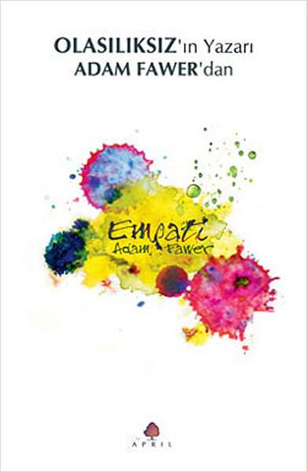

  
# Empati - Adam Fawer
## 690 Sayfa
### 30.09.2022
  
 

  

    
     

 
 

***Karakterler;***
- ***Dr. Elliot Dietrich:***
- ***Darian Wright:*** Organizasyon için çalışan kadın.
- ***Laszlo Kuehl:*** Öğretmen, baş karakter.
- ***Valentinus:*** Laszlo Kuehl'in düşmanı.
- ***Elijah Glass:*** İnsanın yüzünü okuma ustası erkek.
- ***Winter Zhi:*** Winter, şarkı söyleyen kız.
- ***Carol:*** Winter'in annesi.
- ***Jill Willoughby:*** İşkence gören yetenekli kız.
- ***Dr. Elliot Dietrich:*** Organizasyondaki doktor.
- ***Samantha Zinser:*** Organizasyonun başındaki.
- ***Tom:*** Organizasyondaki asker, Laszlo'nun sonradan aklına girdiği.
- ***Charlie Hammond:*** Yeni empatik çocuk.
- ***SpyGurl:*** Blog yazan kız.
- ***Solothurn:***
- ***Peder Sullivan:***

Oppenheimer Okulu

 

> ***(Tanıtım Bülteninden - April Yayıncılık)***

***Yaşamınızın kontrolü sizde değil! Öyle olduğunu düşünebilirsiniz, ama yanılıyorsunuz. Elbette ki kendi kararlarınızı kendiniz vermekte özgürsünüz. Bu kitabı kapatabilirsiniz. O sandalyede oturmaya devam edebilirsiniz. Ya da gözlerinizi oymak gibi çılgınca bir şey yapabilirsiniz. Ne isterseniz yapabilirsiniz. Ama sorun şurada: Ne isteyeceğinizi kontrol edemezsiniz. Her davranışınızı önceden belirleyen arzularınız ruhunuzun o kadar derinlerine işlemiştir ki, onlara dikkat bile etmezsiniz. Ve bu da sizi mükemmel bir köle yapar. Bu nedenle, hayatınızı yaşamaya devam edin. Ne isterseniz yapın. Sadece 'isteklerinizin' tümüyle sizin kontrolünüzde olmadığı gerçeği üzerine kafanızı çok fazla yormamaya çalışın.***
_____

### ***(s.1 - s.96)***

Kitabımız, Laszlo ismindeki kör adamla Darian ismindeki kadının konuşmalarıyla başlıyor. Laszlo, ise Valentinus ismindeki adamı öldürmek istediğini söylüyor. Laszlo, Çok daha uzun zaman önce Laszlo'u bu işe karıştıranın Darian olduğunu  ve bu sefer de Darian'ın kendsine yardım etmesi gerektiğini söylüyor.

Kitabımız iki farklı kişinin gözünden bölüm bölüm ilerlemekte. Bunlardan bir tanesi, Elijah Glass ve diğeri de Winter Zhi'dir.. Bu iki kişinin de boynunda ayrı ayrı gümüş bir haç taşıyorlardı. Bu haçlar çocukluklarından itibaren bu kişilere takılmış ve neredeyse hiç çıkarılmamış. Aynı zamanda bu kişilerin aileleri her zaman sanki bir şeyden korkarcasına tedirginlermiş... Ve son olarak bu iki kişi üzerinde büyük bir huzursuzlukta söz konusuydu.

Winter Zhi, şarkı söyleyen ve konserlere çıkan bir kızdır. Yine bir gün konsere çıkmadan önce, hazırlık yaptığı kulise eski sevgili gelir. Winter, bu adamın gitmesini ve kendisini istemediğini söyler. Ama psikopat adam, Winter'in boynuna yapışır ve gözleri dönmüştür. Winter neredeyse boğulmak üzereyken, eline aldığı makası adamın boğazına saplar.. Kısa bir süre sonra adam yere düşer ve Winter 911'i arar.

Bunların ardından Winter evdeyken ve karanlıktır. Bir anda odasına güçlü biri girer. Winter karşı koymak istese de bunu başaramaz. Korku içerisinde teslim olmak zorunda kalır. Ama adam oradan çıkıp gider. Winter kendine geldiğinde ise, boynundaki kolye çoktan kaybolmuştur. Bunun üzerine büyük bir endişe duyar, çocukluğundan beri o kolye boynundadır. Ama bir yandan da sanki bir rahatlama hisseder... Bunun ardından annesi gelir, ve olanları anlatır.. Annesi olanları duyunca, bir anda telaşlanır ve çok kötü olur. Winter ve annesi arasındaki tartışmanın ardından annesi fenalaşır ve kalp krizi geçirir. Hastaneye kaldırılan annesi ölmüştür.

Elijah Glass, insanın yüzünü okuyan ve yıllarca bu alanda kendini geliştirmiş bir erkektir... Yoğun bir günün ardından otele dönmek ister. Ama Elijah Glass'ın kalabalığa karşı çok büyük bir fobisi vardır. Sokakta ilerlemeye çalışırken neredeyse bayılacak duruma gelir. Bir anlığına karşısında gördüğü kadından çok etkilenir,  o kadın kendi üzerine doğru gelmektedir. Bunca zaman kimsenin ona dokunmasına izin vermemiştir ve çok kötü hissetmektedir... Ama bu kadın bir anda kendisini bu bunaltıcı ve yönetilemez duygular içerisinde dokunmuştur.. Kısa bir sürenin ardından Elijah Glass kendine geldiğinde boynundaki kolyenin olmadığını fark eder. Ama kadın çoktan gözden kaybolmuştur. Aynı şekilde bir yandan tedirgin olmuştur, çocukluğundan beri bu kolye boynundadır ama bir yandan da sanki o kalabalıktan korkan ve üzerine gelen baskı bir anda gitmiş ve artık özgür hissetmektedir..

Bir süre sonra Elijah Glass, okuldan arkadaşı Stephen Grimes ile karşılaşır. Stephen dilencilik yapıp sokakta yaşamaktadır. Birlikte ikisi zaman geçirirler. Önce bir şeyler yerler ve ardından lüks bir otele kalmak için giderler. Bu sırada Stephen, Elijah Glass'a yıllar önce yani sekizinci sınıftayken ailesiyle birlikte neden ortadan kaybolduğunu sorar. Ama Elijah Glass, hiçbir şey hatırlamamaktadır. O zamanlara dair hiçbir şey belleğinde yoktur... Aralarında yine ilginç olarak şöyle bir şey yaşanır. Stephan, Elijah'a,  Cohen soyismiyle hitap eder. Ama Elijah soyisminin Glass olduğunu savunarak buna karşı çıkar... Aynı zamanda Elijah Glass, Stephen'e çocukluğunda boynunda bir haç şeklinde bir kolye takıp takmadığını sorar. Ama Stephen'in cevabı şu şekildedir: ***"Sen Yahudisin be! Ne haçı?"***

_____

### ***(s.96 - s.160)***

Bu bölümde; Elijah Glass, Steve ile birlikte olanları konuşurlar. Steve neler yaptığından bahseder. Steve'in geçmişi biraz hackerlık, daha çok ise zararlı yazılım virüslerini tüm dünyayı yaymakla filan geçmiş. Bu bölümün sonunda ise Elijah Glass ve Steve sinemaya gitmişti. Fakat Elijah Glass kendisini orada kaybetmiş, insanlara saldırmış. Gözlerini açıp daha sonrasında kendine geldiğinde, bağlı bir şekilde bir doktorun gözetimi altındaydı..

Winter tarafında ise işler istediği gibi gitmiyordu. Winter, bu olanlardan sonra evinde polis koruması altında beklerken, kapısına o kör adam geldi. Kör adam Winter ile konuşmak istiyordu, ama Winter adamın konuşmasına fırsat vermeden, adamı oradan uzaklaştırdı..

Winter, o gece konserini vermesi gerekiyordu. Nitekim konsere de çıktı. Winter için bu konser çok zordu, çünkü yıllarca annesiyle birlikte tüm zorluklara göğüs geren Winter artık yapayalnızdı.. Konserini gözyaşları ve duygu seli içerisinde tamamladı. Tüm orkestra aynı duygularla birlikte gözyaşları içerisindeydi. Aynı zamanda seyirci de ayakta alkışlıyordu. Seyircilerin arasında Michael da vardı. Michael buraya tek bir amaç için gelmişti, Winter'ı öldürmek. En sonunda Winter ve Michael gözgöze geldiler. Winter bir anda büyük bir korkuya kapıldı. Michael, cebindeki silahı hissederek Winter'a doğru ilerliyordu. Ama sonradan kafasına dank etti. Böyle bir güzelliği öldürmek doğru muydu? Bunun üzerine ne olduysa, Michael kendisini yüksek balkondan aşağıya attı ve öldü.

Winter bunun üzerine oradan ayrılıp otele geldi. Ama bir sürü gazeteci tarafından etrafı sarılmıştı. Winter oradan kaçmak istedi çünkü ortalık birbirine girmişti. Winter kaçarken ise trafikte arabaların kaza yapmasına sebep oldu. Winter en son bir tane parkta dinlenirken, arkasından karanlıkların içinden bir ses duydu. Arkasına dönüp baktığında ise kör adam ve Alman Kurdu köpeğiyle birlikte Winter'ın arkasındaydı. Winter, kör adama kim olduğunu sordu:   ***"Benim adım Laszlo Kuehl," dedi kör adam, derinden gelen güçlü bir sesle. "Anımsamadığını biliyorum ama senin öğretmenindim."    "Ne zaman?"    "Küçük bir çocukken." Ona doğru çekingen bir adım attı. "On yedi yıl önce." (s.160)***

_____

### ***BÖLÜM 2  --- 1 & 18 | 1990, Laszlo ile Darian (s.160 - s.260)***

Bu bölümde geçmişe gidiyoruz. Laszlo Kuehl, başarılı öğrencileri bir araya toplamıştı. Henüz daha bu öğrenciler çocuktu. Bunların arasında Elijah Cohen, Stephen Grimes ve Winter Zhi'de vardı. Laszlo Kuehl, bu çocukları güzel bir şekilde eğitmeye, bu çocukların bulundukları ortama uyum sağlamasına, aynı zamanda bu çocukların potansiyellerine ortaya çıkarmaya çalışıyordu. Tüm bunların yanında Darian isminde güzel bir kadın çıkıp geldi ve kendisinin eğitim görevlerisini olduğunu söyledi. Darian, özellikle Winter ve Elijah ile ilgileniyordu. Darian ilk başta sanki bir müfettiş edasıyla yaklaşmıştı. 

Darian ve Laszlo Kuehl neler olduğunu konuşmak için bir araya geldiklerinde ise Darian'ın eğitim görevlisiyle herhangi bir amacı olmadığını anlamışlardı. İlk kez bir araya geldiklerinde sarhoş olana kadar içtiler ve akşamında eve gittiler. Laszlo Kuehl ve Darian güzel bir gece geçirip birlikte oldular. Bunun devamında ise uzun süreli bir ilişkileri başladı. Ama bu süre boyunca her ikisi de birbirinin ne amacı olduğunu birbirlerine söylemediler. Ama şöyle bir gerçek vardı ki Darian bir tarikat için çalışıyordu.

Diğer bir tarafta Jill Willoughby ismindeki bir kız var. Bu kız kilisede kalıyor. Aynı zamanda oradaki bir rahibeye karşı bir şeyler hissediyor ve o rahibeyle alakalı hayaller kuruyordu. Bir gece uykusundan uyanıp o rahibeyi yalnız bir şekilde yakalamıştı. Rahibe ve Jill birlikte sohbet ediyor aynı zamanda bir şeyler yiyorlardı. O sırada bir anda rahibe ve Jill bir anda öpüşmeye ve sevişmeye başlarlar. Bunun ardından her şey Jill için çok mükemmel giderken,  bir anda Peder Sullivan odaya girer ve her şey bir anda mahvolur... 

Peder Sullivan, Jill'in içerisinde bir şeytan olduğunu düşünmektedir. Bunun üzerine Peder Sullivan, Jill'i bodruma kilitler ve günlerce ona işkence yapar, aç  ve susuz bırakır ve aynı zamanda tanrıya birlikte dua ederler.. Aradan günler geçmiş Jill açlıktan dolayı bir deri bir kemik kalmıştır. Artık en sonunda Peder Sullivan, kendi otoritesini düşündüğünü için ve Jill'in içerisinden şeytanı çıkaramadığı için ise Jill'i ölüme terk edecektir. Ama bu sıralarda tarikatın Darian için yeni bir görevi vardır. Bu görev ise Jill'i alıp getirmek. Nitekim de öyle olur. Darian, Jill'i gidip Peder Sullivan'in elinden alır.

_____

### ***BÖLÜM 2  --- 18 & 38 | (s.260 - s.392)***

Peder Sullivan, organizasyon tarafından bir takım şeylere maruz kaldı. Peder Sullivan'in kafatasını açtılar. Onun üzerinde deney yaptıktan sonra Peder Sullivan'i serbest bıraktılar. Organizasyon bu deneyden ise, Peder Sullivan'in yüzüğü ile birlikte inanç ile duyguları saf dışı bırakabilmeyi ve takip edilmesini önleyen bir yol keşfetmişti. Aynı zamnda bu yüzük ile birlikte bir aynı görevi gören kolyeler yaptılar.

Artık Jill, organizasyon için eğitilmeye başlanmıştı. Üstelik Jill'in çok güçlü  yetenekleri vardı. Jill kolay bir şekilde diğerlerinin duygularını manüpüle edebiliyordu.

Darian, Laszlo Kuehl ile artık konuşmuş ve ne istediğini söylemişti. Fakat Darian, gerçekleri tam olarak söylememişti. İyi bir amaç için çocukları organizasyona götüreceklerini ve yeteneklerini tam olarak güçlü bir şekilde onlara kullanmayı öğreteceklerinden bahsetmişti. Aynı şekilde bunun üzerine Darian ve Laszlo Kuehl,  Winter ve Elijah ile konuştular. Onların ne kadar özel olduklarından bahsettiler. Laszlo Kuehl'ında özel yeteneği vardı, duyguları kokular yardımıyla hissedebiliyordu. Laszlo Kuehl, herhangi bir duygu hissettiğinde sadece kendisi farklı kokular duyuyordu.  Elijah görsel olarak duyguları hissedebiliyordu, Winter ise bunu işitsel tarafıyla yapabiliyordu. Darian çocuklara da bir daha yalnız kalmayacaklarını ve yeteneklerini çok iyi şekilde kullanmayı öğrenecekleri vaadiyle kandırdı diyebiliriz. Aynı şekilde ailelerinde gönülleri alındıktan sonra çocuklar özel bir jet ile Oppenheimer Okulu'na götürüldü.

Darian ve Laszlo Kuehl birlikte, Organizasyona gittiler. Orada ise kendilerini Samantha Zinser karşıladı. Jill'in özel güçlerini kullanarak Laszlo Kuehl'in hissettiği duyguları manüpüle ettiler ve aynı zamanda Darian'ın duygularını da bastırdılar. Sonrasında ise Laszlo Kuehl'i bayıltmışlardı. Darian'ın kaçacağını anladıkları için, Zinser Darian'ı hücreye kapatmıştı. 

Zinser, daha sonrasında Darian'ın öldüğüne dair sahte bir haber yaptırdı ve Laszlo Kuehl'i buna inandırdılar. Laszlo Kuehl, iki haftalık gibi bir süre boyunca yas tuttu ve her gün alkol aldı. En sonunda Samantha Zinser, Laszlo Kuehl'în yanına giderek yine onun duygularını manüpüle ederek Laszlo Kuehl'i organizasyon için çalışmaya ikna etti. Aynı zamanda bunu yaparkende Darian olsa senden bunu isterdi gibi şeyler söyleyerek Laszlo Kuehl'in zihnine girdi..

Laszlo Kuehl, artık organizasyon için çalışıyordu. Onun görevi ise okullara farklı kılıklarda gidip, empat olan çocukları keşfetmekti. Yine bunların arasında bir tane empat olabilecek bir çocuğu Winter ve Elijah'ın  yanına getirdiler. Bu çocuk, Charlie Hammond idi.. Yine çocuklara eğitimler veriliyordu. Çocukların liderlik özelliklerini öne çıkarabilmek adına, bazen Samantha Zinser bizzat kendi çocukları eğitiyordu...

_____

### ***BÖLÜM 2  --- 39 & 57 | (s.392 - s.500)***

Laszlo Kuehl, bir kız tarafından izleniyor ve manüpüle ediliyordu. Laszlo Kuehl bunu fark edebiliyordu. Altı aydır sigara içmeyen Laszlo Kuehl, tekrardan sigara içmeye başlamıştı. Ancak bu şekilde kızın etkisinden kurtuluyor ve zihnini rahatlatabiliyordu. Tek kaçış noktası bu olmuştu. Bir taraftan organizasyon için çalışmaya devam ediyordu.

Diğer bir tarafta ise Jill, Zinser'e sıkı sıkıya bağlıydı. Jill, onu seviyor ve aynı zamanda ona karşı büyük bir şehvet duyuyordu. Fakat Zinser'in Jill'i kullanabilmesi için yapay duygular yayıyor ve her zaman Jill'i seviyormuş gibi gözüküyordu. Fakat Jill henüz bunu fark edemiyordu.

Laszlo Kuehl, askerlerden birini yakaladı ve askere dokunarak onun zihnine girmeye başarmıştı. Aynı zamanda askerin boynundaki kolyenin bunu engellediğini de keşfetmişti. Bu asker Tom idi. Laszlo Kuehl önce Tom'u kendi tarafına çekti. Ardından Tom ile birlikte gidip Doktor Dietrich'i de bir şekilde boynundaki kolyeyi çıkardıktan sonra yönetmeyi başarmışlardı. Laszlo Kuehl, aynı zamanda Doktordan organizasyonun asıl amacının ne olduğunu ve gerekli çoğu bilgiyi almıştı. Aynı zamanda Darian'ın yaşadığını ve Samantha'nın kendilerine yalan söylediği öğrenmişti.

Tüm bunların ardından Laszlo Kuehl, Jill'in yanına giderek, Jill'e Samantha'nın gerçek yüzünü anlatmaya çalıştı. Samantha'nın tüm duygularının sahte olduğunu Jill'e anlattı. İlk başta her ne kadar Jill bunlara inanmasa da, Laszlo Kuehl nasıl teyit edebileceğini ona söylemişti.. Jill, Samantha'nın yanına giderek, ona birazcık numara yaparak sarılma bahanesiyle duygularını okuyabilmeyi başarmıştı. Zaten bunun üzerine Jill, Samantha'nın duygularının sahte olduğunu görünce ise adeta yıkılmıştı.

Laszlo Kuehl, tüm bunların üzerine Jill ile iş birliği yapmak zorundaydı. Çünkü başka bir şansı yoktu buradan çocukları çıkarması için. Jill, aynı zamanda Samantha'dan intikam almak istiyordu.. 

Laszlo Kuehl, Doktor ve birkaç asker ile birlikte önce Darian'ı kurtardılar. Ardından çocukların yanına gidip çocukları kurtardılar. Diğer tarafta ise Jill aslında bir bakıma Laszlo Kuehl'a ihanet etmişti. Jill, Samantha ile yüzleşip, kendisini gerçekten sevmediğini duyduktan sonra zaten çıldırmıştı. Jill, Samantha'ya işkence etti ve sonra Samantha'nın odasındaki şifreyle birlikte C4 patlayıcılarını aktif etti. Jill kendisi askerlerle birlikte orayı terk etti. Ama Laszlo Kuehl ve çocuklar çıkamadan orada C4'ler patladı ve büyük bir enkaz oluştu. Maalesef Charlie Hammond orada ölmüştü. Aslında daha sonra göreceğimiz üzere ölmüyordu ama Laszlo Kuehl öyle olduğunu düşünecekti.

Laszlo Kuehl, Darian, doktor ve çocuklar hep birlikte oradan çıktılar ve güvenli bir yere geçtiler. Daha sonra ise Laszlo Kuehl, Jill'in peşine düştü. Jill Peder'in olduğu yere gitmişti. Jill' pederle yüzleşip, pederin kendini öldürmesini sağlayacaktı ama tam o esnada Laszlo Kuehl gelmişti. Bunun üzerien Jill ve Laszlo Kuehl boğuşmaya başladılar. Jill, parmaklarını Laszlo Kuehl'ın her iki gözüne de sokmuş ve tüm gücüyle bastırıyordu ki o esnada Darian yetişti. 

Laszlo Kuehl, kendine geldiğinde gözleri bandajlı bir şekilde yatıyordu. Artık bundan sonra Laszlo Kuehl göremeyecekti. Laszlo Kuehl ve Darian, Winter ve Elijah'ı ailelerine teslim etti. Doktor ve Jill'i de uyardılar. Bu yaşananlardan kimseye bahsetmeyecekleri konusunda tehdit ettiler. Çocukların beyinlerini  bazı yöntemlerle yıkamışlardı sırf kendi iyilikleri için. Çocuklar bu olanları hatırlamayacaktı. Boyunlarında taşıdıkları kolyenin nereden geldiklerini bilmeyeceklerdi. Ama her zaman o kolyeyi taşımak zorundaydılar. Aksi takdirde organizasyon onları bulurdu. Darian ve Laszlo Kuehl'de artık görüşmemek üzere ayrıldılar. 

Bunun yanında enkaz altında çalışma yapanlar Laszlo Kuehl'in öldü sandığı Charlie Hammond'u canlı bir şekilde kurtarmışlardı.

_____

### ***BÖLÜM 3 | 30 Aralık 2007, 21.52   --- 1 & 30  | (s.501 - s.681)***
#### (Yargı Gecesi'ne 26 saat, 8 dakika kala)

Darian, Elijah'ı kapatılan yerden kurtarmak için oraya girdi. Oradaki görevlinin zihnini büktükten sonra Elijah'ı da oradan çıkmaya ikna ettikten sonra Darian ve Elijah birlikte oradan ayrıldılar. Laszlo Kuehl, zaten Winter ile birlikteydi. Darian, Elijah'ı Laszlo Kuehl'a teslim ettikten sonra hemen oradan ayrıldı.

Laszlo Kuehl, Winter ve Elijah'a geçmişten bugüne tüm yaşadıklarını bir bir anlattı. Laszlo Kuehl, çocuklardan kendisine Valentinus'u bulmak için yardım etmelerini istemişti. Çocuklarda kabul etmişti. Tam bu sırada odaya silahlı adamlar girdi. Oradaki boğuşmanın ardından, Laszlo Kuehl ve köpeği orada öldüler. 

Elijah ve Winter, güçlerini kullanarak Darian'ı uyarmaya çalıştılar. Darian'ın zihnine girip korku saldılar. Darian bunu anlamış olsa da biraz geç kaldı. Darian, çoktan kendisini bulup öldürmek isteyen adam ile yüzyüze gelmişti bile. Darian ne yaptıysa adama karşı koyamadı. Adam, tam Darian'ı öldürmek üzereydi ki çocuklar yetişti ve Darian'ın hayatını kurtardı.

_______

En sonunda Valentinus' gece yarısı tüm şehri birbirine katmayı hedefliyordu. Diğer ülkelerdeki temsilcileri aynı ayna papaları öldürmek idi... Nitekim tüm bunlara en son Elijah ve Winter engel olmayı başardılar. Valentinus isimli kişi sonuç itibariyle Jill Willoughby'idi. Amacı ise şuydu: Papa ve 108 Katolik kardinali aynı anda öldürerek, Katolik Kilisesi'ni ortadan kaldırmak.  Ama başarılı olamadı.

> ***-SON-***

----

179- hayvan çiftliği açıklaması  
180 -204 & - tesla anlatımı  
181 & 186 -- fizik anlatımı dalga boyları vs.0  
276 & -- fizik  
349 - Arthur  Schopenhauer  
372 & -- Locke  
381 -- tanrı yoktur  
401 & 405 - Descartes akılcılık  
414 & 424  - orada neler döndüğünü doktor, Laszlo'ya anlatır  
611 &

PAPERCLIP ? 418  
Rahibe Teresa nedir? -- s.265'de --> sende rahibe terasasın diyor.  

 

### Kitaptan Alıntılar ;
- ***"İnsanlar söylediklerinizi ya da yaptıklarınızı unutur ama onlara neler hissettirdiğinizi asla unutmaz." (s.1)***
- ***"Ya tüm yaşamını aptalca bir hata nedeniyle geride bıraktıysa?" (s.2)***
- ***"Belki. Belki de değil." (s.12)***
- ***"Ama kör birisi için renklerin ne anlamı olabilirdi ki?" (s.15)***
- ***"Seni yeniden görmek güzel." (s.16)***
- ***"Kişinin asıl efendisi zihni değil, bedeniydi." (s.22)***
- ***"Kişi istediğini yapabilir ama ne isteyeceğini isteyemez." (s.23)***
- ***`"Beden arzuları kontrol ediyordu, arzular da iradeyi. Geri kalan her şey sadece kuru gürültüydü; bilinci kandırıp, bir köleden farklı olduğuna inandıran olgu belliydi." (s.23)`***
- ***"Ama Tanrı'ya bulunca, O da huzuru bulmamda bana yardımcı oldu." (s.33)***
- ***"Eğer devlet, vatandaşların haklarını korumazsa geriye tek bir cevap kalıyor."   "Neymiş o?"   "Devrim." (s.35)***
- ***"Yalnızca onun adını düşünmek bile kalp atışlarını hızlandırmaya yetmişti." (s.36)***
- ***"Yaşam acı çekmektir." (s.36)***
- ***"Arzu tüm acıların kaynağıdır." (s.36)***
- ***"Ama böyle yaşamaya devam edemezsin!"    "Senin istediğin şekilde de yaşayamam!" (s.37)***
- ***"İnsanların yaptıklarını kontrol edemem." (s.53)***
- ***"Her zaman tek başına olacaktı." (s.57)***
- ***"Bu gerçek değil. Başkasının gözlerinden bakıyorsun." (s.58)***
- ***"Anın keyfini çıkarmak yerine sorunun ne olduğunu anlamaya çalışarak zaman kaybediyordu." (s.58)***
- ***"Elijah sanki artık bir kişi değil, birçok kişiydi. Zihninde hiçbiri iyi şeyler söylemeyen bir dizi çoklu kişilik filmi geçiyordu." (s.60)***
- ***`"Onu düşünmediği tek bir gün bile olmamıştı ama onunla konuşma arzusu, o gün göğsünde fiziki bir acı gibiydi." (s.66)`***
- ***"Evrenle birlikte kendinin de değişmesine izin vererek. Ama dikkatli olmalısın; çok az ya da çok fazla değişiklik dengesizliğe yol açabilir, bu da seni hasta edebilir." (s.69)***
- ***"En karanlık gece de bile yıldızlardan gelen bir ışık vardır." (s.69)***
- ***"Annesi olmadan o dünyada tek başınaydı." (s.82)***
- ***"O olaydan sonra başka şeyler düşünmüştü ama düşüncelerin -aslında duyguların- ona ait olmadığı açıkça ortadaydı." (s.83)***
- ***"Bozuk bir saat bile günde iki defa doğru zamanı gösterir." (s.85)***
- ***"Teninden akan sıcak su, bedenindeki tüm acıları ve sızıları bir anda yok etmiş gibiydi." (s.86)***
- ***"Kesin olan bir şey vardı: Ne zaman birinin hafızası silinse, sonuç o kişi için iyi olmuyordu." (s.91)***
- ***"Her şey can sıkıntısıyla başlamıştı. Ne fazla ne de eksik." (s.96)***
- ***"Neden olmasın?" (s.96)***
- ***"Eve dönmek harikaydı." (s.97)***
- ***"Gerçek şu ki onun seni gerçekten sevdiğine inansan, neredeyse, affedebilirdin de. Ama sevdiği sen değilsin." (s.111)***
- ***"Seni aklımdan çıkaramıyorum. Gözlerimi ne zaman kapatsam karşımdasın." (s.111)***
- ***"Seni bir daha asla görmek istemiyorum!" (s.111)***
- ***`"Nereden geldiğinizi bilmeden, nereye gideceğinizi de bilemezsiniz. Bunu  hatırlamaya çalışın." (s.125)`***
- ***"Hava yoğun ve ağırdı; duvarlar sanki insanın üzerine geliyordu." (s.126)***
- ***"Üç temel nöron vardır. Aferent nöronlar doku ve organlardan beyne bilgi iletir. Eferent nöronlarsa o bilgiyi işleyip, beyinden gönderilen sinyalleri aktarır. Aracı nöronlar da beyin ve merkezi sinir sistemi içindeki iletişimi sağlar." (s.133)***
- ***"Sessiz kalmak en iyisiydi." (s.137)***
- ***"Dinlemekten ne zarar gelirdi ki?" (s.139)***
- ***"Her nota sanki sadece onun için çalınmıştı." (s.143)***
- ***"Kendini boş ve yalnız hissetti." (s.143)***
- ***"Ona bir daha asla sahip olamayacaktı. Dışarıda bir yerlerde dikilip onu seyretmekle yetinecekti. Onun sevgisini tattıktan sonra yerine her ne koyarsa koysun, yaşamı sonsuza dek soğuk ve boş olacaktı." (s.143)***
- ***"Sonra annesini, birlikte göğüs gerdikleri şeyleri, kendisini her zaman nasıl koruduğunu düşündü. Sonra ayrılıkla biten her aşkın ardından, yanında olup parçaları toplamasına yardım eden sadece oydu." (s.144)***
- ***"Her şey çok hüzünlüydü. Ve ne kadar çok acı vardı... Benliğinin her tarafında çınlayan acı, başlangıcı ve sonu olmaksızın sağır edici bir sonsuzluğa uzanır gibiydi." (s.145)***
- ***"Beyni kontrolü ele geçirmeye çalışıyordu ama faydasızdı." (s.148)***
- ***"Dünya gerçekten de son derece acımasız ve kusurlu bir yerdi." (s.157)***
- ***"Ve renkler. Beyninin içinde kayalık bir sahile vuran dalgalar gibi savrulan o kadar çok renk vardı ki. Her birinin etrafı nabız gibi  atan parlak duygularla çevriliydi." (s.158)***
- ***"Hadi bakalım, bana bilmediğim bir şeyler söyleyin." (s.177)***
- ***"Edison puştun tekiydi." (s.186)***
- ***"Korkunun seni yenmesine izin veremezsin. İnancın seni iblisin pençelerinden kurtacak. Şimdi dua et!" (s.198)***
- ***`"Tesla'nın sorunu hiçbir zaman pes etmeyişiydi; pes etmenin kendisi için daha yararlı olacağı durumlarda bile direndi." (s.204)`***
- ***"Devletle savaşamazsınız." (s.205)***
- ***`"Devletle savaşabilirsiniz ama buna kalkışırsanız büyük olasılıkla kaybedersiniz. Hatta sizi öldürebilirler bile. Elbette ki bu, denememeniz gerektiği anlamına gelmiyor." (s.205)`***
- ***"Kıskançlık. Bu çocuklar sadece zeki değil. Onlar birer dâhi. Biz öğretmenler onları sadece koruyan, temel sağlayan abartılmış bebek bakıcılarıyız. Bu çocukların hepsinin de kaderinde bizimkilerden daha önemli birer yaşam yazılı. Ümit edebileceğimizin en iyisi, bir gün bizleri sevgi ve şükranla anmaları." (s.206)***
- ***"Yani hepsi bu mu? Siz onların sadece koruyucu meleği misiniz? Sonsuza dek koruyamazsınız o çocukları." (s.207)***
- ***"Elijah da öteki çocuklarının çoğu gibiydi: Yanlış anlaşılmış. Eğer daha önce ulaşmayı başarabilmiş olsa çocuk belki de kendi gölgesinden korkan birisi olmazdı." (s.208)***
- ***`"Hayatın kendi bir oyundur." (s.209)`***
- ***"Ama İncil bize Tanrı'nın bir planı olduğunu öğretir. Her şey bir nedenden dolayı olur." (s.215)***
- ***"Bana sadece Tanrı'nın yardımcı olabileceği anlamına geliyor. Tanrı. Ve iman."   "Doğru, Jill. O'na inanırsan, O da sana inanır." (s.215)***
- ***"Ve sende karanlık bir kötümser. Biraz yalnızlık çeken." (s.217)*** 
- ***"O anda sadece Darian vardı. Başkaları önemli değildi. Başkaları zaten hiçbir zaman önemli olmamıştı." (s.220)***
- ***"Şeytanın hepimizden istediği: Bizi yolumuzundan saptırmak." (s.223)***
- ***"Şeytan bizim aramızdadır. Dünyayı dolaşıp, Eyüp'ü sınadığı gibi diğer insanları da sınar, Tanrı'nın çocuklarının O'nun sevgisine layık olmadıklarını kanıtlamaya çalışır." (s.223)***
- ***"Ama umut, iyimser olmaktan ziyade tehditkârdı." (s.241)***
- ***"Yapay değil. Duygular yapay olamaz. Eğer insanları hissediyorsan gerçektir." (s.249)***
- ***"Darian'dan önce hep yalnızlık çekmişti. Ama onunla... Onunla bir bütündü." (s.258)***
- ***"Onun rahat, sakin zihni sığınabileceği tek limandı." (s.259)***
- ***"Zamanın kavramını kaybetmişti artık." (s.260)***
- ***"O sadece başka bir test miydi? Cesaretini kırmak için bir yol mu? Kendini yeniden insan gibi hissetmesi için kandırıp, sonra onurunu parça parça yitirtmek mi?  Ne istiyorlardı ondan? Ne..." (s.262)***
- ***"Bir günah, vicdanında diğer hepsinden daha parlak şekilde yanıyordu." (s.262)***
- ***"Yaşamının geri kalanında derin pişmanlık duyacağı bir karardı bu." (s.269)***
- ***"Sandığın kadar yalnız değilsin." (s.270)***
- ***"Gerçek bilimsel atılımlar, gerçek özveriler olmadan elde edilemez." (s.293)***
- ***"Ondan önce ne kadar yalnız olduğunu hiç fark etmemişti." (s.295)***
- ***"Kuralları olmayan erkekler bazen kendini aşmaya eğilimli olur." (s.302)***
- ***"Karanlıkta yalnız başına. Bir hiçlik. Canlı canlı gömülmüş gibi. Ya da ölü. Ölüm böyle bir şey olmalı. Sonsuza dek hiçlik. Görüntü yok, ses yok, his yok. Sadece boş bir karanlık. Tek başına..." (s.331)***
- ***"Gerçek anlamda âşık olduğu ilk ve tek kadın... Ölmüştü." (s.339)***
- ***"Ama babam her zaman hayatta hiçbir şeyin bedava olmadığını söyler." (s.343)***
- ***`"Kendini nasıl hissediyorsun?"`   `"Daha iyi günlerim olmuştu." (s.347)`***
- ***"Schopenhauer pek mutlu bir kişi değildi; yaşamı acılarla dolu bir süreç olarak görüyor ve kurtuluşun sadece İrade'nin egemenliğinden kaçarak elde edilebileceğini düşünüyordu." (s.349)***
- ***"Her gün kendimi biraz daha iyi hissedeceğimi umarak kalkıyorum. Bazen öyle de oluyor. Sonra gece çöküyor ve o hâlâ yok." (s.354)***
- ***"Sonunda yaşamına devam etmek zorunda kalacaksın." (s.354)***
- ***"Deneyciler, bilgi edinmenin tek yolunun kişisel deneyimler olduğuna inanır. Bu nedenle de bir deneyci asla bir kitaba, saat altı haberlerine, hatta öğretmenine bile güvenmez. Onlar ilk kuşkuculardır." (s.371)***
- ***"Locke kendine bile güvenebileceğine inanmıyordu. Hatta beş duyunun, bilgi edinmenin  tek gerçek yolu olduğunu yazmasına rağmen duyurulara bile her zaman tümüyle inanılamayacağını iddia etti." (s.373)***
- ***"Hepimiz dünyayı gerçekte olduğu gibi değil, kendi önyargılı algılarımız vasıtasıyla gözlemleriz. Dolayısıyla, gerçekten bilebileceğiniz tek şey kendinizsiniz." (s.374)***
- ***"İblisin hilelerine karşı durabilmek için Tanrı'nın sağladığı bütün silahları kuşanın. Çünkü savaşımız insanlara karşı değil, yönetimlere, hükümranlıklarına, bu karanlık dünyanın güçlerine, kötülüğün göksel yerlerdeki ruhsal ordularına karşıdır. Bu nedenle, kötü günde dayanabilmek, gerekli her şeyi yaptıktan sonra yerinizde durabilmek için Tanrı'nın bütün silahlarını kuşanın." İncil, Efesliler, 6. bölüm, 11. ayet. (s.394)***
- ***"Düşünüyorum, o halde varım." (s.402)***
- ***"Nedenleri bilmek Tanrı'ya özgüydü, insana değil." (s.404)***
- ***"Annesinin başka, babasının başka Tanrı'ya inandığı bir evde büyümüş olmak ona sadece bir şeyi öğretmişti: Kimse kendi inançlarının doğru olduğunu kanıtlayamaz." (s.405)***
- ***"Elijah için din, kesin olarak asla bilemeyeceğiniz bir şey üzerine zaman harcamaktı." (s.405)***
- ***"Bir şey ya vardı ya da yoktu. O kadar." (s.406)***
- ***"Doğru bedeli ödersen her şeyi satın alabilirsin." (s.423)***
- ***`"Çünkü gerçeği öğrenmek istemedin. Çünkü seni sevdiğine inanmak istedin. Çünkü ona âşık..." (s.431)`***
- ***"...sığınabileceğini sandığı tek insana olan güvenini yıktığı için nefret ediyordu o adamdan." (s.431)***
- ***"Ve ona sarıldı. Birilerine sarılmayalı çok uzun zaman olmuştu." (s.432)***
- ***` - "Yaptığı yanlışsa biz neden ona doğru davranmak zorundayız?"`   `- "Çünkü öyle  yapmazsak bizde onun kadar kötü oluruz."`   `+ "Kimin umrunda ki?"`   `- "Benim umrumda. Ve bir gün senin de olacak." (s.434)`***
- ***"Neyse ki hepsi yakında  bitecekti. Kaçtıktan sonra ne yapacağını bilmiyordu, umrunda da değildi. Tek istediği, sürekli korku içinde yaşamaktan kurtulmaktı." (s.440)***
- ***"Aklını korumasını sağlayan tek şey, tünelin ucunda bir ışık olduğunu bilmesiydi." (s.440)***
- ***"Şimdi yapabileceği tek şey beklemekti. Ve Tanrı'ya inanmadığı halde, yetişkin yaşamında ilk kez dua etti." (s.441)***
- ***"Omuzlarında bir ölümün yükü daha." (s.474)***
- ***`"En kötüsü de oydu işte: Hayatının en mutlu dönemine bakıp, yaşadığı mutluluğun gerçek olup olmadığını bilmemek." (s.479)`***
- ***"Daha önceki yıl orası tüm dünyasıydı onun. Şimdiyse bir dizi acı veren anıdan başka bir şey değildi." (s.483)***
- ***"Ve sonra, kendi zihninde kapana kısılmış olarak geçireceği yaşamı düşününce haykırmaya başladı." (s.495)***
- ***"Daha aklı başında düşünebilmeyi isterdi. Ama tüm duyguları yok olmuştu." (s.502)***
- ***"Söyleyin bana: O korkunç şeyler başınıza gelirken inandığınız Tanrı neredeydi?" (s.512)***
- ***"Bu ülkenin bölünmüş olmasına şaşmamak gerek." (s.513)***
- ***`"Hangi televizyon programını seyredeceğiniz, hangi arabayı alacağınız, ne zaman terfi edeceğiniz, hangi üniversiteye gideceğiniz gibi saçma sapan şeyleri saplantı haline getiriyor, yaşamda öylece yuvarlanıp gidiyorsunuz. Asıl sormanız gerekenler dışında, yaşamınızdaki tüm ıvır zıvırla derinlemesine ilgileniyorsunuz. Ya asıl sorular?" (s.513)`***
- ***`"Neden buradayız? Amacımız ne? Öldükten sonra ne oluyor?" (s.513)`***
- ***"İyi ama neden? Ölümden sonra hiçbir şey yoksa o zaman 'iyi insan' olma çabaları neden? Mümkün olan her türlü aşırı zevkin içinde kaybolmalarını engelleyen ne?" (s.514)***
- ***"Ama şunu bilin ki, inançsızların çoğu içten içe duyulan korkuyla yaşar." (s.514)***
- ***"Zihnimi okuduğuna göre konuşmaya ne gerek var ki!" (s.517)***
- ***"Ama kendinden kaçamazdı. Artık kaçmayacaktı." (s.519)***
- ***"Sadece normal biri olmak istiyorum." (s.520)***
- ***"Yaşamında zaten çok fazla ıstırap çekmişti; o son anında gereğinden fazla acı olmamasını minnetle karşıladı." (s.522)***
- ***"Kaçmak bazen seçenekler arasında yer almıyordu." (s.524)***
- ***"Ya sorgulamamanız istenen dayatmalar yalnızca daha büyük gerçeği görmenizi engelleyecek bir yalanlar ağı ise? "(s.526)***
- ***"Size benim ne gördüğümü söyleyeyim: Savaş görüyorum. Hastalık görüyorum. Acı çeken insanlar görüyorum. Sözde adalet adına yapılan zulümleri görüyorum. Kötülüğü görüyorum." (s.526)***
- ***"Bana basmakalıp kilise mektebi lafları etme! Toplumumuzu dolduran yalanları yineleme! Kendi içine, gerçek benliğine bak ve bana gerçekten ne düşündüğünü söyle." (s.527)***
- ***"Her şeyin bir nedeni vardır." (s.528)***
- ***`"Çünkü hâlâ sana öğretilenlerin oluşturduğu duvarlar arasında tutsaksın. Size söylenenleri unutun ve yanıtı kendi içinizde arayın." (s.529)`***
- ***"Sahip olduğu tek silah zihniydi." (s.537)***
- ***"Tüm dinler dünyanın mükemmel olmadığını söyler ve hepsinin de kendine göre nedenleri vardır. Ama kimse bu nedenleri sorgulamaz." (s.544)*** 
- ***"Onlara yardım edemem. Ve sen de edemezsin. Yapabileceğimiz en iyi şey yoldan çekilmektir. Bu bizim kavgamız değil. Girersek büyük olasılıkla hepimizi öldürür." (s.551)*** 
- ***"Umarım şeytan öldüğümüzü anlamadan hepimiz cennete gitmiş oluruz." (s.568)***
- ***"Bir sihirbaz asla numarasını açıklamaz." (s.569)***
- ***`"Ölüm fikri aklına gelince gülümsedi." (s.573)`***
- ***"Bir kişiyi gerçekten gitmek istemediği bir yönde ilerlemesi için bükemem. Onları biraz ittim mi? Evet. Onları zorladım mı? Hayır." (s.596)***
- ***"Ölmenin birden fazla yolu vardır." (s.597)***
- ***"Görmüyor musun? İrade arzular tarafından kontrol edilir. Ve arzu da senin tarafından."   Winter babasının ona arzu hakkında öğrettiklerini düşündü; arzu tüm acıların nedeniydi. Kendine o açıdan yaklaşmak istemiyordu ama gerçeği görmezden de gelemedi." (s.617)***
- ***"Şu anda yalnız olmaya ihtiyacım var." (s.620)***
- ***"Onların duyguları seni öldürecek. Saat gece yarısını çaldığında, etraf cehenneme dönünce, seni öldürecekler." (s.641)***
- ***"Yakıcı öfkesini aşka dönüştürmüştü."   Şairler ve filozoflar haklıydı; bu iki duygu gerçekten de madalyonun iki yüzüydü. Ve şimdi, kadın onundu. (s.644)***
- ***"Ben kurtarılmak istemiyorum! Anlamıyor musun? Artık burada olmak istemiyorum! Bunların hepsini geride bırakmak istiyorum!" (s.646)***
- ***"Tek pişmanlığı bu insanlık denizinde tek başına olmasıydı." (s.648)***
- ***`"Ama büyük başarılar büyük özveri ister." (s.655)`***
