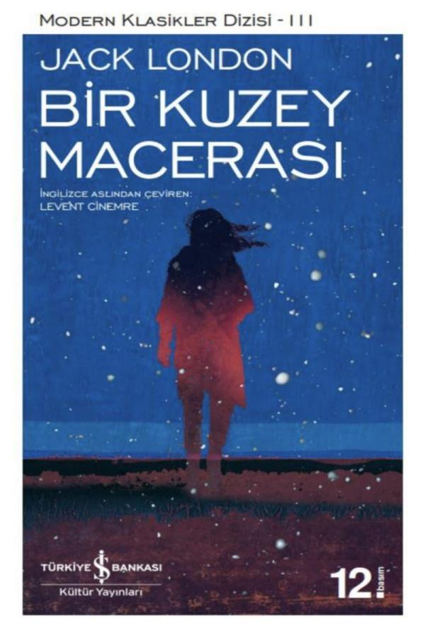

  
# Bir Kuzey Macerası - Jack London
##  56 Sayfa
### 04.11.2022
  
 

  

    
     

 
 

***Karakterler;***
- ***Malemute Kid:***
- ***Prince:***
- ***Naass:***
- ***Unga:***

 

> ***(Tanıtım Bülteninden - Türkiye İş Bankası Kültür Yayınları)***

***Jack London'ın 1900 yılında yayımladığı Kurdun Oğlu adlı derlemenin içinde yer alan Bir Kuzey Macerası, Homeros'un Odysseia destanını andıran, zorlu engellerle dolu, çetin ve “dönüştürücü” bir yolculuğun hikâyesidir. Aleut adalarındaki Akatan'da yaşayan kabile reisi Naass, evlendiği gün karısı Unga'yı denizden çıkıp gelen sarı saçlı beyaz bir adama kaptırır. İki metreyi aşan boyuyla bir devi andıran, “tanrıların dünyanın ilk dönemlerindeki erkekleri örnek alarak kalıba döktükleri” bu adam, Unga'yı sırtına vurduğu gibi gemisine atlayıp oradan uzaklaşmıştır.***

***Naass intikamını almak üzere azılı düşmanının peşinden yollara düşer. Dünyayı dolaşıp bilgi ve görgüsünü artıracağı, macera dolu yıllar beklemektedir onu…***
_____

Malemute Kid ve arkadaşı Prince gruptaki garip adam hakkında konuşmaya başlarlar. Bu ilginç adam yıllardır buralarda, bu soğuk iklimde sözleşmeli olarak kızak sürücülüğü yapmaktadır. Herkesin Divane olarak bildiği bu adam ile birlikte Kid ve Prince yola çıkarlar. Zorlu yollar buz ve kar kaplıdır. Altın aramak için zengin madenler arayanlar ölümü göz önüne alarak doğaya meydan okurlar.

İşte böyle bir anda Divane perişan bir halde Kid ve Prince’in misafir olduğu eve gelir. Onlara hikayesini anlatır. Asıl adı Naass’tır. Akatan’ın reisidir. Neredeyse dört nesildir süren bir kan davasında soyundan sadece kendisi ve karşı taraftan da Unga adında bir kız kalmıştır. Kim önce evlenir ise onun ailesi diğerini yokedecektir. Fakat bunu istemeyen Naas, kısla evlenip bu kan davasını bitirmek ister ama Unga önce kabul edip sonra Denizaslanı lakaplı bir denizciyle kaçar. Naass da intikamını almak için uzun yıllar ikisini aramaya koyulur.

Dünyayı sadece Akatan (Akutan) adasından ibaret sanan kabile ve kabile reisi Naas, mutlu mesut kendi dünyalarında yaşamaktadırlar. Naas, Akatan’da Unga adlı bir kızı sevmektedir. Bu iki sevdalının evlendikleri düğün gününde ufukta bir gemi görünür ve bu geminin dev gibi güçlü kaptanı ve tayfası bu adaya gelir. Kaptan, düğünde Unga’yı görünce onu çok beğenir ve bu yüzden o gece zorla onu kaçırır. Ellerinde mızrak, ok gibi ilkel silahları bulunan yerliler, tüfek ve top gibi güçlü silahları bulunan batılılara karşı koyamazlar.

Bu durum Naas’a çok ağır gelir ve eşini bulmak için yollara düşüp senelerce dünyayı gezer. Sevdiği kadına tekrar kavuşmak için binbir türlü dert, çile çeker. Tıpkı güneşin altında pişen meyveler gibi Naas da zamanla olgunlaşır.

Bir gün Unga’nın izini bulur ama o kadar çok sene geçmiştir ki karısı ve onu kaçıran kaptan, Naas’ı tanımazlar bile, bunun üzerine Naas da fırsat kollamaya başlar. Bir gün Kanada’nın kuzeylerinde altın madeni ararlarken, soğuk ve açlıktan kaptan takatsiz kalır ve bir yere yiyecek zulalayan Naas, kendisi gizli gizli yiyecek yerken kaptanın ölmesine göz yumar. Naas kendini tanıtarak Unga’nın kendisiyle gelmesini ister ama Unga, o eski kadın değildi, değişmiş ve artık kaptanı sevmekteydi. Bu istek karşısında Unga gülerek dalga geçer ve Naas’ın kaptanın ölmesine göz yumduğunu anlayınca onu bıçaklar. Naas, o dondurucu soğukta Unga’yı terk eder ve soluğunu zar zor bir kulübede alır. Naas’ın bu hayat hikayesini kulübede bulunan iki adama anlatırken öğreniriz. Yazar hikâyeyi burada bitirir ve okuyucu derin düşüncelerle baş başa bırakır.

 

### Kitaptan Alıntılar ;
- ***"Ömrümde duygularını bu denli açığa vuran bir adam görmedim." (s.10)***
- ***"Bilirim ki bütün ömrünü maden aramakla geçiren birine, bulduğunun yarısını başkasına vermek zor gelir." (s.10)***
- ***"Bana baktı, gözlerinde nefret vardı." (s.18)***
- ***"Sayımız az, dünyamız küçüktü." (s.20)***
- ***`"Ölmüşlerin kavgasını neden yeni doğacak olanlar sürdürmek zorunda." (s.22)`***
- ***"Bacaklarım artık bedenimi taşımıyordu." (s.26)***
- ***"Acayip acayip yerlerde yattım, garip garip şeyler yedim, tuhaf tuhaf insanlar tanıdım. Çoğu kafayı yediğimi düşünüyor, gülüyordu bana." (s.27)***
- ***"Binlerce şehir gezdim. Bazılarındaki insanlar nazikti, karnımı doyurdular, bazıları bana güldüler, bazıları da lanetler okuyup sövdüler; ama ben dilimi tuttum, bilmediğim yollara gittim, görmediğim şeyler gördüm." (s.29)***
- ***"Bazılarımız öldü, bazılarımız kaldı." (s.32)***
- ***"Ne kadar sürdü, hatırlamıyorum çünkü pek yiyecek yoktu ve sık sık yatıp ölümü bekliyorduk." (s.32)***
- ***"İşte böyle rüzgâra yelken açan ama dümenini kullanamayan küçük balıklar gibi oradan oraya sürüklenip durdum." (s.33)***
- ***"Birçok kere mücadeleden vazgeçeceğini sandım, ama güçlülerin kuvveti vardı onda, devlerin ruhuna sahipti." (s.39)***
- ***"Yolumuz uzun, önümüz karanlık." (s.41)***
- ***"Sessizce oturmuş, bana bu kadar yabancı oluşuna şaşırıyordum." (s.42)***
- ***`"Aklımızın almayacağı bazı şeyler vardır. Adalet duygumuzu aşan şeyler. Bu işin doğrusunu yanlışını biz söyleyemeyiz, bizim yargımız burada işlemez." (s.44)`***

----

- ***"... öl ya da öldür, ye ya da yem ol.***
- ***"Hayatı tanıyarak pek çok zor işlerin üstesinden gelmiş, aşkı tatmışlardı; ama bütün bunların farkında değilmiş gibi gözüküyorlardı."***
- ***"Birine borçlu kalmak ne büyük yük."***
- ***"Merhamet, daha hoşgörülü iklimlere özgüydü."***
- ***"Etrafımız beyaz başlarını yıldızlara doğru dikmiş yüce dağlarla doluydu."***
- ***"Ben çığlığımı rüzgarlara ve fırtınaya savurdum ve yaşamayı başardım."***
- ***"Ne büyük adamdı. Ruhu son ana dek vücudunu taşıdı..."***
