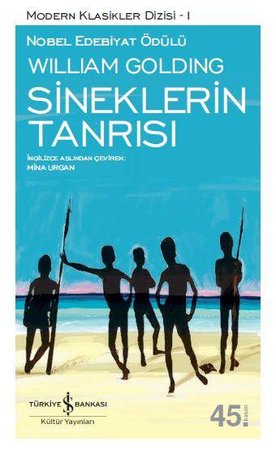

  
# Sineklerin Tanrısı - William Golding
##  261 Sayfa
### 21.10.2022
  
 

  

    
     

 
 

***Karakterler;***
- ***Ralph:*** Sarışın çocuk, lider.
- ***Domuzcuk:*** Öksüz ve kusurları olan bir çocuk.
- ***Jonny:*** 6 yaşındaki  sarışın çocuk.
- ***Sam & Eric:*** İkiz kardeşler.
- ***Merridew:***

 

> ***(Tanıtım Bülteninden - Türkiye İş Bankası Kültür Yayınları)***

***"Sineklerin Tanrısı", günümüzde bir atom savaşı sırasında, ıssız bir adaya düşen bir avuç okul çocuğunun, geldikleri dünyanın bütün uygar törelerinden uzaklaşarak, insan yaradılışının temelindeki korkunç bir gerçeği ortaya koymalarını dile getirir. Konusu, R. M. Ballantyne'ın Mercan Adası gibi eşsiz bir mercan adasının cenneti andıran ortamında başlayan bu roman, çağdaş toplumlardaki çöküntünün, insan yaradılışındaki köklerini gözönüne sermek amacıyla Mercan Adası'ndaki duygusal iyimserlikten apayrı bir yönde gelişir. Uygar insanın yüreğinde gizlenen karanlığı deşerken "Sineklerin Tanrısı"; daha çok Conrad'ın kısa romanı "Karanlığın Yüreği"ni andırır. Golding'in romanındaki çocuklar da başlangıçta tıpkı Kurtz gibi, uygar toplumun baskılarından uzak bir örnek düzen kurmak isterlerken, gitgide hayvanlaşır, korkunç bir kişiliğe bürünürler. Bu yönüyle Sineklerin Tanrısı'nın Mercan Adası ile öbür ıssız ada serüvenlerinden ayrıldığı en önemli nokta, ıssız ada yaşamının çetin güçlüklerini ya da mutluluğunu anlatmaktan daha çok, bir insanlık durumunu, kişiler arasındaki çatışma aracılığıyla ortaya koymaya çalışmasıdır.***
_____

William Golding 1911 yılında İngiltere’de doğdu. Önce fen bilimleri, sonra da İngiliz edebiyatı okuyarak Oxford Üniversitesi’nde eğitim gördü. İkinci Dünya Savaşı’ndan önce ve sonra uzun süre öğretmen olarak çalıştı. Savaşta deniz eri oldu; müttefiklerin Normandiya Çıkartması’na ve daha birçok çarpışmaya katılıp subaylığa yükseldi.

Golding, 1934’te hiç kimsenin ilgisini çekmeyen bir şiir kitabı çıkarmıştı. “Şiir yazamadığım için düzyazı yazıyorum” diyen Golding, yirmi yıl sustuktan sonra 1954’te Sineklerin Tanrısı’nı (The Lord of the Flies) yazdı. Bir söylentiye göre, yirmiye yakın yayınevi bu kitabı basmaya yanaşmamıştı. Ne var ki, Sineklerin Tanrısı basılır basılmaz, Golding büyük bir üne kavuştu.

Peter Brook, 1963’te, çağımızın klasiklerinden sayıldığı için, okullarda ve üniversitelerde okutulan bu kitabın oldukça ilginç bir filmini çevirdi. Golding, Sineklerin Tanrısı’ndan sonra beş roman daha yazdı:[1] The Inheritors, Martin Pincher, Free Fall, The Spire, The Pyramid. Bunlar da değerli yapıtlar olmakla birlikte, belki Sineklerin Tanrısı’ndan daha çapraşık, anlaşılması çok daha güç olduğundan, bu ilk kitap kadar ilgi görmedi.

Sineklerin Tanrısı’nın başlangıcını okuyanlar, bu kitabı ıssız bir adada çocukların serüvenlerini anlatan, küçükler için yazılmış bir öykü, R.M. Ballantyne’ın 1858’de yazdığı ünlü çocuk kitabı Coral Island’ın (Mercan Adası) çağdaş bir uygulaması sanırlar. Hatta Golding, kendine özgü buruk alaycılıkla, okuyucunun bu sanısını pekiştirmek istercesine, Sineklerin Tanrısı’nın başlıca iki kişisine Mercan Adası’ndaki çocuklardan aldığı Ralph ve Jack adlarını verir. Mercan Adası’nda Ballantyne, oldukça duygusal ve biraz da bön bir iyimserlikle, gemileri battıktan sonra Pasifik Okyanusu’nda ıssız bir adaya sığınan üç İngiliz gencinin, Büyük Britanya uygarlığının oldukça başarılı bir küçük örneğini nasıl yeniden kurduklarını anlatır. Golding’in kitabında da bir mercan adası ve İngiliz çocukları vardır. Ama altı ile on iki yaş arasında olan bu çocuklar, gelecekteki atom savaşı sırasında, güvenilir bir yere götürülmek üzere bindikleri uçak bir saldırıya uğradığı için bu mercan adasına düşmüşlerdir. Ve bu mercan adasında olup bitenler, Ballantyne’ın romanında olup bitenlere hiç mi hiç benzemediği gibi, Sineklerin Tanrısı bir çocuk kitabı da değildir. Hamlet’i sadece bir öç alma tragedyası ya da Moby Dick’i sadece bir balina avı öyküsü saymak ne denli yanlışsa, Sineklerin Tanrısı’nı da çocuklar için yazılmış bir serüven romanı saymak o denli yanlıştır. Hatta Sineklerin Tanrısı’na roman demek de yersizdir; çünkü bu kitap bir roman değil, gerçekçi bir anlatımla yazılmış olmakla beraber, bir alegoridir, yani simgesel anlamları olan bir öyküdür.

Victoria çağı yazarı Ballantyne’ın Mercan Adası gibi, Sineklerin Tanrısı’nda gördüğümüz ıssız ada da yeryüzünün cennetlerinden biridir. Çocuklar da bu adanın, okudukları Mercan Adası’na çok benzediğini söylerler. Ne var ki, başlangıçta bunu hiç sezinlemediğimiz halde, atom çağının çocukları, bu güzelim adayı her açıdan bir cehenneme çevireceklerdir.

Sineklerin Tanrısı, öykünün başlıca dört çocuğundan ikisinin, yani Ralph ile Domuzcuk’un tanışmalarıyla başlar. On iki yaşlarında olan Ralph, iyi huylu, zeki, güzel bir çocuktur. Deniz Kuvvetleri’nde binbaşı olan babası gelip onları kurtarıncaya kadar bu ıssız adada, yetişkinlerin baskısından uzak, çok hoş vakit geçireceklerine inandığından sevinç içindedir. Aynı sevinci paylaşmayan Domuzcuk’un gerçek adının ne olduğunu hiçbir zaman bilmeyiz. Şişmanlığından ötürü ona böyle bir ad takılmıştır. Domuzcuk, yalnız şişman olduğu için değil, neredeyse kör denecek kadar miyop olduğundan gözlük taktığı için, ikide bir nefes darlığı nöbetleri geçirdiği için ve aşağı sınıflara özgü bir şiveyle konuşan tek çocuk olduğu için ötekilerden ayrılır. Çocuklar arasında en üstün zekâlısının böyle bedensel kusurları olması ve yoksul bir aileden gelmesi, ayrıca ilginç bir ayrıntıdır bize kalırsa. Ağzını her açışında aklın ve sağduyunun sesini bize ileten Domuzcuk, çocukların durumunun korkunçluğunu gerçekçi bir gözle görür: Burası bir adadır. Ralph’ın babası da, hiç kimsecikler de, çocukların burada olduklarını bilmemektedir. Bir çaresini düşünüp kurtarılmanın yolunu bulmazlarsa, ölünceye dek burada kalacaklardır. Onun için hemen örgütlenmeleri gerekmektedir. Adanın şurasına burasına dağılmış çocukları bir araya getirmeli, kaç kişi olduklarını saptayan listeler hazırlamalı, bir toplantı yapıp kurtuluş çareleri düşünülmelidir.

Domuzcuk’un önerisi üzerine Ralph, sudan çıkardıkları şeytanminaresi biçiminde bir denizkabuğunu boru gibi öttürerek çocukları toplantıya çağırır. Toplantıda ilk alınan kararlardan biri, şeytanminaresini elinde tutana söz hakkı verilmesidir. Böylece, her toplantıdan önce öttürülen bu güzel denizkabuğu, demokratça bir düzen içinde herkesin dilediği gibi konuşmasının, yani düşünce özgürlüğünün bir simgesi olur.

Bu denizkabuğundan tüm adada duyulan bir ses çıkarabilenin doğuştan bir önder olduğunu sezmişçesine, çocuklar oybirliğiyle Ralph’ı şef seçerler. Bu karara karşı çıkan tek kişi Jack’tır. Denizkabuğunu eline almadan konuşmak isteyen, seçim yapılmadan şef olması gerektiğini küstah bir gururla açıklayan Jack’ın bir bakıma hakkı vardır; çünkü Ralph doğuştan bir önder olduğu gibi, Jack da doğuştan bir önderdir. Şu farkla ki, Ralph eşitliğe, sevgiye ve anlaşmaya inanan, iyiliğe yönelik bir önder; Jack ise kendinden başkasını hor gören, zorbaca bir baskıya inanan, kötülüğe yönelik bir önderdir. Jack görülür görülmez, onun küçük bir faşist, çekirdek halinde bir başbuğ olduğu hemen anlaşılır. Jack, katolik bir kilisenin korosunda şarkı söyleyen çocukların başıdır. Şimdi yapılan seçimde Jack’a istemeye istemeye oy veren koro üyelerinin, öteki çocuklarınkinden farklı acayip üniformaları vardır: Gümüşle süslü dört köşe şapkalar, üstüne gümüş renkli bir haç işlenmiş, yerlere kadar uzun kapkara pelerinler giyerler ve askerler gibi, ikişer ikişer, düzenli adımlarla yürürler. Sıcaktan ve açlıktan bitkin oldukları halde, onlara yere oturma iznini bile vermeyen Jack’ın sözünü dinlemek zorundadırlar.

Zorbalığa dayanan üstünlüğünü bu adaya gelmeden önce koronun başıyken kuran Jack, ileride göreceğimiz gibi, güçlendikçe zorbalığı da artırır; Leigh Lodson’un dediği gibi küçük bir Hitler’mişçesine davranmaya başlar: Ona hizmet etmedikleri, sadece meyve yiyip oyun oynadıkları, geceleri de korkudan ağladıkları için, altı yedi yaşındaki küçükleri, yaşamaları gereksiz yaratıklar sayar… Aklına esince, kulu kölesi haline gelen çocukların elini kolunu bağlatıp, hiçbir neden göstermeden onlara dayak atar; faşistlerin şatafatlı törenlere düşkünlüğüyle, yüzünü boyalarla, başını çelenklerle süsleyip, bir put gibi kurulur… Her konuşmasından sonra iki çocuğun tahta mızraklarını havaya kaldırarak “şef söyleyeceğini söyledi,” demesini emreder. Domuzcuk’u görür görmez adam yerine koymaması, “şişko” diyerek aşağılaması da, faşistlerin aydınlık kafalara karşı duydukları kinin belirtisinden başka bir şey değildir.

Jack ve Ralph arasında iktidarı elde etme savaşı açığa çıkmadan önce Ralph, Jack’ın etkileyici kişiliğine kapılır; onunla dost olmak ister. Hızlı konuşamadığı, kayalara çabucak tırmanamadığı için, Ralph, Domuzcuk’a pek önem vermez ilkin. Ama olaylar geliştikçe, şefliğinin sorumluluğu altında ezildikçe, Domuzcuk’un değerini anlar. Kendisinin şef olduğunu ve Domuzcuk’un hiçbir zaman bir şef olamayacağını bildiği halde, kafasını Domuzcuk gibi işletebilme yeteneğinden yoksun olduğunun farkındadır: “Domuzcuk düşünebiliyordu. O şişko kafası adım adım ilerleyebiliyordu… O gülünç bedeninde bir beyin vardı.” İşte bu yüzden Domuzcuk, Ralph’ın akıl hocası olur; tek başına bir beyin takımı işini görür. Ralph, şefliğinin sorumluluğunu artık taşımayacak kadar umutsuzluğa düşünce de, Domuzcuk’un direnmesi ve ona destek olması sayesinde görevini sürdürür.

İlk toplantıda olumlu kararlar alınır. Gene Domuzcuk’un önerisiyle, sahilde hemen barınaklar yapılması ve açıktan geçecek gemilere işaret vermek üzere, dağın tepesinde bir ateş yakılması kararlaştırılır. Hiçbir zaman sönmemesi gereken bu ateş, çocukların kurtuluş umudunun bir simgesi, bu ıssız adayla dünya arasında tek haberleşme aracıdır. Gel gelelim ateş yakma önerisini pek çekici bulan çocuklar, adanın büyükçe bir bölümünü ve bazı küçükleri yakarlar bu arada. Barınak yapmak için uğraşanlar ise, ancak Ralph ve Simon’dur. Sığınacak bir yerleri olması zorunluluğunu ilk kendi düşündüğü halde, aydınlara özgü bir tutum içinde, şişman bedenini yormaya pek yanaşmayan Domuzcuk, kafasını işleterek güneş saati gibi uygarlık araçlarının yapımını tasarlamayı yeğler.

Oyuna dalan çocuklar, verdikleri kararları uygulamayı ne denli savsaklasalar, ne denli beceriksizce davransalar, gene de durumu az çok idare edebilirlerdi herhalde. Ne var ki, aslında iç içe olduklarından birbirinden ayrılmaması gereken iki şey, yani Jack’ın av tutkusuyla mantık dışı bir korku, adayı korkunç bir karabasana döndürür.

Jack, çocukların et yiyebilmeleri için ava çıkmak istediğini söyler. Ama kendi de bunun farkında olmadığı halde, gerçek amacı, tıpkı savaşa benzeyen tehlikeli bir oyun oynayıp, canlı bir yaratığın kanını dökmektir. Gel gelelim, atom çağında yaşayan bir çocuk için bile, kan dökmek kolay değildir. Nitekim Jack, sürüngen bitkilere takılıp kalmış bir domuz yavrusunu öldüremez ilkin. Vuracakmış gibi bıçağını havaya kaldırır ama o bıçağın canlı bir şeyin üstüne inmesinin ne denli korkunç bir şey olacağını bildiği için, hemen davranamadığından, hayvancağız sürüngen bitkilerden sıyrılıp kaçar.

Ne var ki av, artık bir saplantı olmuştur Jack’ta. Domuzları daha kolay kıstırabileceği bahanesiyle, yüzünü gözünü renkli toprakla boyar. Hem ilkel kabilelerin adamlarına benzemek, hem de kendi benliğini maskelemek için yapar bunu. Çünkü bu boya maskesinin ardına gizlenirse, şimdiye dek boyun eğdiği tüm yasaklardan kurtulup, daha kolay kan dökebileceğini bilir.

Jack ile avcıları, domuzları yakalamanın coşkusu içinde, ateşe odun atmayı unuttukları için, dağın doruğundaki umut ateşinin sönmesiyle ilk domuzun öldürülmesi aynı saatlere rastlar. Ve tam o sıralarda, dumanı görseydi belki gelip çocukları kurtarabilecek bir gemi geçer açıktan. Ralph ile Domuzcuk acılar içinde, uzaklaşan geminin ardından bakarlarken, Jack, canlı bir yaratığı öldürmüş olmanın yabansı sevinci içindedir. Daha sonraki avlarda, özellikle bir dişi domuzun öldürülüşünde, bu sevince neredeyse cinsel diyebileceğimiz kötü bir haz da karışacaktır: Jack bıçağını dişi domuzun gırtlağına sapladıktan sonra, çocuklar hep birden kanayan hayvanın üstüne çullanırlar ve dişi domuz çocukların altında çöker: “Çocuklar tüm ağırlıklarıyla, doymuşçasına, üstünde kalırlar.” Aralarında en acımasızı olan Roger, tahta mızrağını hayvanın makatına sokunca, avcılar hep birden gülüşürler.

Jack, domuzları öldürdükçe daha yabansı, daha zalim olur. Faşistlere özgü dar kafalı şovenizmle “Ne de olsa vahşi değiliz biz. Biz İngiliziz ve İngilizler her şeyi en iyi biçimde yaparlar” diye övünen bu çocuk, vahşilerin en kana susamışı gibi davranır. Daha ilk domuzu vurduktan sonra bile, ateşi söndürdüğü için onu suçlayan Ralph’a henüz el kaldırmadığından, Ralph’ın akıl hocası bildiği Domuzcuk’u yumruklayıp yere serer, Domuzcuk’un gözlüğünün bir camının kırılmasına ve çocuğun tek gözlü kalmasına neden olur. Jack daha sonraları, aklın ve sağduyunun temsilcisini tamamıyla kör edecektir.

Ne var ki, “Biz güçlüyüz, biz ava gideriz… Eğer bir canavar varsa, biz onu avlayıp yakalarız. Çevresini sararız, vururuz, vururuz, vururuz!” diye böbürlenen Jack, gizemli bir korkunun kurbanıdır aslında. Kendi domuzları avlarken, ne olduğu belirsiz kötü bir varlığın da onu avladığını sanır.

Zamanla tüm adaya egemen olan korku, altı yedi yaşındaki küçüklerin önce “yılan gibi bir şeyden” sonra da bir “canavar”dan yakınmalarıyla başlar. Kendi benliğinde de bir canavar gizlendiği için, adada bir canavarın gizlenebileceğine aklı yatar Jack’ın. Domuzcuk, küçüklerin geceleri doğal olarak duydukları korkunun bir simgesi olan bu canavara inanmaz. O, aydınlık kafasını işleterek, böyle hayal ürünü yaratıklardan değil, ancak insanlardan korkulması gerektiğini söyler. Ralph da canavara ilkin inanmaz. Ama bir süre sonra, dağın doruğuna konan korkunç şeyi gecenin karanlığında kendi gözleriyle görünce, canavarın varlığını yadsıyamaz hale gelir.

Çocukların canavar sandıkları, ölü bir paraşütçüdür aslında. Şefliğinin sorumluluğu altında ezilen Ralph, büyüklerin dünyasından küçüklere yardım edebilecek, yol gösterebilecek bir işaret beklemişti. Kara alaycılığın bir ustası olan Golding, o gece çocuklar uyudukları, bunu göremedikleri halde, büyüklerin adadaki küçüklere bir işaret verdiklerini anlatır: Adanın üstünde bir hava savaşı sürüp gittiği sırada ışık saçan bir patlama olur; ta yükseklerden düşen ölü bir paraşütçü, çocukların tek umudu olan ateşin bir daha yakılmasını engellercesine, dağın doruğuna konar. Ve paraşüt rüzgârda şiştikçe, ölü pilot canlıymış gibi devinir durur.

Çocukların canavara inanmalarıyla birlikte, Jack ile Ralph arasındaki düşmanlık açığa çıkar. Şimdiye dek hep Ralph’ın öttürdüğü denizkabuğuyla artık Jack çocukları toplantıya çağırır. Ralph’ı korkaklık açısından Domuzcuk’a benzemekle, gerçek bir şef olmamakla suçlayan Jack, bir hükümet darbesi yapıp iktidarı ele geçirmek için kıyasıya bir savaş verir. Gerekli oyları gene elde edemediği için, demokratik yöntemlere göre yenilmiş sayılsa da, aslında bu bir yenilgi değildir. Çünkü Jack, ava gitmek ve et yemek isteyenlerin peşinden gelmelerini söyleyerek, adanın öteki ucundaki Kaya Kale dediği yüksek kayalığa çekilince, büyük çocukların tümü, bundan böyle şef olduğunu açıklayan Jack’ın, yüzü boyalı vahşilerden oluşan “kabile”sine katılırlar. Böylece çocuklar, demokratik düzenden cayıp, kabile düzenine geri dönerler.

Gerçi Domuzcuk, o güzel kafasını işleterek, dağın doruğunda canavardan ötürü yakılamayan ateşin kumsalda yakılmasını önermiştir, ama Jack ile kabilesi geceleyin barınaklara bir baskın yapıp, Domuzcuk’un tek camlı gözlüğünü çalarlar. Adada ateş yakmanın tek yolu da, Domuzcuk’un gözlüğünün merceğiyle kuru yaprakları tutuşturmak olduğu için, çocukların kurtuluş umudu olan ateş artık hiç yanmayacaktır; çünkü Jack, açıktan geçen gemilere işaret vermek için değil, ancak avladığı domuzları kızartabilmek için gözlüğü çalmıştır. Böylece çocuklar, korkularının ürünü olan canavarla birlikte, belki ölünceye dek bu adada kalacaklardır.

Canavara inanmayan tek çocuk küçük Simon’dur. Herhalde kendi iç dünyası ışık içinde olduğundan, tüm çocukların ödünü koparan karanlıklardan hiç korkmadığı için geceleyin tek başına ormana giden, ara sıra bayılıp bir çeşit sara nöbeti geçiren Simon’u, öteki çocuklar kafadan biraz çatlak bilirler. Simon herkesin derdini dert edinir: Barınakların yapılmasında Ralph’a yardım eden tek çocuktur. Jack, ava katılmadığı bahanesiyle, kızartılmış domuz etini Domuzcuk’tan esirgeyince Simon kendi payına düşeni Domuzcuk’a verir; küçüklerin erişemediği yüksek dallardan en olgun meyveleri koparıp onlara sunar. Bunlar iyi yürekli insanlara özgü davranışlardır. Ama Simon sadece iyi yürekli olmakla yetinmez. Bir mistik, bir ermiştir bu küçük çocuk. Golding, kitabını bir gazeteciyle tartıştığı sırada, Simon’un “İsa’yı andıran bir kişiliği” olduğunu, sezgileriyle gerçeği görebildiğini söylemiştir. Simon yalnız gerçeği değil, geleceği de bilir. Örneğin Ralph’ın günün birinde bu adadan kurtulacağı, evine geri döneceği içine doğduğu gibi, canavarın dış dünyada değil, çocukların kendi içlerinde olabileceğini anlar. Simon, “Bizden başka canavar yok belki” derken, Golding’in de belirttiği gibi, “insanlığın başlıca hastalığını” dile getirmek ister.

Kitaba adını veren Sineklerin Tanrısı, bu hastalığı, yani insanların içindeki kötülüğü simgeler. Sineklerin Tanrısı, üstüne sineklerin konduğu ölü bir domuz başıdır: Jack, ilkel bir insanın inancıyla karanlık güçleri yatıştırmak, kendini ve kabilesini canavardan koruyabilmek amacıyla, öldürdüğü bir domuzun başını kesip iki ucu sivritilmiş bir kazığa geçirmiş, kazığı bir put dikercesine toprağa çakarak, bu kokuşmuş domuz başını canavara sunmuştur. İngilizlerin Beelzebub dedikleri şeytanın Kutsal Kitap’taki İbranice adı, Sineklerin Tanrısı anlamına gelen Ba-al-z-bub olduğu için de Golding kitabına bu adı vermiştir.

Simon, insanları çok sevdiği halde, ara sıra tek başına kalabilmek için, ormanda gizli bir yer bulmuştur kendine. O gizli yerde Sineklerin Tanrısı ile karşılaşır günün birinde. Çocukların karabasanlarına giren canavar olduğunu açıklayan Sineklerin Tanrısı, çocuklar arasında ancak Simon’un gerçeği bildiğinin farkındadır; çünkü ancak Simon canavarın çocukların içinde olduğunu, bundan ötürü de hiçbir zaman öldürülemeyeceğini anlamıştır. Sineklerin Tanrısı kahkahalar atarak, “Sen biliyordun değil mi? Sizlerin bir parçası olduğumu biliyordun? (…) Her şeyin bozulmasının nedeniyim ben. Bunu biliyorsun, değil mi?” der. Sonra da Simon’u uyarır: “Seni istemiyorlar… Biz eğleneceğiz bu adada.” (Bu “eğleneceğiz” sözü, adaya ilk geldikleri sırada, Ralph’ın “Bu güzel yerde çok eğleneceğiz.” demesinin korkunç bir yankısı gibidir). “Onun için bir haltlar çevirmeye kalkma, benim zavallı yolunu şaşırmış çocuğum, yoksa… Yoksa seni yok ederiz. Anladın mı?” Ve Sineklerin Tanrısı koskocaman kapkaranlık ağzını açınca, Simon, bu ağzın içine düşercesine yere yıkılır, bir sara nöbeti geçirir.

Ne var ki, Simon acı bir gerçekle, yani kendi benliğinde hiç bulunmayan kötülüğün çoğu insanların içinde var olduğu gerçeğiyle karşılaştığı halde, bu kötülüğü simgeleyen Sineklerin Tanrısı, Simon’u yutup yok edememiştir gene de. Simon kendine gelir gelmez, dağın doruğuna çıkmaya karar verir. Orada bir canavar olmadığını çoktan sezmiştir: “Simon canavarı düşündükçe, gözünün önüne bir insan geliyordu: Hem yiğit, hem de hasta bir insan.” Nitekim gecenin karanlığında, bitkin bir halde, düşe kalka dağa tırmanınca, canavar sanılan şeyin aslında ne olduğunu görür. Ölü pilot gülünç bir kukla gibi devinip durmasın diye, paraşütün kayalara ve çalılara takılmış iplerini çözer. Sonra, durumu bildirmek üzere dağdan iner.

O sırada korkunç bir fırtına patlak vermiştir. Kapkaranlık gecede çıkan şimşeklerden, gök gürültüsünden ödü kopan çocukları oyalamak için, Jack çılgın bir dansa zorlar onları. Canavarı nasıl öldüreceklerini simgeleyen bu dans, çocukları korkudan koruyacak bir çeşit büyü gibidir. Bir halka yapan –ve ne yazık ki, aralarında Ralph ile Domuzcuk da bulunan– çocuklar, hep bir ağızdan “Canavarı gebert! Gırtlağını kes! Kanını dök!” diye bağıra bağıra tepinirlerken, yürüyecek hali olmadığından emekleye emekleye ilerleyen Simon, ormandan çıkar; “Tepedeki ölü adam” diye bir şeyler anlatmaya çalışarak halkanın içine girer. Ve hem korkudan deliren, hem de yabansı bir öldürme hırsına kapılan çocuklar, canavarın olmadığını müjdelemeye gelen Simon’u canavar sanıp paramparça ederler. Simon’un ölümüyle birlikte güçlü bir rüzgâr, ölü pilotun paraşütünü şişirir; paraşüt dağın doruğundan havalanır, adanın üstünden uçar, ölüyü alıp okyanusa gömer.

Gerçi canavar artık yok olmuştur, ama Jack ile kabilesinin yüreklerinde olanca gücüyle yaşamaktadır hâlâ. İşte bu yüzdendir ki, kafası en aydınlık olan çocuk, karanlık güçlerin ikinci kurbanı olacak, üçüncü kurbanın verilmesine ramak kalacak ve kitabın başlangıcında bir cennet olan bu güzel ada bir yangın yerine dönecektir.

Belirli koşullar altında yetişkinler böyle davranabilir, ama altı ile on iki yaş arasında küçük çocuklar, uygar dünyanın baskısından uzaklaşınca, nasıl böylesine vahşileşebilir, kan dökecek kadar acımasız olabilir diye düşünen birçok kişi, küçüklerde bile bu kadar korkunç bir biçimde belirdiğine göre, Sineklerin Tanrısı’nda kötülüğün insan yaratılışında doğuştan var olduğu görüşünün savunulduğu kanısına varıp dehşete kapılmıştır. Okuyucuların duydukları bu dehşeti doğal saymalı; çünkü çocukların tertemiz birer melek oldukları konusunda, yanlış olduğu kadar da yaygın bir inanç vardır. Oysa kendi çocukluğuna ve yakından tanıdığı çocuklara duygusallıktan arınmış gerçekçi bir gözle bakabilenler, çocukların küçük birer melek değil, tıpkı yetişkinler gibi birer insan olduğunu bilirler. İnsanlarda ise, ister büyük ister küçük olsunlar, hem iyi hem de kötü içgüdüler vardır. Anayla baba ve eğitim kurumları, çocuğu olumlu biçimde etkilemeye, iyiye yönelen içgüdülerini geliştirip kötüye yönelen içgüdülerini engellemeye çalışırlar. Uygarlığın amacı da budur aslında. Bu uygarlık süresi içinde en büyük görev topluma düşer. Oysa Sineklerin Tanrısı’ndaki çocuklarda, kötülüğe yönelik duygular kökünden kazılmamış, bazı yasaklarla sınırlandırılmıştır ancak. Örneğin çocukların en acımasızı olan Roger, deniz kıyısında tek başına oynayan bir küçüğü taşlamak istediği halde, adaya gelmeden önce bellediği bazı yasaklardan ötürü, bunu yapamaz ilkin. Çocuğun çevresine taşlar atmakla yetinir. Ama daha sonraları, yazarın deyimiyle “yıkılıp giden” bir uygarlığın koyduğu yasaklara aldırmadan, koskocaman bir kayayı Domuzcuk’un üstüne devirir. Roger ve öteki çocuklar, “yıkılıp giden” bir uygarlıkta değil de, barış ve sevgiye dayanan gerçekten uygar bir ortamda yetişselerdi, başka türlü davranırlardı elbette. Ne çare ki, atom ve nötron bombası çocuklarıdır bunlar. Üçüncü Dünya Savaşı’nda, tehlike bölgesinden kaçarken, uçaklarının bir saldırıya uğrayıp düşmesi sonucu bu adaya sığındıklarını unutmamalı. Bu savaş, kapitalist ülkelerle sosyalist ülkeler arasındadır herhalde. Çünkü bir ara Ralph, belki de “kızılların” onları tutsak alacağını söyleyince, çocuklardan biri, kızılların Jack’tan beter olamayacaklarını ileri sürer. Geceleyin havadaki patlamadan ve ölü pilotun adaya düşmesinden anlaşılacağı gibi, çocukların arasındaki savaş olanca hızıyla dış dünyada da sürmektedir. Çocuklar bir İngiliz kruvazörüyle adadan götürülünce, onların gerçekten kurtulduklarına inanmak da kolay değildir. Çünkü bu çocuklar bir savaş ortamına döneceklerdir gene. Hatta Jack’ın kabilesinin Ralph’ı avladığı gibi, bir düşman gemisi bir kruvazörü avlayacaktır belki de.

Sineklerin Tanrısı, İkinci Dünya Savaşı’ndan kısa bir süre sonra, bu savaşta yıllarca çarpışan insanların birbirlerine nasıl kıydıklarını kendi gözleriyle görüp, birçok umutlarını yitiren biri tarafından yazılmıştır. Ne var ki, kimi eleştirmenlerin sandığı gibi, Golding’in tüm insanların doğuştan kötü olduklarını savunduğu, umarsız ve kapkara bir kötümserliğe kapıldığı söylenemez gene de. Golding, insanların tümüyle kötü olduklarına değil, dış dünyada da, insanların iç dünyasında da iyilikle kötülüğün, aydınlık güçlerle karanlık güçlerin çarpıştığına inanır aslında. Bu kitapta, ancak Simon yüzde yüz iyi ve ancak Roger yüzde yüz kötüdür. Her insanda olduğu gibi, öteki çocuklarda da hem iyilik bulunur, hem kötülük. Ralph ile Domuzcuk’un kötü yanları, Jack’ın da iyi yanları vardır. Şu farkla ki, Ralph ve Domuzcuk’ta iyilik ağır basar, Jack’ta ise kötülük. Gerçi çocukların çoğu Jack’tan yana çıkar ama bunun gerçek nedeni yaratılıştan kötü oluşları değil, sadece güçsüz olmalarıdır. Çocuklar Ralph’ın yanında kalıp, barınakların yapımında uğraşmak ya da Domuzcuk’un akıllı sözlerini dinlemek gibi can sıkıcı işlere katlanamazlar. Yüzlerini boyayıp eğlenebilmek için, ava gidip domuz etiyle karınlarını doyurabilmek için, büyüklerden öğrendikleri savaş oyunlarına heveslendikleri için ve her şeyden fazla canavardan korktukları, onları koruyacak birini aradıkları için Jack’a boyun eğerler, kabileye katılırlar.

Çocukların güçsüzlüğünden ve korkularından yararlanan Jack’ın zorbalığı öylesine korkunç boyutlara varır ki, avladığı domuzun başını canavara sunduğu gibi, Ralph’ı da avlayıp, başını iki ucu sivriltilmiş bir değneğe geçirerek canavara sunmak ister. Sineklerin Tanrısı tamamıyla egemen olmuş gibidir çocuklara. Ne var ki, kitabı bitirip de, Simon’un akıl yolundan hiç şaşmayan ermişliğini, ayrıca ölmeden önce yücelen Domuzcuk’un kabileye meydan okurcasına uygarlığı savunmasını ve karanlık güçlere karşı sonuna kadar direnip, sonunda gene şef olduğunu açıklayan Ralph’ın yiğitliğini düşündükçe, Sinekler Tanrısı’nı yenmenin yolları olduğunu da anlarız.

***Mina Urgan***  
***-Sonsöz-***
____

 

### Kitaptan Alıntılar ;
- ***"Bir acıya, içe dönük yoğun bir düşünceye kapılmışçasına, solgun yüzü değişti." (s.4)***
- ***"Bana ne derlerse desinler, aldırmam." (s.6)***
- ***"Ölünceye dek kalabiliriz burada." (s.9)***
- ***"Herkesten kaçan, herkesten gizlenen, kendi içine kapanmış, hiç kimsenin tanımadığı ince bir çocuk vardı orada." (s.19)***
- ***"Bir dahaki sefere acıma nedir bilmeyecekti." (s.31)***
- ***"Nereye gideceğimizi belki biliyorlar, belki de bilmiyorlardı. Ama nerede olduğumuzu bilmiyorlar; çünkü biz gideceğimiz yere varamadık." (s.35)***
- ***"Daha önce de söyledim bunu; günün birinde kurtarılacağız. Ancak, beklememiz gerek; işte bu kadar." (s.47)***
- ***"İlk yapılması gereken şeyleri hemen  yapmazsanız, gerektiği gibi davranmazsınız, gelip sizi kurtaracaklarını ummaya ne hakkınız var." (s.50)***
- ***"Bunun aslı yok elbette. Bir duygu ancak. Ama sanki sen avlanmıyorsun da... seni avlıyorlar. Sanki biri var, senin hep peşinden gelen." (s.59)***
- ***`"Hiç kimsenin tam sanıldığı gibi olmadığını anlatmak istiyordu." (s.61)`***
- ***"...yaşamları öylesine dopduluydu ki, umuda gerek duymuyorlar, umudun ne olduğunu unutuyorlardı o sırada." (s.65)***
- ***"Yani çok mu işimize yarar saatin kaç olduğunu bilmek!" (s.74)***
- ***"...öylesine mutluydu ki, bu mutluluğu cömertçe paylaşmak istiyordu başkalarıyla. Yığınla anı vardı belleğinde." (s.80)***
- ***"Her yolu kendin bulmak zorunda olduğun ve çoğu zaman ayağını nereye bastığına dikkat etmen gerektiği böyle bir yerde yaşamanın..." (s.89)***
- ***"Bu toplantıda yalnış bir şey yapılmamalıydı; hayal peşinde koşulmamalıydı..." (s.89)***
- ***"Yoksa anlamıyor musunuz siz? Anlamıyor musunuz ki, ateşin sönmemesi için... ölümü bile göze almalıyız..." (s.95)***
- ***"Her şey bozulmakta. Neden bilmiyorum. İyi başlamıştık, mutluyduk. Sonra... Sonra korkmaya başlanıldı." (s.96)***
- ***"Elbette, zaman zaman korktuğumuz olur hepimizin." (s.97)***
- ***"Yani korku sizlere zarar vermez, düşlerin zarar veremediği gibi." (s.97)***
- ***"Her şeyin bir doktoru vardır. Kafamızın içinin bile bir doktoru vardır." (s.99)***
- ***"Kurallardan başka bir şeyimiz yok ki bizim!" (s.108)***
- ***"Ama ya her şey saçmaysa?" (s.110)***
- ***"Birinden korkunca ondan nefret edersiniz ama boyuna da düşünüp durursunuz onu. Kendi kendinizi aldatırsınız; aslında kötü değildir dersiniz. Ama onu görünce, tıpkı nefes darlığına tutulmuş gibi olursunuz, soluk alamazsınız." (s.111)***
- ***"Hepimiz bir yanlara sürüklenip gidiyoruz. Her şey berbat oluyor." (s.111)***
- ***"Seni tek başına bırakmazdım." (s.126)***
- ***"Nereden geldinse, oraya döneceksin." (s.133)***
- ***"Niçin benden nefret ediyorsun?" (s.143)***
- ***"En büyük düşünceler, en basit olanlarıdır." (s.158)***
- ***`"Gölgeler kadar sessiz olmayı öğrenmişti artık." (s.163)`***
- ***"Öyle ki, gerçek bilinen şeyler, anlatılması olanaksız bir hayale dönmüştü." (s.168)***
- ***`"Korkuyorum." (s.169)`***
- ***`"İşleri yoluna koyup devam etmek zorundayız." (s.170)`***
- ***"Bir şey söylenmedi, bir şey yapılmadı." (s.187)***
- ***"Hep aklımdaydı söylemek istediğim. Hiç unutmamıştım." (s.212)***
- ***"Sen bir hayvansın! Bir domuzsun! Kahrolası, kahrolası bir hırsızsın üstelik!" (s.220)***
- ***"Hayır. Onlar bu kadar kötü olamaz." (s.227)***
- ***`"Gölgeler arasında diz çöktü; yalnızlığını hissetti acılar içinde." (s.228)`***
- ***"İnsan uykusuzluğa ne kadar zaman dayanabilirdi?" (s.234)***
- ***"Ah, insanın düşünebilecek vakti olsa!" (s.240)***
- ***"Ralph'ı şimdi en çok korkutan şey, beynindeki perdeydi." (s.241)***
- ***"Biz insanlardan başka canavar yok belki!" (s.257)***
- ***"İnsanlarda ise, ister büyük ister küçük olsunlar, hem iyi hem de kötü içgüdüler vardır." (s.259)***