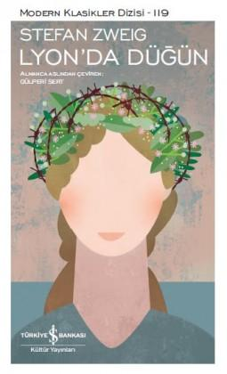

# Lyon'da Düğün - Stefan Zweig
##  50 Sayfa
### 16.11.2022
  
 

  

    
     

 
 

> ***(Tanıtım Bülteninden - Türkiye İş Bankası Kültür Yayınları)***

***Lyon’da Düğün Fransız Devrimi sırasında yaşanan kargaşa ve zulüm günlerinde ölüme yaklaşan insanlara umut veren bir aşkın hikâyesidir. 1793’te kentte kurşuna dizilmeyi bekleyen karşı devrimcilerin toplandığı hapishane tuhaf bir nikâha sahne olur. İki Yalnız İnsan, acı çeken iki çaresiz insanı buluşturur. Birinin yüreğinden kopan çığlık diğerininkinde karşılık bulurken, farkında olmadan birbirlerinin yıllar süren yalnızlığına son verirler. Wondrak ise yazarın savaş karşıtı yapıtlarından biridir. Bohemya’nın küçük bir kentinde çirkinliğiyle sürekli alaya maruz kalan bir kadın tecavüze uğradıktan sonra doğurduğu çocuk sayesinde yaşama tutunmuştur, ama patlak veren Birinci Dünya Savaşı yüzünden oğlunu askere alarak ondan koparmaları söz konusudur. Zweig bu öykülerde toplum dışına itilmiş karakterleri üzerinden insanlık durumunu analiz eder. Karakterlerinin başlarından geçenler “yazgı” değil, insanlığın iflasının sonucudur.***
_____

 

### Kitaptan Alıntılar ;
- ***"Artık hiçbir beklentileri kalmamıştı, hayata, yaşayanlara çoktan sırt dönmüş, hiç hareket etmiyorlardı." (s.3)***
- ***"Mahzendeki hükümlüler, yeni gelenlere soğuk soğuk baktılar, çünkü insan doğasının garip bir yanı da her yere çabuk uyum sağlaması, geçici olarak bulunduğu yerde kendini evinde hissetmeyi bir hak olarak görmesidir." (s.4)***
- ***"Öncesinde korkunç bir şekilde tepelerine çöken sessizlik, anlamsızca meydan okumanın gerginliğiyle daha da sıkıcı bir hal aldı." (s.4)***
- ***"Çünkü sevdiğinin artık yaşamadığı, kendisinin ona kavuşmak için can attığı bu dünyada yapacağı hiçbir şey kalmamıştı." (s.7)***
- ***"Hayır, o mutluydu, sonsuzca mutluydu, çünkü sevdiğiyle aynı saat öleceğini biliyordu ve biri diğeri için yas tutmak zorunda kalmayacaktı. Mutluluğunu gölgeleyen tek bir şey vardı, Tanrı katına sevdiğinin ismiyle, onun eşi olarak çıkamayacaktı." (s.8)***
- ***"O anda hiç kimse ölümü aklına getirmiyordu, ölümü hissedenlerde artık ondan korkmuyordu." (s.10)***
- ***"Şu birkaç saatin tadını çıkarın, hiçbirimize tek bir nefeslik yaşam dahi ikinci bir kez verilmeyecek ve böyle bir anda aşkı bulan onun keyfini çıkarmalıdır." (s.10)***
- ***"Çünkü garip ve mutlu bir duygu seli hepsinin üzerine suskunluğun kanatlarını germişti ve kendi yazgıları karşısında çaresizce hiçbir şey yapamayan bu insanlar, başkalarına bir avuç mutluluk  verebildikleri için çok mutluydular." (s.11)***
- ***"Sadece çiçeklerden yapılmış  tacı sulara gömülen gelinin başından kolayca ayrıldı, dalgaların üzerinde bir süre anlamsız ve tuhaf bir halde sürüklendi. Sonunda o da kayboldu, onunla birlikte ölümün dudaklarından kurtulmuş ve hatırlanmaya değer aşk gecesinin hatırası da sonsuzluğun içinde kaybolup gitti." (s.13)***
- ***"Sakatlığı, onu yalnız kalmaya alıştırmıştı ve bu yalnızlığı içinde de dünya nimetlerinden feragat eden birinin umursamazlığıyla, içine kapanık bir filozof yapmıştı." (s.15)***
- ***"Onun dışında her yerde sessizlik vardı, suskun düşüncelerle konuşmaya başlayan bir sessizlik." (s.16)***
- ***"Yapma böyle Jula. Ağlamakla hiçbir şey halledilmez." (s.17)***
- ***"Birkaç kendini bilmez aptal için üzülme!" (s.17)***
- ***"Çünkü acısını azaltmak istemiyordu, acı çeken herkes gibi acı çekmekten memnundu." (s.17)***
- ***"Beni üzen onlar değil ki. Her şey, tüm yaşamım üzüyor beni.  Bazen kendimi düşündüğümde, ben bile kendimden tiksiniyorum. Ben neden bu kadar çirkinim? Benim elimde değil ki. Fakat hayatım boyunca bu yükü  taşıyorum. Daha çocukken bana bakıp güldüklerini hissediyorum. Bu nedenle başka çocuklarla oynamayı hiç istemedim, onlardan hep çok korktum ve onları kıskandım." (s.18)***
- ***"Hiç kimsenin  hayatı benim hayatım kadar zor olamaz. Benim hiç annem olmadı, hiçbir insan bugüne kadar bana güzel bir şey söylemedi. Her genç kız sevgilisiyle gezmeye çıkarken, ben hep yalnızım ve bunun hep böyle devam edeceğini, böyle devam etmek zorunda olduğunu biliyorum, başkaları gibi hissetsem de bu durum değişmeyecek. Tanrım neden bu böyle?" (s.18)***
- ***`"Şimdiye kadar hiç kimseye söyleyemediklerini, hatta kendilerine bile itiraf edemedikleri şeyleri birbirlerine anlatıyordu bu iki yalnız insan, oysa birbirlerini doğru dürüst tanımıyorlardı bile. Fakat birinin yüreğinden kopan çığlık diğerinde karşılık buluyordu, çünkü onların acıları akrabaydı." (s.19)`***
- ***"Kusurlarını görmeden birbirlerini anlamanın kör duygusu bu iki yalnız insanın üzerine bir mutluluk gibi inmişti." (s.19)***
- ***"Sakat ve biçimsiz varlık yeterince sıkıntısı, derdi yokmuş gibi sağlıklı ve kusursuz varlıkların nahoş davranışlarına da katlanmak zorunda kalır." (s.23)***
- ***"Bu nedenle şaşı bir göz, yamuk bir dudak, yarılmış bir ağız gibi doğanın bir kereliğine yaptıği bir hata, bir insanın gittikçe artan acısına, ruhunda onarılmayacak bir yaraya dönüşebilir; etrafımızı saran, dünya dediğimiz ve inanmakta güçlük çektiğimiz gezegendeki anlam ve adalete olan inancımızı şeytani bir felakete dönüştürür." (s.23)***
- ***"Haklı olarak kendisine Kurukafa dendiğini Ruzena Sedlak çocukluğundan beri biliyordu; konuşmayı öğrenirken kusurunu da öğrenmişti ve yaşamının her saniyesi, bu bir parça eksik kemik yüzünden içinde yaşadığı toplum tarafından acımasızca dışlandığını hatırlatıyordu ona." (s.23)***
- ***"İnsanlardaki çirkinliği fark etmeyen, yalnızca iyi hisseden hayvanlar dışında hiç kimsenin gözbebeğine baktığını, bir gözü yakından gördüğünü hatırlamıyordu Ruzena." (s.23)***
- ***"Sekiz yıl boyunca sadece ormanda yaşadı, çok sevdiği hayvanlar içinde insanları unuttu, insanlar da onu unuttu." (s.24)***
- ***"Kendi çirkin vücudundan başka hiçbir şeyi olmayan Sedlak'ın bir şeyi vardı artık. Kendisinden sonra da yaşayacak, ona muhtaç, ona ihtiyaç duyan bir canlı yaratmıştı." (s.28)***
- ***`"Ancak belediyedeki o kahrolası defterde kayıtlıydı. O deftere kayıt olan bir daha özgür olamıyordu." (s.29)`***
- ***"Ruzena bembeyaz kesildi. Bir anda yüzündeki kan çekilmişti sanki. Oğlunun da on sekiz yaşına geleceğini ve onu kendisinden koparacaklarını hiç düşünmemişti. Şimdi anlamıştı. Bu nedenle bir zamanlar onu kahrolası deftere kaydetmişlerdi. Belediyede, o hırsızlar, oğlunu kendi savaşlarına sürüklemek için yapmışlardı bunu." (s.31)***
- ***"Yoksulların bile oğulları alınıp askere gönderilir..." (s.35)***
- ***"Kanı tamamen çekilmiş gibiydi, içerideki havadan donmuştu sanki. İçi de kopacak kadar gerilmişti. Bu kadar gerginlik insanı felç eder." (s.43)***
- ***"Daha fazla dayanacak gücü kalmamıştı, üzerinde zaman baskısı vardı. Zaman sonsuz gibiydi, geçmek bilmiyordu." (s.43)***
- ***"Kadınlara böyle davranamazsın. İnsanlar böyle bir şeye tahammül etmezler. İşin gerçeği, kadın söz konusu olduğunda insanlar çıldırırlar. Kadınları bu tür konuların dışında bırakmak gerekir." (s.49)***
- ***"O orada olduğu müddetçe ümit vardır." (s.49)***
