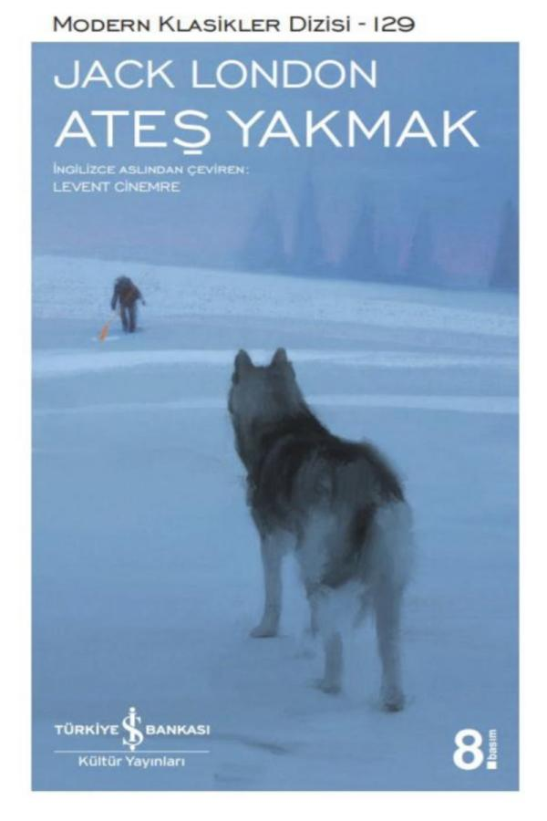

  
# Ateş Yakmak - Jack London
##  58 Sayfa
### 18.11.2022
  
 

  

    
     

 
 

> ***(Tanıtım Bülteninden - Türkiye İş Bankası Kültür Yayınları)***

***Jack London, Kuzey topraklarını konu alan eserlerinde okurlarını buzla sarmalanmış bir diyarda adım adım gezdirir. Biri 1902’de, öbürü 1908’de yayımlanan ve “Ateş Yakmak” başlığını paylaşsalar da birbirlerinden olay örgüsü yönünden ayrılan iki hikâyeyle, “Yaşama Azmi” adlı üçüncü bir hikâyenin bir araya getirildiği bu derlemede de Jack London insanın buz kaplı doğayla ve kendi benliğiyle yüzleşmesini anlatır.  Gençliğinde Klondike bölgesine altın aramaya giden ve soğuğun hüküm sürdüğü bu topraklarda bizzat yaşamış olan London, Alaska’dan Yukon’a, Kolondike’ten Kanada tundralarına kadar yörenin coğrafyasına ve sakinlerine oldukça hâkimdir. Jack London’ın karakterleri Kuzey’in dört bir yanda uzanan bembeyaz topraklarında vahşi doğanın gücüyle amansız bir mücadele halindedir. Doğanın, soğuğun ve pek iyi bilmedikleri bir coğrafyanın pençesinde, hayata tutunmaya çalışırlar.  Ve ateş yakmak, bu varoluş mücadelesinin ilk adımıdır.***
_____

 

### Kitaptan Alıntılar ;
- ***"Güneşsiz  günlere alışıktı. Güneşi görmeyeli günler olmuştu." (s.1)***
- ***"Onun sorunu, hayal gücünden yoksun oluşuydu." (s.2)***
- ***"Bir şeylere kafa yormaya meraklı biri değildi." (s.5)***
- ***"Konuşacak biri yoktu yanında." (s.5)***
- ***`"Halbuki nasıl da kahkahalarla gülmüştü ona! Bu olayın da gösterdiği gibi, insan her konuda kendinden fazla emin olmamalıydı." (s.9)`***
- ***"İnsanların yapması gereken  tek şey telaşa kapılmamaktı." (s.12)***
- ***"Nasıl olsa donmaya mahkûmdu, hiç olmazsa bunu yakışık alır biçimde karşılayabilirdi. Yeni bulduğu bu iç huzuruyla birlikte uykunun da ilk belirtileri ortaya çıktı. Ölüme uyuyarak varmak ne güzel fikir diye düşündü. Sanki yatıştırıcı bir ilaç almış gibi olacaktı. Donmak insanların sandığı kadar kötü bir şey değildi. Ölmenin çok daha feci yolları vardı." (s.20)***
- ***"Uzun kara ve deniz yolculuklarına çıkarken insanın yanında bir yol arkadaşının bulunması, genel olarak dünyanın her yerinde istenen bir şeydir." (s.23)***
- ***"Çünkü Kuzey Topraklarının bir başka kuralı şöyle der: Eksi otuz altı dereceye kadar ıslak çoraplarla yola devam edebilirsin ama daha soğuk havalarda ateş yak." (s.27)***
- ***"Yaşadılar ve attılar zarlarını.   Oyundan çok şey kazanılacak,   Ama yitireceğiz zarların en hasını." (s.33)***
- ***`"Kalbi de sıkıntı veriyordu adama." (s.43)`***
- ***`"Hayat böyleydi işte! Ne kadar boş, ne kadar kısaydı..." (s.47)`***
- ***`"Öldükten sonra acı duyulmazdı. Ölmek, uyumak demekti. Durmak istirahat etmekti. O halde neden ölmeye razı olmuyordu?" (s.48)`***
- ***`"Aslına bakılırsa hey ecan ve duygu denen şey çoktandır terk etmişti onu. Acı da hissetmiyordu artık." (s.52)`***
- ***"Gerçi korkmamıştı da... Korkunun ötesine geçeli çok olmuştu." (s.53)***
