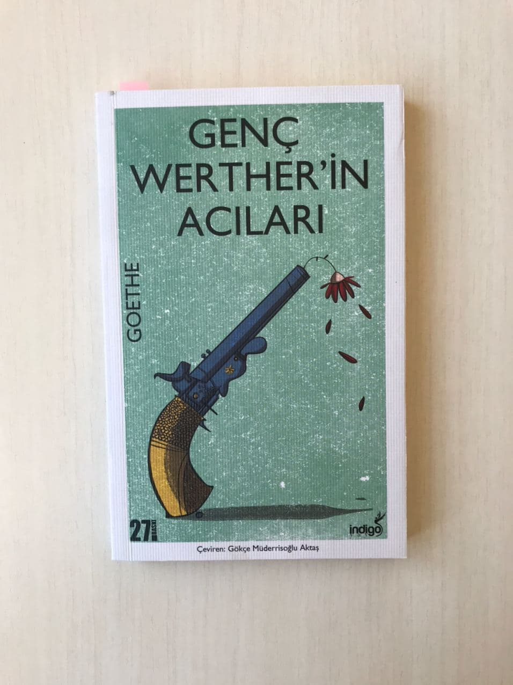

<table><tr>
<td align="left"> 
  
# Genç Werther'in Acıları - Goethe
## 160 Sayfa
### 08.09.2020

  
</td>
<td> 
  

    
     
    
  
 
</td>

</tr></table>

***Karakterler ;***
- ***Werther:*** Kahramanımız ,  genç bir hukuk stajyeri
- ***Wİlhelm:*** En yakın arkadaşı
- ***Charlotte Lotte:*** Aşık olduğu kadın , ama nişanlı
- ***ALbert:*** Charlotte'un nişanlısı

 

Genç Werther'in Acıları , Goethe , tarafından 1774 yılında yazılmış mektup türünde yazılmış bir romandır. Romanın basılmasının ardından Almanya da intihar vakaları birden bire artmıştır.. Werther adındaki bir gencin , nişanlı bir bayan olan Lotte ile intiharına kadar geçirmiş olduğu ızdırap dolu günleri konu almaktadır.

Werther taşındığı bu vadide arkadaşlarıyla bir partiye davet edilir. Arkadaşları Werther'e,  gidecekleri evdeki kızın çok güzel olduğunu ve o kızın nişanlı olduğunu o yüzden o kıza âşık olmamasını tembih ederler
Gittikleri bu evde soylu bir ailenin güzel kızı olan Lotte'ye rastlar ve daha ilk andan itibaren ona âşık olur. Werther hergün vadinin öbür ucuna Lotte'yi görmeye gitmeye başlamıştır. Lotte bu aşkına kayıtsız değildir ama Albert adında biri ile nişanlıdır.  Albert işi gereği uzaklarda olduğu için onun yokluğunda Werther ve Lotte birçok kez bir araya gelebilmekte ve güzel bir dostluk kurabilmektedir.

Werter aşkını kalbine gömüp Lotte ile olan diyaloguna devam ederken ona dokunamamak ve aşkını dile getirememek yüzünden acılarla boğuşmaktadır. Werther,  Albert ve Charlotte'u unutmak için başka şehre taşınır. 
***"Sinsi bir hastalığın önlenemez bir şekilde her geçen gün ölüme yaklaştırdığı bahtsız birinden, hançerle işkencesine bir anda son vermesini isteyebilir misin? Gücünü tüketen hastalık, aynı zamanda ondan kurtulma cesaretinden de onu yoksun bırakmaz mı?"(sf.41)*** Fakat oradaki insanlara alışamaz. Bir süre orada yaşadıktan sonra tekrar vadideki evine döner.

> *Albert ve Charlotte evlenince Werther bu aşktan vazgeçmesi gerektiğini düşünmeye başlamıştır. Werther bunun böyle olmayacağını düşünerek hergün acı çekmektense intihar etmeyi düşünmeye başlar... Albert'ten bir tane silah ister ve ALbert'te , Charlotte'a silahı vermesini ister.. Uşağı Charlotten aldığı silahı Werther'e getirir.. Silahı Charlotte'un verdiğini duyan Werther , Charlotte'un elleriyle kendisini öldürdüğünü düşünür..*

> *Werther ölmeden önce Charlotte'u ilk gördüğü gün giydiği giysileri giyer ve cebine Charlotte'un elbisesinin kurdelesinin bir parçasını koyar. Arkadaşı Wilhelm'a da ölmeden önce bir mektup yazar. Werther, Lotte'ye bir mektup yazarak " Alınyazısı bu, önüne geçilmez. Lotte! Elveda Lotte! Elveda" sözleriyle mektubuna ve yaşamına son verir...*

> ***Werther’in intihar ettiğini duyan Charlotte bayılır. Werther’i  vasiyet ettiği yere giysileriyle gömerler.***

***- SON -***

   
    

### Kitaptan Alıntılar ;
- > ***" Charlotte'un hayali peşimi bırakmıyor. Uykuda da uyanıkken de tüm ruhumu kaplıyor! Gözlerimi kapatır kapatmaz zihnimde , görme gücümün toplandığı alanda onun koyu renk gözlerini görüyorum. Bunu nasıl anlatabileceğimi bilmiyorum ama gözlerimi  kapattığım anda , o gözleri karşımda buluyorum. Uçurum gibi önüme uzanıp , beni içine çekiyor.. İnsan ne tuhaf bir varlık ? En gerektiği anda tüm güçlerini kaybediyor. Neşeden sarhoş olsa da aslında yine de kapalı  bir alana kısılıp kalmış değil mi ? Sonsuzluk içinde yitip gitmek istediğinde de aslında dönüp dolaşıp yine o soğuk ve sıradan varlığa gelmez mi ? "***
- > ***" Wilhelm , kalplerimizdeki sevgi olmasa , dünyanın ne anlamı olurdu ? "***
- > ***" Bana gülme Wilhelm , mutluluk bir kandırmaca mı ne dersin  ?"***
- > ***" Dünyada sevgi kadar vazgeçilmez bir şey daha yoktur. "***
- > ***" ilk izlenim çok önemli , en inanılmaz şeylere bile inanmaya programlanmışız ve bunlar hafızamıza bir kez kazındı mı , onları silmeye çalışanın vay haline. "***
-  ***" İnsanın kendini ve çevresindekileri kemirip durmadığı tek bir an bile yoktur. Farkında bile olmadan herşeyi yıkar geçer. En masum yürüyüş bile , binlerce zavallı böceğin ölümüne neden olur. Tek bir adım , çalışkan bir karıncanın yuvasını mahvedip , küçük bir dünyayı yerle bir eder. "***
-   ***" Benim zekama ve yeteneklerime , hislerimden daha fazla değer veriyor oysa benim için asıl önemli olan hislerim. Gücümün , mutluluğumun ve kederimin tek kaynağı onlar. Sahip olduğum diğer tüm bilgileri başkaları da edinebilir. Ancak hislerim yalnızca bana ait. "***
-   > ***" Bazen onu dünyadaki her şeyden daha fazla severken kendimi ona adamışken , sadece onu düşünüp , başka hiç bir şey istemezken , onun nasıl olupta bir başkasını sevebildiğini , buna nasıl cüret ettiğini anlayamıyorum. "***
-    ***" Hayatta gerçekten değerli nadir şeylerin sahibi olan insanların bunların değerini bilmemesi beni kahrediyor. "***
-    ***" Eğer ölecek olursam ve bu çemberin dışına çıkarsam , yokluğumu hissederler mi ? Ya da ne kadar süreyle bunu hissederler ? Kaç gün ? İnsanoğlu böyle geçicidir. Kendi varlığına en çok inandığı , sevdiklerinin anılarında ve kaplerinde derin izler bıraktığını sandığı yerlerde bile , hızla silinip gider... "***
-    > ***" Çok şeye sahibim ama ona olan sevgim her şeyi silip atıyor. Çok fazla şeyim var ama onsuz hiçbir şeyim yokmuş gibi. "***

