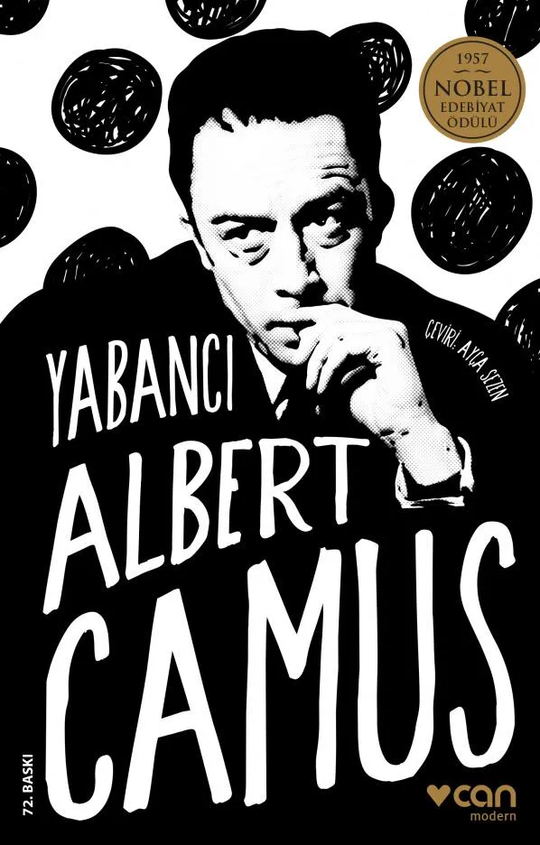

# Yabancı - Albert Camus
##  110 Sayfa
### 29.07.2023
  
 

  

    
     

 
 

***Karakterler;***
- ***Meursault:*** Romanın baş karakteri olan Meursault, 27 yaşında, sıradan bir adamdır. Cezayir'de yaşar ve bir memur olarak çalışır.
- ***Marie:***  Meursault'un sevgilisi olan Marie, güzel ve çekici bir kadındır. Meursault'un aksine, Marie duygusal ve hissiyatlıdır. 
- ***Céleste:*** Meursault'un komşusu olan Céleste, iyi kalpli ve yardımsever bir adamdır. Meursault'u çok sever ve ona her zaman yardım eder. Meursault'un idamından sonra Céleste, çok üzülür ve onu asla unutmaz.
- ***Raymond:*** Meursault'un arkadaşı.

> ***(Tanıtım Bülteninden - Can Yayınları)***

***1942’de yayımlanan Yabancı, romancı, tiyatro yazarı ve düşünür olarak İkinci Dünya Savaşı’ndan sonra yalnız Fransa’da değil tüm dünyada kuşağının sözcüsü ve yol göstericisi olarak kabul edilen Albert Camus’nün, ilk ve en çok ses getiren yapıtıdır. Romanda,  işlediği bir suçtan çok, gerçek duygularını dile getirdiği ve toplumun istediği kalıba girmeyi reddettiği için dışlanan bir “yabancı” aracılığıyla, XX. yüzyıl insanının içine düştüğü yabancılaşma anlatılır. Bir türlü ele geçirilemeyen “anlam”ın sürekli aranışını, bilincin toplumdan ve dış dünyadan kopuşunu, topluma yabancı duran kahramanın çevresiyle ve toplumla arasındaki çatışmayı anlatan roman, büyüleyici gücünü arka plandaki derin ve suskun acıdan alır. Camus, genç kahramanı Meursault’nun dış dünyayla arasına koyduğu mesafeyi, kendine ve topluma yabancılaşmasını, annesinin ölümü dahil her şeye nesnel bir biçimde yaklaşmasını büyük bir ustalıkla dile getirir.***
_____

> ***"Bugün annem öldü. Belki de dün, bilmiyorum."***

"Yabancı", Albert Camus'un Cezayir doğumlu Fransız yazarı olarak bilinen ve 1942 yılında yayımlanan ünlü romanıdır. Roman, varoluşçuluk ve absürt felsefesine dair derin düşünceler içeren bir başyapıt olarak kabul edilir.

Hikaye, ana karakter Meursault'nun perspektifinden anlatılır. Meursault, hayata karşı ilgisiz ve duyarsız bir karakter olarak tanımlanır. Romanın başında, Meursault'nun annesi vefat eder ve cenaze töreni düzenlenir. Meursault, annesinin ölümüne karşı toplumun beklediği duygusal tepkiyi göstermez ve bu durum onun çevresindeki insanlar tarafından tuhaf bir şekilde yargılanmasına sebep olur. Aslında, Meursault duygusal deneyimlerden ve toplumsal normlardan kaçınarak varoluşunu sürdüren bir karakterdir.

Romanın ikinci bölümü, Meursault'nun günlük hayatına ve insanlarla etkileşimlerine odaklanır. Bir arkadaşı olan Raymond, Meursault'ı bir suç işlemeye yardım etmeye ikna eder. Raymond, eski sevgilisine zarar vermek için intikam planları yaparken, Meursault ona destek olur. Bu olaylar zinciri, Meursault'nun trajik bir olayın içine çekilmesine neden olur.

Bir yaz günü, Meursault ve arkadaşı Raymond'la birlikte plajda bulunurlar. Orada, bir grup Arapla karşılaşırlar. İçlerinden biri olan "Arab", Meursault'nun varlığını tehditkâr bir şekilde algılar ve aniden bir kavganın ortasında bulurlar kendilerini. Bu sırada, kavga anında ve bilinçli bir şekilde, sıcak ve yorgun bir Meursault, Arab'ı silahını kullanarak öldürür.

Meursault'nun işlediği bu suç, romanın ana dönüm noktasını oluşturur. Ancak, dikkat çekici bir şekilde, Meursault suçu işlerken herhangi bir içsel sıkıntı veya vicdan azabı hissetmez. Bu olay, onun "yabancı" kişiliğini daha da vurgular. Meursault, suçunu itiraf etse de, onun tepkisi, halkın ve hukukun beklentilerinin dışında, soğuk ve umursamazdır. Onun kayıtsızlığı, toplumun gözünde daha da yabancılaşmasına yol açar ve yargılanması sırasında bu tuhaf davranışları suçlu bulunmasına etki eder.

Romanın son kısmı, Meursault'nun hapishanede geçirdiği zamanı ve duruşmasını ele alır. Meursault'nun avukatı ve savcusu, onun kayıtsız ve umursamaz tutumunu vurgularlar ve onun karakterini sorgularlar. Meursault, yaşamın anlamsızlığına dair düşüncelerini ifade eder ve özgürlüğünü savunur. Ancak, yargıç ve jüri, onun davranışlarını ve düşüncelerini anlayışsızca yargılar.

Romanın sonunda, Meursault, "yabancı" kişiliğini ve felsefesini sonuna kadar korur. Suçlu bulunur ve idam edilir. O, tıpkı yaşamını sürdürdüğü gibi, ölüme de soğukkanlılıkla yaklaşır.

"Yabancı", absürt felsefesini ve hayatın anlamı üzerine derin düşüncelerini okurlara sunarken, aynı zamanda toplumun normları ve değerleriyle çatışan bir karakterin trajedisini anlatarak unutulmaz bir edebi deneyim sunar. Albert Camus'nun bu çarpıcı romanı, insan doğasının karmaşıklığı ve anlamsızlığı üzerine düşünmeye yönlendirir ve günümüzde bile edebiyat dünyasında önemli bir yerini korur.

----

Yabancı'nın varoluşçuluk felsefesini anlatan bazı temel temalar şunlardır:

- Varoluşun anlamsızlığı: Romanda, Meursault'un hayatı anlamsız bir şekilde sona erer. Bu, Meursault'un varoluşunun da anlamsız olduğunu gösterir.
- İnsanın çaresizliği: Meursault, varoluşunun anlamsızlığını kabul eder ve bu anlamsızlık karşısında hiçbir şey yapamaz. Bu, insanın varoluşunun anlamsızlığı karşısında çaresiz olduğunu gösterir.
- Özgürlük: Meursault, varoluşunun anlamsızlığını kabul etmesine rağmen, özgürlüğünü korur. Bu, insanın varoluşunun anlamsızlığı karşısında özgür olduğunu gösterir.

Yabancı, varoluşçuluk felsefesini anlatan önemli bir romandır. Roman, insanın varoluşunun anlamsızlığını ve insanın bu anlamsızlık karşısındaki çaresizliğini anlatır. Meursault'un bu tavrı, varoluşçuluk felsefesinin temelini oluşturur.

 

### Kitaptan Alıntılar ;
- ***`"Bugün annem öldü. Belki de dün, bilmiyorum." (s.11)`***
- ***"İnsanın bir tek annesi olur." (s.12)***
- ***"Buradaki tek dostu olduğunu, şimdi kimsenin kalmadığını söylüyordu." (s.17)***
- ***"Şimdi de tüm insanların sessizliğine katlanamıyordum." (s.17)***
- ***"Bense nabzımın şakaklarımda attığını hissediyordum." (s.22)***
- ***"İnsan yavaş yürürse güneş çarpabilir. Ama hızlı yürürse de kan ter içinde kalır ve kiliside üşütür." (s.23)***
- ***`"Zaten bir anlamı yoktu bunun. Ne de olsa insan her zaman biraz suçludur." (s.25)`***
- ***"Uzun bir pazar günü daha geçip gitti, anne şimdi toprağın altında yatıyor, ben işime döneceğim, sonuç olarak değişen bir şey yok." (s.28)***
- ***"El alem sana yaşattığım mutluluğu kıskanıyor, sen anlamıyorsun. Sahip olduğun mutluluğun kıymetini iş işten geçince anlayacaksın." (s.34)***
- ***"İnsan kendini koyuvermemeli." (s.36)***
- ***"Huysuzdu. Arada didişirdik. Ama yine de iyi bir köpekti." (s.47)***
- ***"...ona göre hiç kimse Tanrı'nın bağışlamayacağı kadar günahkâr olamazmış ama bunun için insanın nedamet getirip ruhu bomboş, her şeyi kabullenmeye hazır bir çocuğa dönüşmesi gerekmiş." (s.65)***
- ***`"Sizinki kadar katılaşmış bir kalbe daha önce hiç rastlamadım." (s.66)`***
- ***"Umudu kesmemek gerek." (s.70)***
- ***"Yine de tutukluluğum başlarında, en zoru, özgür insanlar gibi düşünmekti." (s.72)***
- ***`"İnsan eninde sonunda her şeye alışır." (s.72)`***
- ***"Böylece ne kadar çok düşünürsem, daha önce fark etmediğim ya da unuttuğum o kadar çok şeyi hafızamın derinliklerinden bulup çıkarıyordum.İşte o zaman, dışarıda sadece bir gün bile yaşamış olsa insanın hapiste hiç zorlanmadan yüzyıl geçirebileceğini anladım." (s.74)***
- ***"Hapiste insanın zaman kavramını kaybettiğini okumuştum. Ama bunun benim için pek de bir anlamı yoktu. Günlerin nasıl hem uzun hem de bu kadar kısa olabildiğini anlamamıştım. Yaşaması uzundu elbette, fakat o kadar genişlemişlerdi ki sonunda iç içe geçiyorlardı. Adlarını yitiriyorlardı. Benim için içi boşalmadan anlamını koruyan yalnız dün ve yarın sözcükleriydi." (s.75)***
- ***"Hayır, çıkar yol yoktu, kimse hapisteki akşamların neye benzediğini hayal bile edemezdi." (s.76)***
- ***"Bütün bu insanların beni görmek için toplaştığını ilk anda kavrayamadım sanırım. Bugüne kadar insanların ilgisini çeken bir olmamıştım." (s.78)***
- ***"Yıllar sonra ilk kez içimi aptalca bir ağlama arzusu kapladı, bütün bu insanların benden ne çok nefret ettiklerini anlamıştım çünkü." (s.83)***
- ***"Tahmin edebileceğiniz gibi, o gün çok üzgündüm. Bu yüzden hiçbir şey görmedim. Üzüntümden hiçbir şey göremez olmuştum. Çünkü bu benim için çok büyük bir acıydı." (s.84)***
- ***"Bana göre bu talihsiz bir kazadır. Bunun ne demek olduğunu herkes bilir. İnsanı savunmasız bırakır, elini kolunu bağlar. Bana göre, talihsiz bir kazadır bu!" (s.85)***
- ***"Sayın juri üyeleri, bu adam annesinin ölümünün ertesi günü denize giriyor, gayrimeşru ilişkiye giriyor, ve bir komedi filmine gidip gülüyor. Size söyleyebilecek başka bir şey bulamıyorum," dedi. (s.87)***
- ***- "Müvekkilim annesini gömmüş olmaktan mı yoksa adam öldürmekten mi yargılanıyor?   - Bu adamı, bir anneyi bir katilin  merhametsiz kalbiyle gömmüş olmakla suçluyorum." (s.88-89)***
- ***"Evet, bundan çok uzun zaman önce , kendimi mutlu hissettiğim saatti bu." (s.89)***
- ***"Sanık sandalyesinde de olsa, insanın her zaman kendisinden bahsedildiğini duyması her zaman ilginç bir şey." (s.90)***
- ***`"Kaderim benim fikrim alınmadan yazılıyordu." (s.90)`***
- ***"Yaptığımdan çok da pişman değilim. Ama bu kadar hırslanmasına şaşıyordum. İçtenlikle hatta dostça, yaptığım herhangi bir şeyden hiçbir zaman gerçek anlamda pişmanlık duyamadığımı ona anlatmayı isterdim." (s.92)***
- ***"İnsan bilmediği konularda hep abartılı fikirlere sahip olur." (s.101)***
- ***"Anne sık sık, insan hiçbir zaman tamamıyla mutsuz olmaz derdi." (s.102)***
- ***"Ama herkesin bildiği gibi, hayat yaşamaya değmez." (s.102)***
- ***"Nihayetinde madem ölüyoruz, nasıl ve ne zaman olduğunun ne önemi var, orası aşikâr." (s.103)***
- ***"Her halükârda, beni gerçekten neyin ilgilendirdiğinden emin olamayabilirdim ama neyin ilgilendirmediğinden kesinlikle emindim." (s.104)***
- ***Elini omzuma koyarak, "Hayır evladım," dedi. "Ben sizden yanayım. Ama bunu anlamıyorsunuz çünkü kalbiniz kör olmuş. Sizin için dua edeceğim." (s.108)***
- ***`"Şimdiye kadar böyle yaşamıştım, başka türlü de yaşayabilirdim. Şunu yapmıştım, bunu yapmamıştım. Bir şeyi yapmamıştım, başka bir şeyi yapmıştım. Ne fark ederdi?" (s.108)`***
- ***`"Hiç, hiçbir şeyin önemi yoktu."  (s.108)`***
- ***"Her şey tamam olsun, kendimi daha az yalnız hissedeyim diye, benim için artık, idam günümde seyircilerin çok kalabalık olmasını ve beni  nefret çığlıklarıyla karşılamalarını istemekten başka bir şey kalmamıştı geriye." (s.110)***

-------

- ***"Umut, koşup giderken bir sokağın köşesinde, daha kurşun havadayken vurulup ölmekti."***
- ***"İnsan daha ölüm düşüncesine alışmadan, cenaze arabasının peşine takılmak zorunda kalır."***
- ***
- ***
- ***
