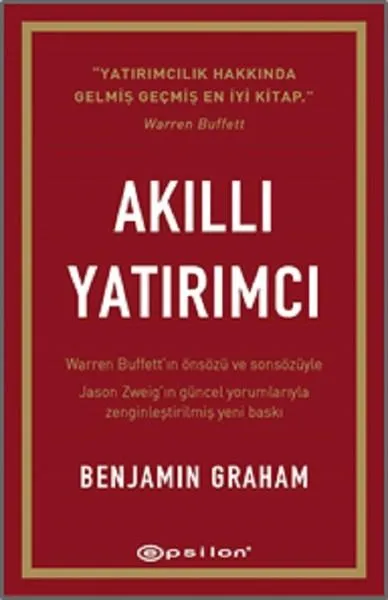

# Akıllı Yatırımcı - Benjamin Graham
##  Sayfa
### .2023
  
 

  

    
     

 
 

***Karakterler;***
- ***:*** 
- ***:*** 
- ***:*** 
- ***:*** 

> ***(Tanıtım Bülteninden - )***

***||***
_____

 

### Kitaptan Alıntılar ;
- ***"İnişleri ve çıkışlarıyla, kaderin cilvelerine gülerek açarız yolumuzu..." (s.1)***
- ***"Ne kadar dikkatli olursanız olun, hiçbir yatırımcının kaçınamayacağı tek risk hata yapma riskidir." (s.17)***
- ***"Geçmişi hatırlamayanlar onu tekrarlamaya mahkumdurlar." (s.19)***
- ***"Kusur, sevgili yatırımcı, yıldızlarımızda değildir - ve hisse senetlerimizde de değildir -, bizdedir..." (s.26)***
- ***"Eğer havada şatolar inşa ettiyseniz, eserinizin yok olması gerekmez; bulunmaları gereken yer orasıdır. Şimdi onların altına temeller yerleştirin." (s.30)   - Henry David Thoreau, Walden***
- ***"Aptalca bir risk almanız sizi öyle derin bir çukura sokar ki geri çıkmak neredeyse olanaksızdır." (s.30)***
- ***"İnsanların tüm mutsuzlukları tek bir şeyden gelir: Bir odada nasıl hareketsiz duracağını bilememekten." (s.55)   - Blaise Pascal***
- ***"...kısa sürede şansınız yaver gittiği ölçüde işe yararlar. Zaman içinde, sizi ölüme sürüklerler." (s.57)***
- ***"Halk, kendisini hiç olmadığı kadar piyasa hakkında bilgili hissetti. Ne yazık ki, insanlar veriler içinde boğulurken, bilgi ise hiçbir yerde yoktu." (s.60)***
- ***"Oscar Wilde, toplumsal değerleri küçümseyen birisinin 'her şeyin fiyatını bilmesi fakat hiçbirinin değerini bilmemesi'yle dalga geçmişti." (s.61)***
- ***"İyi ya da kötü, kumar içgüdüsü insan doğasının bir parçasıdır - bu nedenle birçok insan için bunu bastırmaya çalışmak bile boşunadır. Ancak, onu tutmalı ve dizginlemelisiniz. Bu, spekülasyonu yatırım ile asla birbirine karıştırmayarak, aptal durumuna düşmenizi engelleyecek en iyi tek yoldur." (s.67)***
- ***"Yirmi yıl önce on dolarlık bir tahıl sepetini ancak iki kişi taşıyabiliyordu. Şimdi aynı sepeti beş yaşında bir çocuk bile taşıyabilir."   - Henny Youngman (s.79)***
- ***
- ***
- ***
- ***
- ***
- ***
- ***
- ***
- ***
- ***
- ***
- ***
- ***
- ***
- ***
- ***