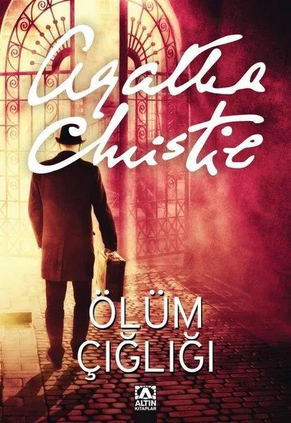

# Ölüm Çığlığı - Agatha Christie
##  272 Sayfa
### 04.01.2024
  
 

  

    
     

 
 

***Karakterler;***
- ***Miss Jane Marple:*** St. Mary Mead köyünde yaşayan yaşlı, keskin zekalı bir kadın. Cinayeti çözmede kilit rol oynar.
- ***Papaz Leonard Clement:*** St. Mary Mead köyündeki papaz. Hikaye onun bakış açısından anlatılır.
- ***Griselda Clement:*** Papazın genç ve enerjik eşi. Sosyal çevresi ve dedikodularıyla tanınır.
- ***Albay Lucius Protheroe:*** Köyde pek sevilmeyen bir adam. Cinayetin kurbanı.
- ***Anne Protheroe:*** Albayın genç ve güzel karısı. Eşiyle mutlu olmayan bir evlilik sürmektedir.
- ***Lawrence Redding:*** Köyde yaşayan bir ressam. Anne Protheroe ile yakın ilişkisi olduğu düşünülür.
- ***Dr. Haydock:*** Köydeki doktor. Cinayetle ilgili bazı tıbbi bilgiler sağlar.
- ***Dennis Clement:*** Papazın genç kuzeni. Evdeki hayatın bir parçasıdır.
- ***Mary:*** Clement ailesinin hizmetçisi. Olaylarda dolaylı bir rol oynar.
- ***Yüzbaşı Melchett:*** Yerel polis şefi. Cinayeti çözmek için görevlidir.

> ***(Tanıtım Bülteninden - )***

***||***
_____

Hikaye, St. Mary Mead adında sessiz ve huzurlu bir İngiliz köyünde geçer. Hikayenin anlatıcısı, köyün papazı Leonard Clement’tir. Clement, karısı Griselda ile sakin bir yaşam sürmekte, köydeki dedikodular ve insan ilişkileriyle meşgul olmaktadır. Ancak bu sakinlik, köyde pek sevilmeyen Albay Lucius Protheroe’nun öldürülmesiyle bozulur.

***Giriş: Albay Protheroe’nun Ölümü***  
Albay Protheroe, emekli bir asker ve köydeki kilisenin mali işlerinden sorumludur. Sert, katı ve dik başlı yapısıyla köyde birçok düşman edinmiştir. Papaz Clement, bir konuşmasında Protheroe’nun ölmesinin köy için hayırlı olacağını düşündüğünü dile getirir. Bu ifade, ileride bir alıntı olarak sıkça gündeme gelir.

Bir gün, Protheroe, papazı ziyaret etmek üzere Clement’in ofisine gelir. Ancak Clement bir ziyaret nedeniyle dışarıdadır. Papaz döndüğünde, Protheroe’nun masasının başında vurulmuş halde ölü bulunduğunu görür. Ofiste, kurşunla delik açılmış bir mektup ve yerde bir tabanca bulunur.

---

***İlk Araştırmalar ve Şüpheliler***  
Cinayet, kısa sürede köyde bir dedikodu dalgası başlatır. Polis, Protheroe’nun ölümünün sebebini ve katilin kimliğini bulmaya çalışır. İlk şüpheliler, Protheroe’nun mutsuz eşi Anne Protheroe ve genç ressam Lawrence Redding’dir. Protheroe’nun eşi ile Lawrence arasındaki yakın ilişki, onları polisin gözünde öne çıkarır. İlginç bir şekilde, hem Anne hem de Lawrence ayrı ayrı suçu üstlenir. Ancak her iki itiraf da mantık hataları içerir.

---

***Miss Marple’ın Devreye Girişi***  
St. Mary Mead’in yaşlı sakini Miss Jane Marple, olayla ilgilenir. Köydeki insanların doğasını çok iyi bilen ve insan davranışlarını gözlemleme konusunda usta olan Marple, Clement’in ofisinde olup bitenleri dikkatle analiz eder. Her ne kadar insanlar onun meraklı bir ihtiyar olduğunu düşünse de, Marple köydeki herkesin sırlarını çözebilecek keskin bir zekaya sahiptir.

Marple, cinayetin zamanlamasıyla ilgili detaylara dikkat çeker. Cinayet sırasında kilise bahçesinde bir grup çocuğun oynadığını ve bazı köylülerin geçtiğini öğrenir. Ayrıca, kurbanın masasındaki mektup ve cinayet silahı gibi fiziksel kanıtların garip yerleştirildiğini fark eder.

---

***Polisin Çıkmazı***  
Yüzbaşı Melchett ve Dedektif Slack, soruşturmada birçok teoriyi değerlendirir. Ancak her yeni ipucu, olayı daha karmaşık hale getirir. Lawrence Redding’in davranışları, Anne Protheroe’nun suçlamaları ve diğer köylülerin şüpheli alibileri, polisin işini zorlaştırır. Clement’in eşi Griselda bile bu karmaşaya bir şekilde dahil olur ve papazın endişelerini artırır.

---

***Cinayetin Çözülüşü: Miss Marple’ın Adım Adım Analizi***
1. ***Cinayet Anının İpuçları***   
Miss Marple, cinayetin zamanlamasına ve kurbanın bulunduğu duruma özellikle dikkat eder. Clement’in ofisindeki sahne, dikkatlice düzenlenmiştir. Albay Protheroe masada oturur halde, alnından tek bir kurşunla vurulmuş şekilde bulunmuştur. Yanında bir tabanca ve bir mektup vardır. Ancak Marple, olay yerinin çok düzenli görünmesinden şüphelenir. Cinayet sahnesinin doğal bir şekilde oluşmadığı, katilin dikkatlice bir mizansen kurduğu açıktır.

2. ***Tanıklar***   
Cinayet sırasında farklı kişiler ofisin çevresindedir:  
Papaz Clement o sırada köyde bir hasta ziyareti yapmaktadır.
Bazı köy sakinleri kilise bahçesinde ya da çevrede olduklarını söyler.
Lawrence Redding ve Anne Protheroe, garip bir şekilde suçu üstlenir. Ancak Marple, bu itirafların mantıksız olduğunu fark eder. İkisi de birbirini koruma amacıyla hareket etmektedir.
Çocuklar, cinayet saatine dair önemli bir ipucu verir: Ofis çevresinde birinin hızlıca geçtiğini gördüklerini ama kim olduğunu net seçemediklerini söylerler.

3. Kurbanın Kimliği ve Motivasyon   
Miss Marple, kurbanın karakterine ve ilişkilerine odaklanır. Protheroe, köyde pek çok kişiyi sinirlendirmiştir. Zalim, baskıcı ve kontrolcü bir yapısı vardır. Özellikle eşi Anne Protheroe’ya kötü davranmaktadır. Bu da Anne’yi birincil şüpheli haline getirir.   
Protheroe’nun köydeki bazı sırları bildiği ve bu sırları kendi çıkarları için kullandığı da ortaya çıkar. Bu durum, köydeki herkesin potansiyel bir motivasyonu olduğunu gösterir.

4. Cinayet Silahı ve Mektup   
Miss Marple, olay yerinde bulunan tabancanın ve mektubun mantığını sorgular:
Tabanca, kurbanın ölümüne sebep olan silah gibi görünse de bu tabancanın cinayette kullanılmadığı anlaşılır. Gerçek cinayet silahı, katil tarafından saklanmıştır.
Protheroe’nun masasındaki mektup, üzerinde kurşun deliği olan sahte bir kanıttır. Bu mektubun özellikle dikkat dağıtmak için yerleştirildiğini fark eder.

5. Katilin Planı   
Miss Marple, cinayetin aslında bir mizansen olduğunu ortaya çıkarır. Albay Protheroe’nun öldürülmesi, birden fazla kişi tarafından planlanmıştır. Anne Protheroe ve Lawrence Redding, birlikte hareket ederek cinayeti işlemiştir: 

- Lawrence, Protheroe’yu ofise çekmek için sahte bir iş bahanesi kullanır.
- Protheroe ofiste yalnızken, Anne içeri girer ve kocasını bir tabanca ile vurur. Cinayetten sonra, tabancayı saklar.
- Lawrence ve Anne, sahte bir cinayet sahnesi kurar. Kurbanın cesedi tabancayla vurulmuş gibi gösterilir ve sahte bir mektup hazırlanır.
- Suçu üstlenme planı yaparak, ikisi de birbiriyle tutarsız itiraflarda bulunur. Bu, polisin dikkatini dağıtmayı amaçlar.   

6. Marple’ın Çıkardığı Sonuç    
Miss Marple, Anne Protheroe ve Lawrence Redding’in hareketlerindeki tutarsızlıkları fark eder. Özellikle:  
- Cinayet saatinde Anne’nin nerede olduğunu açıklayamaması.
- Lawrence’ın suçu üstlenirken verdiği detayların sahte olduğunu gösteren çelişkiler.     
Marple ayrıca, çocukların tanıklığını değerlendirir. Çocukların kilise çevresinde gördüğü kişi Lawrence’dır ve bu, onun cinayet sırasında ofiste olduğuna dair güçlü bir kanıttır. Ayrıca, kurbanın vücudundaki yara ve olay yerindeki detaylar, Lawrence’ın planındaki bir hatayı ortaya çıkarır.

---

***Katilin Yakalanması***  

Miss Marple, polisi ikna ederek Anne Protheroe ve Lawrence Redding’in suçlarını itiraf etmelerini sağlar. İkili, kurbanın zalim ve baskıcı yapısı nedeniyle cinayeti planladıklarını kabul eder. Ancak, bu planın çok ince detaylar gerektirdiği ve sonunda açığa çıkacağı Marple tarafından belirtilir.

---

 

### Kitaptan Alıntılar ;
- ***"Artık hiçbirimizde genç sayılmayız," dedim. "Kalan yıllarımızın bedelini ödememiz gerekiyor." (s.10)***
- ***"İnsanın anımsatılmasından hiç hoşlanmadığı bazı şeyler vardır." (s.13)***
- ***"Ama benim karşılaştığım gençler genellikle ruh gibidirler, cansız..." (s.14)***
- ***"Tanrım! Herkes de ne kadar sıkıcı. Dayanılır gibi değil. Ah keşke param olsaydı, alır başımı giderdim. Param olmadıkça bu olanaksız." (s.16)***
- ***"Ah, Tanrım, o kadar uykum var ki..." (s.16)***
- ***"Yaşam çok zor ve yorucu..." (s.16)***
- ***"Siz gençler insanların hep iyi olduğunu düşünüyorsunuz." (s.20)***
- ***"İnsan karşısındakine güvenmek, karşısındakinin sözlerine inanmak istiyor ama..." (s.20)***
- ***"Kendimi birden yalnız hissettim." (s.35)***
- ***"İnsan neyse o olmalı." (s.40)***
- ***"Ölüm bazen insanın duygularının değişmesine neden olur." (s.55)***
- ***"Ama korkarım her zaman dürüst ve vicdanlı değil..." (s.82)***
- ***"Tabii insan hiç kimseden emin olamaz, o başka." (s.82)***
- ***"Korkarım bu dünya kötülük dolu." (s.84)***
- ***"Beni yönetmek hiç kolay değildir, beni istemediğim hiçbir şeye zorlayamazlar." (s.88)***
- ***"Bunu biliyorum. Ama eğitimsiz olması sonsuza kadar da öyle kalması anlamına gelmiyor." (s.91)***
- ***"Ah! İnsanlar çok kötü, çok hainler! Öyle şeyler söylüyorlar ki! Öyle iğrenç şeyler söylüyorlar ki!" (s.98)***
- ***"Evet, bizler dar kafalı, kendini beğenmiş yaratıklarız, hiçbir şey bilmediğimiz konularda hüküm vermeye o kadar hevesliyiz ki..." (s.123)***
- ***- "Kaç yaşında?"   + "On altı. İnsan o yaşta felaketleri ciddiye almıyor. Yaşamı bir Sherlock Holmes ya da Arsen Lüpen macerası gibi algılıyor." (s.125)***
- ***"Hiçbir şey gençlerin düşüncesizce, iyi niyetle giriştikleri, eylemlere bilmeden göz yummak ya da yol göstermek kadar tehlikeli olamaz." (s.126)***
- ***"Henüz çok gençsiniz. Adalet konusunda fazla hassassınız. Benim yaşıma geldiğinizde bu konularda acele edilmemesi gerektiğini , insanlara en kuşkulu durumlarda bile şans verilmesi gerektiğini anlarsınız." (s.131-132)***
- ***"Geçmiş geçmişte kaldı, artık bunu değiştirmek olanaksız, hiçbir şey geri alınamaz..." (s.133)***
- ***"İnsanın acıları bazen başkalarına karşı da gözlerinin açılmasına neden olur." (s.143)***
- ***"Ah! Aslında ben herkesten bir ölçüde kuşkulanılması gerektiğini düşünürüm. Hep derim, asla kesin olarak bilinemez." (s.147)***
- ***"Doğarsın-büyürsün-başka insanlarla bir araya gelirsin-itilip-kakılırsın-evlenirsin-çocukların olur... Ve ölürsün. Ama her zaman ölüm kağıdı olmaz. Çünkü bazıları yaşayan ölülerdir." (s.183)***
- ***"Pek az kimse başkaları için her şeyi yapabilir." (s.189)***
- ***"Aptal görünmek çok kolaydır Bay Clement. İnsanlar üzerinde aptal izlenimi bırakmak dünyanın en basit işidir." (s.196)***
- ***"Sırlarını saklamakta çok ustasın." (s.215)***
- ***"Herkesin sırrı vardı. Bu da benim sırrımdı." (s.228)***
- ***"Biliyor musun, bazen seni hiç tanımadığımı düşünüyorum." (s.231)***
- ***"Hepimiz biraz tuhafız, öyle değil mi? Birçok insanın öyle olduğunu onları tanıdıkça anlarsın." (s.234)***
- ***"İnsanların birbirine ne kadar benzediklerini bilseniz çok şaşırırsınız." (s.234)***
- ***"İnsan doğası süprizlerle doludur." (s.250)***
- ***"Ama insanların her söylediklerine inanmamak gerekir." (s.257)***
- ***- "Büyük teyzem Fanny'nin bana söylediği bir şeyi anımsıyorum da. O zamanlar on altı yaşındaydım ve bunun çok aptalca bir görüş olduğunu düşünmüştüm."   + "Ne demişti teyzeniz?" diye sordum.   - "Ne derdi biliyor musunuz? 'Gençler yaşlıların aptal olduğunu düşünürler yaşlılar ise gençlerin aptal olduğunu bilirler.'" (s.266)***
