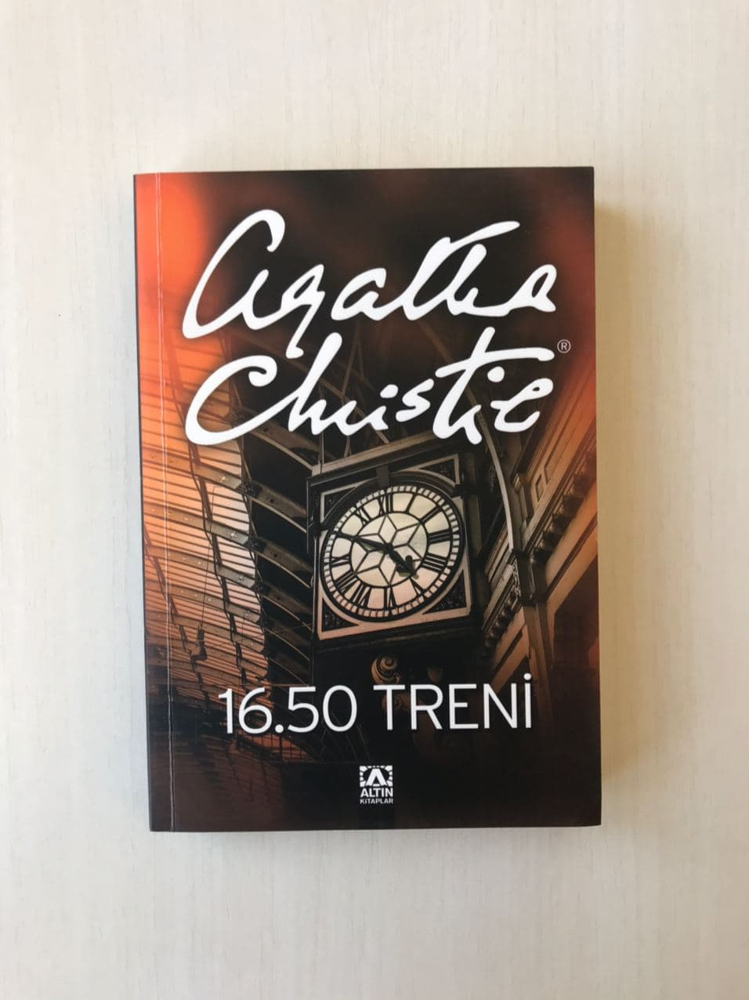

  
# 16.50 Treni - Agatha Christie
## 288 Sayfa
### 14.09.2020

   

  

    
     
    

***Karakterler ;***

- **Elspeth Mcgillicuddy :** Tren de cinayetin işlendiğini gören yaşlı teyzemiz
- **Miss Jane Marple :** Elspeth'in arkadaşı ve cinayeti çözen yaşlı kadın , eski dedektif
- **Lucy Eyelesbarrow  :** Son derece zeki ve yetenekli bir genç kız. Yaşamını hizmetçilikle kazanıyordu.
- **Bay Luther Crackenthorpe  :** Ailenin babası. Miras nedeniyle oğullarını görmek bile istemiyor , herkesin kendinin ölümünü beklediğini düşünüyordu. Cimriliğiyle ailenin nefretini kazanmıştı.
- **Müfettiş Dermot Craddock  :** Miss Marple ile daha önce de çalışmıştı. İşin içinde bir iş olduğunu düşünüyordu.

 

Hikayemiz , Elspeth'in bir gün 16.50 treni ile yolculuğa çıktıktan sonra , hareket halindeyken yanlarına bir tren yanaştı , bir süre yanyana gittiler. Bu süre zarfında karşı trende işlenen bir cinayete şahit oldu. Sırtı dönük olan bir  adam , bir tane kızı boğuyordu.. Ve sonra tren hızlanarak yanlarından geçip gitti.. Bu olanları trendeki görevliye ve bir sonraki istasyonda yetkililere anlattı ama kimse ona inanmadı.. Neyse işte varacağı yere vardı , Miss Marple'in yanına gelecekti zaten.. Geldikten sonra ona tüm gördüklerini anlattı , Miss Marple ona inandı tabiki.. Zaten daha öncede birlikte çalışmışlar..

Sonrasında polise gittiler.. Bir kaç gün içerisinde polis araştırma yaptı ama öyle herhangi bir cesede veya kuşku uyandıracak bir olaya rastlamadı...  Miss Marple bir süre boyunca aynı şekilde tekrardan aynı trenle seyahatlar yaptı ve bunun nasıl olabileceğini anlamaya çalıştı. En sonunda trenin bir tane virajdan yavaşlayarak geçtiği noktalarda ,aşağıda ise böyle yamaç gibi ,gayet cesedin kolaylıkla oraya atılabileceğini fark etti.. Biraz o bölgeyi araştırdı.. Kuşkularında haklı çıkabileceğini biliyordu... 

Böyle olunca daha öncede kendisine bakmış olan Lucy Eyelesbarrow ile bir görüşme ayarladı.. Lucy , çok fazla merak ve  içerisinde gizem olan olayların pesinden gitmeyi oldukça seviyordu ve bu sebeple de olayla ilgilenmeye karar verdi.  Lucy bu sebeple oraya yakın olan küçük bi kasabada bir ailenin ,Crackenthorpe ailesinin, yanında  çalışmaya başladı.. Aile de bir tane yaşlı baba , onu bakan kızı Emma ile birlikte yaşıyorlardı... Bir süre Lucy , etrafı  inceledi. İpucu bulmaya çalıştı , hemen o yamaçta yani trenin altındaki yamaçta , kürk parçaları buldu..  Bir süre sonra , Lucy uzun ambarda ,  o kadının cesedini buldu..

 Bunun üzerine , uzun süre soruşturma ile geçti.. Bu süre zarfında 2 tane kardeş öldürüldü.. İlki evdeki yemek ile zehirlendi.  Diğeri de eve gönderilen haplar ile zehirlenerek öldü.. Tabi tüm bunların sonunda ise katilin doktor olduğunu kanıtladılar.. 

   

### Kitaptan Alıntılar ;

- **" Hiçbir konudan emin olmamak gerekir. Size anlatılan hiç bir şeyin aslını araştırmadan kabul etmemelisiniz."**
- **" Mark Twain'in öykülerinden esinlendim. Atı bulan oğlanın izlediği yöntemi izledim. Hikaye de çocuk at olsaydım nereye saklanırdım diye düşünür ve oraya gittiğinde atı bulur."**

