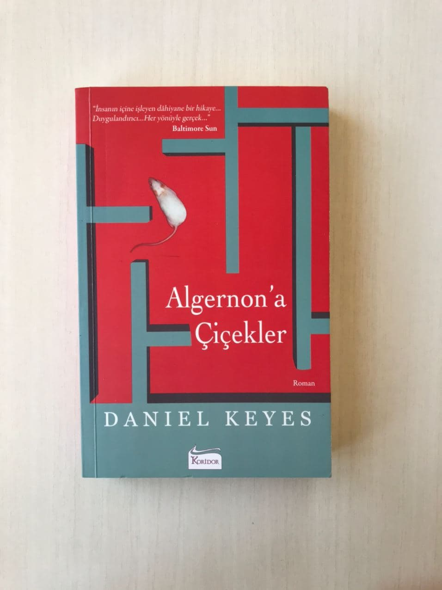

<table><tr>
<td align="left"> 
  
# Algernon'a Çiçekler - Daniel Keyes
## 325 Sayfa
### 17.09.2020

  
</td>
<td> 
  

    
     
    
  
 
</td>

</tr></table>

***Karakterler ;***
- ***Charlie Gordon :*** Başkarakterimiz.
- ***Algernon:*** Kendisiyle birlikte deney yapılan fare
- ***Rose Gordon:***  Annesi
- ***Matt Gordon:***  Babası
- ***Norma Gordon:*** Kardeşi
- ***Alice:*** Aşık olduğu kız , aslında bir bakıma kendi eğitmeni diyebiliriz.
- ***Nemur:*** Kendi üzerinde deney yapan doktordan bir tanesi 

 

Charlie iq'su düşük , bir takım zihinsel engeli bulunan , okumayı bilmeyen , aklında hiç bir şey tutamayan 32 yaşında bir genç.. Tabi bunca zamana kadar etrafındakiler tarafından kendisiyle çok dalga geçilmiş ve çok fazla alay edilmiş...  Charlie yıllar önce Herman Amcasının , Fırıncı Donner'e , Charlie'yi göz kulak olup ona sahip çıkmasını söylemiştir.. Bu sebeple yıllardır , 17 yıldır Charlie o fırında çalışmıştır.. O fırın Charlie için aynı zamanda bir yuva , Donner 'de bir baba olmuştur..

 Tabi bu süre zarfında Charlie , bir süre doktorlar gözetimi altındaydı. Algernon ismindeki bir fare ile kendisini yarıştırıyorlardı.. Tabi ilk başlarda Algernondan nefret ediyordu çünkü hiç bir zaman onu yenemiyordu.. Bu yarışta ,  labirent ile alakalı bir yarıştı.. Neyse ki Charlie sonralarda ameliyat olmayı kabul etti ve bir süre sonra yavaş yavaş düzelmeye başladı.. Başlarda noktalama işaretleri ve yazım hatalarını giderdi.. Sonralarda ise bol bol çok fazla kitap okumaya başladı.. 

 ***Bir anda hızlı  bir şekilde gelişim göstermeye başladı diyebiliriz...  Tabi böyle olunca, anında insanlardan üstün bir duruma geçince.. İnsanlar eskisi gibi onunla alay edemeyince, kendilerini  daha ezik görmeye başladılar ve Charlie'den uzaklaştılar..*** Tabi haliyle Charlie de bir takım değişiklikler gösterdi...  İster bilgi anlamında isterse kişisel anlamda , önceki gibi cana yakın bir insan olmaktan çıktı...  Bu süre zarfında Alice'i yemeğe davet etmişti.. O gecenin sonunda Alice'e karşı deyim yerindeyse aşık oldu diyebiliriz.. Sonraki zamanlarda konsere filan gittiler.. Ama tabi Alice' bu kişisel ilişkilerini desteklemiyordu.. Çünkü Charlie çok fazla hızlı bir şekilde ilerleme katediyordu ve artık iq'su 185'ti... 

  Bunun yanında gerçekten Charlie çok kötü bir çocukluk geçirmiş ..  Annesi hep kendisini azarlamış dövmüş , altını pisletmesi halinde gerçekten çok büyük bir azar işitmiş ve şiddetle karşı karşıya kalıyormuş.. Bunun yanında tabi  çoğu insan ona gerizekalı muamelesi yapıyormuş...

  > *150. sayfaya kadar olanlar bu şekildeydi...*

  Ve Charlie , Chicago'ya ulaştı..
  
  Sonrasında Charlie , bir konferans gibi bir yerde , kendisi için , onun ordakiler tarafından yeniden yaratıldığının , daha öncesinde  bir insan bile olmadığını söylediklerinde , çok fazla sinir olmuştu.. İlk başta Algernon'un kapısını açıp onu serbest bıraktı ve bir süre Algernon'u kovaladılar ve yakalayamadılar. Charlie en sonunda onu tuvalette buldu ve Algernon da zaten kolay bir  şekilde 
Charlie'nin cebine girdi ve birlikte orayı terk ettiler..

 Bir süre Charlie Algernon ile , herkesten uzak bir apartmanda yaşamaya başladılar.. Alt katında yaşan kızla ,Fay, ile  tanıştılar.. Bir süre onunla birlikte oldular seviştiler filan.. Bu süre zarfında Charlie araştırmalar yapıyordu.. İlerleyen zamanlarda ise Algernon iyice vahşileşti ve bazı şeyler yolunda gitmemeye başlayınca , labarotuvara dönmeye karar verdiler... 
 > Bu arada Charlie' babasının berber dükkanına kadar  ziyarete gitmişti. Onun elinden traş oldu ama bir türlü kim olduğunu söyleyemedi..

 ***İlerleyen zamanlarda Algernon'un durumu kötüleşti.. Charlie de bunun sebebini çözdü ve bunu raporladı.. Bir anda nasıl  Algernon'un zekası zirve yaptıysa yine bir anda aynı şekilde zekası azalmaya başladı.. Ve kısa bir zaman geçtikten sonra ise maalesef Algernon öldü..***
 
 > *Charlie' Algernon'u yakmalarına izin vermedi ve kendisi Algernon'u yanında alıp geldi. Onu Evinin arkasında ki  bahçeye gömdü...*

  Bir süre sonra Charlie de yavaş yavaş her şeyi unutmaya ve eski haline dönmeye başladı.. Annesinin evine onu görmeye gitti.. Başta annesi ondan kaçtı ama sonrasında eve girdi , bir süre konuştular ama neredeyse annesi de kafayı yemişti.. Sonrasında kız kardeşi geldi , kendisine bu kadar iyi davranacağını hiçbir şekilde düşünmüyordu.. Ama kız kardeşi Charlie'ye o kadar yakın davrandı ki  , ne kadar özlediğinden filan bahsetti... Charlie sonrasında kendini eve kapattı ve bir süre Alice ile  birlikte yaşadılar , her ne kadar Alice , Charlie'nin onu istemeyeceği güne kadar kalacağını söylese de öyle oldu..  Artık Charlie onu evinde istemediğini söyledi... Zaten bu süre zarfında artık öğrendiği herşey bir bir yok olmuştu.. Yeniden  yazı yazmakta zorlanıyor , okuduklarını anlayamıyor ve okudukları aklında kalmıyordu..

  En sonunda kısa bir zaman da olsa tekrardan fırında çalışmaya başladı... Arkadaşları Charlie'yi destekledi  ve onun yanında oldular.. Tekrardan Charlie'yi ne kadar  sevdiklerini gösterdiler. Ama en sonunda Charlie ' daha fazla insanların kendisine acımasını istemediği için tek başına " Warren " e geldi...

  > ( Warren - sadece böyle zeka özürlü insanların bulunduğu ve hiç bir şekilde geleceğe dair onlar için bir umut olmadığı bir yerdi.. Deyim yerindeyse , böyle insanlara ölüme terkedilmiş olarak bakılıyordu
   , daha doğrusu oraya gelen insanlar ölene kadar orada kalıyorlardı... )

   Charlie de kendi isteği ile ve tek başına Warren'e geldi... Ve zaten hikaye burada bitiyor...

      

   > ***" Ona bir zamanlar Algernon adında bir arkadaşım vardı ama o bir fareydi ve biz onunla yarış yapardık dedim... Bana tuhaf tuhaf baktı hani sanki ben deliymişim gibi."***
   

   ***Ama hikayenin son cümleleri beni gerçekten derinden etkiledi ve ağlattı diyebilirim...***  
   ***" Charlie ve Algernon , sizi özleyeceğim. "***

***NOT : " Lütfen eğer vaktiniz olursa Algernon'un arka bahçedeki mezarına birkaç çiçek koyun olur mu."***
   
   
    

### Kitaptan Alıntılar ;
> - *Şimdi anlıyorum ki , üniversiteye gitmenin ve bir eğitim almanın en önemli nedenlerinden biri , tüm hayatımız boyunca  doğru olduğuna inandığınız şeylerin doğru olmadığını ve hiç bir şeyin göründüğü gibi olmadığını öğrenmekmiş."*

> - *" Hayat dediğin şey nedir ki ? Labirentlerden oluşan bir kutu."*

