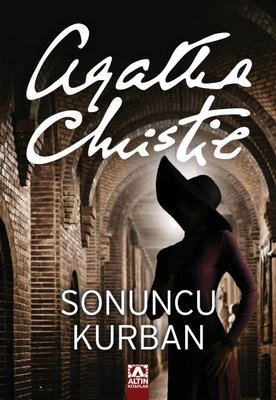

<table><tr>
<td align="left"> 
  
# Sonuncu Kurban - Agatha Christie
## 222 Sayfa
### 21.09.2020

  
</td>
<td> 
  

    
     
    
  
 
</td>

</tr></table>

***Karakterler ;***
- **Hercule Poirot :** Dedektif.. Daha çok kahramanımız da diyebiliriz.
- **Ariadne Oliver :** Meşhur yazar. Ortada bir şeylerin döndüğünü seziyordu.
- **Amy Folliat :** Yaşlı bir kadın. Nasse Şatosu'nun bir zamanlar kendisine ait olduğunu unutamıyordu.
- **Sir George Stubbs :** Zengin bir adam.
- **Lady Hattie Stubbs :** Sir George'un karısı. Genç , güzel , fakat aptalca bir kadındı.
- **Marlene Tucker :** On dört yaşında bir kız. Çirkin , fakat çok meraklıydı..
- **Merdell :** Geveze bir ihtiyar ona kimse inanmıyordu..
- **Etienne De Sousa :** Yakışıklı bir genç. Yıllardan beri görmediği akrabasını ziyarete gelmişti..

 

Öncelikle hiyakemiz , Ariadne Oliver isminde bir polisiye kadın  yazarın.. Nasse şatosunda düzenlenecek olan bir panayırda cinayet tasarlaması için çağırılmıştı... Bu tasarladığı cinayeti , yarışmacılar ipuçlarını toplayarak çözeceklerdi ve en sonunda da bir ödül söz konusuydu...  

Oliver yani yazarımız bu sürede bir şeylerden şüphelendi ve daha önceden tanışıyor oldukları arkadaşı dedektif  Hercule Poirot'u arayarak buraya , yani şatoya gelmesini söyledi... Telefonda herhangi bir detay vermedi.. Dedektif geldikten sonra ona olanları ve şüphelerini anlattı.. Panayır zamanına kadar dedektif ortalığı güzelce süzdü , olabildiğince bilgi edinmeye çalıştı.. Ama öyle pek fazla şüpheli bir şey ile karşılaşmadı.. Bu arada bu şato Sir George Stubbs'a aitti..  Bir süre önce burada yaşayan Folliat'lardan alınmış.. Ondan önce de Hattie'nin ailesi ölmüş ve bu durumda Amy Folliat ise 
 bu kıza sahip çıkmış.. Hattie'yi Sir George ile evlenmesine ikna etmiş.. Hattie de aptal bir kadınmış...

Panayırdan bir gün önce yemekteyken , Lady Stubbs'a bir mektup geliyor.. En son yıllar önce gördüğü kuzeninden , Hattie'yi yarın ziyarete geleceğini söylüyor mektupta.. Tabi bu mektubu görünce Lady Stubbs korkuyor.. Bu ifadesi herkes tarafından fark ediliyor... Zaten dedektif buraya geldiğinden itibaren Lady Stubbs hep bir bahane bularak , odasına çekiliyordu ve fazla ortalıkta dolaşmıyordu.. Yorgun olduğunu , başının ağrıdıgını filan öne sürüyordu..

Ertesi gün panayır günü her şey normaldi.. Bu cinayet oyununa göre , sözde ceset rıhtımdaki kulubede olacaktı. Bu ceset rolünü ise , 14 yaşındaki Marlene üstlenecekti... Aynı panayır günü , dedektif ve Bayan Oliver rıhtıma gittiklerinde korktukları başlarına geliyor ve bu küçük kız ölü bir  şekilde bulunuyor... Aynı zamanda Lady Hattie Stubbs'ta kaybolmuştu.. Kimse onu görmediğini söylüyordu..  Bu arada dedektif cesedi bulmaya gelmeden önce, Hattie'nin gelecek olan kuzeni Etienne De Sousa gelmişti.. Onunla karşılaştılar ve bir süre sohbet ettiler.

İlerleyen süre zarfında hep araştırma ve soruşturma ile geçti.. Tabi bu soruşturmaya başka dedektifler ve polisler de katılmıştı ama tabi bir şey elde edemediler... Aradan 1 ay geçmişti , hala Marlene'nin katilini ve Lady Stubbs'u bulamadılar. Bu süre zarfında ise hep bu ziyarete gelen kuzenden şüphelendiler.... Çünkü sözde Hattie ' kocasına onun daha önce birini öldürdüğünü. Bu yüzden ondan korktuğunu söylemişti... Kocası Sir George'da bunu bu Şekilde dedektiflere anlatınca , bu ziyarete gelen Etienne De Sousa en büyük şüpheli haline gelmişti... 

Aradan dediğim gibi 1 ay hatta 5 hafta geçti... Hiç bir şey bulamamışlardı.. Sonrasında bizim dedektif evinde yani Londra da kendi kendine düşünmeye başladı.. Bir şeyleri atlıyordu.. Her şeyi en baştan incelemeye başladı.. En sonunda tekrardan bu olayın olduğu yere geldi.. Ve tüm cevapların Amy Folliatta olacağını düşünüyordu. Onunla konustu ama tam anlamıyla net bir şey elde edemedi.. Amy folliat bir şeylerden korktuğu belliydi , aslında biraz kendini açık etti..  Dedektif bu seferde ölmüş olan kızın ailesini ziyaret etti... Burada bir süre önce , Merdell ismindeki rıhtımın orada yaşayan yaşlı adamın , Marlene'nin dedesi olduğunu öğrendi ve kaza eseri gece nehire düşüp öldüğünü öğrendi.. Bunun üzerine dedektif artık olayı çözmüştü..

*Tekrardan yazar kadınla konusup bir şeyler sordu.. Bunun sonucunda artık çoğu şeyden emindi... Polislerede olanları anlattı. En sonunda , Amy Folliat'ın yanına gidip ona da herşeyi anlattı..*

***Aslında gerçek olay şu şekildeydi.. Amy'nin yıllar önce savaşta şehit olduğunu söylediği oğlu aslında şehit olmamıştı ve askerden kaçmıştı.. Bu süre zarfında , Amy'nin yanında ki Hattie , zaten saf bir kız olduğu için onunda ailesi zengin ve varlıklıydı... Kızı bir şekilde kandırdılar ve kendi oğlu ile evlendirdi. Tabi kızın elinden tüm mal varlıklarını aldılar  ve kendisinin fakir olduğunu ve ailesinin öldüğünden vs yararlanarak kıza ve etraftakilere bunu bu şekilde yaydılar.. Sonrasında ise Amy' bu şatoyu bu adama sattı , yani aslında kendi oğluna..***

***Tabi Hattie' ile evlenmeden önce zaten oğlu evliydi ve italyan bir kızla birlikteydi.. Bir süre sonra Hattie'yi öldürdüler. Bu kız makyaj filan yaparak Hattie'nin yerine geçtii... Kimse yine bir şey anlamadı..
Sözde bu şekilde oğluda " Sir " unvanını alınca , tüm insanlar tarafından saygın biri olarak kabul ediliyordu. Tabi savaş  yılları olduğu için kimse bu adamı uzun süre görmemişti ve  tanımıyordu... Bu şatoya geldiğinde kimse  bir şeyden şüphe  etmemişti.. Tek bir kişi dışında.. Merdell ismindeki bu yaşlı adam bu oğlanı hemen tanımıştı...***

***Tabi ilerleyen zamanlarda bu küçük kız Marlene büyük babasından bu olanları sohbet esnasında duyuyordu ve bunları yaymaya başladığı için , George tarafından para verilerek susturuluyordu.. Tabi hemen akabinde plan yapmaya başladılar.. George ve italyan karısı.. O gün bu küçük kızı ortadan kaldırdılar.. Ve bunu ziyarete gelecek kuzeninin üzerine attılar , daha doğrusu onu şüpheli gösterdiler..  Hattie'yi kayboldu gibi gösterip, sonrasında herhangi bir cesedi ise George , Hattie'ymiş gibi gösterebilirdi... George'un ilk karısı italyan kadın , tekrardan eski kimliğine kavuşabilecekti... Hattie'nin kendi cesedini ise daha öncesinden oraya yaptıkları pavyonun altına gömmüşler....***

   

### Kitaptan Alıntılar ;

- *" Bir çok şey görüş tarzınıza bağlıdır.* "
-  *" Didinmekten sonra uyku , fırtınadan sonra liman , savaştan sonra rahat , hayattan sonra ölüm , çok memnun eder. "*
-  *" Hercule Poirot , insan ne aradığını bilse , diye içini çekti.. İş çok kolaylaşırdı. Fakat neyi aradığınızı bilmeniz imkansız. Bu yüzden ters yerlere veya yanlış şeylere bakıyorsunuz. "*
-  *" Ben fotoğraflardan hiç hoşlanmam. Bunlar insanı geçmişte yaşamaya zorlarlar. Halbuki unutmasını öğrenmemiz gerek. Kurumuş dalların kesilip atılmasından başka çare yoktur.."*

