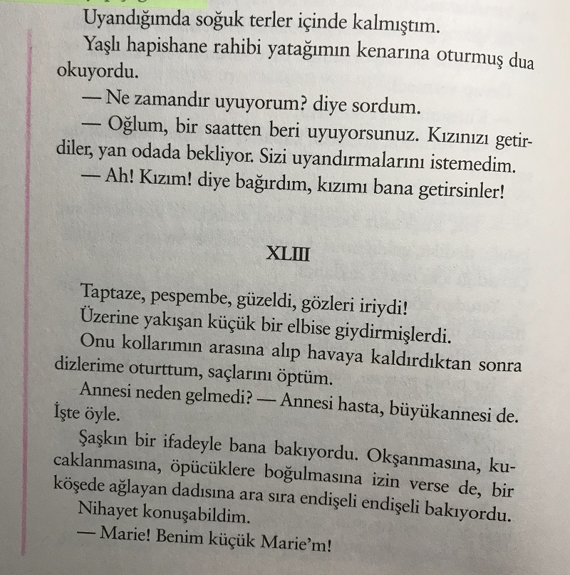

# Bir İdam Mahkumunun Son Günü 
## Victor Hugo
### 117 Sayfa
#### 22.09.2020

  

 Kitabımız aslında iki parça diyebiliriz. Kitabın ilk 40 sayfasında önsöz adı altında bir takım mesajlar ve çıkarımlar yapılmaktadır. İdam edilme yani bir diğer değişle , suçlunun tüm meydanda herkesin önünde canı alınırken, tüm insanların neşe ve coşku ile bunu izliyor oluşu ne kadar üzücü ve iğrenç bir durum değil mi ? Niye bir insan başka bir insanın canlı canlı bilerek öldürülmesinden keyif alır ki ? O suçlu veya idam edilen her kimse , en azından hapiste ceza çekse bile , ailesine , eşine , kızına bir faydası 
dokunabilir. Hapiste olsa bile güzel şeyler yapabilir. Fakat toprağın altındaki ölmüş , cesedi çürümeye mahkum bir insanın kimseye faydası yoktur. Zaten kitabın Önsözü altında bu durum fazlasıyla incelenmiştir.

 Kitabımızın diğer 76 sayfalık kısmında ise ; cinayet işlediği için tutuklanan bir mahkumumuz vardır. Zaten tüm bu olanlar mahkumun ağzından anlatılmaktadır. Mahkemeye çıktıktan sonra, idam kararı çıkar ve mahkumumuz 5 hafta sonra canından olacaktır. *İlk başlarda birazcık umudu olan mahkumumuz affedileceğini umut ediyordu fakat ilerleyen zamanlarda bu umutları gitgide tükenmeye başlıyor...*

 Korkudan titremeye başlayan mahkumumuz arkasında bıraktığı kızı , eşi ve annesini düşünür ama en çok da kızı için üzülmektedir. ***" Ama kızım, yavrum , şu anda gülen, oynayan, şarkı söyleyen, hiçbir şey düşünmeyen zavallı küçük Marie'm, işte o beni kaygılandırıyor."***

***Çünkü kızını son kez görmesi için , kızını yanına getirmişler ve küçük kız babasını tanıyamayarak, ona  “Bilmiyor musunuz bayım? Babam öldü.” Diye cevap vermiştir.***

Bunun üzerine zaten , mahkumumuz için artık daha başka bir şeyin önemi kalmamıştır. Ve saat 16.00'da meydanda herkesin gözü
önünde idam edilir...
*Romanımız **" Saat Dört "** diyerekten hikayeyi bitirir..*

> ***"Merak ediyorum, giyotinle olmasa da insanların canını vahşice alan ve buna seyirci kalan milyonlar hala neden kana doymuyor?"***

### Kitaptan Alıntılar ;
- *Acaba kralın adamları uygarlık sözcüğünden ne anlıyorlar? Uygarlığın neresindeyiz ? Adalet üçkâğıtçılık ve düzenbazlık yapacak kadar , yasa yedek çözümler bulacak kadar alçaldı! Korkunç!*

    *Toplum ona bu denli acımasızca , adaletsizce davrandığına göre idam mahkûmu olmak, demek ki çok dehşet verici bir şey! (s.33)*

- *Yargılayanlar ve mahkûm edenler ölüm cezasının toplumdan kendisine zarar veren ve daha sonra da zarar verebilecek olan birinin uzaklaştırmanın önemi nedeniyle gerekli olduğunu söylüyor. Sadece bu konusu olsaydı, müebbet hapis cezası yetecekti. Öldürmek neye yarar? Hapishaneden kaçılabileceğini söyleyerek itiraz edeceksiniz, öyle değil mi? Nöbetçileriniz görevlerini iyi yapsınlar. Demir parmaklıkların sağlamlığına güvenmiyorsanız, hayvanat bahçelerini açmaya nasıl cesaret ediyorsunuz?*
  
    *Zindancının yeterli olduğu yerde cellada gerek yoktur. Ama devam ediliyor. Toplumun intikamını alması, cezalandırması gerekiyor. Ne biri ne diğeri. İntikam almak bireyseldir, cezalandırmak Tanrı'nın işidir. (s.34)*

  

- ***Sayfa : 47***

    

- ***Sayfa : 48***

    

- ***Sayfa : 66***

    

- ***Sayfa : 67***

    

