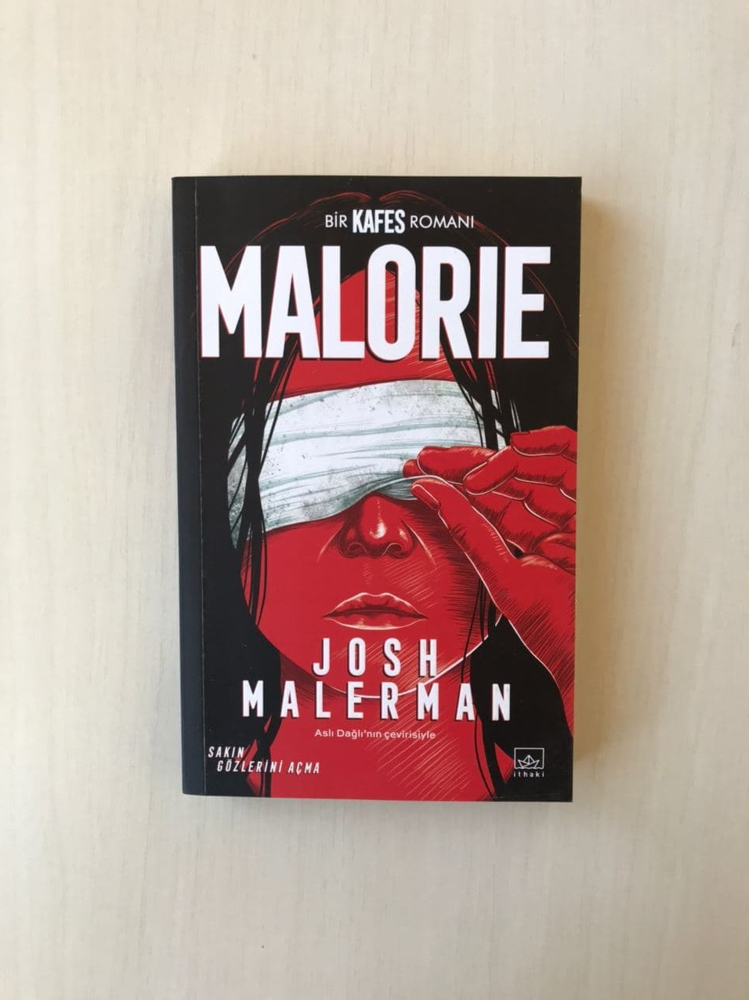

 
  
# Malorie - Josh Malerman
## 332 Sayfa
### 27.09.2020
  
   

  

    
     

***Karakterler ;***
- ***Malorie :*** *Hikayemizin başkahramanı*
- ***Tom :*** *Malorie'nin öz erkek oğlu*
- ***Olympia :*** *Yıllar önce ilk başta sığındıkları evdeki , doğumdan sonraki ölen kadının kızı*
-  ***Sam ve Mary Walsh :*** *Malorie'nin babası ve annesi*
-  ***Ron Handy :*** *Oturdukları yerin yakınındaki edindiği bir arkadaşı*
-  ***Dean Watts :*** *Kör treni harekete geçiren ilk kişi*

  

>***Bu kitabı gerçekten çok fazla seviyorum. Bu yüzden yazdıklarım biraz uzun ve detaylı oldu.*** 

 

Öncelikle bu hikayemiz , daha önceki ***Kafes*** kitabının devam niteliğinde.. İlk önce kafes kitabını okuduktan sonra bu kitabı okumanız haliyle çok daha iyi olacaktır..!     Kafes kitabında, 2 yıl önce  Malorie ve çocukları ; gözleri bağlı bir şekilde nehri boydan boya takip ederek , zorlu bir yolculuğun ardından Jane Tucker Körler Okulu'na ulaşmışlardı... Burada iki yıl kalmışlar ve şuanda Malorie kitabının başından itibaren artık burası da o yaratıklar tarafından ele geçirilmişti.. Artık Körler Okulu da güvenli değildi ve herkes kendisini öldürmeye başlamıştı.. Malorie bu kargaşanın başında ise , kör olan bir kadının bile aklını kaçırdığını gördü. Bunun nasıl olduğunu anlayamıyordu.. Artık yaratıkların dokunaraktan da akıllarını kaçırmalarına sebep olduğunu düşünmeye başlamıştı.. Bu kargaşanın içinde Malorie , çocuklarını zor da olsa buldu.. Malorie , Tom(6) ve Olympia(6) birlikte 2 yıl önce girdikleri kapıdan çıkarak buradan ayrıldılar.. ***Yalnız başlarına. Bir kez daha.***

- Hikayemiz 10 yıl sonra diyerekten devam ediyor : 

10 yıl boyunca Malorie ve çocukları , Kamp Yadin'i yuva olarak bellediler. Buraya ilk geldiklerinde o kadar çok şaşırmışlardı ki çünkü bir sürü yiyecek ve kocaman bir kütüphane vardı.. Bu süre içerisinde Olympia burada ki 1000'in üzerindeki kitabı okumuştu.. Bunun yanında Tom o kadar aksi bir çocuktu ki , Malorie'nin aldığı katı kurallara bazen uymuyordu..

Bir gün Tom , her zaman ki gibi dışardıdaki kuyudan su doldurmaya gittiği sırada , yanına birinin yaklaştığını fark etti. Sessizce olduğu yerde durdu , bekledi ve dinledi.. Gelen yabancı iyice yanına kadar yaklaştı ve "Merhaba, seninle konuşmak istiyorum" dedi. Bunu duyan Tom hiç beklemeden hemen eve doğru koştu ve bir anda içeriye girdi. Olanları hemen Malorie'ye anlatıyordu ki bir anda kapı çalmaya başladı.. Yabancı adam , nüfus müdürlüğünden geldiğini ve kapı kapı dolaşarak hayatta kalanlara ulaşmaya çalıştığını , birbirlerinden bilgi alışverişi yapabileceklerini söyledi.. Fakat Malorie adamın buradan ayrılmasını istedi.. Adam giderken , bir sürü kağıt bırakmıştı kapıya.. Malorie kampın etrafını kolaçan etmeye çıktığı sırada Tom ve Olympia ise bu kağıtları okumaya başladılar.. Bu kağıtlar da insanların yaratıkları görme çabalarını ve nasıl akıllarını kaçırdıklarını , yani başarısız olduklarını anlatıyordu.. Tabi böyle şeyler Tom'un çok fazla ilgisini çekiyordu..

Kağıtları karıştırmaya devam ederlerken , hayatta kalanların isimlerinin olduğu yerde iki tane isimi fark ettiler. Hemen Malorie'nin yanına koşa koşa heyecanlı bir şekilde gittiler.. Hemen olanları Malorie'ye anlattılar.   ***"St. Ignace, Michigan'da anne," dedi Olympia. "Annenle babanın adları listede ,anne. İsimleri hayatta kalanlar listesinde. Annenle baban hayatta."***  
Malorie bunu duyunca ne yapacağını bilemedi. Bir süre yanlız başına kaldı , böyle bir şey mümkün olabilir miydi? 17 yıl geçmişti üzerinden annesi babasının hayatta kalması nasıl mümkün olabilirdi ?

*Malorie , Ron Handy'yi Kamp Yadin'i bulmasından önce keşfetmişti. On yıl önce yeni bir yuva bulmak umuduyla altı yaşındaki çocuklarıyla yürüdüğü esnada burnuna belli belirsiz bir benzin kokusu çalınmıştı. Birkaç konserve ya da abur cubur bulmayı ümit ederek kokuyu onun evi olduğunu bilmediği , Michigan çevre yolunun kenarındaki korunaklı bir benzin istasyonuna dek takip etmişti. Ron Handy , Malorie'nin bildiği kadarıyla içeride bile gözbağını çıkarmazdı.*

Malorie , 3 yıldır Ron'u ziyaret etmemişti.. Ron evdeydi ve onu içeri aldı.. Alt kata indiler. Malorie başından geçenleri anlattı. Ve sonrasında göz bantlarını çıkarmaya karar verdiler , Ron o kağıtları okumak için ilk defa göz bandını çıkardı ve birbirlerini gördüler.. Bir süre Ron da kağıtları okudu ve kız kardeşinin yaşayanlar listesinde ismini gördü.. Bir süre  sonra Malorie oradan ayrıldı.

Malorie ve çocuklar hazırlıklarını yaptılar.. Ve 50 km ötedeki kör trene ulaşmak için yola çıktılar.
Bir süre sonra geceyi geçirmek için bir tane ahırda konaklamaya karar verdiler.. Tom , annesi ve kardeşi uyuduktan sonra annesinin çantasındaki kağıtları gizlice aldı ve okumaya başladı... Indian River'i , Athena Hantz'ı okudu , orada olanları , oradaki özgürlüğü okudu ve bunun üzerine ; neredeyse karşısında dikilen yaratığa meydan okudu ve kollarını açtı , neredeyse gözünü açıyordu ve hatta birazcık araladı gözlerini ve sonra bir anda etraflarını  bir sürü yaratık birden sarınca kendine geldi... Annesine bu yaptıklarından bahsetmedi ve bir süre sonra Malorie , Tom ve Olympia hemen orayı terk ettiler..

Uzun bir yolculuğun ardından , neredeyse treni kaçırıyorlardı.. Tren hareket etmişti , peşinden koşarak son bir gayretle trene binmeyi başardılar ve içeri girdiler...

> ***KÖR TREN***

İçeri girdikten sonra onları " Dean Watts " isminde biri karşıladı.. Bu trenin sahibiymiş , daha doğrusu bu koca külüstürü çalıştırmayı akıl eden ilk kişi diyebiliriz.. Bir süre Malorie aklına gelen soruları sordu.. Daha önceden trende 7 kişi aklını kaçırmış , dışarıya bakmak istedikleri için.. Trenin camları siyaha boyanmış , sonrasında siyah metaller ile kapatmışlar.. Dean , onlara kendilerine ait bir kompartıman bıraktı ve oradan ayrıldı..

Bir süre sonra Malorie , yemek kompartımanından dönerken insanların konuşmalarına şahit oldu. Trende birisi yaratıkların başka biri tarafından yakalandıklarını ve depo kompartımanındaki tabutların birinin içine kapatıldığından bahsediyordu.. Bunu duyunca Malorie , telaşlı bir şekilde çocuklarının yanına döndü.. Onlara yapmaları gereken şeyleri söylüyordu ki , Tom ile biraz atıştılar ve Malorie , Tom'a tokat attı. Bunun üzerine Tom ise çekip gitti.. Bir süre sonra Malorie oğlunu aramak için neredeyse tüm treni dolaştı, o sırada Dean ile karşılaştı ve duyduklarını yaratık ile ilgili konuşmayı ona da anlattı.. Dean ise kontrol edeceğini söyledi.. Bunun üzerine bir süre daha çocuklarını arayan Malorie en sonunda birinin , oğlunu gördüğünü ve onunla gelmesini söyledi. Malorie adamı takip etti ve bir süre sonra ilk başta trene bindikleri yere yani trenin arkasına geldiklerini fark etti ve orada Gary'nin olduğunu da fark etti. Garyise Malorie'yi trenden aşağıya itti ve Malorie düştü..

Bundan sonra ise Gary , Tom'u kompartımanlar arasında , kendi yaptığı gözlüğü ile dışarıyı izlerken buldu.. Gary , Tom'u kendi odasına davet etti.. Bir süre sonra da Tom haliyle onun yanına gitti... Gary , Tom'un aklını yıkamaya çalıştı , onun suyundan giderek özgürlükten vs. bahsetti. En sonunda ise metalin arasından küçük bir üçgen açarak dışarıya bakmasını söyledi Tom'a , Tom neredeyse bunu yapacaktı ama dışarıdaki çok fazla sayıdaki yaratığın varlığını hissedince bundan vazgeçti. En azından bunu şimdi yapmayacaktı..

Bir süre sonra Olympia , annesini aramaya başladı ve bu sırada dışarıda yaratığın kaynadığı bir yerden geçiyorlardı. Herkese uyarılarda bulunmaya başladı , gözlerini kapatmaları ve hiçbir şey yapmamaları konusunda... Olympia neredeyse bir çok yere bakmıştı ama annesine rastlayamadı.. Dean ile karşılaştı, Olympia'ya konuşma fırsatı vermeden Dean " anneni gördün mü ?" diye sordu. Tüm trene baktığını Tom ve Malorie'yi bulamadığını söyledi Dean.. Ve bir kişi daha eksik " Gary "... Olympia bunu duyunca , neredeyse aklı başından gitti...  

***Olympia yere çömeldi ve sesin,  platformun kapıyla buluştuğu yerdeki ızgaraya takılıp rüzgarda çırpınan bir kumaş parçasından geldiğini keşfetti... Bu kumaş parçasına o kadar çok dokunmuştu ki ne olduğunu sorgulamasına gerek bile kalmadı... Tren onu kuzeye götürürken ayağa kalktı ve yüzünü güneye döndü. "Anne" dedi... Çünkü Olympia , Malorie Walsh'un asla kaybetmeyeceği , asla yanından eksik etmeyeceği yegâne eşyasını, deliliğe sürüklenmiş bu dünyada onu her şeyden çok tarif eden yegâne şeyi şimdi ellerinin arasında tutuyordu... En kötü şeyin olduğunu anladı. Malorie'nin başına bir şey gelmişti. Bunun ispatı Malorie'nin yokluğu değildi... Olympia'nın elinde tuttuğu , elinde çırpınan o siyah ve hırçın şeydi.. "Annesinin Gözbağıydı"...  (sf.258)***

> ***GÜVENLİ ODALAR***

Bir süre sonra Malorie uyandı. Neler olduğunu hatırlamaya çalıştı. En son trenden itilirken , Gary'nin sesini duyduğunu düşündü.. Etrafında duvarlar vardı , ve toprak kokuyordu.. En sonunda dört duvarın arasında olduğunu fark etti. Yukarıya çıkmaya çalıştı ama başaramadı. Kendini büyük bir çıplaklığın içinde hissetti , göz bağı olmadığı için.. Ve sonra aynı çukurda,  o küçücük alanda o canavlardan birinin olduğunu hissetti. Hareket ediyordu , ona yaklaşıyordu.. Malorie , onun tam tersine geçti. Ona bağırdı , çağırdı.. Ona bir sürü şeyden isyan etti.. Uzun bir süre ona isyan etti , en sonunda üzerine geldiğini hissetmeye başladı ayağa kalktı yapabileceği hiçbir şey yoktu , ama yukarıya uzanmaya çalışırken bir tane elin , kendi elini tuttuğunu fark etti. Olmypia annesine seslendi , "anne solunda ağaç kökü var ona bas ve seni yukarı çekeceğim" dedi.. Malorie , onun dediğini yaptı ama bu nasıl olurdu , o ağaç kökünü nasıl görüyordu. Olympia aşağıda Malorie den başka bir şey olmadığını söylüyordu. Aman tanrım , Malorie gerçekten deliriyor muydu ?.. 

Malorie bunun nasıl mümkün olduğunu sordu. Olympia ise görebildiğini , bakabildiğini söyledi.. Ne zamandan beri diye sordu Malorie.. " En başından beri " diye cevap verdi Olympia... En başından beri.. Bana annemin beni doğururken onlardan birini gördüğünü anlatmıştın , diye devam etti Olympia. "Sanırım o onunla alakalı bir durum bu.."

***Bunun ardından Olympia kumaşı Malorie'nin gözlerine kapattı. Gözbağını , onun gözbağını sıkıca kafasına bağladı... "Daha önce kimseyi öldürmedim," dedi Malorie ne düşündüğünü dosdoğru söyleyerek... "Anne, bunu yapmak zorunda değiliz."... "Zorundayız." sesi kararlılıktı. Sesi gerçeklerdi.. "Çünkü eğer yapmazsak sonsuza dek karanlıkta , bizim karanlığımızda saklanır." dedi Malorie... Malorie son kez çukura doğru döndü. Olympia'nın bağışıklığı vardı. Olympia görebiliyordu. Ve çukurun boş olduğunu söylüyordu. Fakat Malorie artık aklını kaçırmış gibi hissetmiyordu. Bir daha aklını öyle ya da böyle kaçırabileceğini hiç sanmıyordu. "Acele etmeliyiz," dedi. "Asıl canavar Tom'u avucuna düşürdü." (sf.288)***

Malorie ve Olympia bir süre yol aldıktan sonra en sonunda Indian River'a ulaşmışlardı.. Şehrin girişinde bir sürü ceset vardı , o kadar çok fazlaydı ki çürümüş hatta kemikleşmiş cesetlerin kokusu etrafa yayılmıştı.. Bir süre şehrin içine ilerlediklerinden sonra büyük bir kalabalığın toplandığını gördüler. Daha doğrusu Olmypia gördü. Sahnede Tom vardı. Herkes Tom için tezahuratlar yapıyorlardı.. Tom kendi çift yönlü ayna ile yaptığı gözlüğü deniyordu ve karşısında ki bir tane yaratığa bakıyordu.. Gerçekten bu müthiş bir andı. 

>***O kalabalığın arasında Tom , Malorie'nin ismini bağırınca.. Bir süre sonra bir tane adam Malorie'nin yanına geldi ve ona seslendi. Malorie bu sesi 17 yıl öncesinden bildiği bu sesi hemen tanıdı. Bu ses babasına aitti.. Birbirine sarıldılar ve hasret giderdiler.. Buranın yakınındaki bir evde oturuyordu babası , oraya gittiler.. Annesi de ölmüştü ama bu yaratıklar yüzünden değildi , bu yüzden böyle olmasından dolayı mutluluk duymuştu.. Annesinin mezarı arka bahçedeydi. Malorie haftalarca her gün annesi ile hasret giderdi ve onunla konuştu.. Tom'un yaptığı icat işe yaramıştı. Belki de geleceği değiştirecekti.. Artık Malorie, babası , Tom ve Olympia hep birlikte mutluydular.. "Çocuklar hayatlarında ilk defa hayatlarını doya doya yaşıyorlardı. Biri genleri , diğeri ise yaratıcılığı sayesinde.." En son iş olarak , Malorie Gary'i öldürdü.. Ve bir sabah uyandı. Tom'un yaptığı gözlüğü taktı ve 17 yılın ardından ilk defa dışarıda gözlerini açtı. Karşısında o yaratıklardan birini gördü ama artık önemi yoktu...***

 
***- SON -***

 

### Kitaptan Alıntılar ;

  

> - ***" Yeni dünyadan kaçınmak için elinden geleni yapabilirsin fakat er ya da geç , o ya da bu şekilde mutlaka gelip kapını çalacaktır." (s.75)*** 
> - ***"Ve bizim gibi düşünürlerin en iyi yaptıkları şeyi yapmaya devam etmeleri önemlidir. Kaçılmaz ölümü beklemek. Huzur içinde. Ve yapayalnız." (sf.82)***
> - ***"Onları bulsak da bulamasak da oraya gidişimiz yabana atılamaz. Hem de hiç. Dışarıda , yapmak üzere olduğumuz şeye teşebbüs dahi edemeyecek kadar korkan insanlar var." (sf.89)***
> - ***"Tom , Malorie'nin sesinde uzun zamandır duymadığı bir şey duyar gibi oldu. "Risk.".. Bu onu korkuttu. Çünkü risk şüphe demekti. Ve eğer Malorie'nin asla dile getirmediği bir şey varsa o da dış dünyayla ilgili kararlarından duyduğu şüpheydi." (sf.91)   " Dünyaya bakış açısını değiştirmeye yetecek kadar büyük bir risk. Şimdiden evden bir adım daha uzaklaşmışlardı. (sf.92)***
> - ***" Zeka , derdi babası kızlarına , konuşarak kavgadan paçayı sıyırabilmek demektir. " (sf.110)***
> - ***" Yaptığımız şeyle iftihar ediyoruz. Ve dediğim gibi... kimseden para almıyoruz. Ne yapacaksınız ? Bütün hayatınız boyunca karanlıkta mı oturacaksınız ? Ben değil. Biz değil. Bizler yeni şeyler denemeliyiz , öyle değil mi ? Zaten aklımda bir iki fikir daha var." (sf.171)***
> - ***" Ama yine de sana bir sır vereceğim... Gündüz ya da gece olsun , yaptığımız her seferde hâlâ o incecik açıklığı , o minicik deliği , koca evrende kapatmayı unuttuğum o küçücük beneği arıyorum. Çocuklarımın bulduğu , uzay ve zamandaki o noktayı. Çocuklarımın aklını kaçırmasına neden olanı." (sf.188)***
> - ***" Duyuyor musun ? Yanından geçtiğin kompartımandaki insanlar konuşuyor. Ve insanlar konuştuklarında kendilerini ele verirler. Ve kendilerini ele verdiklerinde kulak kesilmen gerekir." (sf.201)***
> - ***" ... yeni bir başlangıç. Ve kesinlikle dünyalara bedel. Mesele yanlızca nerede yaşadığımız değil ,Judy, nasıl yaşadığımız. Ve birbirimize nasıl davrandığımız..." (sf.201)***
 - ***" Ve kendine şunu sordu : Yaratıklara kıyasla insanlardan daha çok korktuğu doğru muydu ? Bir yaratık yakaladığını iddia eden kişinin , kötülüğüyle nam salmış avından daha tehlikeli olduğunu söylerken kendine karşı dürüst davranıyor muydu ? " (sf.207)***
 > - ***" Kiminle tanışırsan tanış , kiminle karşılaşırsan karşılaş , sakın onların da kayıplar yaşadığını unutma. Annelerini , babalarını , çocuklarını ya da arkadaşlarını... Onlar da yeni dünyaya kurbanlar verdiler. Bu insanlarla konuşurken , sana güvenmediklerini sezdiğinde , sana sanki tehlikenin ta kendisiymişsin gibi baktıklarında bunu aklından çıkarma..." (sf.253)***
 > - ***" Fakat eğer birini bıktıracak kadar çok "hayır" derseniz o kişi sırf başka bir şey duymuş olmak için , sırf başka bir kelime duymuş olmak için "evet" diye düşünmeye başlardı.." (sf.272)*** 
  - ***" Fakat kafası rahat bir deli , aklı başında ama huzursuz bir kadından daha güvenilirdir. Yaratıklar birer canavar olabilir ancak annenin ve hayatın sana layık gördüğü hayat bize gösteriyor ki... Asıl sorun o kepaze yaratıklar değil. İnsanoğlu aslında korktuğu yaratığın ta kendidir." (sf.308)***
 > 