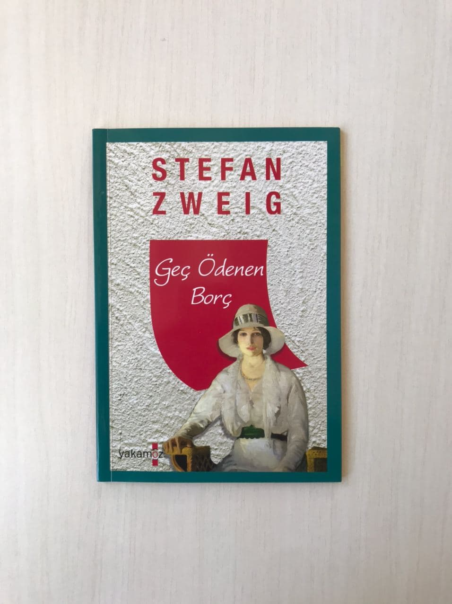

<table><tr>
<td align="left"> 
  
# Geç Ödenen Borç - Stefan Zweig  
## 45 Sayfa
### 08.10.2020
  
</td>
<td> 
  

    
     
    
  
 
</td>

</tr></table>

***Karakterler ;*** 
- ***Margaret:*** Hikayeyi kendi ağzı ile anlatan kahramanımız.
- ***Ellen:*** Margaret'in , en son yıllar önce konuştuğu yakın arkadaşı. 
- ***Peter Sturzentaler:*** Yıllar önce , ünlü devlet tiyatro sanatçısı

 

 Hikayemiz aslında yazılmış bir mektup olarak ele alınmış.. Margaret ismindeki kadın , yıllar önceki yakın arkadaşı Ellen'e yazdığı bu mektupta başından geçenleri anlatıyor.

 Margaret isminde ki kahramanımız.. Bir süre başından kötü olaylar geçmiş , kocasının annesini kaybetmişler. Baktıkları çocuklar hastalanmış. Bunun üzerine kocası , kendisinin uzun zamandır çok yorulduğunu dile getirmiş ve onu dinlenmesi için şehirden uzakta bir yerlerde kafanı topla diye öneride bulunuyordu.. Bunu bir süre erteleyen Margaret , bir süre sonra bunu gerçekleştirdi..

 Güzel sakin bir kasabadaki pansiyondan yer ayırttılar. Ve hemen oraya gittiğinde gerçekten ne kadar güzel karar verdiğini bir kez daha anlamış oldu.. İlk gün uzun bir yürüyüşe çıktı. Dağ bayır gezdi dolaştı , 2 saat kadar yeşilliklerin arasında güzel ve derin bir uyku çekti.. Akşam tekrar pansiyona dönmüştü.. 

 Akşam yemeğinden sonra , pansiyonun alkollü restaurantında oturuyordu.. Köy halkı da kendi halinde oyun filan oynuyorlardı.. Bir süre sonra , içeriye yaşlıca bir adam girdi. Buradan olmadığı hal , hareket ve tavırlarından oldukça belliydi.. Yüksek sesle bara geçip bira istedi. Birasını aldıktan sonra köylülerin yanına sokuldu ve yer istedi. Bir süre sonra ise kendi kendine bir şeyler anlatmaya başladı. Ama kimsenin o adamı dinlediği yoktu.. En sonunda köylülerden birinin kendisini terslemesi ile adam susmuştu.. 

 Bunu fırsat bilen Margaret , hemen barın sahibi yaşlı kadına , bu adamın kim olduğunu sormaya gitti. Çünkü en başından beri bu adamda kendisini rahatsız eden bir şey vardı.. Yaşlı kadın , ***"Ah , o mu ?" dedi umursamaz bir şekilde. "Zavallı , bu yakınlardaki bir kimsesizler yurdunda kalıyor.. İsmi Peter Sturzentaler. Babası eskiden bu köyde odunculuk yapardı. Peter'i kimsesizler yurduna kabul etmelerinin sebebi de babasının burada tanınıyor olmasıydı."***

 Bunu ismi duyan Margaret , bir anda şaşırmıştı. Hemen odasına çıktı ve düşünmeye başladı.. Bu adam , yıllar önce.. Ellen ile birlikte aşık oldukları tiyatrocu olan adamdı. Her şeyini ezberledikleri , onun peşinden gitmedikleri yer bırakmadıkları adamdı.. En sonunda Ellen , ailesi sebebiyle taşınmak zorunda kalmış.. Her gün Margaret'in kendisine mektuplar yazıp bilgilendirmesini istemişti.. Tabi bir süre sonra da , bu ünlü sinemacı da o kasabadan ayrılmak zorunda kalmıştı..

 > ***Peter'in kasabadan ayrılacağını duyan Margaret, adeta kendinden geçmiş çok büyük bir üzüntü içerisine düşmüştü.. Değişen tavırlarından dolayı annesi ve babası tarafından eve kapatılmış ve sinemaya gitmesi yasaklanmıştı.. Son gün , son kez sahneye çıkacak olan Peter' için evden kaçan Margaret.. Uzun uzun sokaklarda dolaştıktan sonra kendini Peter'in evinde bulmuştu.. Zile basıp içeriye girdikten sonra , Peter'e gitmemesi için adeta yalvarmış... Peter'e kendisini yanında götürmesini ve kendisini istediği gibi kullanabileceğini söylemişti Margaret. Tabi o zamanlar genç ve güzel bir kızdı.. Fakat Peter ise onu güzelce yolcu etmiş , onunla vedalaşmıştı..***

 Margaret , o zamanlar böyle aptalca bir şey yapabildiğinin farkında değildi , şimdi düşününce o zaman yaptıkları çok saçma geliyordu.. Çünkü bu adam o zaman için kendi isteğiyle kapısına gelen kızı istediği gibi kullanabilirdi. Ama bunu yapmadı... 

 Şimdi yıllar sonra , Margaret ,  odasında şu şekilde düşünüyordu ; ***"Sadece ama sadece , zamanında bana büyük bir iyilik yapmış bu insanı bunca zaman boyunca unutabildiğim için kendimden utanıyordum.. (sf.36)***
.... Margaret hemen odasından indi.. 10 dakika kadar yukarıda kalmıştı. Her şey aşağıda bıraktığı gibiydi. ; 

***"Siz... Siz , çok değerli oyuncu , devlet sanatçısı Bay Sturz değil misiniz ?*** ... *Peter birden irkildi. Tüm vücudunun titrediğini görebiliyordum. Düşük gözkapakları şaşkınlıkla kalktı. Kimsenin onu gerçekten tanımadığı , geçmişini bilmediği bu köyde , biri ona eski adıyla hitap etmişti.. Üstelik kendisine ***"Devlet Sanatçısı "*** da demişti. Şaşkınlığı tüm yüzünden okunuyordu. Heyecandan kaskatı kesilmişti. Uzun bir sessizliğin ardından bakışları değişti ve bana odaklandı. Sanki ona bir şaka yapılıyordu....* ***"Şey... Evet. Bir zamanlar benim adım buydu." (sf.39)***

> ***Peter'in yanında oturan köylüler şaşkınlıkla karışık saygı içinde adama bakakaldılar ve hemen kenara çekilip ona yol verdiler. O güne kadar bir dilenci gibi davranıp dalga geçtikleri adamın aslında kim olduğunu öğrenince utanmışlardı... Hiç tanımadıkları bir kadının , bu adama böyle saygıyla yaklaşması , onun başka bir diyarda tanınmış ve saygıdeğer biri olabileceği ihtimalini akıllarına getirmiş olmalıydı... (sf.40)***

> ***"Bir şişe şarap , lütfen. Bu çok değerli tiyatro oyuncusunun şerefine en kalitelisi hangisiyse onu istiyorum !" (sf.41)***

____

> ***Peter bana ben daha yolun başında , genç bir kızken yardım etmişti ve ben de ona hayatının son yıllarında yardım ederek ona olan borcumu ödemiştim. Geçte olsa borcumu ödemiştim. (sf.44)***

___

***Evet sevgili dostum , bu sayede sana olan borcumu da geç de olsa ödedim. Ve artık pek sevgili Peterimiz ile ilgili son sırrımı da biliyorsun...***

> ***- SON -***

 

### Kitaptan Alıntılar ;
- > ***"Duygular , insanı ve kendilerini aldatmayı severdi." (sf.42)***
- > ***Bir insanı iyileştirecek en etkili şey mutluluktu ve bir başkasını mutlu etmek de mutlulukların en büyüğüydü... (sf.45)***

