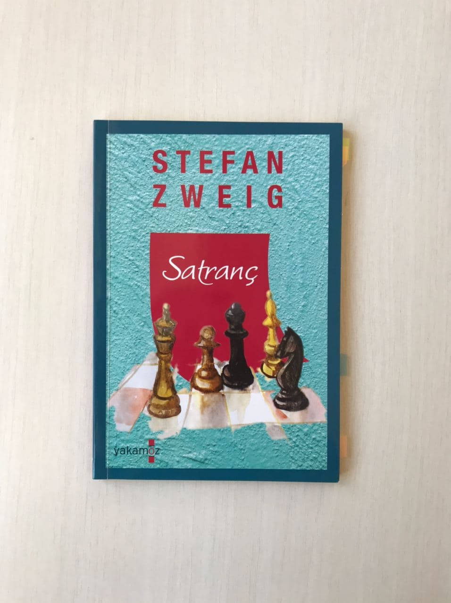

# Satranç - Stefan Zweig
## 76 Sayfa
### 13.10.2020
  
   
 
  

    
     

***Karakterler ;*** 
- ***Mirko Czentovic :*** Dünya satranç şampiyonu
- ***McConnor :*** İskoçyalı bir mühendis.
- ***Bay B :*** 25 yıl boyunca eline bir tek bile satranç taşı almadan , tüm satrancın herşeyini ezbere bilen adam.

 

> ***Yine bir başyapıt olarak adlandırabileceğimiz , mükemmel ötesi bir eser.***

 

Hikayemiz birinci tekil kişi tarafından anlatılıyor.. Kahramanımız bir gemi yolculuğuna çıkacağı sırada , bir anda gürültüler ve flaşlar patlamaya başlayınca merak edip orada neler olduğuna bakıyor.. DÜnya satranç şampiyonu Mirko Czentovic'in aynı gemide olduğunu fark ediyor..

Mirko Czentovic , çocukluğunda babasını bir gemi kazasında kaybediyor.. O zamanlarda bir rahip , Mirko'ya acıyıp onu yanına alıyor ve onu büyütüyor.. Bu süre zarfında hiçbir şekilde tepki vermeyen , konuşmayan , okumayan , anlamayan bir çocuk olan Mirko.. Sadece rahib ve arkadaşı Jandarma ile oynadığı satranç oyunlarını uykulu gözlerle izliyordu.. 

Bir gün yine rahip ve arkadaşı oyun oynarken , komşu köyden birisi acil rahibi çağırır ve rahip gitmek zorunda kalır.. Bu sırada oynadıkları satranç oyunu yarım kalınca , jandarma olan arkadaşı Mirko'ya alaycı bir tavırla hadi bakalım yarım kalan oyunu bitirelim der.. Bunun üzerine çekingen bir tavırla Mirko bu adamın karşısına oturur ve oyuna devam eder.. Mirko , ilk oyunu ve devamında gelen oyunları kazanır.. Bunun üzerine jandarma arkadaşı ,  olanları  rahibe anlatır. Defarlaca rahibi de yenen Mirko bir anda herkesin ilgisini çeker..

Bunun üzerine merkezdeki şehre inerler ve oradaki satranç ustaları ile maç yapmaya başlayan Mirko , ilk başlardaki bir kaç oyunu kaybeder. Sonrasında ise karşısına çıkan tüm insanları yener.. 20 yaşına geldiğinde ise çok fazla sayıda başarısı ve dünya satranç şampiyonluğu vardır...

____

Bir şekilde dünya satranç şampiyonu ile tanışmak isteyen kahramanımız onun ilgisini çekmek için , McConnor ismindeki adamla satranç oynamaya başlar.. Bir süre sonra McConnor , dünya şampiyonu ile 250 dolar karşılığında bir maç ayarlar.. Fakat sonuç hiçte şaşırtıcı değildir ve kaybederler.. Mirko , herkese o kadar tepeden bakan bir insan ki , kimseyle tek bir kelime dahi konuşmayan kendini herkesten üstün gören bir insan... Öfkeden deliye dönen McConnor , bir kaç maç daha rövanş istedi ama onları da kaybetti.. 

Son maçtayken , maçın ortalarında tam da bir hamle yapacak iken , yabancı birisi onlara müdahale etti ve o hamleyi yapmamasını ve başka bir hamle yapmasını söyledi.. Bu hamleyi yaptıktan sonraki olası 5-6 hamleyi de onlara anlattı.. Bu yabancı adamı dinleyen McConnor , en sonunda dünya şampiyonu ile berabere kaldılar.. Böyle bir şeyi kimse beklemiyordu ve kimsenin de umudu yoktu.. Bunun üzerine Czentovic bir maç daha istedi..

Ertesi gün kahramanımız , bu yabancı adamın yanına gidip maça çıkması için ikna etmeyi denedi.. Ve bir süre  kahramanımız ve Bay B birlikte sohbet ettiler ... Bay B başından geçenleri anlattı ; 

> ***Bay B , yıllar önce ajanlar tarafından yakalanmış ve sorguya çekilmek üzere kampa götürülüp fiziksel işkence yapılmayıp  , bir tane otele götürülmüş.. Tabi bu şekilde bakınca kulağa ne kadar hoş gelse de aslında o kadar da kolay bir şey değil... Çok uzun bir süre boyunca sadece tek başına bırakılan Bay B , psikolik şiddete mağruz kalmış.. Elinden her şey alınmış ve tamamen bir hiçliğin içine bırakılmış... Ne kadar sorguya çekilse de hiçbir şey söylemeyen Bay B , bir süre sonra artık kafayı yeme noktasına gelmiş.. Taa  ki bir gün , yine sorguya götürüldüğü sırada , uzun süre hakimin gelmesini beklerken oradaki bir paltonun cebinden küçük bir kitap çalar ve artık hayata tutunmak için bir sebebi olur..***
 
> ***Odasına döndüğünde , kitaba baktığında hayal kırıklığına uğrasada , ilk başlarda bu kitaptan bir şey anlamayan Bay B , zamanla bu kitapta yazan tüm satranç maçlarını bir bir kafasının içinde hepsini oynar ve hepsini ezberler.. Artık bu da yeterli gelmeyince , bu sefer  siyah ve beyaz olarak kendi oyunlarını yazmaya başlar.. Ne kadar zor olsa da , en sonunda kafayı yeme noktasına ulaşır ve kendini hastanede uyanmış bir şekilde bulur... Başından şunlar geçmiştir ; kendiyle savaşan iki farklı bir insan gibi en sonunda kendi kendine satranç oynarken kavgaya tutuşan Bay B , kendine zarar verir.. İyi niyetli doktor sayesinde bir daha oraya geriye dönmez...***

Maç günü geldiğinde Bay B , yıllar sonra ilk defa bir satranç tahtasının başına oturup satranç oynar.. İlk oyunlarında Mirko o kadar zorlanır ki , aksine Bay B ise çok rahat  bir şekilde oynar.. Fakat oyunun ortalarına doğru gelince Mirko bilerek çok uzun süre bekleyerek oynamaya başlayınca Bay B'nin sinirlendiğini fark eder.. İlk oyunu kazanamayacağını anlayınca Mirko yenilgiyi kabul eder ve Bay B oyunu kazanır... İkinci oyunda ise, Mirko bilerek en son zamana kadar bekler ve en sonunda Bay B'yi çileden çıkartıp kendini kaybetmesine sebep oldu...

> ***- SON -***
