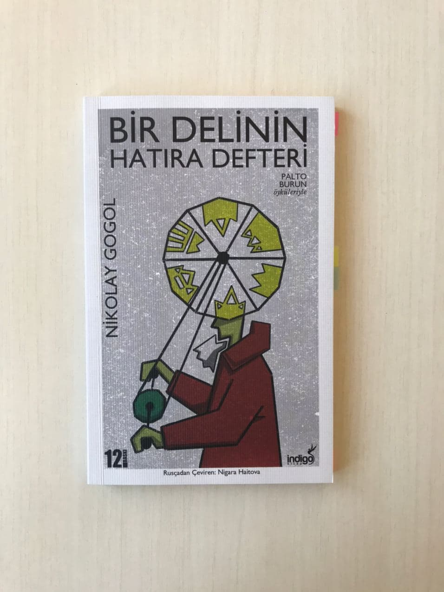

<table><tr>
<td align="left"> 
  
# Bir Delinin Hatıra Defteri - Nikolay Gogol
## 128 Sayfa
### 16.08.2020
  
</td>
<td> 
  

    
     
    <em style="color: grey">packet switching</em>
  
 
</td>

</tr></table>

 

***Karakterler ;*** 
- ***İvan Yakovleviç :***
- ***Kolarev :***
- ***Akakiy Akakiyeviç :***

 

> ***Burun***

İvan Yakovleviç , bir sabah kahvaltı yapmak için oturdu. Kendisi sürekli alkol kullanan bir berberdi.. Ekmeği eline aldı ve içerisinden bir tane burun çıktı.. Bu burun , büro şefi yardımcısı Kolarev'in burnuydu.. Yakovleviç , hemen bu burundan kurtulmak için evden çıktı ve en sonunda burnu nehre attı.. 

Bir diğer tarafta , Kolarev sabah uyandı ve aynanın karşısına geçtiğinde öyle bir şaşırdı ki , çünkü burnu yerinde yoktu.. Hemen sokağa çıktı , burnunu aramaya koyuldu. Nereye gitse , kimse yardımcı olamadı ona , burnu bir rütbeli asker kılığında dolaşıyordu.. Kolarev , burnunu katadrelde dua ederken yakaladı. Burnuyla konuştu ama burnu hiç oralı olmadı ve ikisininde birbirinden bağımsız insanlar olduğunu savundu.. 

Bu arada , Kolarev başına her şeyin gelmesine razı oldu fakat burnunun olmamasına kabullenemiyordu.. En sonunda  bir sabah uyandığında , yeniden burnunun yerine geldiği için sevindi.. Ve yeniden herkese tepeden bakmaya devam etti... 

> ***Palto***

Akakiy Akakiyeviç ismindeki bir adam yazıları temize çekme görevinde , bir devlet dairesinde çalışıyordu.. İş yerinde ki herkes onunla alay edip , onu eziyordu.. Akakiy ise , hiç kimseyle muhattap olmayan , sadece yazacağı yazılardan başka hiçbir şey düşünmeyen bir adamdı.. Bir gün omuzlarında çok ağır bir yük hissetti. Akşam evine geldiğinde yıllardır giydiği paltosunu inceledi ve bu paltonun sebep olduğunu anladı.. Paltosu artık iyice eskimiş ve incelmişti.. Zaten bu sebeple herkes onunla alay ediyordu..

Paltosunu yama yaptırmak için terziye gittiğinde , terzi bu paltonun artık iş görmeyeceğini ve yenisini alması gerektiğini söyledi.. Akakiy her ne kadar üzülse de , en sonunda uzun süre aç kalarak ve tasarruf etmeye çalışarak.. Yeni bir palto diktirdi.. Bunu giyip çalıştığı yere gittiğinde herkes büyük bir çoşku içinde onu karşıladı ve insanların ilgisini çekti.. 

Akakiy , bu yeni paltonun şerefine , bir tane davete katıldı.. Akşam biraz uzun kaldı , bir kaç kadeh bir şeyler içti ve eve dönerken , iki tane adam tarafından dövüldü ve paltosu çalındı.. Bunun üzerine ilerleyen günlerde karakola gitse de bir sonuç çıkmadı.. En son çalıştığı yerde ki yabancı ünlü bir adama başvurdu.. Ama adam onu öyle bir azarladı ki , Akakiy bayılıp yere düştü.. Bunun üzerine ilerleyen bir kaç gün içerisinde yüksek ateş ile birlikte hastalanan Akakiy , hayata veda etti...

 

### Kitaptan Alıntılar ;

___

> ***Şu uzaktaki beliren benim evim mi ? Pencerede oturan kadın annem mi ? Annem benim , kurtar zavallı oğlunu ! Onun ağrıyan başına akıt gözyaşlarını ! Ona neler yaptılar , görüyor musun ?  Zavallı yetim oğlunu bas bağrına ! Ona yer yok bu dünyada !  Her yerden kovuyorlar oğlunu ! Anneciğim ! Şu zavallı oğluna acı ! (sf.41)***

___

> ***Kovalev mutluluktan neredeyse kahkaha atacaktı. Ama bu hayatta hiçbir şey uzun sürmez ; ikinci kez duyduğu mutluluk da , ilkine oranla pek cansızdı. Üçüncü kez duyacağı mutluluk biraz daha zayıflayacak , en sonunda da yok olup gidecekti. O da eski ruh haline dönecekti , tıpkı taşların suda sektirilmesiyle oluşan halkaların bir süre sonra kaybolması gibi... (sf.69)***

___

> ***Onun , insanın içini yakan "Beni rahat bırakın , neden kalbimi kırıyorsunuz ? " sözlerini "Ben de sizin kardeşinizim" şeklinde algılamaya başladı. Zavallı genç memur , yaşadığı şu kısa ömründe insanların ne kadar da acımasız olduklarını , sözde kibar olduğunu düşünülen eğitimli ve sosyetik kişilerin içlerinde sonsuz  kötülükler barındırdığını görerek ürperir , yüzünü elleriyle kapatırdı. Tanrım ! En kötüsü de , insanların dürüst ve asil olarak değerlendirdikleri kişiler yapıyor tüm bunları... (sf.86)***

___

> ***" Olmaz düzeltmenin imkânı yok ! " dedi... Akakiy Akakiyeviç bu sözleri duyunca az kalsın kalbi duracaktı. " Neden olmuyor , Petroviç ? Bir tek omuz kısmında incelmeler var , o kadar. Yama için küçük kumaş parçaları yok mu sende ? " diye sordu , çocuk gibi yalvaran sesiyle.." (sf.95)***

___

> ***İşte paranın yarısına bu sayede sahipti , fakat diğer yarısını nereden bulacaktı ? Diğer kırk rubleyi nereden alacaktı ? Uzun uzun düşündükten sonra , günlük harcamalarını en az bir sene kısması gerektiğine karar verdi : Akşamları içtiği çaydan , yaktığı mumdan vazgeçmesi gerekiyordu. Çalışması gereken zamanlarda ev sahibinin evine gidip taktığı ışıkta çalışacaktı. Ayakkabısının köselelerini eskitmemek için sokak ve kaldırımlardaki taşlara dikkatlice , ayağının ucuyla hafifçe basarak yürüyecekti. Eve gelir gelmez , üzerindeki kıyafetlerini çıkarıp zamanın bile eskitemediği pamuk hırkasını giyecekti. Çamaşırlarını çamaşırcı kadına elden geldiğince nadir yıkatacaktı... Doğruyu söylemek gerekirse , ilk başlarda bu tür kısıtlamalara alışması zor olmuştu , ama zamanla benimsedi ve her şey yoluna girdi. Akşam yemeği yememeye bile alışmıştı ; nasılsa ruhu , gelecekte yaptıracağı paltosunun  hayaliyle beslenebiliyordu... (sf.101)***

___

> ***Akakiy Akakiyeviç'i mezarlığa götürüp gömdüler. Böylelikle , Petersburg Akakiy Akakiyeviç'siz kaldı , sanki hiç yaşamamış gibiydi. Kimse tarafından tanınmamış , korunmamış , değer verilmemiş , kimsenin ilgisini çekmemiş bir varlık yok olmuştu. Sıradan bir sineğe bile mikroskop altında inceleyen bir bilimcinin dahi  yüzüne bakmadığı Akakiy Akakiyeviç , iş arkadaşlarının alaylarına katlanmış ve hiçbir olağanüstülük görmeden bu dünyadan göçüp gitmişti. Yalnız , ömrünün sonuna doğru acınası yaşamını canlandıracak tek bir şey girmişti hayatına : palto kılığındaki aydınlık bir konuk. Sonra hükümdarların , kralların , tüm dünyaya egemen olanların başına gelen mutsuzluk onun da başına gelmişti... (sf.120)***

____