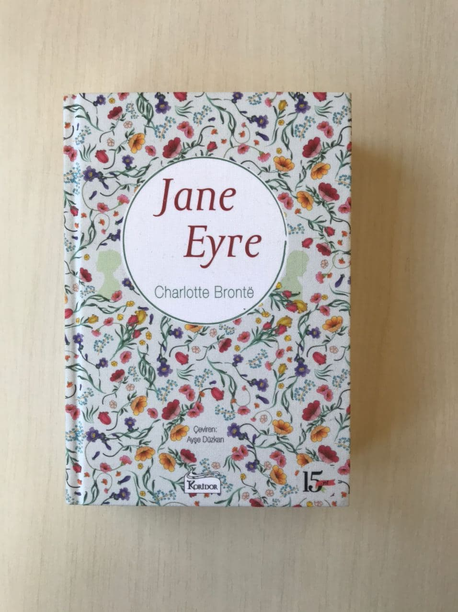

  
# Jane Eyre - Charlotte Bronte
## 663 Sayfa
### 13.11.2020

 

  

    
     

 
 

 

***Karakterler ;*** 
- ***Jane Eyre :*** Annesi ve babası ölen , 10 yaşındaki kız
- ***Bessie Lee :*** Gateshead'da ki Jane'in içlerinde en çok sevdiği dadı , arada kendisini azarladığı da oluyordu.
- ***Bay Reed :*** Annesinin kardeşi , yani dayısı. Ama vefat ediyor.
- ***Bayan Reed :*** Dayısının eşi. Jane'e hiç iyi davranmıyor.
- ***Bay Rochester :*** Thornfield Malikanesinin sahibi.
-  ***Bayan Adele :*** Bay Rochester'in evlatlık edindiği küçük kız.
- ***Bayan Fairfax :***  Thornfield Malikanesinin yöneticisi ve kahyası.
- ***St John Eyre Rivers:*** Mary ve Diana'nın ağabeyi, Jane'in kuzeni.
- ***Mary:*** St John ve Diana'nın kardeşi, Jane'in kuzeni.
- ***Diana:*** St John ve Mary'nin kardeşi, Jane'in kuzeni.

 

Jane Eyre , annesi ve babası hastalık yüzünden ölen ve başka hiçbir akrabası olmayan küçük bir kızdır.. Dayısı olan Bay Reed , Jane'i yanına almıştır. Ama bir süre sonra dayısı da vefat etmiştir. Bu durumda , Bayan Reed ve onun çocukları ile birlikte aynı evde yaşamaktadır. Fakat Jane , hiç kimse tarafından sevilmeyen bir kızdır.

Bir gün Jane ,  Bayan Reed'in oğlu John ile tartışırken ,  John'un kendisine sert bir şekilde kitap fırlatmasıyla yere düşer ve başı kanamaya başlar. Her ne kadar Jane'in hiçbir suçu olmasa dahi , John'a kimse bir şey söylemez ve bunun aksine Jane'i kırmızı odaya ceza olarak kapatırlar..

Jane , akşama kadar kırmızı odada kalır.. ***Neden hep acı çekiyordum , hep korkutuluyordum , hep suçlanıyor , her zaman kınanıyordum ? Neden hiçbir zaman kimseyi memnun edemiyordum ? Herhangi birinin gönlünü kazanmaya çalışmak neden boşunaydı ? İnatçı ve bencil Eliza saygı görüyordu ? (sf.18)***...   ***Düştüğüm ve kafamı çarptığım için başım hala ağrıyor ve kanıyordu ; beni sebepsiz yere dövdüğü için John'u kimse ayıplamamıştı ve bu anlamsız şiddeti daha fazla sürdürmesini engellemek için ona karşı çıktım diye herkes tarafından aşağılanmıştım... (sf.19)***

Bir süre bu kırmızı odada kalan Jane , en sonunda hastalanıyor ve kendine geldiğinde ise farklı bir odada kendini yatıyor buluyor ve başında eczacı Bay Lloyd vardı.. Bu ilk gün için Bay Lloyd hemen ayrıldı , ilerleyen günlerde tekrardan Jane'in durumunu incelemeye geldiğinde , Jane ile biraz sohbet etti.. Jane ise ne kadar mutsuz olduğundan filan bahsetti. Bay Lloyd  oradan ayrılmadan önce Bayan Reed'e Jane'i okula göndermesini önerdi.

 Aradan uzun bir süre geçti , bir gün ansızın evlerine bir araba geldi.. ***Beni kimin beklediğini , Bayan Reed'in orada olup olmadığını sorardım ama Bessie çoktan gitmiş ve çocuk odasının kapısını kapatmıştı. Yavaş yavaş aşağıya indim. Neredeyse üç aydır Bayan Reed'in yanına çağırılmamıştım , o kadar uzun bir süredir çocuk odasına mahkumdum kii kahvaltı ve yemek odaları ve salonları benim için , girmekten korktuğum berbat bölgeler olmuştu.. (sf.42)***

> Bay Brocklehurst , Bayan Reed ile görüşmeye gelen adamdı.. Bayan Reed , Jane'i de yanına çağırdı ve her şeyi Bay Brocklehurst'e anlattı.. Jane'in ne kadar yalancı ve yaramaz olduğunu , Jane'i burada istemediğinden filan bahsetti... Bay Brocklehurst gittikten sonra ise Jane , Bayan Reed'in karşısına geçip aklına ve ağzına ne geldiyse hepsini söyledi. Adeta Bayan Reed'ten bir intikam almış ve zafer kazanmıştı. 

***En sonunda Jane , Bessie ile bir araya geldi. Birbirlerine ne kadar sevdiklerinden bahsettiler.  Jane , Gateshead'da ki en sevdiği insanın Bessie olduğunu söyledi ve onu öptü.. Birbirlerinden ayrılacakları için Jane çok üzgündü..***

> ***Gateshead'dan Ayrılış***

Ocak 19'un sabahı saat beşi henüz vurmuştu ki , Jane yeni uyandı. Bir saat içerisinde hazırlandı ve Bessie ile vedalaşıp , saat altıda Gateshead'dan , at arabasına bindirilip ayrıldı.. Bir süre yolculuğun ardından ***Lowood Kurumu'na*** ulaştı.. On ila yirmi yaşları arasında seksen kadar kız vardı. İlk günü derslere girip çıkarak gayet sıradan geçmişti... Bir ara , bir tane kız ile sohbet etti , ona sorular sordu... Aynı günün sonuna doğru , bu sohbet ettiği kız sınıfta ceza almıştı. Herkesin içerisinde ayakta bekleyecekti.. Jane'in bu kız ***( Helen Burns)*** hakkında düşünceleri ;

> Kendi kendime , ***Böyle bir şeye nasıl bu kadar sessiz , bu kadar güçlü bir biçimde dayanabiliyor ?*** diye sordum. ***Bana öyle geliyor ki ben onun yerinde olsam , yer yarılsında içine gireyim isterdim. Sanki cezasının ötesinde , durumunun ötesinde bir şey düşünüyor gibi bir hali var ; ne etrafında ne de önünde olan bir şey. Gündüz görülen rüyaları duymuştum. Acaba şimdi gündüz rüyası mı görüyor ? Gözlerini yere dikmiş ama orayı görmediklerine eminim ; sanki bakışı içine çevrilmiş , kalbinin içine dönmüş : Şu anda olana değil , hatırladığı şeylere bakıyor , sanırım. Acaba ne türden bir kız bu ; iyi mi yoksa yaramaz mı ? (sf.72)***

Lowood'da ki ikinci gününde , yine eğitimle geçti. Ama üzücü bir şekilde , Jane'in tanıştığı Helen Burns öğretmenleri tarafından hiç sevilmeyen , azar işitip ve cezalara maruz kalıyordu... Jane günün sonunda Helen'i yine kitap okurken yakaladı ve yanına oturdu.. Birlikte sohbet ettiler.. Helen'in , Jane'e kendisi hakkında söyledikleri şu şekilde; ***"Öyleyse benden insanları görünüşlerine göre yargılamamayı öğren : Ben Bayan Scatcherd'in dedidiği gibi pasaklıyım ; hiçbir şeyi yerine koymam , bir şeyi nadiren olması gerektiği yerde tutarım ; dikkatsizim ; kuralları unuturum ; derslerime çalışmam gerekirken kitap okurum ; usul bilmem ve bazen senin gibi , sistemli düzenlemelere dayanamadığımı söylüyorum.." (sf.78)***

> Bir süre sonra Bay Scatcherd geldi ve herkesin içerisinde , Jane'i bir taburenin üzerine çıkardı.. Bay Scatcherd , Bayan Reed ile ilk günkü gibi konuştuğu şekliyle , herkese Jane'in ne kadar kötü ve yalancı bir çocuk olduğunu anlattı. Hiç kimsenin Jane ile arkadaşlık kurmaması gerektiğini söyledi.. Bunun üzerine Jane'e de ceza olarak tabure üzerinde durmasını emretti.. 

> Bir saat kadar bir sürenin ardından herkes dağıldı ve Jane tek başına ağlamaya başladı. Yanına Helen geldi ve Jane'e üzülmemesi gerektiğini belirterek büyük destek oldu. Bir süre sonra da Bayan Temple da onlara katıldı.. İlk önce Jane'in başından geçen her şeyi anlatmasını istedi.. Jane en başından itibaren dayısı ve bayan Reed ile olanları anlattı.. Bunun üzerine Bayan Temple, tüm bunları doğrulamak için Bay Lloyd' soracağını söyledi.. Bayan Temple , Helen ve Jane ile uzun uzun sohbet etti.. Yatma vakti gelince " Tanrı sizi korusun çocuklarım ! " diyerekten vedaştı Bayan Temple.

> Bir süre sonra Bay Lloyd'dan olumlu haber gelince.. Bayan Temple , herkesi bir araya toplayarak Jane'in hakkında ki o kötü şeylerin birer yalandan ibaret olduğunu herkese anlattı. Bunun üzerine Jane , öğretmenleri ve arkadaşları tarafından tüm olumsuzluklardan kurtulmuş oldu.. İlerleyen zamanda bir çok başarı yakalayıp sınıfını yükseltti..

Aradan yine uzun bir zaman geçtikten sonra. Lowood Kurumu'nda bir salgın hastalık başladı. Neredeyse kırk öğrenci kalmıştı. Bir kısmı ölmüş , bir kısmıda evlerine geriye dönmemek üzere ölüme gönderilmişti. Aynı zamanda eğitime ara verilmişti.. ***Jane bir süredir Helen ile görüşemiyordu çünkü Helen da hastaydı.. En sonunda Jane gece uyuyamamıştı. Helen'in olduğu odaya gitti. Birbirlerine son kez sımsıkı sarıldılar ve biraz sohbet ettiler. O gece birbirlerine sarılarak uyudular.. Jane sabah uyandığında hemşirenin kollarında yatakhaneye götürülüyordu. Birkaç gün sonra öğreniyor ki , onları Helen ve Jane'e sarılarak bulan Bayan Temple olmuş.. Ama üzücü kısmı ise ; Jane uyuyor , Helen ise ölmüş... (sf.117)***

Aradan sekiz yıl geçti , Jane bunun altı yılını öğrenci ve son iki yılını öğretmen olarak geçirdi.. En sonunda Bayan Temple'in evlenip Lowood'dan ayrılması sonucunda Jane' tamamen büyük bir boşluğa düştü.. Bunun sonucunda artık buradan ayrılması gerektiğini ve yeni denizlere  yelken açması gerektiğini düşünüyordu.. Gazete'ye ilan verdi , aradan belli bir süre geçtikten sonra bir tane on yaşındaki çocuk için öğretmenlik işine kabul edildi.. Son gün eşyalarını topladı ve Lowood'dan ayrılacakken oraya Bessie ziyarete geldi ve uzun uzun Jane ile sohbet ettiler.. Ve ertesi gün ikisi de kendi yollarına ayrıldılar.

Uzun bir yolculuğun ardından Jane çalışacağı yere ulaştı. Thornfield ismindeki bu yerin sahibi ise Bay Rochester'idi.. Jane'i karşılayan Bayan Fairfax oldu. Bayan Fairfax ise buranın yöneticisi ve kahyasıydı. Yol yorgunu olduğu için Jane , hemen odasına çekilde ve uyudu. Ertesi gün öğrencisi 7-8 yaşlarındaki Bayan Adele Varens ile tanıştı , bunun üzerine Bayan Fairfax ile etrafı dolaştılar. Burası güzel ve sakin bir yerdi.

> Bir gün Jane , şehre mektup bırakmaya giderken yolda bir adamla karşılaştı , daha doğrusu bu adam at arabasıyla birlikte soğuk ve buzlu olan yolda küçük bir kaza geçirdi ve yere düştü. Jane bu adama yardım etmeye çalıştı , ama adam kendisi hakkında herhangi bir şey söylememişti. Adamın yanında ise Kılavuz isminde bir de köpeği vardı.. Jane işlerini halledip Thornfield'a geri döndüğünde ise ilk başta içeri de bu köpeği gördü ve hemen ardından oradakilere bu köpeğin sahibinin kim olduğunu sordu. Bu köpeğin sahibi yani kaza yapan bu adam Bay Rochester'idi yani buranın sahibi..

> İlerleyen günlerde Jane , Bay Rochester ile tanıştı. Başlarda çok fazla tepeden bakan bu adam , ilerleyen zamanda ise Jane'e iyi davranmaya başladı.. Bir gün Jane ile birlikte dışarıda yürüyüş yaparlarken , Küçük Kız Adele'nin annesini ve Adele'nin şuanda buraya nasıl geldiğini anlatmaya başladı.. ***Başlarda Adele'nin annesine büyük bir tutku ve aşk duyan Bay Rochester , Adele'nin annesine bir sürü takı ve mücevherler hediye eder. Bir gün Bay Rochester, kadını çok daha alt düzey bir adamla yatak odasında yakalar ve sonrasında ise kadını oradan gönderir. İlerleyen zamanlarda bu küçük kızın yani Adele'nin Rochester'in kızı olduğunu öne süren kadın , onları bırakıp gider. Bay Rochester'da bu küçük kızın orada burada savrulup gitmemesi için buraya İngiltere'ye getirir...*** Bunların üzerine Bay Rochester , bu küçük kız Adele'yi kendi kızı olarak görmediğini ve o yüzden pek fazla önemsemediğini Jane Eyre'ye belirtir.. ***Bu duyduklarından sonra Jane , yetim olan küçük kızı bırakmak istemez ve ona daha büyük bir sevgi ile bakmaya başlar..***

Bir gece Jane uyuyamaz ve aynı zamanda koridorda değişik sesler duyar. Bunun sonucunda korkusundan Bayan Fairfax'ın yanına giderken , Bay Rochester'in odasından alevler ve dumanların yükseldiğini fark eder.. Bir anda içeriye girdiğinde ortalık alev alev yanmaktadır. Güç bela sular dökerek alevleri söndürür ve Bay Rochester2in hayatını kurtarır.. ***"Bunun üzerine Bay Rochester , Jane'e bir sürü sevgi sözcükleri söyler.. (sf.221)***

Bu olayların ardından Jane gece uyuyamadı. Ertesi gün Bay Rochester ile karşılaşmaktan korkuyordu ama akşam öğrendi ki Bay Rochester oradan ayrılmıştı.. On beş gün kadar da geriye dönmedi , bu süre zarfında Jane , kendini Bay Rochester'a karşı bir şeyler hissetmemesi adına telkinlerde bulunuyordu.

En sonunda Bay Rochester ve bir sürü kalabalık grup eşliğinde eve döndüler. İlk gün hiçbir şey olmadı , Adele ve Jane ayak altında dolaşmadılar.. İkinci gün ise Bay Rochester'in özel isteği ile Jane ile Adele aşağıya konukların , birbirinden güzel hanımların ve yakışıklı beylerin , yanlarına davet edildiler.. Bir süre orada perdenin arkasında dikkat çekmeyerek oturan Jane , tam da oradan ayrılırken karşısına Bay Rochester çıkıyor ***Bay Rochester , Jane'e niye üzgün olduğunu , niye kendisiyle konuşmaya gelmediğini soruyor.. Bunun üzerine ilerleyen günlerin hepsinde Jane'in aralarına katılmasını istiyor.. Bay Rochester veda ederken şöyle diyor ; "İyi geceler benim..." Durdu , dudağını ısırdı ve hemen ayrıldı...(sf.265)***

> ***Tekrardan Gateshead'a Dönüş***

Bir gün Thornfield Malikanesi'ne Jane'i görmeye gelen birisi olduğu söylendi. Jane bu kişinin yanına gittiğinde ise Bessie'nin kocası olduğunu gördü.. ***Bayan Reed'in oğlu , John Reed çok berbat bir hayat yaşıyormuş , bir kaç kez ise hapise girip çıkmış. Bundan bir süre önce de ölmüş.. Bu ani ölüm ile Bayan Reed felç geçirmiş. Bir süre sonra Jane'i sayıklamaya başlamış. Böyle olunca da Bessie'nin kocası Jane'i almaya gelmiş.***

Ertesi sabah yola çıktılar. 160 kmlik bir yolun ardından  Gateshead'a ulaştılar. Her şey 9 yıl önce ki gibi aynıydı.. Jane burada bir ay kadar kaldı. Bu süre içerisinde Bayan Reed ile konuştu. ***Bayan Reed , Jane'den ne kadar nefret ettiğinden ve tüm bu olanların onu uzun zamandır huzursuz hissettirdiğinden bahsetti.. Bunun yanında bu nefretinden dolayı , 3 yıl önce John Eyre isminde ki bir amcası Madeira'dan Bayan Reed'e yazmış. Jane Eyre'yi evlatlık edinmek istediğini ve sonrasında ise tüm malını ona bırakmak istediğini söylemiş.. Fakat Bayan Reed, Lowood'da ki salgın hastalıkta Jane'in öldüğü yalanını söylemiş...*** Bayan Reed bunları anlattıktan sonra ki gece yarısı öldü..

___

> ***Bay Rochester'dan, Jane'e evlenme teklifi (sf.373)***

Bir gün Jane gece vakti bahçede yürüyordu. Bir süre sonra yanına Bay Rochester geldi. Konuşmaya başladılar, ilk başta Bay Rochester, kendisinin Bayan Ingram ile evleneceğini ve Jane'in buradan ayrılması gerektiğini söyledi.. Sonrasında ise Bay Rochester, bunun gerçek olmadığını, sadece ve sadece sevdiğinin Jane olduğunu, burada kalmasını ve kendisiyle evlenmesini teklif etti.  

"Yanıma gel, Jane, ve izin ver ne demek istediğimizi birbirimize anlatalım ve birbirimizi anlayalım." dedi.   ***"Bir daha asla sizin yanınıza gelmeyeceğim; ben artık oradan koptum ve bir daha geri dönemem."***   "Ama Jane, senden karım olmanı istiyorum, evlenmek istediğim tek insan sensin."   Sesimi çıkarmadım benimle alay ettiğine inanıyordum.   "Gel Jane, buraya gel."   ***"Eşiniz araya giriyor."***   Bay Rochester ayağa kalktı ve büyük bir adım atarak yanıma geldi.   Beni tekrar kendine çekerek, "Benim eşim burada," dedi. "Çünkü benim dengim burada ve benim benzerim. Jane, benimle evlenir misin?"   ***(...)***   ***"Samimi misiniz? Beni gerçekten seviyor musunuz? Eşiniz olmamı gerçekten istiyor musunuz?"***   "İstiyorum ve eğer seni tatmin etmek için yemin etmem gerekiyorsa yemin ederim."   ***"Öyleyse efendim sizinle evlenirim."***   "Jane; benim küçük karım."   ***"Sevgili Edward!"***

_____

Aradan neredeyse bir ay kadar bir zaman geçti. Bay Rochester ve Jane Eyre artık, evleneceklerdi. Sabah, kilisiye vardıklarında kimsecikler yoktu. Nikah töreninde hiç misafir olmayacaktı, fakat sadece iki tane yabancı bir adam vardı.. Nikah töreni başladı ve papaz genel bir soru olarak, bu nikahın kıyılmasında herhangi bir engel var mı diye sordu. O yabancı iki adamdan bir tanesi arkalarından, "evet bu nikah gerçekleşemez" diyerekten itiraz etti. Bunun üzerine sebebini açıklamaya koyuldu... ***Bay Rochester'in şu anda hayatta olan bir karısı vardı."*** On beş yıl önce bir evlilik yapmış olan Rochester' aslında gerçekleri göremediğinden bahsetti. Bay Rochester'i kandırmışlar. İlk karısı olan kadın ve ailesi deliymiş.. Bunların üzerine oradaki herkesle birlikte eve döndüler. Üçüncü kata çıktılar, odaya girdiler ve oradaki gizli bölümdeki parmaklıkların arkasında  o deli, vahşi kadını hep birlikte gördüler. Onu kapalı tutuyorlardı... Bu yabancı adamlar Jane Eyre'ye amcaları Bay Eyre'nin isteği üzerine geldiklerinden bahsettiler. Amcası, verem hastalığına yakalanmış ve hasta olduğu için gelememiş. Tüm bunların ardından herkes oradan ayrıldı. Jane Eyre ise odasına geçti.

Ertesi sabah Jane dışarıya çıktı ve Bay Rochester da bir süre sonra Jane'in yanına geldi.. Birlikte konuşmaya başladılar. Bay Rochester başından geçen tüm olayları Jane'e anlattı. ***On beş yıl önce Bay Rochester'in babası, kendisini sevmediğini, ağabeyini çok daha sevdiğini söyledi. Bu sebeple Bay Rochester'i bu deli karısıyla evlendirmişler. O zamanlarda bu kadın gayet güzel ve sıradanmış. Sonradan kadın, annesi gibi delirmiş. Zaten bir süre sonra Bay Rochester'in ağabeyi ve babası da ölmüş.. Bay Rochester'in hayatı artık bu kadın ile çekilmez bir hal almış. En sonunda bu kadını İngiltere'ye, Thornfield'a getirmiş. Üçüncü kata kimsenin bilmediği gizli bir odaya kapatmış. Bir süre sonra bu kadına bakması için bir bakıcı bulmuş. Zaten bu sırrını da bu bakıcı ve doktoru dışında başka kimse bilmiyormuş... Tüm bunlardan sonra ülkeyi gezmiş dolaşmış ve kafasına göre bir eş olacak birini bulamamış. Taa ki, ilk gün Thornfield'a gelirken Jane ile karşılaşana kadar.. Hikayenin devamı zaten bildiğimiz gibi..*** Tüm bu konuşmalardan sonra kararlı bir şekilde Jane burada daha fazla kalamayacağını söyledi. Her ne kadar Bay Rochester, Jane'i çok sevse de ve Jane'in burada onunla birlikte kalmasını yalvarsa ve istesede herhangi bir şey değişmedi... O gece Jane son kez burada kalmıştı. Sabah erkenden kimsenin haberi olmadan Thornfield'dan ayrıldı...

_____

> ***Thornfield'dan ayrılış.***

Jane, yanına bir bohça ve 20 şilin bir para almıştı.. Yolda bir tane arabacıya denk geldi ve nereye gittiğini sordu. Onunla birlikte yola çıktı ve parasının tamamını bu adama verdi. Parasının karşılığı kadar götüren bu adam, Jane'i Whitcross diye bir yerde indirdi... Yanında ne bir parası ne de başka bir şeyi vardı. En yakınındaki bir köye gitti. Orada hangi kapıyı çaldıysa geri çevirdiler. İki gece dışarıda soğukta ve yağmurda kaldı. En sonunda artık hiç gücü kalmamışken, son nefesini vermeye yaklaşmışken bir tane eve güç bela ulaştı. Dışarıda yağmur yağıyordu, Jane'in üstü başı pislik içerisinde ve sırılsıklamdı. Güç bela kapıyı çaldı, kapıyı evin hizmetçisi Hannah açmıştı. Ne istediğini sordu, Jane'i hiçte güvenilir bulmadığı için kapıyı Jane'in suratına kapattı... Jane'in artık yapacak hiçbir şeyi kalmamıştı, ne gidecek gücü vardı ne de adım atacak hali, artık orada ölmeyi bekleyecekti.. Neyse ki bir süre sonra evin Beyi olan, St John isimli adam, Jane'i eve aldılar. Nerden gelip nereye gittiğini ve kim olduğunu sordular. Ama Jane'in hiç hali yoktu... Neyse ki onu üst kata çıkardılar ve sıcak bir oda ve yatak verdiler... Jane üç, dört gün kadar sadece yattı. Bu sürenin ardından kendine geldi ve salona insanların yanına indi. Evin kızları, Diana ve Mary ise Jane'i sevmişler ve çok sıcak kanlı davranıyorlardı. Jane başından geçenlerin bir kısmını onlara anlattı.. Ve St John, Jane için çalışacak bir şey ayarlayabileceğini ve bu zaman içerisinde burada kalabileceğini söyledi..

___

Bir ay kadar bir süre Jane Eyre, Moor House da kaldı. Bu süre içerisinde Diana ve Mary ile çok iyi sıcak kanlılık ve samimiyet içerisinde anlaştılar. Birbirleriyle düşünce biçimleri o kadar çok uyumluydu ki anlatamam... Sonrasında ise, Mary ve Diana birbirinden farklı şehirlere çalışmak için gitmek zorunda kaldılar. St John ise Jane için bir iş teklif etti. Jane, bu köydeki yeni açacakları okulun öğretmeni olacaktı, ve kendisine kalması için bir küçük ev bile hazırladılar. 20 tane öğrencisi vardı, bunların büyük bir çoğunluğu cahil ve okuma yazma bilmiyordu. Zamanla birbirlerine alıştılar ve birbirlerini sevmeye başladılar.

____

Bir gün St John, Jane Eyre'yi ziyarete geldi, gelmeden önce ise Jane resim yapıyordu. Bir süre sohbet ettiler. John uzun bir süre kaldıktan sonra, Jane'in yaptığı resimlerin oradaki karalama kağıdından bir parça yırttı. Jane bunu gördü, uzun süre düşündükten sonra ise önemsiz olduğuna karar verdi ve bir anlam çıkartamadı.. St John oradan ayrıldı.

***Aynı günün akşamında dışarıda fırtına ve büyük bir şiddetle yağan kar vardı. Jane'in evine bir anda birisi girdi ve bu kişi St John'idi... Bir süre oturdular, sonrasında ise John ona bir hikaye anlatacağını söyledi ve başladı anlatmaya... Jane Eyre'nin başına gelenleri, kendi bakış açısından anlattı. Annesi ve babasının öldüğünü, sonrasında ise onların küçük kızlarını Bayan Reedlerin büyüttüğünü, on yaşına geldikten sonra eğitim görmek için başka yere gittiğinden bahsederek tüm olanları anlattı Ama bunları anlatma sebebi ise, Bay Rochester gazetelere ve her yerlere ilan vermiş. Jane Eyre'nin kaybolduğunu ve görenlerin kendisine ulaşması gerektiğini söylemiş..*** 

***Tüm bunlardan önce, Jane kendisini ilk geldiğinde "Jane Elliot" olarak tanıtmıştı... St John'un o karalama kağıdının kenarından yırttığı parça da ise, JANE EYRE yazıyormuş. St John, işte bunu görmesi sayesinde tüm bu olanları çıkartabilmiş... St John'un asıl ismi ise "St John Eyre Rivers" imiş. Yani sonuç olarak St John, Mary, Diana ve Jane hepsi birlikte kuzen oluyorlar. Bir diğer haber ise, bunların amcaları olan John Eyre ölmüş ve tüm servetini Jane Eyre'ye miras bırakmış. Bu servetin değeri ise yirmi bin sterlin... Çok büyük bir para, fakat Jane Eyre, tüm bu paranın dört kuzen arasında eşit bölünmesini istedi ve bunu gerçekleştirdi. (sf.568)***

>***"Belki de, benim sizin adaşınız olduğumun farkında değilsiniz. Benim St John Eyre Rivers olarak vaftiz edildiğimi bilmiyorsunuz, değil mi?" (sf.561)***

____

Bir süre sonra Moor House'daki evlerine Mary ve Diana da geldi. Uzun bir süre birlikte mutlu ve güzel bir şekilde yaşadılar... Fakat son zamanlara doğru; Jane, St John'un ısrarı ile hintçe öğrenmeye başladı ve kendisinin bir sürü şeyinden vazgeçip St John'un dediklerini yapmaya başladı. En sonunda ise St John, Jane'e kendisiyle evlenmesini ve onunla birlikte Hindistan'a gelmesini istedi. Elbette Jane bunu kabul etmedi... 

____

***Jane, Bay Rochester'dan haber almak için mektuplar yazmıştı ve 6 ay boyunca haber bekledi fakat hiçbir şekilde haber alamadı. Yanına biraz eşya alarak,  Thornfield Malikanesi'ne doğru yola çıktı. Uzun bir süren yolcuğun ardından Thornfield Malikanesi'ne ulaştığında gördüğü manzara ile tam anlamıyla şok olmuştu. Thornfield Malikanesi'nin yerinde tamamen yanmış ve harabeye dönmüş bir moloz yığını duruyordu. Hemen oradaki Hancının yanına gitti ve olanları öğrenmek istedi.*** 

> ***"Bir süre önce, Thornfield Malikanesi'nde yangın çıkmış, eski karısı yani deli olan karısı kendini aşağıya atmış ve bunun sonucunda ölmüş, Bay Rochester evdeki herkesi bir şekilde dışarıya çıkarmayı başarmış ama kendisi çıkamadan enkazın altında kalmış. Bunun üzerine sol kolunu tamamen kaybetmiş, her iki gözü de kör olmuş.. Zaten bu zamana kadar Jane diye diye sayıklıyor ve hiçbir şeyin onun için bir önemi yokmuş. Artık hayata tamamen küsmüş ve kendini uzak bir yerdeki ormanlık alanın arasında bir yere kapatmış ve orada yaşamaya başlamış."***

***Jane, tüm bunları öğrendikten sonra hemen Bay Rochester'in yaşadığı yere gitti. Evde sadece hizmetçi olarak Mary ve John varmış. Jane, onlarla biraz konuştuktan sonra Bay Rochester'in yanına gitti. Bay Rochester ilk başta hayal gördüğünü düşündü, ama bir o kadar da gerçekti... Aynı gece ve ertesi gün Jane başından geçen tüm şeyleri Bay Rochester'a anlattı. Bunun üzerine hemen bir kaç gün sonra Jane Eyre ve Bay Rochester evlendiler. Şu anda on yıldır evliler, çocukları ve çok mutlu bir hayatları var.***

> ***- SON -***
____

 

____

***Kendinin dışında kimsenin hissetmediği bir acıya sabırla katlanmak , seninle ilişkisi olan herkesi etkileyecek kötü sonuçlara yol açan , düşüncesiz bir şey yapmaktan çok daha iyidir. Üstelik İncil bizim kötülüğe iyilikle cevap vermemizi ister."***  
***Ama eğer engelleyemiyorsan , görevin buna dayanmaktır ; eğer bir şeye katlanmak kaderinse , buna dayanamayacağını söylemek zayıflık ve salaklıktır." (sf.77)***    

***Üstelik , bu inanç sayesinde suçlu ile işlediği suçu o kadar açık biçimde ayırt edebiliyorum ki , büyük bir samimiyetle suçluyu affedip suçtan nefret ediyorum ; bu inanç sayesinde intikam , yüreğimi hiç üzmüyor , aşağılanmak beni hiçbir zaman derinden bezdirmiyor , haksızlık asla yıkmıyor. Gözlerimi yaklaşan sonuma dikip huzur içinde yaşıyorum." (sf.82)***
______

***" Bütün dünya senden nefret etse ve senin kötü olduğuna inansa bile , eğer vicdanın yaptıklarını onaylıyor ve seni aklıyorsa dostsuz kalmazsın.."***  

***" Öyleyse hayat bu kadar kısa bir süre sonra bitecekken ve ölüm bu kadar kesin bir şekilde mutluluğun -ve cennetin- kapısındayken , neden üzüntüyle boğulalım ? (sf.98)***

***" Hazreti Süleyman , ' Sevginin olduğu bir sofrada ot yemek , nefretin olduğu bir sofrada kızarmış bir öküzü yemekten evladır,' diye doğru söylemiş... Bütün yoksulluklarına rağmen Lowood'u , Gateshead Malikanesi'ne ve oradaki gündelik lükse değişmezdim..." (sf.106)***

_____

***Şu anda fazla acı çekmeden hayattan kurtulabilsem benim için çok iyi olur, diye düşündüm. O zaman yüreğimi Bay Rochester'in yüreğiyle birleştiren bağları koparma eziyetinden de kurtulmuş olurum. Görünüşe bakılırsa, onu terk etmem gerekiyor. Onu terk etmek istemiyorum, onu terk edemem." (sf.437)***

____

***"Sevgili okur, çektiğim acıyı siz asla çekmeyin! Gözleriniz benim gözlerimden akan yaşlar gibi bir fırtınaya hiç tutulmasın, böylesine kavurucu, yürek burkan gözyaşları dökmeyin. O saatte benim dudaklarımdan dökülen dualar kadar ümitsiz ve acı dolu dualarla Göklere yalvarmak zorunda kalmayın hiç; çünkü benim gibi, bütün kalbinizle sevdiğiniz kişiye kötülük edecek araç olmanın korkusunu hiçbir zaman için tatmayın." (sf.470)***

___

***"Zaten bugünden sonra sizi asla terk etmeyeceğim, efendim."   "Asla terk etmeyeceğim mi diyor bu hayal? Ama her zaman uyanır ve bunun boş bir alay olduğunu görürdüm; yalnız ve terk edilmişimdir, hayatım karanlık, yalnız ve ümitsizdir; ruhum susamıştır ama içmesi yasaktır, yüreğim açtır ama ona yemek verilmez. Şimdi tatlı, yumuşak bir rüya kollarımda yatıyor, tıpkı kız kardeşlerinin daha önce uçmuş olduğu gibi sen de uçacaksın ama gitmeden öp beni, sarıl bana Jane." (sf.636)***
___

***"Kesinlikle, eğer ki siz itiraz etmezseniz. Komşunuz, hemşeriniz, kâhyanız olacağım. Sizi yalnız buldum, sizin can yoldaşınız olacağım, size kitap okuyacak, sizinle yürüyecek, sizinle oturacak, başınızı bekleyecek, sizin gözleriniz ve elleriniz olacağım. Böyle mahzun görünmeyi bir kenara bırakın benim sevgili efendim, ben yaşadıkça yalnız kalmayacaksınız." (sf.637)***
___

***"Ah! Sevgilim. Tanrı seni kutsasın ve ödüllendirsin!"***    ***"Bay Rochester, eğer ömrüm boyunca iyi bir iş yaptıysam, eğer ömrüm boyunca iyi bir düşünce ürettiysem, eğer ömrüm boyunca samimi ve günahsız bir dua ettiysem, eğer ömrüm boyunca haklı bir dilek dilediysem şu anda ödüllendirilmişimdir. Bu dünya üzerinde en fazla sizin karınız olarak  mutlu olabilirim." (sf.652)***
___

### Kitaptan Alıntılar ;
-  ***"Işığın insanların üstünde öyle bir parlasın ki yaptığın iyilikleri görebilsinler ve senin cennetteki babanı yüceltsinler. Aziz Matteus İncili , 16. Sure" ... (sf.68)***

-  ***"İnsanoğlunun kusurlu tabiatı böyledir işte ! En berrak gezegenin halesinde bile böyle lekeler vardır ve Bayan Scatcherd'inki gibi gözler yalnızca bu minik kusurları görür ve yıldızın gerçek parlaklığına kör kalırlar.." (sf.95)***

-  ***" İç huzurunuza , temiz vicdanınıza ve kirlenmemiş anılarınıza , sizi gıpta ediyorum. Küçük kız , lekesiz ve kirlenmemiş hatıralar muhteşem bir hazinedir ; insanı  yenileyen , tükenmek bilmez bir kaynaktır , değil mi ?" (sf.197)***

-  ***"Hataya meylettiğinizde vicdan azabından korkun , Bayan Eyre ; vicdan azabı hayatın zehridir... " (sf.198)***
- ***"Gel, bu gece burada büyük bir huzur içinde oturacağı, bir daha burada birlikte oturmak kaderimizde olmasa bile." (sf.367)***
- ***"Ben kuş değilim, beni esir etmiş bir ağ falan da yok. Ben bağımsız bir iradeye sahip özgür bir insanım ve şimdi irademi sizi terk etmek yönünde kullanıyorum." (sf.370)***
- ***"Bu dünyada insanlar hiçbir zaman tam bir mutluluğun keyfini süremez." (sf.378)***
- ***"Kaderin yüz üstü bıraktığı insanları dostları da unutur." (sf.435)***
- ***Onu ardımda bırakırken kalbim, "Elveda!" diye bağırıyordu. Ümitsizlikle, "Sonsuza kadar elveda!" diye de ekledi. (sf.466)***
- ***"Bay Rochester, ölünceye kadar sizi sevecek ve sizinle birlikte yaşayacağım," ve o anda bir çoşkunluk pınarı fışkırıverdi dudaklarıma. (sf.468)***
- ***"Artık hiçbir şey düşünmeye izin yoktu, hiç geriye doğru bakılmayacaktı, öne doğru bile bakılmayacaktı. Ne geçmiş, ne gelecek düşünülecekti." (sf.468)***
- ***"Önyargıların en zor silindiği yürekler, toprağı eğitimle sürülmemiş ve gübrelenmemiş olanlardır." (sf.498)***
- ***"Bu dünyadan gelmiş geçmiş en iyi insanlardan bazıları benim kadar muhtaçtı ve eğer sen dinine bağlıysan yoksulluğu suç saymaman gerekir." (sf.501)***
- ***"...rahata alışma, insanlara fazla bağlanma, hep bir amacın olsun. Duydun mu Jane?"***
- ***"Peki, esen rüzgârların ve iki damla yağmurun beni bu kolay görevlerden alıkoymasına izin verirsem, böyle bir tembellik, kendim için tasarladığım geleceğe beni nasıl hazırlar?" (sf.513)***
- ***Aslında içine kapanık insanlar duygularının ve acılarının dürüst bir biçimde tartışılmasına, dışa açık insanlardan daha fazla ihtiyaç duyar. En katı görünen sofu bile sonuç olarak insandır ve onların ruhlarının "sessiz denizi" ne cesaret ve iyi niyetle "dalmak" genellikle onlarla zorunluluklarının önceliği konusunu tartışmak anlamına gelir." (sf.545)***
- ***"Ve siz, benim kardeşçe bir sevgiye nasıl aç olduğumu hayal bile edemezsiniz. Benim hiç yuvam olmadı, hiç kardeşlerim olmadı, şimdi bunlara sahip olacağım ve sahip olmalıyım; yoksa beni kabul edip benimseme konusunda isteksiz misiniz?" (sf.566)***
- ***"Bütün amaçlarımız bu dünyada gerçekleşmeyecek, bunu böyle görmeye çalışmayın, bu dünyada insana rahat da yoktur, o yüzden de tembelleşmeyin." (sf.571)***
- ***"Görüyorsun Jane, kavga verildi ve zafer kazanıldı." (sf.579)***
- ***"O zamana kadar beklemese iyi olur, Jane," dedi, "eğer beklerse çok geç olur çünkü bizim balayımız ömür boyu parlayacak ve mehtabı ancak senin ya da benim mezarımda solacak." (sf.659)***