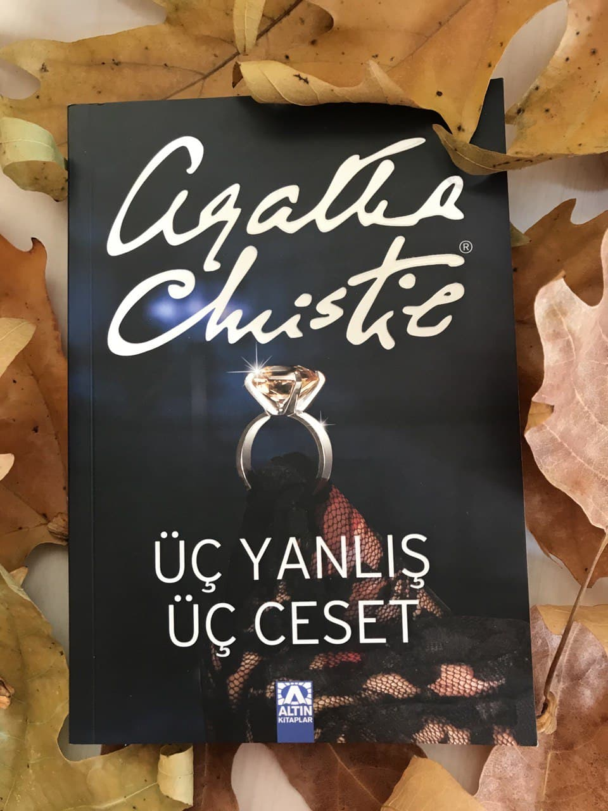

  
# Üç Yanlış Üç Ceset - Agatha Christie
## 189 Sayfa
### 17.12.2020
  
   

  

    
     
    

 

***Karakterler ;*** 
- ***Hercule Poirot :*** Olayları çözen baş kahramanımız, dedektif.
- ***Felicity Lemon :*** Hercule Poirot'un sekreteri. Sık sık hata yapmaya başlamıştı.
- ***Bayan Hubbard:*** Bayan Lemon'un kız kardeşi. Aklı başında bir kadın.
- ***Nigel Champman :*** Ortaçağ tarihi okuyan, alaycı, başkalarının damarına basmaktan hoşlanan ukala bir genç.
- ***Valerie Hobhouse :*** Soğukkanlı, zarif ve sert tavırlı, esmer, güzel bir genç kız.
- ***Celia Austin :*** Genç bir eczacı. Güzel olmasına karşın biraz silik bir kız.
- ***Elizabeth Johnston:*** Kendisini çok beğenen, zeki, çalışkan bir öğrenci.
- ***Patricia Lane:*** Nigel'e çok düşkün, gözlüklü, çirkin bir kız.
- ***Colin MacNabb:*** Kendisine hayran olan, Celia'ya aldırmayan ukala bir genç.
- ***Bayan Nicoletis:*** İriyarı, orta yaşlı, ama hâlâ güzel bir kadın. Öğrenci yurdunun sahibesi.
- ***Müfettiş Sharpe:*** Uysal görünüşlü, ama aslında çok zeki ve azimli bir adam.

 

Olaylar aslında Hercule Poirot'un sekreterinin hatalar yapması ile başlıyor. Normalde hiç hata yapmayan sekreterin bu hali Hercule Poirot'un ilgisini çeker ve ona neler olduğunu sorar. Sekreter ise kardeşinin başına gelenleri anlatır. Bu olanları ilgiyle dinleyen Hercule Poirot, kardeşiyle konuşmak için davet eder.

Bayan Lemon'un kardeşi Bayan Hubbard olanları dedektife anlatır. Yurtta birbirinden çok alakasız ve değersiz eşyalar çalınıyordu. Bunlar dedektifin ilgisini çeker ve bu olanlar için Bayan Hubbard tarafından yurda davet edilir. Dedektif yurda gelmeden önce bir olay daha yaşanır. Elizabeth isimli öğrencinin notlarının üzerine bilerek yeşil mürekkep dökülür. Yurtta sadece bir kişi yeşil mürekkep kullandığı için yani Nigel Champman bu olayda suçlu gösterilir. Ama Nigel bunu yapmadığını söyler.

Yurda gittikten sonra birlikte yemek yerler ve Hercule Poirot başından geçen bazı ilginç olayları oradakilere anlatır. Bunların üzerine tüm bu olanlardan dolayı yurda polis çağırmaları gerektiğini söyler. Hercule Poirot ve Bayan Hubbard yukarıya çıktıktan sonra arkalarından Celia Austin gelir ve yaptıklarını itiraf eder. Küçük değersiz şeyleri çaldığını söyler ama bunları gerçekten kötü bir niyetle yapmadığını da belirtir. Zaten Celia'nın bu şeylere ihtiyacı olmadığı yani gelir düzeyinin de iyi olduğu ortadadır.

> Celia bu çaldığı şeyleri ödemeyi kabul eder. Arkadaşları onu affeder fakat ertesi gün Celia odasında ölü olarak bulunur. İntihar süsü vermek için yanında bir şişe morfin ve yırtılmış bir intihar notu bulunur.. Olayı incelemek için Müfettiş Sharpe yurda gelir. Zaten olayın intihar olmadığını ve intihar süsü verilmek istendiğini anlarlar.

Müfettiş yurttaki herkesi tek tek sorgular pek fazla elle tutulur bir şey bulamaz. Fakat Nigel bundan on beş gün öncesinde arkadaşlarıyla girdiği iddia sebebiyle üç farklı zehir elde eder ve bunları illegal yollar ile yani çalarak ve sahtecilik ile elde ettiğini müfettişe anlatır.

> ***Diğer bir yandan Hercule Poirot , Bayan Hubbard'tan tüm bu çalının şeyleri tarih sırasına göre yeniden yazmasını ister. Tekrardan bu bilgi eline geçtiğinde en üstte çalınan çantanın parçalanmış olduğu ve ardından yurttaki ampüllerin çalındığı gelir.. Bunun üzerine Hercule Poirot, sokağın başındaki bu çantaları satan adamın yanına gider ve aynı çantadan alır. Başka yerlerden de bu çantanın benzerlerini alır ve hepsini parçalar.***

Tüm bunların üzerine yurdun sahibi olan Bayan Nicoletis ölü bulunur. Olay daha fazla ilginçleşir. Artık elde var iki ceset.

> ***Yurdun sahibinin ölmesi üzerine Hercule Poirot, Müfettiş Sharpe ve iki tane daha polis toplanırlar. Durum değerlendirmesi yaparlar ve Hercule Poirot bazı varsayımlarda bulunur. Bu incelediği çantalarda uyuşturucu ve elmas taşındığı üzerine bir varsayım söyler. Çünkü o çantaların bazılarında farklılıklar var ve bu çantaları parçaladığında bunu fark etmiştir.***

Patricia, Nigel ile konuşurken bazı şeyleri itiraf eder. Nigel'in dolabından aldığı zehirin yerine başka bir şey koyar ve sonrasında Patricia bu aldığı zehiri kayıp ettiğini söyler. Tabi bunun üzerine tüm olanların kendi üzerine kalacağından endişelenen Nigel, polise gider. Kendisi poliste sorgudayken Patricia tarafından bir arama gelir ve ona gerçekleri çözdüğünü ve yurda geldiğinde anlatacağını söyler. Nigel ve Müfettişler yarım saat içerisinde yurda döndüklerinde ise Patricia öldürülmüştür..

___

> ***Tüm bunlar kitabın sonunda şu şekilde açıklanmaktadır ;***

***Nigel yıllar önce annesini öldürmüştür. Bunun üzerine babasıyla bir daha kötü şeyler yapmayacağına dair bir anlaşma yapar ve babasından ayrılır.. Celia tamamen suçsuz olup, sadece ve sadece bilmemesi ve görmemesi gereken şeyler gördüğü için, yani Nigel'in o çantadan çıkardığı uyuşturucuları fark ettiği için Nigel tarafından öldürülür.. Aynı şekilde Nigel, yurdun sahibini takip eder ve onu da öldürür. Son olarakta Patricia'da Nigel'in işlerini zorlaştırdığı için ilk önce onu öldürür ve suç ortağı Valerie ile plan yaparlar. Nigel polis merkezindeyken Valerie kendisi sanki Patriciaymış gibi Nigel'i arar. Bu durumda Nigel zaten polisin yanında Valerie de yurtta olmadığı için, Patricia cinayeti ile suçlanamayacaklarını düşünler.. Ama tabi sonuç umdukları gibi olmaz ve her şey Nigel ve Valerie'nin yaptığı birkaç hata ile Hercule Poirot tarafından çözülür.***

___

 

### Kitaptan Alıntılar ;
- ***"Bir hastalığa engel olmak, onu tedavi etmekten daha iyidir... Bizler de cinayetlere engel olmaya çalışırız. Bir cinayet işlenene kadar beklemeyiz." (sf.39)***

