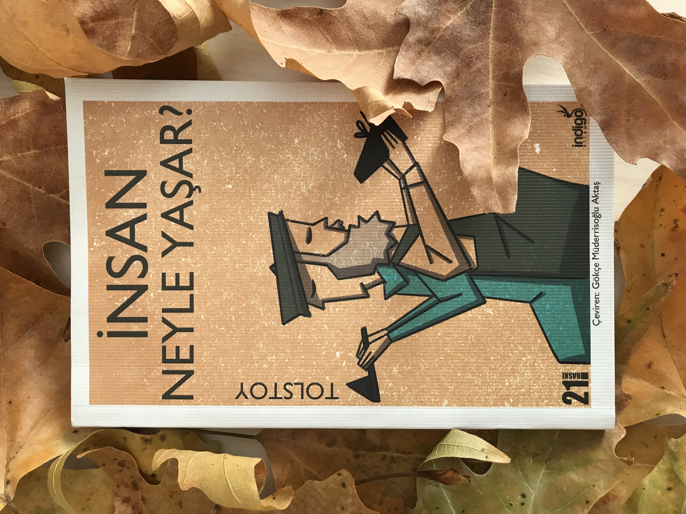

  
# İnsan Neyle Yaşar - Tolstoy
## 92 Sayfa
### 18.12.2020
  
</td>
<td> 
  

    
     
    
  
 
</td>

</tr></table>

 

***Karakterler ;*** 
- ***Simon :*** Fakir bir kunduracı
- ***Matryona :*** Simon'un eşi, karısı
- ***Michael :*** Cennetten düşen melek.

 

> ***İNSAN NEYLE YAŞAR (sf.9)***

Çok fakir olan bir kunduracı ve eşi birlikte yaşamaktadır. Bir gün kunduracı ceket yapmak için şehre post almaya indi. Ama ne yazık ki alacağı olan insanlardan bu parayı alamadı ve haliyle postuda satıcıdan alamadı. Bunun üzerine az miktar para ödeyerek votka aldı ve dönüş yoluna geçti.

Simon eve dönerken tanrının evi, yani mabed'in yanında bir tane çırılçıplak bir adam gördü. Simon ilk başta bu adamdan korktu ve yolunu değiştirerek oradan uzaklaştı fakat sonrasında ise bir merhamet ve acıma duygusu ile geriye adamın yanına döndü.. Simon, adama nereden gelip nereye gittiğini sorsada cevap alamadı. Bu adam sadece **"Tanrı beni cezalandırdı."** demekle yetindi.

Simon yanındaki adam ile birlikte eve döndüklerinde, karısı Simon'un alkol aldığını anlamıştı. Matryona, iki adamında ayyaş ve sarhoş olduğunu düşünerekten, kocasını azarlamaya başladı ve neredeyse onları evden kovacaktı. Ama Simon zor bela, olanları karısına anlattı. Matryona, biraz yumuşadı ve Micheal'a acımaya, merhamet duymaya başladı. Onlar için yemek hazırladı. ***"Bunun üzerine Micheal, Matryona'a bakarak gülümsedi ve yüzü aydınlandı."***

Ertesi günden itibaren Michael, Simon ile birlikte kalmaya ve Simon'un çıraklığını yapmaya başladı. Aynı zamanda işleri de çok çabuk öğrenip, çok kaliteli yaptığı için bir anda ünleri yayılmaya ve herkes buradan ayakkabı yaptırmaya başlamıştı.

> ***Birinci yılın sonunda müşteri olarak bir tane adam geldi. Bir o kadar zengin ve bir o kadar da kendini beğenmiş bir adam. Bu adam, çok değerli bir deri bırakarak bir yıl boyunca hiç deformeye uğramayacak bir çizme istemişti.. Bu adamı gören Michael gülümsedi ve yüzü bir kez daha parlamıştı.. Ertesi gün haber geldi, dünkü gelen o zengin adam aynı gece ölmüştü.***

> ***Altı yıl sonra ise yine sıradan bir gün de bir tane kadın ve iki tane ikiz kız çocuğu ayakkabı yaptırmaya geldiler. Michael , bu iki kız çocuğuna öyle incelemeye başladı ki.. Sonrasında bu kadın başından geçenleri anlattı. Normalde bu iki kız çocuğunu kendi öz evlatları değildir ama onları o kadar çok sevmektedir ki.. Bunun üzerine Micheal bir kez daha gülümsedi ve yüzü aydınlandı..***

___

***Ve Tanrı da: 'Git ve kadının ruhunu al. `Ve üç hakikati öğren: İnsanın içinde ne vardır, İnsana ne verilmemiştir ve İnsan neyle yaşar?` Bunları öğrendikten sonra, cennete dönebilirsin,' dedi.(sf.39)***

***"Sonra Tanrı'nın bana söylediği ilk dersi hatırladım: 'İnsanın içinde ne olduğunu öğren,`'Ve ben, insanın içinde Sevgi olduğunu anlamıştım!` Tanrı'nın bana bunu söz verdiği gibi gösteriyor olmasına sevinmiştim. O zaman ilk kez gülümsedim. Ama henüz her şeyi öğrenmemiştim. Henüz insana neyin verilmediğini ve insanın neyle yaşadığını öğrenmemiştim."(sf.41)***

***"Sizinle yaşarken bir yıl geçti. Bir adam bir yıl boyunca şeklini kaybetmeden ve yırtılmadan giymek için bir çizme siparişi verdi. Adama baktım ve birden omzunun arkasında, yol arkadaşımı -ölüm meleğini- gördüm. Benden başka kimse bu meleği görmedi ama ben onu tanıyordum ve güneş doğmadan, zengin adamın ruhunu alacağını anlamıştım. ;  `Kendi kendime, adam, bir yıl sonrası için hazırlık yapıyor ama akşam olmadan öleceğini bilmiyor, diye düşündüm.` Ve Tanrı'nın ikinci dersini hatırladım: İnsana verilmeyen şeyi öğren." (sf.42)***

***`"Ve kadın, kendisine ait olmayan çocuklara olan sevgisini gösterip, onlar için ağladığında, onda, yaşayan Tanrı'yı gördüm.` Ve insanın neyle yaşadığını anladım. Ve Tanrı'nın bana son dersini verdiğini, günahımı affettiğini anladım. O zaman da üçüncü kez gülümsedim. (sf.43)***

___

***Ve tüm bu olanlardan sonra Micheal, "Tanrının kendisini affetiğini ve artık geriye döneceğini söyler ve oradan gökyüzüne doğru kanatlanarak uçar gider.***

> ***ÜÇ SORU (sf.45)***

Bir tane kral üç tane sorunun cevabını merak eder. Bu sorular ise ; ***"Her şeye başlaması için doğru zamanın ne olduğunu"*** | ***"Dinlemesi gereken doğru kişinin kim olduğunu"*** | ***"Kimlerden sakınması gerektiği"*** bu soruların cevabını öğrenmek ister. Bunun için kral ülkenin her bir yerinden çok fazla insanı davet eder ve onların cevaplarını dinler, fakat hiçbir cevap onu memnun etmez.

Sonrasında kral, ***bilge bir münzevinin*** yanına gider ve aynı soruları sorar. Fakat münzevi cevap vermez, ve elinde bir tane kazma ile toprağı kazmaktadır. Kral elinden kazmayı alır ve ona yardım eder. Aradan saatler geçer münzevi hâlâ cevap vermez.. Sonra bir tane adam kanlar içinde onlara doğru gelir ve kral bu adamı tedavi eder, yarasını sarar. Kral, yorgunluktan  uyuyup kalır ve ertesi gün uyandığında ise ; o adamın aslında kendisini öldürmek için beklediğini fakat gelmeyince buraya gelirken, muhafızlar tarafından yaralandığını öğrenir..

> ***SURAT'IN KAHVE DÜKKANI (sf.53)***

Hindistan'ın surat kasabasında bir tane kahve dükkanında birbirinden farklı bir çok milletten insan bir araya gelmişler. İlk başta iki kişi arasında ortaya çıkan ***Tanrı var mıdır? Veyahut varsa da nerededir?"*** sorusu üzerine herkes farklı cevaplar vermeye ve kendi ülkelerini göre cevaplamaya başlamışlar.. Tabi bir sonuca varamadılar, çünkü herkes kendi fikirlerini savunuyor ve onları kabul ediyordu.

En sonunda ise ***"Konfüçyüs'ün öğrencisi Çinli adam konuşurken, kahve dükkanındaki herkes onu sessizce dinledi ve kimin inancının daha üstün olduğu konusundaki tartışma sona erdi.. (sf.65)***

> ***İNSANA NE KADAR TOPRAK LAZIM (sf.67)***

Bu son hikayemizin kahramanı Pahom isminde aç gözlü bir adam. İlk önce yaşadığı yerde, daha fazla toprak sahibi olmak istedi ve oldu. Burada bir süre sonra insanlar ile anlaşamamaya başladı. Bunun üzerine başka bir yerden daha fazla toprak alabileceğini fark etti ve şimdiki yaşadığı yerde ki her şeyini satıp yeni bir yerden çok daha fazla toprak aldı.

Bu yeni yerdeki toprakları da ona yetmedi. Bu seferde son olarak başka bir yerde hiç ekilmemiş topraklar olduğunu öğrendi. Oraya vardığında onu karşıladılar.. ***"Ertesi gün sabahtan akşama kadar başladığı noktaya tekrardan dönebilirse ve bu süre içerisinde ne kadar alanı çevirebilirse tüm topraklar onun olacaktı."***

> Aç gözlü olduğu için gün boyunca şurayı da alayım, burayı da alayım derken elbette çok ileriye gitti ve geri dönemeyeceğini anladı.. Geri dönmek için çok çaba sarf etti ve en sonunda ne yazık ki ölüp kaldı.

***"Ne kuvvetli bir adam!" diye bağırdı Reis. "Bir sürü toprak kazandı!"... Pahom'un adamı koşarak geldi ve onu yerden kaldırdı ama ağzından kan geldiğini gördü. Pahom ölmüştü! `Pahom'un adamı kazmayı aldı ve Pahom'un içine sığabileceği bir mezar kazıp, onu içine gömdü. Pahom'un ihtiyacı olan toprak parçası sadece bir metre seksen santimetreydi..`. (sf.92)***

 

### Kitaptan Alıntılar ;

- ***"Atasözü ne kadar da doğruymuş, 'İnsan annesiz ve babasız yaşayabilir ancak Tanrısız yaşayamaz,'" dedi. (sf.37)***
- ***"Tüm insanların, kendilerine baktıkları için değil, sevgi sayesinde yaşadıklarını öğrendim."(sf.43)***
- ***"Anneye çocuklarının neye ihtiyaçları olduğu bilgisi verilmemişti. Zengin adam da kendisinin neye ihtiyacı olduğunu bilmiyordu. Hiçbir insan akşam olduğunda, bedeni için çizmeye mi yoksa naaşı için terliğe mi ihtiyaç duyduğunu bilemez."(sf.43)***
- ***"Ve tüm insanlar, kendi iyiliklerini düşünerek değil, içlerindeki sevgiyle yaşarlar."(sf.44)***
- ***"İnsanlar kendilerine baktıkları için yaşadıklarını sansalar da aslında sadece sevgiyle yaşadıklarını anladım. Seven kişi, Tanrı'ya yaklaşır ve Tanrı da ona yaklaşır. Çünkü sevgi Tanrı'nın ta kendisidir."(sf.44)***
- ***"Tek bir önemli zaman vardır, o da şu an! En önemli an şu andır çünkü üzerinde gücümüzü kullanabileceğimiz tek andır."(sf.50)***
- ***"En önemli insan birlikte olduğun insandır çünkü hiç kimse bir başkasıyla bir ilişkisi olup olmayacağını önceden bilemez."(sf.51)***
- ***"Ve en önemli iş de o kişiye iyilik yapmaktır çünkü insan yeryüzüne sadece bu yüzden gönderilmiştir!"(sf.51)***

