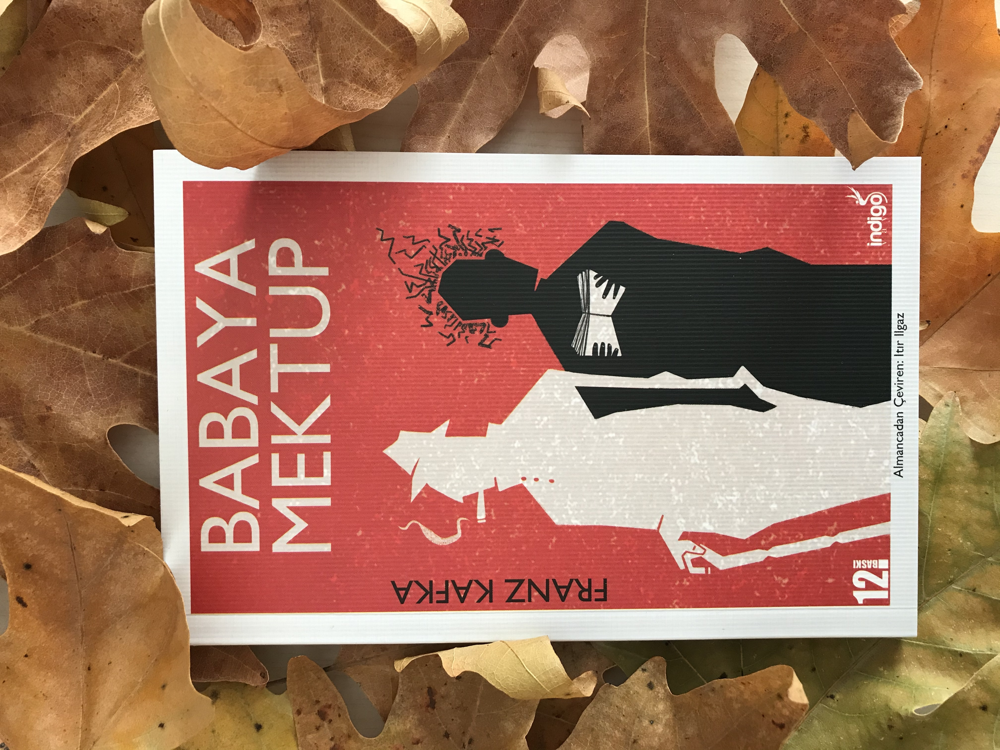

  
# Babaya Mektup - Franz Kafka
## 88 Sayfa
### 19.12.2020
  
 

  

    
     
    

 

> ***20. yüzyıl edebiyat tarihinin en büyük itiraflarından biri sayılan bu kitap, Kafka'nın sahibine hiç ulaşmamış bir mektubu aslında. Franz Kafka, 1919'da dinlenmek üzere gittiği Schelesen'de Praglı sekreter Julie Wohryzek ile tanışır ve nişanlanır. Babaya Mektup yazarın bu evlilik kararına karşı çıkan babasına olan duygu ve düşüncelerini dile getirirken, diğer yandan bize Kafka'nın yaşam öyküsünden ipuçları da sunmaktadır. Franz Kafka'nın yazarlığına, kendi var oluşuna ilişkin ayrıntılarla bezeli yapıt, kurmaca hikâyelere dayalı diğer eseriyle karşılaştırıldığında belgesel bir nitelik de taşımaktadır. Baba oğul arasındaki çatışmadan yola çıkan Babaya Mektup aslında Kafka'nın burjuva toplumlarını belirleyen güçlü ve güçsüz kavramlarına bir serzenişidir.***

 

___

***Ama evliliğe karşı duyduğum arzunun azalmasının sebepleri başka. Bu sebepler senin çocuklarınla ilişkinde yatıyor, zaten bütün mektup da bunun üzerine.***

***Evlilik korkusunun kaynağına yönelik bir görüş de, insanın ebeveynlerine karşı işlediği günahları, ileride kendi çocuklarına ödeteceğinden korkması. (sf.68)***

___

 

### Kitaptan Alıntılar ;
- ***"Yıllar sonra bile, o koca adamın, babamın, o son merciin, neredeyse yok yere, gecenin bir yarısı gelerek beni yatağımdan alıp sahanlığa bırakabildiği, onun için bir hiç olduğum düşüncesi bana ıstırap çektirmeye devam etti." (sf.13)***
- ***"Senden bağımsız gibi görünen tüm fikirlerim en başından beri senin yok sayan o yargın altında ezildi." (sf.16)***
- ***O oyuncuyu burada özellikle hatırlıyorum, çünkü onun hakkındaki ifadelerini şu açıklamayla not almıştım; "Babam (hiç tanımadığı) arkadaşım hakkında böyle konuşuyor, sırf benim arkadaşım olduğu için. Bunu, beni çocukça bir sevgi ve minnet duygusundan yoksun olmakla suçladığı her sefer onun yüzüne vuracağım.(sf.17)***
- ***"Kuşkusuz çoğu kez ben de kelimelerimle seni incitmişimdir, ama sonradan bilirdim, canımı yakardı, ama kendime hâkim olamazdım, dilimi tutamazdım ve ağzımdan çıkarken pişman olurdum. Oysaki sen, sözlerinle döverdin, kimseye acımazdın, ne sözü söylerken ne de sonrasında, insan senin karşında tamamen savunmasız oluyordu." (sf.17)***
- ***"Lütfen beni yanlış anlama baba, bunların hepsi tamamen önemsiz ayrıntılardan ibaret olabilirdi, ama benim için baskı unsuru haline gelmeleri, sen, benim için böylesine muazzam bir ölçüt olan insan, bana koyduğun yasaklara bizzat kendin uymadığında gerçekleşti." (sf.19)***
- ***"Benim için tuhaf değildin, seçme şansım yoktu, ne varsa almaya mecburdum." (sf.20)***
- ***"Ve işte burada da senin anlaşılmaz masumiyetin ve dokunulmazlığın kendini gösterirdi, kendin sövüp saydığında hiçbir kaygı duymaz, başkalarının sövmesini yargılar ve yasaklardın." (sf.23)***
- ***"Hani biri beş alçak basamak yukarı çıkarken diğeri sadece bir basamak çıkar, ama bu tek basamak en azından onun için, diğerinin çıktığı beş basamak kadar yüksektir ya, işte aynen öyle." (sf.58)***
- ***"Güneşin ortasına uçmak çok da gerekli değil ama dünya üzerine, arada sırada güneşin aydınlattığı ve insanın biraz ısınabileceği sade, küçük bir köşeye sığınmak lazım. (sf.59)***