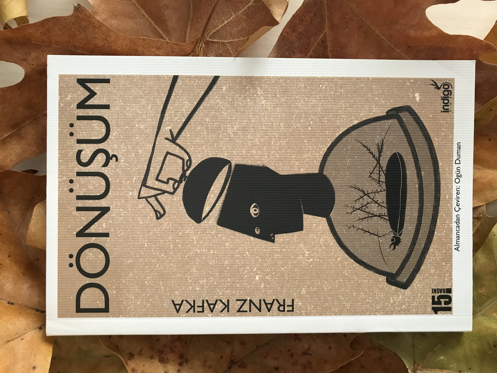

  
# Dönüşüm - Franz Kafka
## 92 Sayfa
### 20.12.2020
  
 

  

    
     
    

 

***Karakterler ;*** 
- ***Gregor Samsa :*** Bir haşereye dönüşen kahramanımız
- ***Grete :*** Gregor'un kız kardeşi
- ***Bay Samsa :*** Gregor Samsa'nın babası
- ***Bayan Samsa :*** Gregor Samsa'nın annesi

 

_____

***Her insanın mutlaka okuması ve kitaplığında bulundurması gereken bir kitap.
Kitap içerisinde, "Toplumsal Yapıyı ve Aile Yapısını" ayrıntılı olarak çok iyi bir şekilde eleştirmektedir.***

***"Biz bu dünyada insanların işine yaradığımız kadar varız. İnsanlar için her ne yaparsak yapalım, günü geldiğinde sanki hiçbir şey yapmamışçasına sana sırtlarını döneceklerdir."   "İnsanlar için gözlerini feda etsen, zaten kördü derler..."***

___

 

Gregor Samsa bir sabah huzursuz rüyalardan uyandığında, yatağında kendini dev bir haşereye dönüşmüş halde buldu. Neredeyse hareket edemiyordu, vücudu ve bacakları değişmişti. Normalde şimdiye kadar işe gitmiş olması gerekiyordu. Gregor Samsa, tüm ailesinin geçimini karşılıyor ve kardeşini konservatuvara göndermek gibi bir hayali vardı.

5 yıldır aynı yerde çalışan Gregor Samsa, ailesi tarafından merak edildi ve herkes kapının önünden kendisine sesleniyordu. Daha henüz normal şartlardan farklı olarak işine 15 dk geç kalmasına rağmen, müdür kapıya gelmişti. Tüm aile ve müdür, Gregor Samsa ile konuşarak onun dışarıya çıkmasını istiyorlardı. Hatta bunun için çilingir bile çağırmaya gitmişlerdi.

Gregor Samsa, neyse ki bir süre sonra kendi çabasıyla kapıyı açtı. Onu o haliyle gören herkes bir anda ondan uzaklaştı. Müdürü hiçbir şey demeden arkasını döndü ve evi terk etti. ***Eğer insanların işini aksatıyorsanız, sizi dinlemezler bile.*** 

Bu durumdan sonra evdeki herkes Gregor Samsa'dan uzaklaşmıştı. Hiç kimse onunla konuşmuyor ve onun odasına bile girmiyordu.

Bir gün annesi ve kardeşi odasındaki eşyaları alırlarken, duvarda asılı olan kadın resmini vermek istemedi ve ona sımsıkı yapıştı. Zaten annesi Gregor Samsa'dan çok fazla korkuyordu. Onu öyle görünce bayıldı. Bunun üzerine salonda beklemek zorunda kalan Gregor Samsa, babasının akşam eve gelmesi üzerine hiçbir yere kaçamadı. Bir süre babası Gregor Samsa'yı kovalasada yakalamayınca, ne kadar elma varsa hepsini ona attı. 

***Bu elmalardan bir tanesi Gregor Samsa'nın sırtına saplandı. Kimse de bu elmayı çıkarmayı cesaret edemediği için. Bu elma ile yaşamaya devam etti.***

Ailenin maddi durumu kötü olduğu için, evin bir odasını üç tane adama kiralamışlardı. Bir gün herkes salonda otururken, Grece müzik yaparken, bu müzik Gregor Samsa'nın çok hoşuna gider ve yavaş yavaş salona, kardeşine doğru yaklaşır. Gregor Samsa'yı gördüklerinde ortalık karışır ve herkes salonu terk eder. ***Bunun üzerine, ailedeki herkes Gregor Samsa'dan tamamen kurtulmak gerektiğini ve şimdiye kadar zaten burada tutmalarının hata olduğunu söylerler.***

___

> ***AYNI GECE***

***"Ya şimdi?" diye sordu Gregor kendi kendine ve karanlıkta etrafına bakındı. Az sonra artık yerinden kımıldayamadığını keşfetti. Buna hiç şaşırmadı, aksine o ana kadar bu incecik bacaklar üzerinde hareket etmekti ona garip gelen. Üstelik nispeten iyi hissediyordu. Gerçi tüm bedenini saran ağrılar vardı ama bunların hafifleyeceğini, giderek daha da azalıp sonunda tamamen yok olacaklarını düşünüyordu. Sırtında saplı duran çürümüş elmayı ve bunun etrafını saran, yumuşak tozla kaplı iltihaplı bölgeyi artık hissetmiyordu bile. Ailesini duygulanarak ve sevgiyle anımsıyordu. Ortalıktan kaybolmasına dair inancı, belki de kız kardeşinin bu konudaki düşüncelerden çok daha güçlüydü. Kule saati sabahın üçüncü saatini vurana dek bu boş ve huzurlu düşünceler içinde yüzmeyi sürdürdü. Son olarak  pencerenin dışında havanın aydınlandığını görmeyi de başardı. Sonra başı istemi dışında düştü ve burun deliklerinden son nefesini koyuverdi. (sf.76)***

 

### Kitaptan Alıntılar ;
- ***"Erken kalkmak,"diye düşündü,"insanı bir hayli aptallaştırıyor. İnsan uykusunu iyi almalı. (sf.10)***
- ***Bundan kızın hâlâ görüntüsüne tahammül edemediğini, hatta hiçbir zaman tahammül edemeyeceğini ve kanepenin altından çıkan bir tek uzvunun görüntüsü karşısında bile odadan kaçmamak için kendine hakim olmak zorunda kaldığını anladı.(sf.45)***
- ***"Bu yüzden kafasını dağıtmak için duvarlara ve tavana tırmanma alışkanlığını edindi. Özellikle tavanda asılı kalmayı çok seviyordu." (sf.46)***
- ***"Herkes beraberinde taşıdığı bir parmaklığın ardında yaşıyor."***
- ***Ölmekten müthiş bir şekilde korkuyordu çünkü henüz gerçek anlamda yaşamamıştı.***