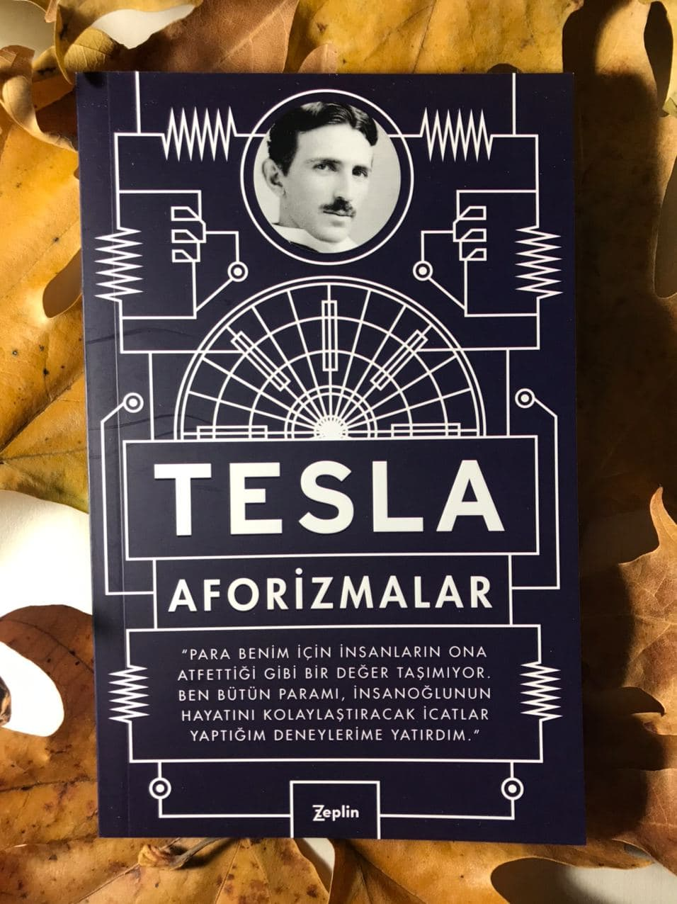

  
# Aforizmalar - Tesla
## 160 Sayfa
### 21.12.2020
  
 

  

    
     
    

 

 

Bu kitabımızın başında Tesla'nın ne kadar zor bir çocukluk geçirdiğinden bahsetmektedir.
İlk başlarda gözlerinin önünde ışıklar çakıyor ve değişik değişik görüntüler görüyordu.  Tabi bunlar haliyle hayatını oldukça zor bir hale getiriyordu. ***Bu görüntüler gerçekten nesnelerin görüntüsünü bozuyor, bir yerden sonra hareketlerimi kısıtlıyordu. Gözümün önüne gelen bu görüntüler asla hayal ettiğim şeyler değil, mutlaka daha önce gördüğüm nesnelerin ya da manzaraların birer resmiydi. (sf.12)***

***Uykuya dalmadan önce her zaman insanların ya da nesnelerin görüntüsü geliyor gözlerimin önüne. Onları görmeye başladığımda uyumak üzere olduğumu anlarım. Bu görüntüler bir türlü gözlerimin önüne gelmiyorsa o gece bana uyku yok demektir. (sf.17)***

Bir süre sonra çok büyük bir şiddetle kitap okumaya başlamış ve kitap okumayı çok seviyormuş. Fakat babası kitap okumasına kızmaya ve izin vermemeye başlamış. Buna nazaran yine de bir şekilde bir yolunu bulup gizli gizli, geceden sabaha kadar, yani evdekiler uyanana kadar kitap okumaya devam etmiş.

Sonrasında ise kumara bağımlı olmuş. Ne yaptılarsa vazgeçirememişler. Zaten babası kumar oynamasına şiddetle karşı çıkıyormuş. Bir gün tüm parasını kaybetmiş ve annesi yanına  gelmiş. Annesi tüm parasına oğluna vermiş ve " al bunları, nasıl olsa hepsini kaybetmeden bırakmayacaksın bu kumar oyununu" demiş. Böyle olunca da Tesla, o günden sonra bir daha kumar ya da en ufak bir bahis bile oynamamış.

Yine buna benzer bir şekilde bir de bağımlı bir şekilde sigara içmeye başlamış. Bir süre de onunla uğraştıktan  ve sağlığı bozulmaya başladıktan sonra onu da bırakmış.. Hatta ve hatta sabahları içtiği kahvenin bile sağlığını bozduğunu fark ettikten sonra kahve içmeyi de bırakmış..

___

> ***PATENTLER***
- Elektrik Ark Lambası
- Hava Yoluyla Taşıma Yöntemi
- Dinamolu Elektrikli Makineler İçin Regülatör
- Alternatif Akım Motorları İçin Regülatör
- Elektrik Motoru
- Elektrik Jeneratörü
- Elektrikli Demiryolu Sistemi
- Elektromanyetik Motor
- Alternatif Motor
- Sinyalizasyon Sistemi

____

 

### Kitaptan Alıntılar ;
- ***"İlginçtir ki sonrasında aslında düşünüğüm her şeyin dışardan edindiğim izlenimlerin sonucu olduğunu fark ettim. (sf.15)***
- ***"Çoğunluğun asla başaramayacağına inandığı bazı sonuçları elde edebilmem bana yıllar süren bir fikir silsilesine mal oldu. Şimdiyse bu sonuçlardan pek çok kişi hak iddia ediyor ve sayıları, savaştan sonra Güney'deki albay sayısının arttığı gibi artıyor."(sf.27)***
- ***"İnsanın ilerlemesini engelleyen en büyük direnç, Buda'nın deyişiyle, 'Dünyanın en büyük kötülüğü' cehalettir. Cehalettten kaynaklanan bu direnç ancak bilginin aktarılması ve insanlığın heterojen unsurlarının birleştirilmesiyle mümkün olacaktır. Bu amaç uğruna hiçbir emek boşa harcanmış olmaz." (sf.30)***
- ***"Daha çok bildiğimizde cehaletimizin daha da arttığını söylemek ne kadar çelişkili dursa da doğrudur. Çünkü ancak aydınlanma yoluyla sınırlarımızın farkına varırız. Entelektüel gelişimin en memnuniyet verici sonuçlarından biri, yeni ve daha büyük ihtimallere kapı açmasıdır." (sf.31)***
- ***"İnsanların birbirlerini öldürmek gibi vahşi eylemleri sürdürdükleri müddetçe gelişimin önü kapalıdır. Savaşlara karşı duyduğum köklü nefret bana, huzuru ve barışı korumak için çok uğraşmış, hikmet sahibi bir insan olan babamdan geçmiştir." (sf.42)***
- ***"Pek çok mucidin ortak bir sorunu var: Sabırsızlar. İşi ağırdan alıp bir şeyi önce kafalarında açık ve net olarak çalıştırmaya isteksizler. Akıllarına eseni hemen denemek istiyorlar. Sonuçta da bir sürü para ve iyi malzeme heba olduktan sonra yanlış yaptıklarını görüyorlar. Hepimiz hata yaparız ama hatayı işe koyulmadan yapmak en iyisi." (sf.43)***
- ***"İnsan bütün enerjisini tek bir işe odaklamalı, tüm benliğiyle tek bir gerçeği idrak etmeli; işte o zaman, kutsal ateş onu kavursa bile kendisinden daha az yetenekli milyonlarca kişi peşinden gelecektir. Başarmak için çok az bir şansı olsa bile gece gündüz yılmadan çalışmalı. Gelişimin büyüklüğünü belirleyen işin niceliği değil niteliğidir." (sf.44)***
- ***"Elektrik enerjisinin, Faraday'ın 1831'deki buluşundan 1896 senesinde [Niagara Şelalesi'nde] Tesla polifaz sisteminin kurulumuna kadarki evrimi, hiç şüphesiz mühendislik tarihinin en muazzam hadisesidir." (sf.46)***
- ***"Çağımızın büyüklüğünü doğru bir şekilde anlamak isteyen herkes elektrik gelişmelerin tarihini çalışmalıdır. Elektriğin tarihi `Binbir Gece Masalları'ndaki` bütün öykülerden daha muhteşemdir." (sf.48)***
- ***"Ben asıl işe geçmek için acele etmiyorum. Aklıma bir fikir geldiğinde onu önce hayalimde canlandırıyorum. Yapısını değiştiriyorum, iyileştirmeler yapıyorum ve aleti zihnimde çalıştırıyorum. İcat ettiğim alet aynı düşündüğüm şekilde çalışıyor ve deney planladığım gibi sonuçlanıyor. Yirmi yıl boyunca tek bir istisnayla karşılaşmadım.  Neden aksi olsun ki?" (sf.56)***
- ***"Hep yeni heyecanlara açızdır ama çok geçmeden onları kanıksar ve kayıtsız kalırız. Dünün mucizeleri bugünün sıradan olaylarıdır." (sf.64)***
- ***"Hayatımda başarılı olmamın tek yolu disiplinden geçiyordu. Ben de arzularımla iradem bir olana kadar kendi üstümde disiplin uyguladım." (sf.76)***
- ***"Nefretiniz elektriğe dönüştürülebilseydi bütün dünyayı aydınlatmaya yeterdi." (sf.85)***
- ***"Fikrimi çalmaları mühim değil... Asıl mühim olan kendi fikirlerinin olmaması." (sf.87)***
- ***"3, 6  ve 9 sayılarının azametini bilseydiniz evrenin anahtarını elde edebilirdiniz." (sf.97)***

