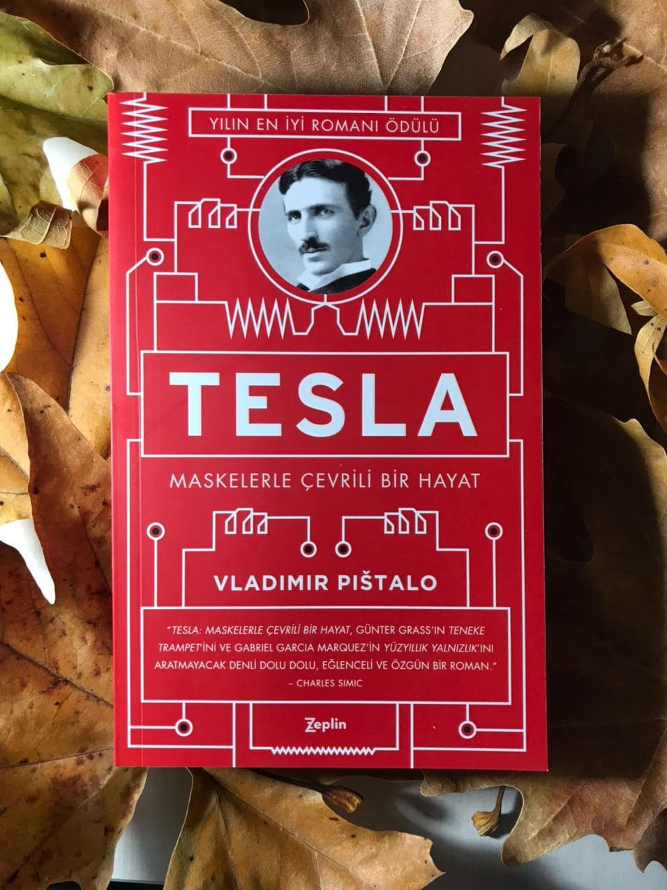

  
# Tesla - Vladimir Pistalo
## 472 Sayfa
### 25.12.2020
  
 

  

    
     

 
 

***Karakterler ;***
- ***Nikola Tesla :*** Ana Karakterimiz; ( 10 Temmuz 1856 - 7 Ocak 1943 )
- ***Milutin Tesla :*** Tesla'nın  babası
- ***Djuka Tesla :*** Tesla'nın annesi
- ***Danilo Tesla :*** Tesla'nın ağabeyi, 15 yaşında öldü.

 

***NOT :***  
***`Lusitania :`*** 7 Mayıs 1915'te Almanya tarafından batırılan gemi. Bu olay ABD'nin Birinci Dünya Savaşı'na girmesindeki nedenlerden biridir. ABD'de orduya çağrı kampanyalarının simgesi olmuştur.

***Anneleri dünyayı yaratmış ve ardından babaları gelip onu kitaplara yerleştirmişti sanki. Babaları, annelerinin hikayelerine burun kıvırırdı bu tarz efsanelerin nasıl olup da papazlarla dolu bir ailede varlığını sürdürebildiğini merak ediyordu. "Boş ver," diye söylendi Milutin, "kov şeytanları, iyiye sarıl. İlleti, sefaleti bırak gitsin. Esenliğe yönel." (sf.15)***

Nikola, kuzenleri ile birlikte bir kış günü dağın başına çıkmışlardı. Kim daha ileriye kar topu atabilir diye aralarında yarış yapıyorlardı. Nikola bir tane kartopunu tepeden aşağıya doğru zar atar gibi attı. Kartopu birden önüne gelen her şeyi kendisine katarak büyümeye başladı ve az bir süre sonra büyük bir çığa dönüştü. ***Nikola mest olmuş bir vaziyette duruyordu. Bu felaket onu da büyülemişti. Bu doğal güç salınımı karşısında kendinden geçmişti. (...) "Dehşet içinde fısıldadı: 'Kader...' (sf.19)***

***O an, Dane'nin kendisinden sekiz yaş küçük kardeşinden taraf olduğu ilk andı. "Hayır, Nikola'nın bahsettiği şey bana da oluyor." Anne babaları rahatladı. Prenslerinin başına gelen bu şey, kötü olmasa gerekti. "Işık parıltılarıyla birlikte şekiller de görüyor musun?" diye sordu Dane kardeşine. Nikola başını evet anlamında salladı. "Korkma onlardan," dedi Dane, "bırak kendini." Nikola yaşlı gözlerini ağabeyine dikerek bağırdı: "Ama en korkuncu da bu zaten!" (sf.22)***

 ***`Niko` olarak anılmaktan hazzetmezdi Nikola. Sırpçada "var olmayan kimse - hiç kimse" anlamına geliyordu çünkü bu. (...) `Ağabeyinin olmadığı bir dünya nasıl bir dünya olurdu? Güneş yine böyle parlar mıydı?` Bu düşünce Nikola'yı çok defa yoklamıştı. (sf.25)***

> ***Haber komşu evlere yayıldı. İnsanlar kapıyı yumruklamaya başladı. Genç Yusuf, emsalsiz Danilo Tesla, öldüğünde on beşindeydi. Evi dolduran ziyaretçiler taziyede bulunup, "Prens!" diyerek tabutunun başında gözyaşı döktüler. (sf.26)***

***"Kütüphaneci, "bu çocuk kütüphaneden çıkmıyor," diye yakındı karısına. Kadın ise, "delirmiş herhalde," diye fısıldadı. Böyle  düşünen başkaları da vardı. `Nikola okul koridorlarında daima bir yığın kitap ile gezerdi.` (sf.34)***

Nikola'nın babası, oğlunun rahip olmasını istiyordu. Her ne kadar Nikola babasına karşı çıksa da sözünü geçiremedi. Bunun üzerine bir süre sonra Kolera Hastalığına yakalanarak yataklara düştü ve ölümle burun buruna kaldı... Babası oğlunu kaybetmek istemediği için ; ***`"Nikola oğlum, kendine gel, oğlum, sen yeter ki iyi ol, teknik üniversiteye gitmene müsade edeceğim. Graz'a git ve ne istiyorsan onu oku. Yeter ki iyileş... Sen de bırakıp gitme beni. İstediğin yerde, istediğin şeyi oku," dedi Milutin oğlunun alnına bakarak. (sf.56)`*** Bunun üzerine Nikola yavaş yavaş kendine geldi ve iyileşti.

Nikola, bir süre sonra farklı şehire okumaya gitti. ***Morali bozulan Nikola, bu düşünceleri zihninden kovardı. Kendisini babasına karşı savunmak için Voltaire okurdu. Voltaire onu, `'En iyi , iyinin düşmanıdır'` sözüne ikna etmişti. `Bunun üzerine Bay Tesla, günde on sekiz saat çalışmaya başladı..` İlk yılında dokuz dersi verdi, halbuki bunun yarısı bile birinci sınıfı geçmesi için yeterliydi. Dekan, Gospiç'teki rahibe, "Oğlunuz olağanüstü bir deha," yazdı. (...) `Nikola okuyor ve okudukça dünyası genişliyordu. Her şeyden öte, bir mucit olmak istiyordu; bir şeyler icat etmek de dünyanın genişlemesi anlamına gelmiyor muydu zaten? Kütüphanenin kapanış saati gelip çattığında mecburen dışarı çıkar,` Kant'ın yıldızlı gecesini seyrederdi. (sf.60)***

***Nikola, okuldaki ilk senesinde iki yıllık ders alıp "iyinin de ötesinde" notlarla geçince eve döndü... Yine de bir tuhaflık vardı. Babası kaşlarını çattı, oğlundan gözlerini kaçırarak konuyu değiştirdi. "Evet, sağlığım yerinde." Babasının sorularını yanıtlarken Nikola'nın kafası karışıktı. `"Dane'nin ölümünü hâlâ atlatamadı,"` diye düşündü. `"Beni asla kabullenmeyecek. Hiçbir zaman Dane'nin yerini tutmayacağım."` | Graz'da, babasını mutlu etmek için günde on sekiz saat çalıştı, eve döndüğünde neşeyle karşılanmayı ve onaylanmayı bekliyordu ama hiç de umduğu gibi olmadı. (sf.76)***

___

> ***DÜELLO (sf.80)***

Graz Teknik Üniversitesi'nin orta avlusunda kırmızı suratlı bir öğrenci, Nikola Tesla'ya yanaştı. "Evine hoşgeldin," dedi. "Sıkı çalış da hocaların seni daha bir sevsin." dedi. "Kafanı kitaplara gömme konusunda pek iyisin, onu biliyoruz," dedi Tesla'ya. "Peki ama hayatı dolu dolu yaşadığını söyleyebilir misin? Bir türkü tutturduğun ya da kızılca kıyameti kopardığın oluyor mu mesela?" Alaycı bakışlarını Tesla'ya dikmiş, kelimelerin üstüne basa basa konuşuyordu. ***Tesla'nın yüzünde, bir meydan okumaya nasıl karşılık verileceğini bilen atalarına has o boş ifade belirdi. `"Bu akşam Botanik Bahçesi'nde?"` dedi sertçe. (sf.80)***

> ***KAYBOLUŞ (sf.85)***

Bunların üzerine Tesla, bu çocuk sebebiyle artık gece hayatları yaşamaya, alkol kullanmaya ve kumar oynamaya başladı. Bir süre ortalıktan kayboldu, herkes Tesla'yı merak etti... Okuldan da atıldı, tutuklanıp babasının yanına getirildi. Babasıyla her ne kadar bu konuda kavga da etse, kumar oynamaktan vazgeçmedi. Bir gün tüm parasını kaybetti ve eve döndü. Annesinden para istedi. Annesi, çekmeceyi açtı ve evin ihtiyaçları için ayrılan parayı olduğu gibi oğluna verdi ve şöyle söyledi: ***"Al bakalım. Hepsini kaybet ve kurtul artık şu illetten!" (sf.88)*** Bunun üzerine Tesla, tekrardan kumar oynamaya giderken, aklı başına geldi ve "Ben ne yapıyorum?" diyerek vazgeçti. Eve geldi ve annesine bir daha oynamamak üzere yemin etti.

***Babası gömülürken Nikola orada değildi. Söylediklerine göre karanlık bir günmüş fakat tabutu mezara indirecekleri sırada güneş açıvermiş. (...) Her daim babasına karşı gelerek yaşamış, ona karşı gelmek için Voltaire okumuştu. Ağlayıp rahatlamak için can atıyordu ama bunu nasıl yapacağını bilmiyordu. (sf.91)***
___

***Sıradan bir hayat mı peki?***   Hayır, kahramanımız hiç de sıradan bir hayat sürmedi. Bir görünüp bir kaybolan mucizeler ölene dek peşini bırakmadı. Şiddetli ışık saldırılarını kontrol altına alamadı. Ne zaman gözlerine o altından perde inse evren onun adına kararlar alıyordu. Strazburg'da da tıpkı Budapeşte'de olduğu gibi, ölümün eşiğine gelmesi an meselesiydi. Göz kapaklarının ardında güçlü flaşlar çakıyor, bu yüzden erken yatıyordu. Yıldızlı semadan gelen frekans ve sinyaller, sinir uçlarının yanmasına sebep oluyordu. ***(sf.114)***

____

Bayan Bauzain, Tesla'nın gözlerindeki yumuşaklıktan hoşlanmıştı. "Bekarsınız. Özel bir nedeni var mı?" Hem işveli bir kadın hem de anne olarak sormuştu bu soruyu.   ***"Çalışıyorum." Tesla nazikçe yanıtladı. Tebessüm ederek, "Boşa geçirecek bir dakikam bile yok," dedi.***   Jeanne, `"Aşksız geçen her dakika boşa geçmiştir,"` dedi fırçalarcasına. ***(sf.115)***

___

> ***II. BÖLÜM - AMERİKA (sf.125)***

Tesla, bir süre Edison ile birlikte çalıştı. Sonrasında ise anlaşamadılar ve istifa edip oradan ayrıldı.. Karla karışık yağmurun atıştırdığı sisli bir sabah Tesla, yıpranmış ayakkabılarıyla Mulberry Caddesi'nde volta atıyordu. Derken tanıdık bir sima belirdi önünde: Stevan Prostran!   ***Likalı genç arkadaşının bir an bile tereddüt etmeden elini omzuna koyup söylediği o cümleyi Tesla hayatı boyunca unutmayacaktı: `"Benimle gel! Bir kişiye yeten, iki kişiye de yeter."` (...) Nikola, sonradan hatırlamayı reddettiği o sonbaharda Prostran'ın yatağında uyudu: Gündüzleri genç fırıncı, geceleri Tesla kullanıyordu aynı yatağı. (sf.144)***

> ***Günün on altı saatini en ufak bir gereksiz hareket yapmadan geçiriyordu. Rüzgar onu önüne katmış sürüklüyordu. Günler, aylar su gibi aktı. Beyin dalgaları müzikle birlikte dans ediyordu; şimşekler çakıyor, kıvılcımlar gökyüzünü kırbaçla yarıyordu. Geceler göz açıp kapayıncaya kadar biterken gündüzlerin sonu yoktu. (sf.160)***

Tesla'dan sunum yapmasını istemişlerdi ve Tesla bunu seve seve kabul etti.   ***"Elektrik yoktan var edilemez ya da yok edilemez. Niceliği daima sabittir. Tanrı gibi; şekli, kokusu yahut sesi yoktur ama kendini gösterdiği vakit buna kimse karşı koyamaz. Çakan şimşekler elektrik değil sıcak havadır, çünkü elektrik gözle görülmez."(sf.166)***     ***Altın iplik yumağı, önünde uzanan yolda neşeyle yuvarlanmaya devam ediyordu. Tesla o kadar hızlı konuşuyordu ki arada nefes alma gereği dahi duymuyordu. İnsanlar hayret etmekten yorgun düşmüş bir halde dinliyorlardı. Kimi zevkten dört köşe olmuş kiminin devreleri yanmış... Konuşma bittiğinde salon alkıştan yıkılıyordu. (sf.167)***

> Nikola, arkadaşı Szigety'i kaybetmişti, yani arkadaşı vefat etti.. Bir süre sonra da Nikola'nın annesi, Djuka, da vefat etti.

___

> ***DÜNYA FUARI (sf.229)***

***Ampullerle donatılmış sergi salonları ve MacMonnies Çeşmesi, Tesla'yla Westinghouse'un işiydi. Sırf bunlar için, Chicago şehrine harcanandan daha fazla elektrik harcadılar. (...) Kendi yarattıkları bu ışıltının ortasında, küçükken gizlice kitap okuyabilmek için yaptığı mumlar ve kapı altından sızan ışık geldi Nikola'nın aklına. Ya şimdi? Diğer ışık hüzmeleri arasında ışıldayan, var olmayan insanlar arasında yolunu bulmaya çalışan bir ışık hüzmesiydi artık. (sf.230)***

Tesla elini salladı.   ***Ve bir anda bütün yapı karanlığa gömüldü. Karanlıkta, Giambattista Vico'nun Tanrı'ya ilişkin ilk kavramlarından insanlara üstü kapalı bahsettiği zamanki gibi şimşekler çaktı. Tesla'nın bobini, sönmeyecekmişçesine alev alev yanan bir çalıya dönüştü. Ampuller ve cam tüpler, hafif cızırtılar eşliğinde kendiliğinden yandı. Robdöşamblı adamın vücuduna iki yüz bin voltluk elektrik verildiği an heyecan doruktaydı. Bir an sonra elektrik tufanına dönüştü adam. Saçları dimdik havaya kalktığında insanlar dehşet içinde geri çekildiler...*** Nefesler tutulmuştu. Kimse ona dokunmaya yanaşmadı. Bedeninden ve kıyafetlerinden art arda haleler yayılmaya devam ediyordu. "Nedir şu ***`güzelliğin hayali`*** denen şeyin manası? diyen bir kadın sesi duyuldu. ***(sf.232)***

___

***DÜNYANIN TEPESİNDE (sf.238)***

Avrupa turu ve Dünya Fuarı sayesinde meşhur olmuştu Tesla. Sıcak bakışlı Martin, Tesla hakkında o sihirli kelimeyi ilk kullanan kişi oldu `Electrical Review`'da ***"Prometheus!"***
  Birdenbire herkes Tesla'yı hatırlar oldu. Eski arkadaşları yazmaya başladı... 

***Varazdin günlerinden kalma fotoğraftaki açlıktan kıvranan, perçemli oğlan nerede, şidmi dünyanın en tepesinde duran adam neredeydi! (...) Dünyanın tepesinde takılıyordu son zamanlarda. Onu dünyanın en tepesine çıkaran, keşfin verdiği hazdı esasında.***

___

> ***"Fotoğraflarımıza!" dedi misafirler. "Fotoğraflarımıza!" dedi Tesla. Floresan lambalarıyla onların fotoğraflarını çekmişti. Koca burunlu Joseph Jefferson'la keskin yüz hatları olan Marion Crawford, neşeli ortamın ilk ölümsüzleşen simalarıydı. Tesla, daha sonra Katharine'in asi saçları ve telaşlı gözlerini fotoğrafladı. Son olarak da sarkık bıyığı ve bir elinde yanmakta olan kablosuz ampulle Mark Twain girdi kadraja.. `Bunlar, ilk fosforlu fotoğraflardı. Takvim, rüzgarlı bir 26 Nisan 1894 gününü gösteriyordu.` (sf.244)***

____

> ***Nikola Tesla'nın laboratuvarının yıkımı ve ev sahipliği yaptığı onca ilginç nesne, tek bir adamın kaybından çok daha büyük. Dünya çapında bir felaket. `|New York Sun, 13 Mart 1895`***

***Tesla şaşkınlıkla etrafına bakınıyordu. Yok, gerçek olamazdı bu, her şeyi buradaydı. Kişisel müzesi. Makaleleri, notları. Makineleri. Hafızasını kaybetmişti bir keresinde. Şimdi de bir şeylere yüklediği hafızayı kaybetti. Dünyanın en ilginç yerlerinden biri tıpkı bir kağıt parçası gibi yanıp kül olmuştu. Misafirleri burada amiboyit mavisi içinde yüzerek bir şeyler içerken hayalet ellerin kendilerine dokunmasından endişe ederdi. Bütün emeği buradaydı! (sf.257)***

____

***Ne zaman umulmadık bir anda biriyle el sıkışmak zorunda kalsa ardından hemen buraya koşuyordu Bay Tesla. Kalıp sabun avuçları arasında eridi. Tesla, insanları kirli buluyor ve onlarla temastan kaçınıyordu. `Kendisini gözle görülemeyen, birbirini yiyen mikroplardan koruduğunu söylüyordu daima. Bahsettiği bu mikroplar, insanların kendisi olsa gerekti.` (sf.370)***

***"Seksen sene dile kolay." Çekoslovakya büyükelçisi, Tesla'yı devlet nişanıyla ödüllendirdi. (...) Papaz gülümsemeye devam etti ve Tesla'ya; "Sizi işte! Kral'dan Lika köylüsüne varana kadar herkes kutlamalar yapıyor. Krallık, sizin şerefinize demir yolu ulaşımında indirim yaptı. Üzeride portrenizin olduğu bir pul bastırdı. (sf.437)***

Çok şiddetli yağmurlu bir günde Tesla oteline doğru giderken, kendisini araba çarptı. Neyse ki çok ciddi bir şeyi yoktu ve taksici onu oteline bıraktı... Doğal olarak çok daha ciddi bir tavırla ona karşı çıktı otelin doktoru. "Göğüs kafesi kontüzyonu," diyerek koydu teşhisi. "Kaburgada üç kırık. Zatürre!" ***Yaşı ilerledikçe kendisine karşı çıkan insanlara tahammül edemez olmuştu Tesla. Doktor, kendi vücudunu ondan daha iyi mi bilecekti? Kötü bir durum olsa hissetmez miydi? İki defa boğulmanın eşiğinden dönmüştü Tesla. Bir keresinde diri diri haşlanıyordu az kalsın. Bir defa da yanarak ölmekten son anda kurtulmuştu. Doktorlar, tam üç kez, yaşayacağından ümidi kesmişlerdi. (sf.440)***

____

"Ya şuna ne diyorsunuz?" diye bağırdı Duçiç. ***`"Kanaatimizce, hayatı sıradan insanlar için kolaylaştıran Nikola Tesla insanlık tarihinin en muhteşem dehasıdır."` ... Her şey netti onlar için. Tesla, onların gözünde, Sırp bir anneden doğma, ilhamını Sırp olmasından alan, muhteşem Sırp zekasıyla düşünen bir Sırp dehasıydı. Sırp! (sf.448)***

____

 

### Kitaptan Alıntılar ;
- ***"Şimdi kalbini bana açabilir ve omuzlarındaki yükün ne olduğunu fısıldayabilirsin, zira Tanrı en çok fısıltılara kulak verir." (sf.10)***
- ***"Arıların düşmanı kırlangıçlar ve kirpilerdir." (sf.13)***
- ***"Kurutulmuş meyve gibi kokan deri kaplı kitapları sildi. Kitaplar yazan insanlara çok müteşekkirdi, çok. Tek bir arkadaşının dahi olmadığı bu şehirde ona arkadaşlık ediyorlardı." (sf.34)***
- ***"Dinlemek zorunda değilim. Her söylenene kulak verilmesi gerektiğini söyleyen bir yasa yok." (sf.55)***
- ***"Herkes bir nedenden ötürü affedilmeyi ister."(sf.83)***
- ***"Onu tanıyamıyorum" diye fısıldadı Szigety, Kulisiç'e. Kulisiç iç çekti. "O bile kendini tanıyamazken sen nasıl tanıyacaksın?" (sf.84)***
- ***"İnsanların değiştirilebileceğine inanmıyordu. İnsanlar ancak sevilebilirdi." (sf.88)***
- ***"İnsanların, varlığını kabul etmediği önyargılarına saplanıp kalmalarından daha kötü bir şey olamaz." (sf.93)***
- ***"Olmayan bir şeyi kaybedebilir misin?" (sf.95)***
- ***"İnsanlar kör. Hiçbir şey görmüyorlar. Hiçbir şeyden anladıkları yok. Çoğu böyle." (sf.104)***
- ***`"Yolun başlangıcını, yola nereden çıktığımı, yolculuğun kendisini ve nereye vardığımı unuttum." (sf.117)`***
- ***"Fakat  yaşlanınca anlıyor insan, farklı düşünmeye başlıyorsun." (sf.155)***
- ***"Hakikat akıllı ve dürüst bir adama asla ağır gelmez." (sf.173)***
- ***"Birey için bazen zor olsa da rekabet yasası, insan ırkı adına en iyisidir. Her alanda en güçlü olanın ayakta kalmasını sağlar." (sf.180)***
- ***"Dünya böyle bir yer." (sf.208)***
- ***"İnsan olduğunu unutma." (sf.239)***
- ***"Dünyaya bir daha gelecek olsan okumak istemeyeceğin bir şey yazma asla." (sf.245)***
- ***"Tavsiyemi dinleyin ve mutluluktan başka bir şeyin peşine düşmeyin." (sf.253)***
- ***"Kader kendisine ihanet ettiğinde insan nasıl davranmalıydı? Ya da ağır bir  darbe yediğinde?" (sf.258)***
- ***"Ruh akrebin soktuğu sarhoş bir maymundur." (sf.259)***
- ***"Fani olan şeyleri ebedi kılma arzumuz yüzünden acı çekiyoruz. Kuşlar ötüyor: Her şey geçici. Gerçek değil hiçbiri. Geride bırakamayacağımız ne bir insan var aslında ne de bir mekan. Her şeyin kesin ve net olmasına duyduğumuz saplantıdan dolayı zihinsel bir köleliğe itiliyoruz." (sf.260)***
- ***"Geride bırakamayacağımız ne bir insan var aslında ne de bir mekan. Bir gün, kendinizi dahi geride bırakacaksınız." (sf.261)***
- ***"Uzun zaman önce kendisini ele geçiren yalnızlıkla anlaşmaya başlamıştı." (sf.294)*** 
- ***"İşler kötüye gittiğinde yalnızca senin için çalan çanları duymaya başlıyorsun." (sf.364)*** 
- ***"En nadir cesaret türü gecenin üçünde gelen cesarettir." (sf.402)***
- ***"İnsan insanın kurdudur." | Hobbes (sf.416)***
- ***"İnsanın ruhu, nerede yaşıyor olursa olsun, ya bir taşra kasabasıdır ya da bir metropol." (sf.416)***
- ***"Korkmamız gereken tek şey korkunun kendisidir." (sf.427)***
- ***"Hasta olmanın en kötü yanı, insanın yapmak istediği şeyleri yapamıyor olması değil, bu isteklerin artık anlamsız görünmesi." (sf.441)***
- ***"Çiçekler, dünyanın gülümseme şeklidir." (sf.445)***
- ***"Annem de babam da burada. Ölümden korkmuyorum artık, çünkü burada benden iki parça yatıyor." (sf.446)***
- ***"Zamana ve mekana asla temas etmeyen ruhtaki kıvılcım, tüm yaratılmışları da reddeder." (sf.462)***